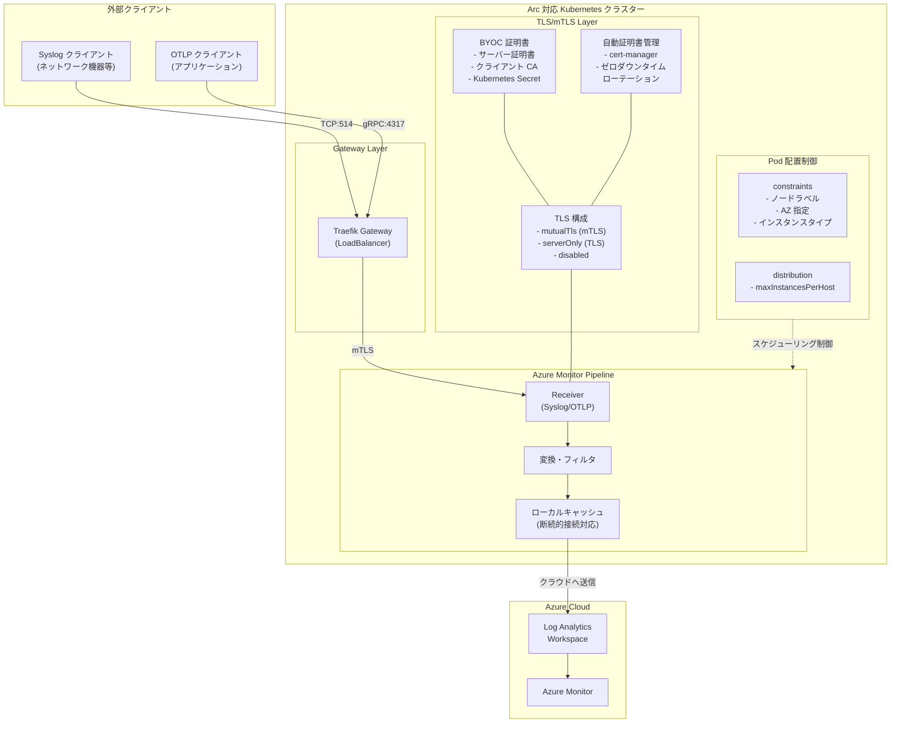

# Azure Monitor Pipeline: セキュアインジェストとポッド配置機能

**リリース日**: 2026-02-26

**サービス**: Azure Monitor

**機能**: Secure ingestion and pod placement for Azure Monitor pipeline

**ステータス**: パブリックプレビュー

[このアップデートのインフォグラフィックを見る](https://takech9203.github.io/azure-news-summary/20260226-azure-monitor-pipeline-secure-ingestion.html)

## 概要

Azure Monitor pipeline に対して、外部エンドポイントからのセキュアインジェスト（TLS/mTLS 対応）と、Kubernetes クラスター上でのポッド配置制御という 2 つの主要機能がパブリックプレビューとして発表された。

Azure Monitor pipeline は、オンプレミスデータセンターやマルチクラウド環境において、テレメトリデータの大規模収集、変換、ルーティングを行うコンテナ化ソリューションである。Arc 対応 Kubernetes クラスター上にデプロイされ、OpenTelemetry エコシステムの技術を基盤としている。

今回のアップデートでは、特に Bring Your Own Certificates（BYOC）機能により、企業が独自の証明書を使用して TLS/mTLS 通信を構成できるようになり、セキュリティとコンプライアンス要件への対応が強化された。また、ポッド配置機能により、パイプラインインスタンスの Kubernetes ノードへのスケジューリングを細かく制御できるようになった。

**アップデート前の課題**

- Azure Monitor pipeline への外部エンドポイントからのデータ取り込みにおいて、TLS/mTLS を企業独自の PKI 証明書で構成する手段が限定的だった
- パイプラインの Pod がデフォルトの Kubernetes スケジューリングに依存しており、特定のノードへの配置やリソース分離の制御が困難だった
- マルチテナントクラスター環境において、パイプラインインスタンスのパフォーマンス分離やコンプライアンス要件（データレジデンシー、セキュリティゾーン）の適用が難しかった
- 高スループット環境で、同一ノード上に複数のパイプラインインスタンスが配置されることによるポート枯渇やリソース競合のリスクがあった

**アップデート後の改善**

- BYOC により企業独自の証明書・PKI を使用した TLS/mTLS 通信の構成が可能になり、既存のセキュリティポリシーとの整合性を維持できるようになった
- ポッド配置の constraints と distribution 設定により、特定のノードラベル、アベイラビリティゾーン、ノードタイプに基づくスケジューリング制御が可能になった
- `maxInstancesPerHost` 設定により、ノードあたりのインスタンス数を厳密に制限でき、リソース分離が実現された
- 自動証明書管理とゼロダウンタイムローテーションのオプションも引き続き利用可能

## アーキテクチャ図



この図は、外部クライアントから Azure Monitor pipeline へのセキュアなデータ取り込みフローと、ポッド配置制御の全体像を示している。外部クライアント（Syslog、OTLP）は Traefik Gateway 経由で TLS/mTLS で暗号化された通信を行い、パイプラインの Receiver でデータを受信する。証明書管理は BYOC（企業独自の PKI）または自動証明書管理（cert-manager）から選択可能。受信データは変換・フィルタリング後、ローカルキャッシュを経由して Azure Monitor の Log Analytics Workspace に送信される。

## サービスアップデートの詳細

### 主要機能

1. **セキュアインジェスト（TLS/mTLS）**
   - 外部エンドポイントからの TCP ベースレシーバーに対する TLS および mutual TLS（mTLS）サポート
   - 3 つの TLS モード: `mutualTls`（デフォルト）、`serverOnly`、`disabled`
   - mTLS ではサーバー証明書認証とクライアント証明書認証の双方を実施

2. **Bring Your Own Certificates（BYOC）**
   - 企業独自の証明書と秘密鍵をパイプラインの TLS エンドポイントに使用可能
   - デフォルトのコレクターサーバー証明書を独自証明書で置換
   - クライアント証明書検証用の独自 CA を提供可能
   - Azure Key Vault との統合による証明書保管（Secret Store Extension 経由）
   - 外部 PKI（LetsEncrypt 等）との連携をサポート

3. **自動証明書管理（Default TLS）**
   - Certificate Manager 拡張機能による自動化された証明書ライフサイクル管理
   - ゼロダウンタイムでの証明書ローテーション
   - サーバー証明書: 48 時間の有効期限、有効期限の 24 時間前に自動更新
   - Trust Bundle の自動配布

4. **ポッド配置制御（Pod Placement）**
   - `executionPlacement` プロパティによる Kubernetes ノードへのスケジューリング制御
   - constraints: ノードラベル、アベイラビリティゾーン、インスタンスタイプ等に基づく配置制約
   - distribution: `maxInstancesPerHost` によるノードあたりのインスタンス数制限（現在は `1` のみサポート）
   - 自動的な Pod ラベリングとアンチアフィニティルールの適用

5. **Gateway 連携（Traefik）**
   - Traefik Gateway を使用した外部クライアントへのパイプラインエンドポイント公開
   - Gateway とパイプライン間の mTLS 通信
   - cert-manager による Gateway クライアント証明書の自動発行・更新

## 技術仕様

| 項目 | 詳細 |
|------|------|
| 対象リソース | Microsoft.Monitor/pipelineGroups |
| API バージョン | 2025-03-01-preview |
| デプロイ基盤 | Arc 対応 Kubernetes クラスター |
| 基盤技術 | OpenTelemetry エコシステム |
| サポートプロトコル | Syslog（TCP:514）、OTLP（gRPC:4317） |
| TLS モード | mutualTls、serverOnly、disabled |
| 証明書管理 | 自動（cert-manager）または BYOC |
| サーバー証明書有効期限 | 48 時間（自動管理時） |
| クライアント証明書更新制約 | 2 日以内に更新が必要 |
| Pod 配置 constraint オペレーター | In、NotIn、Exists、DoesNotExist |
| maxInstancesPerHost | 1（厳密分離） |
| 必須拡張機能 | cert-manager（microsoft.certmanagement） |

## 設定方法

### 前提条件

1. Arc 対応 Kubernetes クラスターが外部 IP アドレスを持つこと
2. クラスターでカスタムロケーション機能が有効化されていること
3. Azure サブスクリプションで Microsoft.Insights および Microsoft.Monitor リソースプロバイダーが登録されていること
4. cert-manager 拡張機能がインストールされていること
5. Log Analytics ワークスペースが作成済みであること

### cert-manager 拡張機能のインストール

```bash
export RESOURCE_GROUP="<resource-group-name>"
export CLUSTER_NAME="<arc-enabled-cluster-name>"
export LOCATION="<arc-enabled-cluster-location>"

az k8s-extension create \
  --resource-group ${RESOURCE_GROUP} \
  --cluster-name ${CLUSTER_NAME} \
  --cluster-type connectedClusters \
  --name "azure-cert-management" \
  --extension-type "microsoft.certmanagement" \
  --release-train stable
```

### BYOC TLS の構成手順

1. **サーバー証明書と秘密鍵を Kubernetes Secret として作成**

```bash
kubectl create secret tls collector-server-tls \
  --cert=tls.crt --key=tls.key -n <namespace>
```

2. **クライアント CA 証明書を Secret として作成**

```bash
kubectl create secret generic byoc-client-root-ca-secret \
  --from-file=ca.crt=ca.crt -n <namespace>
```

3. **ARM テンプレートでパイプラインの TLS を構成**

```json
{
  "type": "Microsoft.Monitor/pipelineGroups",
  "apiVersion": "2025-03-01-preview",
  "name": "byoc-pipeline",
  "location": "eastus2",
  "properties": {
    "receivers": [
      {
        "name": "syslog",
        "type": "Syslog",
        "tlsConfiguration": "byoc-mtls",
        "syslog": { "endpoint": "0.0.0.0:514" }
      }
    ],
    "tlsConfigurations": [
      {
        "name": "byoc-mtls",
        "mode": "mutualTls",
        "tlsCertificate": {
          "certificate": {
            "type": "kubernetesSecret",
            "location": "collector-server-tls",
            "subLocation": "tls.crt"
          },
          "privateKey": {
            "type": "kubernetesSecret",
            "location": "collector-server-tls",
            "subLocation": "tls.key"
          }
        },
        "clientCa": {
          "type": "kubernetesSecret",
          "location": "byoc-client-root-ca-secret",
          "subLocation": "ca.crt"
        }
      }
    ]
  }
}
```

### ポッド配置の構成例

```json
{
  "properties": {
    "executionPlacement": {
      "constraints": [
        {
          "capability": "team",
          "operator": "In",
          "values": ["observability-team"]
        },
        {
          "capability": "topology.kubernetes.io/zone",
          "operator": "In",
          "values": ["us-east-1a", "us-east-1b"]
        }
      ],
      "distribution": {
        "maxInstancesPerHost": 1
      }
    }
  }
}
```

## メリット

### ビジネス面

- **コンプライアンス対応の強化**: BYOC により企業独自の PKI ポリシーとセキュリティ基準を維持したまま Azure Monitor pipeline を利用可能。規制要件への対応が容易になる
- **データレジデンシーの確保**: ポッド配置の constraints により特定のアベイラビリティゾーンやリージョンでのデータ処理を強制でき、データ主権要件に対応
- **エンタープライズセキュリティの維持**: 既存の証明書管理インフラストラクチャ（PKI）との統合により、監視データの通信セキュリティを企業のセキュリティポリシーに準拠させることが可能
- **運用負荷の軽減**: 自動証明書管理オプションにより、証明書のライフサイクル管理を自動化し、運用チームの作業を削減

### 技術面

- **エンドツーエンド暗号化**: TLS/mTLS による外部クライアントからパイプラインまでの通信暗号化とクライアント認証を実現
- **柔軟な証明書管理**: 自動管理（cert-manager）と BYOC の 2 つのオプションから環境に適した方式を選択可能
- **ゼロダウンタイムローテーション**: 自動証明書管理では証明書の更新がサービス中断なく実行される
- **リソース分離**: `maxInstancesPerHost: 1` によりノード単位の厳密なリソース分離を実現し、ノイジーネイバー問題を回避
- **ポート枯渇防止**: ノードあたりのインスタンス数制限により、高スループット環境でのポート枯渇リスクを軽減
- **Azure Key Vault 統合**: Secret Store Extension を使用して Azure Key Vault から Kubernetes Secret へ証明書を自動同期可能

## デメリット・制約事項

- パブリックプレビュー段階であり、SLA の対象外。本番環境での利用は慎重に検討する必要がある
- サポートされる Kubernetes ディストリビューションが限定的（Canonical、Cluster API Provider for Azure、K3、Rancher Kubernetes Engine、VMware Tanzu Kubernetes Grid）
- BYOC 証明書管理では、証明書の更新・ローテーションを企業側で管理する必要があり、運用負荷が増加する
- `maxInstancesPerHost` は現在 `1` のみサポートされており、より柔軟なインスタンス数制限は未対応
- ポッド配置は ARM/Bicep テンプレートによる構成のみサポートされており、Azure Portal からの設定には対応していない
- cert-manager 拡張機能のインストールが必須であり、既存の cert-manager インスタンスを事前にアンインストールする必要がある（一時的に証明書ローテーションが停止するリスク）
- Traefik Gateway は、Kubernetes Load Balancer が正常にデプロイできる環境でのみ動作する

## ユースケース

### ユースケース 1: 規制産業におけるセキュアなログ収集

**シナリオ**: 金融機関がオンプレミスのネットワーク機器から Syslog データを Azure Monitor に取り込む際、社内の PKI 証明書を使用した mTLS 通信を要求される。

**実装例**:

1. 社内 PKI で発行したサーバー証明書とクライアント CA 証明書を Kubernetes Secret として作成
2. BYOC mTLS 構成でパイプラインの Syslog レシーバーを設定
3. Traefik Gateway を経由して外部ネットワーク機器からの接続を受け付け
4. ポッド配置で金融データ処理専用ノード（セキュリティゾーン）への配置を強制

**効果**: 規制要件を満たしたセキュアな通信経路でログデータを収集でき、監査要件にも対応可能。

### ユースケース 2: マルチテナント Kubernetes クラスターでの分離

**シナリオ**: 複数のチームが共有する Kubernetes クラスター上で、各チームの監視パイプラインを適切に分離して運用する。

**実装例**:

1. constraints でチーム専用ノード（`team=observability-team`）への配置を指定
2. `maxInstancesPerHost: 1` でノードあたり 1 インスタンスに制限
3. チームごとに異なる TLS 証明書を使用

**効果**: ノイジーネイバー問題を回避し、チーム間のパフォーマンス分離とセキュリティ分離を実現。

### ユースケース 3: 高可用性テレメトリ収集

**シナリオ**: 大規模な IoT/OT 環境で、高スループットのテレメトリデータを複数のアベイラビリティゾーンに分散して処理する。

**実装例**:

1. ポッド配置で特定のアベイラビリティゾーン（例: `us-east-1a`, `us-east-1b`）に制約
2. 高リソースノード（`Standard_D16s_v3` 等）をターゲットに設定
3. `maxInstancesPerHost: 1` でノード間の負荷分散を確保
4. ローカルキャッシュを活用した断続的接続環境への対応

**効果**: ゾーン冗長性を確保しつつ、高スループットのテレメトリデータを効率的に処理。

## 料金

Azure Monitor pipeline のセキュアインジェストおよびポッド配置機能自体に追加料金は発生しない。Azure Monitor の料金体系に従い、主に以下の項目で課金される。

| 項目 | 説明 |
|------|------|
| データインジェスト | Log Analytics Workspace への取り込みデータ量（GB 単位）に応じた課金 |
| データ保持 | Analytics Logs: 31/90 日の保持を含む（最大 12 年まで延長可能） |
| ログ処理 | 基本/分析ログテーブルで 50% 未満のフィルタリングの場合は無料。50% を超えるフィルタリングには課金あり |
| クエリ | Basic/Auxiliary Logs はスキャンデータ量に応じた課金。Analytics Logs のクエリは無料 |

※ 最初の 5 GB/月（Analytics ティア、課金アカウントあたり）は無料。最新の料金は [Azure Monitor 料金ページ](https://azure.microsoft.com/pricing/details/monitor/) を参照。

## 利用可能リージョン

Azure Monitor pipeline は、以下のリージョンで利用可能。

| リージョン |
|------------|
| Canada Central |
| East US |
| East US 2 |
| Italy North |
| West US 2 |
| West Europe |

※ 最新のリージョン対応状況は [Azure リージョン別利用可能サービス](https://azure.microsoft.com/explore/global-infrastructure/products-by-region/table) を参照。

## 関連サービス・機能

- **Azure Monitor Agent（AMA）**: 仮想マシンや Kubernetes クラスターからのデータ収集エージェント。Azure Monitor pipeline と併用することで、エッジ環境からクラウドまでの統合的なデータ収集が可能
- **Azure Arc 対応 Kubernetes**: パイプラインのデプロイ基盤。オンプレミスやマルチクラウドの Kubernetes クラスターを Azure と統合管理
- **Data Collection Rules（DCR）**: Azure Monitor のデータ収集構成ルール。パイプラインから送信されたデータの処理方法と保存先を定義
- **Log Analytics Workspace**: パイプラインから収集されたデータの最終的な保存先。KQL によるクエリ分析が可能
- **cert-manager（Azure Arc 拡張機能）**: パイプラインの TLS 証明書管理基盤。自動証明書ライフサイクル管理を提供
- **Azure Key Vault**: BYOC 構成における証明書の安全な保管場所。Secret Store Extension 経由で Kubernetes Secret と自動同期
- **OpenTelemetry**: パイプラインの基盤技術。OTLP プロトコルによるテレメトリデータの標準化された収集と転送

## 参考リンク

- [インフォグラフィック](https://takech9203.github.io/azure-news-summary/20260226-azure-monitor-pipeline-secure-ingestion.html)
- [公式アップデート情報](https://azure.microsoft.com/updates?id=552808)
- [Microsoft Learn - Azure Monitor pipeline overview](https://learn.microsoft.com/en-us/azure/azure-monitor/data-collection/pipeline-overview)
- [Microsoft Learn - Configure Azure Monitor pipeline](https://learn.microsoft.com/en-us/azure/azure-monitor/data-collection/pipeline-configure)
- [Microsoft Learn - Azure Monitor pipeline TLS configuration](https://learn.microsoft.com/en-us/azure/azure-monitor/data-collection/pipeline-tls)
- [Microsoft Learn - TLS configuration (Customer managed / BYOC)](https://learn.microsoft.com/en-us/azure/azure-monitor/data-collection/pipeline-tls-custom)
- [Microsoft Learn - TLS configuration (Automated)](https://learn.microsoft.com/en-us/azure/azure-monitor/data-collection/pipeline-tls-automated)
- [Microsoft Learn - Azure Monitor pipeline pod placement](https://learn.microsoft.com/en-us/azure/azure-monitor/data-collection/pipeline-pod-placement)
- [Microsoft Learn - Gateway for Kubernetes deployment](https://learn.microsoft.com/en-us/azure/azure-monitor/data-collection/pipeline-kubernetes-gateway)
- [Microsoft Learn - Configure clients for Azure Monitor pipeline](https://learn.microsoft.com/en-us/azure/azure-monitor/data-collection/pipeline-configure-clients)
- [料金ページ](https://azure.microsoft.com/pricing/details/monitor/)

## まとめ

Azure Monitor pipeline のセキュアインジェストとポッド配置機能は、エンタープライズ環境における監視データ収集のセキュリティと運用制御を大幅に強化するアップデートである。TLS/mTLS 対応と BYOC 機能により、企業独自のセキュリティポリシーと PKI インフラストラクチャを維持したまま、外部エンドポイントからの安全なデータ取り込みが実現される。また、ポッド配置制御により、マルチテナント環境でのリソース分離、コンプライアンス要件への対応、高スループット環境での安定運用が可能となる。

Solutions Architect への推奨アクション:

1. **セキュリティ要件の評価**: 現在の監視データ収集パスにおける TLS/mTLS 要件を確認し、BYOC と自動証明書管理のどちらが適切かを判断する
2. **PKI 統合の検討**: 既存の企業 PKI インフラストラクチャとの統合方法を計画し、証明書のライフサイクル管理プロセスを設計する
3. **ポッド配置戦略の策定**: クラスターのノード構成とチーム分離要件に基づき、constraints と distribution の設定を検討する
4. **プレビュー環境での検証**: 非本番環境で TLS/mTLS 構成とポッド配置を検証し、本番環境への展開計画を策定する
5. **リージョン対応の確認**: 現在サポートされている 6 リージョンを確認し、デプロイ先リージョンの選定を行う

パブリックプレビュー段階であるため、本番環境への導入は GA 後を推奨するが、非本番環境での早期検証を開始し、GA 時にスムーズに導入できるよう準備を進めることが望ましい。

---

**タグ**: #AzureMonitor #AzureMonitorPipeline #TLS #mTLS #BYOC #PodPlacement #Security #Kubernetes #AzureArc #PublicPreview
