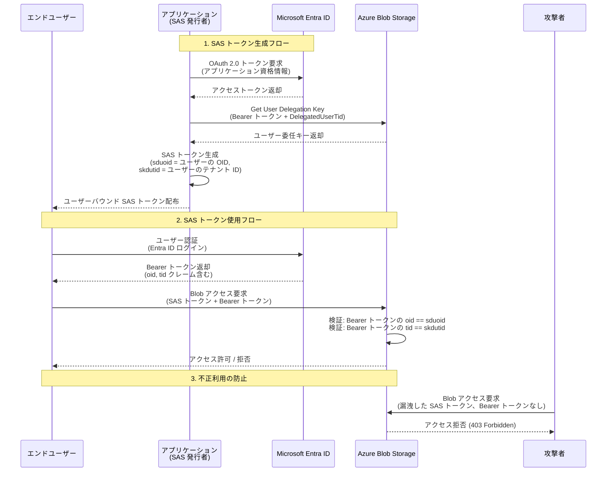

# Azure Blob Storage: ユーザーバウンド ユーザー委任 SAS (User-Bound User Delegation SAS)

**リリース日**: 2026-02-26

**サービス**: Azure Blob Storage

**機能**: Restrict usage of user delegation SAS to an Entra ID identity

**ステータス**: パブリックプレビュー

[このアップデートのインフォグラフィックを見る](https://takech9203.github.io/azure-news-summary/20260226-blob-storage-user-bound-delegation-sas.html)

## 概要

Azure Storage に新たに導入された「ユーザーバウンド ユーザー委任 SAS (User-Bound User Delegation SAS)」は、従来のユーザー委任 SAS (User Delegation SAS) のセキュリティをさらに強化する機能である。従来のユーザー委任 SAS は Microsoft Entra ID の資格情報で署名されるためアカウントキーベースの SAS より安全であったが、SAS トークンを取得した任意のクライアントがそのトークンを使用してリソースにアクセスできるという課題があった。

ユーザーバウンド ユーザー委任 SAS では、SAS トークンの使用を特定の Entra ID ユーザーに制限できる。SAS トークン作成時にエンドユーザーの Entra オブジェクト ID を `signedDelegatedUserObjectId` (`sduoid`) フィールドで指定し、SAS トークン使用時にはそのユーザーが Entra ID ログイン（Bearer トークン）で本人確認を行う必要がある。指定されたユーザー以外は SAS トークンを使用できないため、SAS トークンの漏洩や不正利用のリスクが大幅に低減される。

本機能は API バージョン 2025-07-05 以降で利用可能であり、現在パブリックプレビュー段階にある。

**アップデート前の課題**

- ユーザー委任 SAS は Entra ID 資格情報で署名されるものの、生成された SAS トークンを取得した任意のクライアントがリソースにアクセスできた
- SAS トークンの漏洩時に、トークンの有効期限内であれば誰でもリソースにアクセス可能であった
- マルチユーザー環境において、SAS トークンの使用者を特定のユーザーに限定する手段がなかった
- SAS トークンの配布後に使用者を制御するには、ユーザー委任キーの無効化（最大 7 日間の有効期限切れ待ち）しか手段がなかった

**アップデート後の改善**

- SAS トークンの使用を特定の Entra ID ユーザーに限定できるようになり、トークン漏洩時のリスクが大幅に低減された
- SAS トークン使用時に Entra ID の Bearer トークンによる本人確認が必須となり、トークンの不正利用を防止できるようになった
- クロステナントシナリオにも対応可能で、`signedKeyDelegatedUserTenantId` (`skdutid`) フィールドにより異なるテナントのユーザーへの SAS 発行にも対応した
- SAS の柔軟性と Entra ID のユーザーバウンドアクセスの両方のメリットを享受できるようになった

## アーキテクチャ図



この図は、ユーザーバウンド ユーザー委任 SAS の認証フローを示している。アプリケーションが Entra ID を通じてユーザー委任キーを取得し、特定ユーザーにバウンドされた SAS トークンを生成する。エンドユーザーは SAS トークンに加えて Entra ID の Bearer トークンを提示する必要があり、Azure Storage はトークン内の `oid` クレームと SAS の `sduoid` パラメータを照合して本人確認を行う。攻撃者が SAS トークンを入手しても、対応する Entra ID 認証情報がなければアクセスは拒否される。

## サービスアップデートの詳細

### 主要機能

1. **ユーザーバウンド SAS トークン (`sduoid`)**
   - SAS トークン作成時に `signedDelegatedUserObjectId` (`sduoid`) フィールドでエンドユーザーの Entra ID オブジェクト ID を指定する
   - SAS トークン使用時にユーザーは Entra ID の Bearer トークンを提示する必要がある
   - Azure Storage は Bearer トークンの `oid` クレームと SAS の `sduoid` 値を照合し、一致しない場合はアクセスを拒否する

2. **クロステナント対応 (`skdutid`)**
   - `signedKeyDelegatedUserTenantId` (`skdutid`) フィールドにより、ストレージアカウントとは異なるテナントに属するユーザーへの SAS 発行が可能
   - Bearer トークンの `tid` クレームと `skdutid` 値が照合される
   - クロステナント対応はデフォルトで無効であり、ストレージアカウントの `allowCrossTenantDelegationSas` プロパティを `true` に設定する必要がある

3. **ユーザー委任キーの拡張**
   - `Get User Delegation Key` API に `DelegatedUserTid` パラメータが追加され、クロステナントシナリオで委任対象ユーザーのテナント ID を指定可能
   - レスポンスに `SignedDelegatedUserTid` フィールドが追加された

## 技術仕様

| 項目 | 詳細 |
|------|------|
| 必要な API バージョン | `sv=2025-07-05` 以降 |
| SAS トークンパラメータ (ユーザー OID) | `sduoid` (signedDelegatedUserObjectId) |
| SAS トークンパラメータ (テナント ID) | `skdutid` (signedKeyDelegatedUserTenantId) |
| ユーザー委任キーの最大有効期間 | 7 日間 |
| 対象サービス | Azure Blob Storage |
| 認証方式 | SAS トークン + Entra ID Bearer トークン (併用) |
| クロステナント対応 | `allowCrossTenantDelegationSas` プロパティで制御 |
| SAS トークン種別 | アドホック SAS のみ（ストアドアクセスポリシー非対応） |

### String-to-Sign フォーマット (バージョン 2025-07-05 以降)

ユーザーバウンド ユーザー委任 SAS の署名文字列には、従来のフィールドに加えて以下のフィールドが追加されている:

- `signedKeyDelegatedUserTenantId` - 委任対象ユーザーのテナント ID
- `signedDelegatedUserObjectId` - 委任対象ユーザーのオブジェクト ID

### 必要な RBAC ロール

ユーザー委任キーを要求するセキュリティプリンシパルには、以下のいずれかの組み込みロールが必要である:

- Storage Blob Delegator
- Storage Blob Data Contributor
- Storage Blob Data Owner
- Storage Blob Data Reader
- Contributor
- Storage Account Contributor

## 設定方法

### 1. ストレージアカウントの構成 (クロステナントの場合)

クロステナントでのユーザーバウンド SAS を使用する場合、ストレージアカウントの `allowCrossTenantDelegationSas` プロパティを有効にする必要がある。

### 2. ユーザー委任キーの取得

```http
POST https://{account}.blob.core.windows.net/?restype=service&comp=userdelegationkey
Authorization: Bearer {OAuth token}
x-ms-version: 2025-07-05

<?xml version="1.0" encoding="utf-8"?>
<KeyInfo>
    <Start>2026-02-26T00:00:00Z</Start>
    <Expiry>2026-02-27T00:00:00Z</Expiry>
    <DelegatedUserTid>{end-user-tenant-id}</DelegatedUserTid>
</KeyInfo>
```

- `DelegatedUserTid` はクロステナントシナリオでのみ必要

### 3. ユーザーバウンド SAS トークンの生成

SAS トークン生成時に以下のパラメータを追加する:

- `sduoid` = エンドユーザーの Entra ID オブジェクト ID
- `skdutid` = エンドユーザーのテナント ID（クロステナントの場合のみ必要）
- `sv` = `2025-07-05` 以降

### 4. SAS トークンの使用

エンドユーザーが SAS トークンを使用する際は、SAS トークンに加えて Entra ID の Bearer トークンをリクエストヘッダに含める必要がある。

```http
GET https://{account}.blob.core.windows.net/{container}/{blob}?{sas-token}
Authorization: Bearer {end-user-entra-token}
```

Azure Storage は Bearer トークン内の `oid` クレームが SAS の `sduoid` と一致するか検証する。

## メリット

### ビジネス面

- **コンプライアンス強化**: SAS トークンの使用を特定のユーザーに限定することで、データアクセスの監査性とトレーサビリティが向上する
- **リスク低減**: SAS トークン漏洩時の被害範囲を限定でき、セキュリティインシデントの影響を最小化できる
- **マルチテナント対応**: クロステナントシナリオに対応しているため、パートナー企業やゲストユーザーへの安全なデータ共有が可能

### 技術面

- **ゼロトラストアーキテクチャとの親和性**: SAS の柔軟性と Entra ID のアイデンティティベース認証を組み合わせることで、ゼロトラストの原則に沿ったアクセス制御を実現できる
- **既存 SAS ワークフローとの互換性**: 既存のユーザー委任 SAS のワークフローに対するパラメータ追加で対応可能であり、大規模な設計変更は不要
- **きめ細かいアクセス制御**: IP 制限、有効期限、権限スコープに加えて、ユーザーアイデンティティによるアクセス制御が追加され、多層的なセキュリティを実現できる

## デメリット・制約事項

- **パブリックプレビュー段階**: 現時点ではプレビューであり、本番環境での使用は推奨されない。GA 時に仕様変更が発生する可能性がある
- **追加の認証オーバーヘッド**: SAS トークンに加えて Entra ID の Bearer トークンも必要となるため、クライアント側の実装が複雑になる
- **API バージョン要件**: `sv=2025-07-05` 以降が必要であり、古い SDK やツールでは利用できない場合がある
- **クロステナントのデフォルト無効**: クロステナント対応はデフォルトで無効であり、ストレージアカウントレベルでの明示的な設定変更が必要
- **ストアドアクセスポリシー非対応**: ユーザー委任 SAS はストアドアクセスポリシーに対応していないため、アドホック SAS としてのみ使用可能
- **ユーザー委任キーの有効期間制限**: ユーザー委任キーの有効期間は最大 7 日間であり、長期間のアクセス委任には定期的なキー更新が必要

## ユースケース

1. **マルチユーザークラスタ環境でのデータアクセス**: Hadoop や Spark クラスタにおいて、各ユーザーに個別のユーザーバウンド SAS を発行することで、共有クラスタ上でもユーザー単位のアクセス制御を実現する

2. **外部パートナーへの一時的なデータ共有**: パートナー企業の特定ユーザーに対してクロステナント対応のユーザーバウンド SAS を発行し、安全にデータを共有する。万が一 SAS トークンが漏洩しても、指定されたユーザー以外はアクセスできない

3. **規制産業でのデータアクセス管理**: 金融・医療などの規制産業において、データアクセスを個人レベルで追跡・監査する必要がある場合に、ユーザーバウンド SAS によりアクセスの非否認性を確保する

4. **SaaS アプリケーションでのテナント分離**: SaaS プロバイダーがエンドユーザーに Blob Storage への直接アクセスを提供する際に、ユーザーバウンド SAS により各ユーザーのアクセスを厳密に分離する

## 料金

ユーザーバウンド ユーザー委任 SAS 自体に追加料金は発生しない。従来の Azure Blob Storage の料金体系が適用される:

- **Get User Delegation Key 操作**: Premium Block Blob / Standard GPv2 では「その他の操作」、Standard GPv1 では「読み取り操作」として課金される
- **SAS を使用したデータアクセス**: 通常の Blob Storage のトランザクション料金（読み取り、書き込み等）が適用される
- **データ転送**: 通常のデータ転送料金が適用される

詳細な料金については [Azure Blob Storage の価格](https://azure.microsoft.com/pricing/details/storage/blobs/) を参照のこと。

## 利用可能リージョン

パブリックプレビュー段階での具体的なリージョン制限についての情報は公式ドキュメントに記載されていない。一般的に Azure Blob Storage のユーザー委任 SAS 機能はすべてのパブリックリージョンで利用可能であるが、プレビュー機能の提供範囲については今後の公式発表を確認されたい。

## 関連サービス・機能

| サービス・機能 | 関連性 |
|--------------|--------|
| Microsoft Entra ID | ユーザー認証と Bearer トークンの発行に使用される |
| Azure Blob Storage ユーザー委任 SAS | 本機能の基盤となる既存の SAS 種別 |
| Azure RBAC | ユーザー委任キーの要求に必要な権限管理に使用される |
| Azure Data Lake Storage | HNS 有効化環境での POSIX ACL との統合 |
| Apache Hadoop ABFS ドライバー | マルチユーザークラスタ環境での SAS 統合ユースケース |
| Apache Ranger | Data Lake Storage ワークロードでのアクセス制御統合 |

## 参考リンク

- [Azure アップデート: Restrict usage of user delegation SAS to an Entra ID identity](https://azure.microsoft.com/updates?id=557694)
- [ユーザー委任 SAS の作成 (REST API)](https://learn.microsoft.com/en-us/rest/api/storageservices/create-user-delegation-sas)
- [Get User Delegation Key (REST API)](https://learn.microsoft.com/en-us/rest/api/storageservices/get-user-delegation-key)
- [共有アクセス署名 (SAS) の概要](https://learn.microsoft.com/en-us/azure/storage/common/storage-sas-overview)
- [.NET でユーザー委任 SAS を作成する](https://learn.microsoft.com/en-us/azure/storage/blobs/storage-blob-user-delegation-sas-create-dotnet)
- [Azure Blob Storage の価格](https://azure.microsoft.com/pricing/details/storage/blobs/)

## まとめ

ユーザーバウンド ユーザー委任 SAS は、Azure Blob Storage のセキュリティを大幅に強化する重要な新機能である。従来のユーザー委任 SAS はアカウントキーベースの SAS より安全ではあったが、SAS トークンの所有者であれば誰でもアクセスできるという課題が残っていた。本機能では SAS トークンと Entra ID の Bearer トークンを組み合わせることで、SAS トークンの使用を特定のユーザーに限定し、トークン漏洩時のリスクを大幅に低減する。

Solutions Architect にとっては、ゼロトラストアーキテクチャの実現、コンプライアンス要件への対応、マルチユーザー環境でのきめ細かいアクセス制御など、多くのシナリオで有用な機能となる。現在パブリックプレビュー段階であるため、本番環境への適用前に十分な検証を行い、GA リリースを待つことが推奨される。既存のユーザー委任 SAS ワークフローからの移行は `sduoid` パラメータの追加が主な変更点であり、段階的な導入が可能である。

---

**タグ**: `Azure Blob Storage` `Security` `SAS` `User Delegation SAS` `Microsoft Entra ID` `Authentication` `パブリックプレビュー` `ゼロトラスト`
