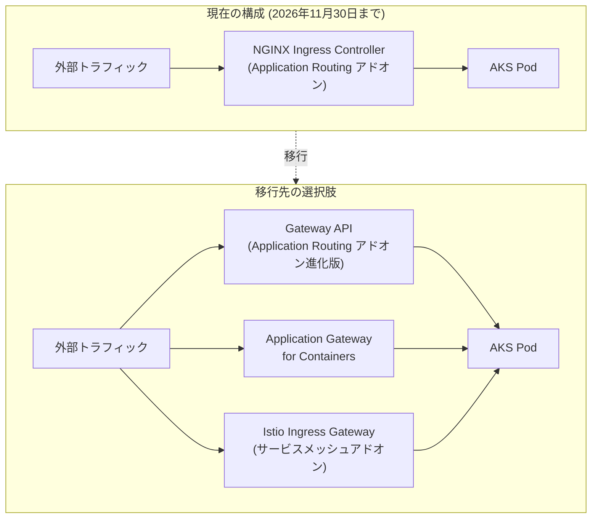

# Azure Kubernetes Service (AKS): マネージド NGINX Ingress (Application Routing アドオン) の廃止予告

**リリース日**: 2026-02-27

**サービス**: Azure Kubernetes Service (AKS)

**機能**: マネージド NGINX Ingress with Application Routing Add-on の廃止

**ステータス**: Retirement (廃止予告)

[このアップデートのインフォグラフィックを見る](https://takech9203.github.io/azure-news-summary/20260227-aks-nginx-ingress-retirement.html)

## 概要

Kubernetes SIG Network およびセキュリティ対応委員会は、Ingress-NGINX プロジェクトの廃止を発表した。上流プロジェクトのメンテナンスは 2026 年 3 月をもって終了する。これを受け、Azure Kubernetes Service (AKS) の Application Routing アドオンで提供されているマネージド NGINX Ingress コントローラーも、**2026 年 11 月 30 日**をもってサポートが終了する。

Microsoft は 2026 年 11 月 30 日まで、Application Routing アドオンの NGINX Ingress リソースに対してクリティカルなセキュリティパッチを引き続き提供する。この期間中、プロダクションワークロードは完全にサポートされるため、即座のアクションは不要だが、長期的な移行計画の策定を開始することが推奨される。

AKS は上流の Kubernetes の方針に沿い、**Gateway API** をイングレスおよび L7 トラフィック管理の長期的な標準として採用する方向に進んでいる。ユーザーは現在の構成に基づいて移行パスを計画する必要がある。

**廃止の背景**

- Ingress-NGINX プロジェクトは、メンテナンスリソースの不足や技術的負債の蓄積に直面していた
- スニペットアノテーションなどの機能がセキュリティ上の脆弱性と見なされるようになった
- 代替コントローラー (InGate) の開発計画も十分な関心を集められなかった
- Gateway API が Ingress の現代的な後継として位置づけられている

**移行後の選択肢**

- Application Routing アドオンは Gateway API との統合が進化し続ける
- Application Gateway for Containers は Ingress API と Gateway API の両方をサポート
- Istio ベースのサービスメッシュアドオンによるイングレス管理も選択可能

## アーキテクチャ図



この図は、現在の NGINX Ingress Controller を使用した構成から、3 つの推奨される移行先への移行パスを示している。ユーザーの要件に応じて適切な移行先を選択する必要がある。

## 廃止スケジュールと対応の詳細

### タイムライン

1. **2025 年 11 月 12 日**
   - Kubernetes SIG Network が Ingress-NGINX プロジェクトの廃止を発表

2. **2026 年 3 月**
   - 上流の Ingress-NGINX プロジェクトのメンテナンスが終了
   - 以降、上流からの新規リリース、バグ修正、セキュリティアップデートは提供されない

3. **2026 年 11 月 30 日**
   - Microsoft による Application Routing アドオン NGINX Ingress のクリティカルセキュリティパッチ提供が終了
   - NGINX Ingress コントローラーのサポートが完全に終了

### 移行先の選択肢

1. **Application Routing アドオン (Gateway API 対応)**
   - 現在 Application Routing アドオンを使用しているユーザー向け
   - AKS が Gateway API との統合を進化させるため、別のイングレス製品に移行する必要はない
   - 2026 年 11 月まで完全サポートが継続される

2. **Application Gateway for Containers**
   - Azure ネイティブの L7 ロードバランシングソリューション
   - Ingress API と Gateway API の両方をサポート
   - トラフィックスプリッティング、mTLS、ヘッダーリライトなどの高度な機能を提供
   - AKS クラスターの外部で動作し、ALB Controller によって管理される

3. **Istio ベースのサービスメッシュアドオン**
   - サービスメッシュの導入を検討しているユーザー向け
   - Istio Ingress を現在使用し、Istio Gateway API サポートが GA になった際に移行する
   - サービス間通信のセキュリティ、可観測性、トラフィック管理を統合的に提供

## 技術仕様

| 項目 | 詳細 |
|------|------|
| 廃止対象 | Application Routing アドオンのマネージド NGINX Ingress Controller |
| サポート終了日 | 2026 年 11 月 30 日 |
| 上流プロジェクト終了 | 2026 年 3 月 |
| 長期的な標準 | Gateway API (gateway-api.sigs.k8s.io) |
| 影響範囲 | NGINX Ingress を使用するすべての AKS クラスター |
| 現在の Ingress クラス名 | webapprouting.kubernetes.azure.com |

## 対応方法

### 現在の NGINX Ingress 使用状況の確認

```bash
# AKS クラスターで NGINX Ingress の使用状況を確認
kubectl get pods --all-namespaces --selector app.kubernetes.io/name=ingress-nginx

# Application Routing アドオンの状態を確認
kubectl get pods -n app-routing-system

# 現在の Ingress リソースを一覧表示
kubectl get ingress --all-namespaces
```

### Application Gateway for Containers への移行を検討する場合

```bash
# ALB Controller をインストール (Application Gateway for Containers 用)
# 詳細は Microsoft Learn ドキュメントを参照
az aks approuting disable --name <ClusterName> --resource-group <ResourceGroupName>
```

### Application Routing アドオンの有効化 (OSS NGINX からの移行)

```bash
# 既存クラスターで Application Routing アドオンを有効化
az aks approuting enable --resource-group <ResourceGroupName> --name <ClusterName>
```

## ユーザー別の推奨アクション

### ユースケース 1: Application Routing アドオンを使用中のユーザー

**シナリオ**: 既に Application Routing アドオンで NGINX Ingress を使用しているプロダクションワークロード

**推奨アクション**:
- 即座のアクションは不要。2026 年 11 月まで完全サポートが継続される
- AKS の Gateway API 統合の進化を注視し、移行計画を策定する
- 別のイングレス製品に移行する必要はない

**効果**: 最小限の移行コストで長期的なサポートを確保

### ユースケース 2: OSS NGINX Ingress Controller を使用中のユーザー

**シナリオ**: 自身で管理する OSS 版の NGINX Ingress Controller を AKS で使用している

**推奨アクション**:
- Application Routing アドオンに移行して 2026 年 11 月までの公式サポートを得る
- または、Application Gateway for Containers に直接移行する (Ingress API と Gateway API の両方をサポート)

**効果**: 2026 年 3 月以降もセキュリティパッチを受けられる環境を確保

### ユースケース 3: サービスメッシュの導入を検討しているユーザー

**シナリオ**: マイクロサービスアーキテクチャで可観測性やトラフィック管理が必要

**推奨アクション**:
- Istio ベースのサービスメッシュアドオンを検討する
- Istio Ingress を使用し、Istio Gateway API サポートが GA になった際に移行する

**効果**: イングレス管理とサービスメッシュ機能を統合的に利用可能

## 制約事項

- Application Routing アドオンは最大 5 つの Azure DNS ゾーンをサポート
- Application Routing アドオンはマネージド ID を使用する AKS クラスターでのみ有効化可能
- app-routing-system 名前空間の ingress-nginx ConfigMap の編集はサポートされていない
- Istio サービスメッシュアドオンは現時点でサイドカーレスの Ambient モードをサポートしていない
- Istio サービスメッシュアドオンの Gateway API サポートは現在開発中で、まだ GA ではない
- Application Gateway for Containers のリスナーで許可されるポートは 80 と 443 のみ

## 関連サービス・機能

- **Application Routing アドオン**: AKS クラスターでマネージド NGINX Ingress Controller を提供するアドオン。Gateway API 対応へ進化予定
- **Application Gateway for Containers**: Azure ネイティブの L7 ロードバランサー。Ingress API と Gateway API の両方をサポート
- **Istio ベースのサービスメッシュアドオン**: AKS 向けの公式サポート付き Istio 統合。イングレス管理とサービスメッシュ機能を提供
- **Gateway API**: Kubernetes SIG Network が推進する次世代のイングレスおよびトラフィック管理標準

## 参考リンク

- [インフォグラフィック](https://takech9203.github.io/azure-news-summary/20260227-aks-nginx-ingress-retirement.html)
- [公式アップデート情報](https://azure.microsoft.com/updates?id=555839)
- [Application Routing アドオン - Microsoft Learn](https://learn.microsoft.com/en-us/azure/aks/app-routing)
- [Application Gateway for Containers - Microsoft Learn](https://learn.microsoft.com/en-us/azure/application-gateway/for-containers/overview)
- [Istio サービスメッシュアドオン - Microsoft Learn](https://learn.microsoft.com/en-us/azure/aks/istio-about)
- [Ingress-NGINX 廃止発表 (Kubernetes Blog)](https://www.kubernetes.dev/blog/2025/11/12/ingress-nginx-retirement/)
- [Gateway API 公式サイト](https://gateway-api.sigs.k8s.io)

## まとめ

AKS Application Routing アドオンのマネージド NGINX Ingress Controller は、上流の Ingress-NGINX プロジェクト廃止に伴い、**2026 年 11 月 30 日**にサポートが終了する。Microsoft は同日までクリティカルなセキュリティパッチを提供するため、即座のアクションは不要だが、移行計画の策定を早期に開始することが重要である。

推奨される次のアクションは以下の通り:

1. 現在の AKS クラスターにおける NGINX Ingress の使用状況を把握する
2. 自身の要件に基づいて移行先 (Gateway API 対応の Application Routing / Application Gateway for Containers / Istio サービスメッシュ) を選定する
3. 移行計画を策定し、2026 年 11 月 30 日までに移行を完了させる

---

**タグ**: #AzureKubernetesService #AKS #NGINX #Ingress #Retirement #GatewayAPI #ApplicationRouting #ApplicationGateway #Istio #Containers #Compute
