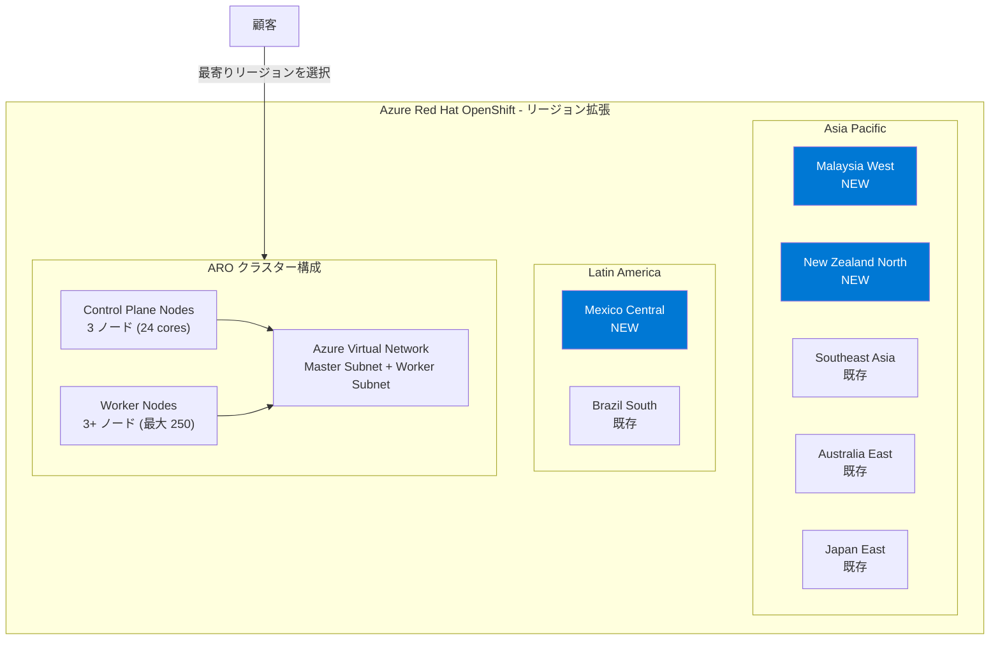

# Azure Red Hat OpenShift: Malaysia West、New Zealand North、Mexico Central リージョンで一般提供開始

**リリース日**: 2026-02-27

**サービス**: Azure Red Hat OpenShift

**機能**: Malaysia West、New Zealand North、Mexico Central リージョンでの一般提供 (GA)

**ステータス**: Launched (GA)

[このアップデートのインフォグラフィックを見る](https://takech9203.github.io/azure-news-summary/20260227-aro-malaysia-newzealand-mexico.html)

## 概要

Azure Red Hat OpenShift (ARO) が、新たに 3 つの Azure リージョン -- Malaysia West、New Zealand North、Mexico Central -- で一般提供 (GA) を開始した。これにより、アジア太平洋 (APAC) およびラテンアメリカ (LATAM) 地域における ARO のプレゼンスが大幅に強化され、これらのリージョンの顧客がエンタープライズグレードの Kubernetes クラスターをデプロイ・管理できるようになった。

Azure Red Hat OpenShift は、Red Hat と Microsoft が共同でエンジニアリング・運用・サポートを行うフルマネージドの OpenShift サービスである。シングルテナントで高可用性の Kubernetes クラスターを Azure 上に提供し、コントロールプレーン、インフラストラクチャノード、アプリケーションノードのパッチ適用・更新・監視を Red Hat と Microsoft が代行する。今回のリージョン拡張により、データレジデンシー要件を持つマレーシア、ニュージーランド、メキシコの顧客が、自国もしくは近隣のリージョンで ARO クラスターを運用できるようになる。

**アップデート前の課題**

- マレーシア、ニュージーランド、メキシコの顧客は ARO を利用するために地理的に離れたリージョン（例: Southeast Asia、Australia East、South Central US）にクラスターをデプロイする必要があり、レイテンシが高くなる場合があった
- 各国のデータレジデンシー要件やコンプライアンス規制への対応が困難だった
- APAC および LATAM 地域でのディザスタリカバリ構成において、近接リージョンの選択肢が限られていた

**アップデート後の改善**

- Malaysia West、New Zealand North、Mexico Central でのローカルデプロイが可能となり、エンドユーザーへのレイテンシが大幅に低減される
- 各国・地域のデータレジデンシー要件に準拠した ARO クラスター運用が可能になった
- APAC および LATAM 地域でのマルチリージョン構成やディザスタリカバリの選択肢が拡大した
- 現地のコンプライアンス規制（マレーシアの PDPA、ニュージーランドの Privacy Act、メキシコの LFPDPPP など）への対応が容易になった

## アーキテクチャ図



この図は、今回新たに追加された 3 リージョン（Malaysia West、New Zealand North、Mexico Central）と、既存の主要リージョンとの関係を示している。各リージョンで ARO クラスターは Control Plane ノードと Worker ノード、専用の Virtual Network で構成される。

## サービスアップデートの詳細

### 主要機能

1. **3 リージョンでの一般提供 (GA)**
   - Malaysia West: マレーシア国内で初の ARO 提供リージョン。東南アジア市場への近接性を強化
   - New Zealand North: ニュージーランド国内で初の ARO 提供リージョン。オセアニア地域のカバレッジを拡大
   - Mexico Central: メキシコ国内で初の ARO 提供リージョン。ラテンアメリカ市場へのアクセスを強化

2. **フルマネージドの OpenShift サービス**
   - Red Hat と Microsoft による共同エンジニアリング・運用・サポート
   - コントロールプレーン、インフラストラクチャノード、アプリケーションノードのパッチ適用・更新・監視を代行
   - 仮想マシンの手動運用やパッチ適用が不要

3. **エンタープライズグレードの Kubernetes 環境**
   - シングルテナント・高可用性クラスター
   - Microsoft Entra ID との統合認証
   - Kubernetes RBAC によるアクセス制御
   - 組み込みのコンテナレジストリ、CI/CD、モニタリング機能

4. **データレジデンシーとコンプライアンス対応**
   - 各リージョンでデータが処理・保存されるため、現地のデータレジデンシー規制に対応可能
   - Azure のリージョンコンプライアンス認証が適用される

## 技術仕様

| 項目 | 詳細 |
|------|------|
| サービス種別 | フルマネージド OpenShift (Kubernetes) |
| 最小コア数 | 44 コア（ブートストラップ 8 + Control Plane 24 + Worker 12） |
| 運用時コア数 | 36 コア（ブートストラップ削除後） |
| 最大 Worker ノード数 | 250 ノード |
| デフォルト Master VM サイズ | Standard D8s_v5 |
| デフォルト Worker VM サイズ | Standard D4s_v5 |
| SLA | 99.95% |
| クラスター作成時間 | 約 45 分 |
| 認証統合 | Microsoft Entra ID |
| ネットワーク要件 | 仮想ネットワークに 2 つの空サブネット（Master 用、Worker 用） |

## 設定方法

### 前提条件

1. Azure サブスクリプションを保有していること
2. 最小 44 コアの vCPU クォータが利用可能であること（Standard DSv5 ファミリー）
3. Contributor および User Access Administrator 権限、または Owner 権限を保有していること
4. Microsoft.RedHatOpenShift、Microsoft.Compute、Microsoft.Storage、Microsoft.Authorization リソースプロバイダーが登録済みであること

### Azure CLI

```bash
# 変数の設定（新リージョンの例: Malaysia West）
LOCATION=malaysiawest
RESOURCEGROUP=aro-rg
CLUSTER=my-aro-cluster
VIRTUALNETWORK=aro-vnet

# リソースグループの作成
az group create \
  --name $RESOURCEGROUP \
  --location $LOCATION

# 仮想ネットワークの作成
az network vnet create \
  --resource-group $RESOURCEGROUP \
  --name $VIRTUALNETWORK \
  --address-prefixes 10.0.0.0/22

# Master サブネットの作成
az network vnet subnet create \
  --resource-group $RESOURCEGROUP \
  --vnet-name $VIRTUALNETWORK \
  --name master-subnet \
  --address-prefixes 10.0.0.0/23

# Worker サブネットの作成
az network vnet subnet create \
  --resource-group $RESOURCEGROUP \
  --vnet-name $VIRTUALNETWORK \
  --name worker-subnet \
  --address-prefixes 10.0.2.0/23

# ARO クラスターの作成
az aro create \
  --resource-group $RESOURCEGROUP \
  --name $CLUSTER \
  --vnet $VIRTUALNETWORK \
  --master-subnet master-subnet \
  --worker-subnet worker-subnet
```

### Azure Portal

1. Azure Portal にサインインし、「Azure Red Hat OpenShift clusters」を検索して選択する
2. 「作成」を選択する
3. 「基本」タブで、リージョンに「Malaysia West」「New Zealand North」「Mexico Central」のいずれかを選択する
4. クラスター名、ドメイン名、VM サイズ、Worker ノード数を設定する
5. 「認証」タブでサービスプリンシパルと Red Hat プルシークレット（任意）を設定する
6. 「ネットワーク」タブで仮想ネットワークとサブネットを構成する
7. 「確認と作成」で内容を確認し、「作成」を選択する

## メリット

### ビジネス面

- **データレジデンシー要件への対応**: マレーシア、ニュージーランド、メキシコの各国内でデータを処理・保存できるため、現地のデータ保護規制（マレーシア PDPA、ニュージーランド Privacy Act 2020、メキシコ LFPDPPP）への準拠が容易になる
- **レイテンシの低減による UX 向上**: 現地の顧客やエンドユーザーに対して低レイテンシのサービス提供が可能になり、ビジネスアプリケーションの応答性が向上する
- **APAC・LATAM 市場への展開促進**: コンテナベースのアプリケーションをこれらの成長市場に迅速にデプロイできる

### 技術面

- **マルチリージョン構成の拡充**: ディザスタリカバリやマルチリージョンデプロイメントにおけるリージョンの選択肢が増加する
- **フルマネージドのインフラ運用**: コントロールプレーンの運用・保守を Red Hat と Microsoft に委任でき、アプリケーション開発に集中できる
- **Azure サービスとの統合**: 新リージョンでも Microsoft Entra ID、Azure Monitor、Azure Container Registry など、Azure のエコシステムと統合された OpenShift 環境を利用できる

## デメリット・制約事項

- 新リージョンでは ARO で利用可能な VM サイズが既存リージョンと比較して制限される場合がある。デプロイ前に `az aro get-versions --location <LOCATION>` で利用可能なバージョンを確認すること
- 最小 44 コアの vCPU クォータが必要であり、新規サブスクリプションではクォータ増加申請が必要になる場合がある
- クラスター作成に約 45 分を要する
- 新リージョンの料金は既存リージョンと異なる場合がある（リージョンごとの料金差異の確認が推奨される）

## ユースケース

### ユースケース 1: マレーシアでのデータレジデンシー対応

**シナリオ**: マレーシアの金融サービス企業が、個人データ保護法 (PDPA) に準拠しつつ、コンテナベースのマイクロサービスアプリケーションを運用する必要がある。

**実装例**:

```bash
# Malaysia West リージョンに ARO クラスターをデプロイ
LOCATION=malaysiawest
az group create --name aro-my-rg --location $LOCATION
az aro create \
  --resource-group aro-my-rg \
  --name aro-my-cluster \
  --vnet aro-my-vnet \
  --master-subnet master-subnet \
  --worker-subnet worker-subnet
```

**効果**: マレーシア国内でデータの処理と保存が完結するため、PDPA への準拠が容易になり、東南アジアのエンドユーザーへのレイテンシも低減される。

### ユースケース 2: APAC リージョンでのディザスタリカバリ構成

**シナリオ**: オーストラリアをプライマリとし、ニュージーランドをセカンダリとするマルチリージョン DR 構成を構築する。

**実装例**:

```bash
# プライマリ: Australia East
az aro create --resource-group aro-au-rg --name aro-primary \
  --vnet aro-au-vnet --master-subnet master-subnet --worker-subnet worker-subnet

# セカンダリ: New Zealand North
az aro create --resource-group aro-nz-rg --name aro-secondary \
  --vnet aro-nz-vnet --master-subnet master-subnet --worker-subnet worker-subnet
```

**効果**: オーストラリアとニュージーランドの地理的近接性を活かした低レイテンシの DR 構成が実現でき、オセアニア地域内でのデータレジデンシー要件にも対応可能。

### ユースケース 3: ラテンアメリカ市場への展開

**シナリオ**: 北米企業がラテンアメリカ市場にコンテナアプリケーションを展開する際、Mexico Central リージョンを活用してメキシコ国内にサービスを提供する。

**実装例**:

```bash
# Mexico Central リージョンへのデプロイ
az aro create --resource-group aro-mx-rg --name aro-mx-cluster \
  --vnet aro-mx-vnet --master-subnet master-subnet --worker-subnet worker-subnet
```

**効果**: メキシコ国内のユーザーに対して低レイテンシでサービスを提供でき、LFPDPPP（メキシコ連邦個人データ保護法）へのコンプライアンス対応も容易になる。

## 料金

Azure Red Hat OpenShift はコンポーネントベースの課金モデルを採用しており、クラスターリソース（コンピューティング、ネットワーク、ストレージ）は実際の使用量に基づいて課金される。

| 項目 | 説明 |
|------|------|
| Control Plane ノード | Azure Virtual Machines の標準 Linux VM 料金（OpenShift ライセンス込み） |
| Worker ノード | Linux VM 料金 + OpenShift ライセンス料（例: D4s v3 で約 $0.171/時間のライセンス料） |
| 購入オプション | 従量課金制、またはリザーブドインスタンス（最大 59% の割引） |

※ 料金はリージョンにより異なる場合がある。新リージョンの正確な料金は [Azure Red Hat OpenShift 料金ページ](https://azure.microsoft.com/pricing/details/openshift/) を参照。別途 Red Hat との契約は不要で、Azure の課金に含まれる。

## 利用可能リージョン

今回のアップデートにより、以下の 3 リージョンが新たに追加された。

| リージョン | 地域 | ステータス |
|----------|------|----------|
| Malaysia West | アジア太平洋 | **新規追加** |
| New Zealand North | アジア太平洋 | **新規追加** |
| Mexico Central | ラテンアメリカ | **新規追加** |

ARO が利用可能な全リージョンの一覧は [Azure リージョン別利用可能サービス](https://azure.microsoft.com/global-infrastructure/services/?products=openshift) を参照。

## 関連サービス・機能

- **Azure Kubernetes Service (AKS)**: Azure のマネージド Kubernetes サービス。ARO は OpenShift ベースの Kubernetes サービスであり、Red Hat エコシステムとの統合が必要な場合に適している
- **Azure Container Registry (ACR)**: ARO クラスターと統合可能なコンテナイメージレジストリ。新リージョンでも ACR との連携が可能
- **Microsoft Entra ID**: ARO クラスターの認証基盤として統合。RBAC と組み合わせたアクセス制御を提供
- **Azure Monitor**: ARO クラスターの監視とログ収集。Container Insights によるコンテナワークロードの可視化が可能
- **Azure Virtual Network**: ARO クラスターのネットワーク基盤。Master サブネットと Worker サブネットの 2 つの空サブネットが必要

## 参考リンク

- [インフォグラフィック](https://takech9203.github.io/azure-news-summary/20260227-aro-malaysia-newzealand-mexico.html)
- [公式アップデート情報](https://azure.microsoft.com/updates?id=557897)
- [Microsoft Learn - Azure Red Hat OpenShift ドキュメント](https://learn.microsoft.com/en-us/azure/openshift/)
- [Microsoft Learn - Azure Red Hat OpenShift の概要](https://learn.microsoft.com/en-us/azure/openshift/intro-openshift)
- [Microsoft Learn - ARO クラスターの作成](https://learn.microsoft.com/en-us/azure/openshift/create-cluster)
- [料金ページ](https://azure.microsoft.com/pricing/details/openshift/)
- [Azure Red Hat OpenShift SLA](https://azure.microsoft.com/support/legal/sla/openshift/v1_0/)
- [リージョン別利用可能サービス](https://azure.microsoft.com/global-infrastructure/services/?products=openshift)

## まとめ

Azure Red Hat OpenShift の Malaysia West、New Zealand North、Mexico Central リージョンへの拡張は、APAC および LATAM 地域におけるエンタープライズ Kubernetes ワークロードのデプロイ選択肢を大幅に広げるアップデートである。特にデータレジデンシー要件を持つマレーシア、ニュージーランド、メキシコの顧客にとって、自国リージョンでフルマネージドの OpenShift 環境を利用できるようになった意義は大きい。

Solutions Architect への推奨アクション:

1. **リージョン選定の見直し**: APAC・LATAM 地域のワークロードについて、新リージョンの利用を検討する。特にレイテンシ要件やデータレジデンシー要件がある場合は優先的に評価すること
2. **クォータの事前確認**: 新リージョンでの ARO デプロイに必要な vCPU クォータ（最小 44 コア）を事前に確認し、必要に応じて増加申請を行う
3. **DR 構成の再評価**: 既存の ARO クラスターに対するディザスタリカバリ戦略を見直し、新リージョンをセカンダリサイトとして活用できるか検討する
4. **料金の確認**: 新リージョンの料金体系を確認し、既存リージョンとのコスト比較を行う

---

**タグ**: #AzureRedHatOpenShift #Containers #Kubernetes #OpenShift #RegionalExpansion #MalaysiaWest #NewZealandNorth #MexicoCentral #APAC #LATAM #GA
