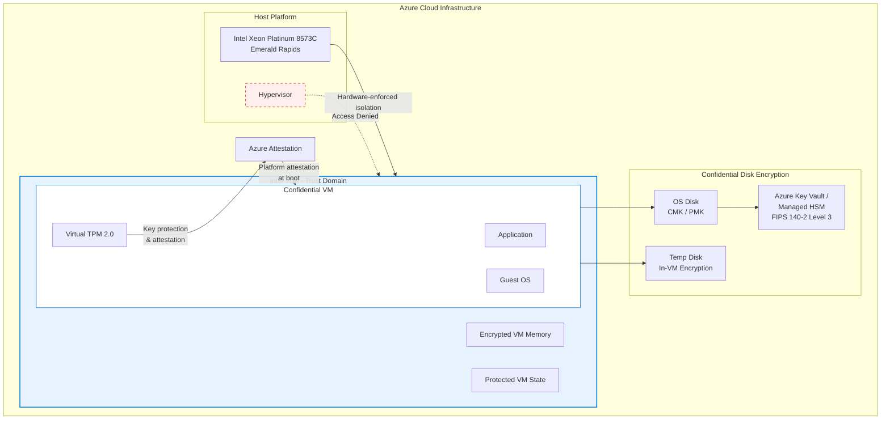

# Azure Confidential Computing: DCesv6/DCedsv6/ECesv6/ECedsv6 Confidential VM の一般提供開始

**リリース日**: 2026-02-27

**サービス**: Azure Confidential Computing / Virtual Machines

**機能**: DCesv6、DCedsv6、ECesv6、ECedsv6 シリーズ Confidential VM

**ステータス**: Launched (GA)

[このアップデートのインフォグラフィックを見る](https://takech9203.github.io/azure-news-summary/20260227-confidential-vms-v6-intel-tdx.html)

## 概要

Microsoft Azure は、次世代の Confidential Virtual Machines（機密 VM）として DCesv6、DCedsv6、ECesv6、ECedsv6 の 4 シリーズを一般提供（GA）開始した。これらの VM は、第 5 世代 Intel Xeon Scalable プロセッサ（コードネーム: Emerald Rapids）と Intel Trust Domain Extensions（Intel TDX）テクノロジーを基盤としており、クラウド上で処理中のデータおよびコードを保護する。

Intel TDX により、ハイパーバイザーやホスト管理コード、クラウド管理者からの VM メモリおよび状態へのアクセスが拒否され、ハードウェアレベルでの強力な分離が実現される。これにより、組織はアプリケーションコードを変更することなく、機密性の高いワークロードをクラウドへ移行できる。

4 シリーズの使い分けとして、DC シリーズは汎用（General Purpose）、EC シリーズはメモリ最適化（Memory Optimized）用途向けであり、それぞれ「eds」付きのシリーズはローカル一時ストレージを搭載している。最大 128 vCPU、512 GB RAM、最大 7 TB のローカルストレージ（DCedsv6）まで対応する。

**アップデート前の課題**

- 従来の AMD SEV-SNP ベースの Confidential VM（DCasv5/DCadsv5 等）は AMD プラットフォームのみで提供されており、Intel プロセッサベースの TEE（Trusted Execution Environment）の選択肢がなかった
- 前世代では最大 vCPU 数やメモリ容量に制限があり、大規模なワークロードへの対応が困難だった

**アップデート後の改善**

- Intel TDX ベースの Confidential VM が追加され、AMD SEV-SNP と Intel TDX の 2 つの TEE テクノロジーから選択可能に
- DCesv6/DCedsv6 シリーズでは最大 128 vCPU/512 GB RAM、ECesv6/ECedsv6 シリーズでは最大 64 vCPU/512 GB RAM まで対応し、大規模ワークロードにも対応
- Intel AMX（Advanced Matrix Extensions）による AI アクセラレーション機能を搭載
- 全コアターボクロック速度 3.0 GHz の高性能プロセッサを採用

## アーキテクチャ図



Intel TDX により、ハイパーバイザーからの VM メモリへのアクセスがハードウェアレベルで拒否される。VM の起動時に Azure Attestation がプラットフォームの健全性を検証し、vTPM を通じた鍵管理と暗号化によりデータの機密性が保護される。

## サービスアップデートの詳細

### 主要機能

1. **Intel Trust Domain Extensions（TDX）によるハードウェア分離**
   - ハイパーバイザー、ホスト管理コード、クラウド管理者から VM メモリおよび状態へのアクセスをハードウェアレベルで拒否
   - 高度なハードウェア・ソフトウェア攻撃からの保護

2. **Confidential OS Disk Encryption（機密 OS ディスク暗号化）**
   - VM ディスクをブート時に暗号化（CMK: 顧客管理キー、または PMK: プラットフォーム管理キー）
   - Azure Key Vault / Azure Managed HSM との完全統合（FIPS 140-2 Level 3 検証済み）
   - 暗号化キーはハイパーバイザーやホスト OS を含む Azure コンポーネントをバイパス

3. **Confidential Temp Disk Encryption（機密一時ディスク暗号化）**
   - ローカル一時ディスク（eds シリーズ）の暗号化に対応
   - In-VM 対称キー暗号化テクノロジーによりホストからデータが読み取れない状態を実現

4. **Virtual TPM（vTPM）**
   - TPM 2.0 仕様に準拠した専用仮想 TPM インスタンス
   - VM の外部からアクセス不可能なセキュアな環境で動作
   - 鍵管理とシークレット保護のための専用セキュアボールト

5. **Azure Attestation によるプラットフォーム検証**
   - VM 起動時にプラットフォームの重要なコンポーネントとセキュリティ設定を検証
   - Intel TDX が有効であることを確認する署名済みアテステーションレポートを生成
   - セキュリティ設定が不十分な場合は VM の起動を阻止

6. **Intel AMX（Advanced Matrix Extensions）**
   - AI ワークロードのアクセラレーションをサポート
   - 機密データを使用した AI/ML 処理に対応

## 技術仕様

### DCesv6 シリーズ（汎用 / ローカルディスクなし）

| サイズ名 | vCPU | メモリ (GB) | 最大データディスク数 | 最大ディスク IOPS/MBps | 最大 NIC 数 | 最大ネットワーク帯域幅 (Mbps) |
|------|------|------|------|------|------|------|
| Standard_DC2es_v6 | 2 | 8 | 8 | 3,750/106 | 2 | 12,500 |
| Standard_DC4es_v6 | 4 | 16 | 12 | 6,400/212 | 2 | 12,500 |
| Standard_DC8es_v6 | 8 | 32 | 24 | 12,800/424 | 4 | 12,500 |
| Standard_DC16es_v6 | 16 | 64 | 48 | 25,600/848 | 8 | 12,500 |
| Standard_DC32es_v6 | 32 | 128 | 64 | 51,200/1,696 | 8 | 16,000 |
| Standard_DC48es_v6 | 48 | 192 | 64 | 76,800/2,544 | 8 | 24,000 |
| Standard_DC64es_v6 | 64 | 256 | 64 | 102,400/3,392 | 8 | 30,000 |
| Standard_DC96es_v6 | 96 | 384 | 64 | 153,600/4,000 | 8 | 41,000 |
| Standard_DC128es_v6 | 128 | 512 | 64 | 204,800/4,000 | 8 | 54,000 |

### DCedsv6 シリーズ（汎用 / ローカルディスクあり）

| サイズ名 | vCPU | メモリ (GB) | ローカルストレージ (GiB) | 最大データディスク数 | 最大ディスク IOPS/MBps | 最大 NIC 数 | 最大ネットワーク帯域幅 (Mbps) |
|------|------|------|------|------|------|------|------|
| Standard_DC2eds_v6 | 2 | 8 | 1x110 | 8 | 3,750/106 | 2 | 7,000 |
| Standard_DC4eds_v6 | 4 | 16 | 1x220 | 12 | 6,400/212 | 2 | 7,000 |
| Standard_DC8eds_v6 | 8 | 32 | 1x440 | 24 | 12,800/424 | 4 | 7,000 |
| Standard_DC16eds_v6 | 16 | 64 | 2x440 | 48 | 25,600/848 | 8 | 7,000 |
| Standard_DC32eds_v6 | 32 | 128 | 4x440 | 64 | 51,200/1,696 | 8 | 9,000 |
| Standard_DC48eds_v6 | 48 | 192 | 6x440 | 64 | 76,800/2,544 | 8 | 12,500 |
| Standard_DC64eds_v6 | 64 | 256 | 4x880 | 64 | 102,400/3,392 | 8 | 25,000 |
| Standard_DC96eds_v6 | 96 | 384 | 6x880 | 64 | 153,600/4,000 | 8 | 30,000 |
| Standard_DC128eds_v6 | 128 | 512 | 4x1,760 | 64 | 204,800/4,000 | 8 | 40,000 |

### ECesv6 シリーズ（メモリ最適化 / ローカルディスクなし）

| サイズ名 | vCPU | メモリ (GB) | 最大データディスク数 | 最大ディスク IOPS/MBps | 最大 NIC 数 | 最大ネットワーク帯域幅 (Mbps) |
|------|------|------|------|------|------|------|
| Standard_EC2es_v6 | 2 | 16 | 8 | 3,750/106 | 2 | 12,500 |
| Standard_EC4es_v6 | 4 | 32 | 12 | 6,400/212 | 2 | 12,500 |
| Standard_EC8es_v6 | 8 | 64 | 24 | 12,800/424 | 4 | 12,500 |
| Standard_EC16es_v6 | 16 | 128 | 48 | 25,600/848 | 8 | 12,500 |
| Standard_EC32es_v6 | 32 | 256 | 64 | 51,200/1,696 | 8 | 16,000 |
| Standard_EC48es_v6 | 48 | 384 | 64 | 76,800/2,544 | 8 | 24,000 |
| Standard_EC64es_v6 | 64 | 512 | 64 | 80,000/3,392 | 8 | 30,000 |

### ECedsv6 シリーズ（メモリ最適化 / ローカルディスクあり）

| サイズ名 | vCPU | メモリ (GB) | ローカルストレージ (GiB) | 最大データディスク数 | 最大ディスク IOPS/MBps | 最大 NIC 数 | 最大ネットワーク帯域幅 (Mbps) |
|------|------|------|------|------|------|------|------|
| Standard_EC2eds_v6 | 2 | 16 | 110 | 8 | 3,750/106 | 2 | 7,000 |
| Standard_EC4eds_v6 | 4 | 32 | 220 | 12 | 6,400/212 | 2 | 7,000 |
| Standard_EC8eds_v6 | 8 | 64 | 440 | 24 | 12,800/424 | 4 | 7,000 |
| Standard_EC16eds_v6 | 16 | 128 | 880 | 48 | 25,600/848 | 8 | 7,000 |
| Standard_EC32eds_v6 | 32 | 256 | 1,760 | 64 | 51,200/1,696 | 8 | 9,000 |
| Standard_EC48eds_v6 | 48 | 384 | 2,640 | 64 | 76,800/2,544 | 8 | 12,500 |
| Standard_EC64eds_v6 | 64 | 512 | 3,520 | 64 | 80,000/3,392 | 8 | 30,000 |

### シリーズ間の比較

| 項目 | DCesv6 | DCedsv6 | ECesv6 | ECedsv6 |
|------|--------|---------|--------|---------|
| 用途 | 汎用 | 汎用 | メモリ最適化 | メモリ最適化 |
| ローカルディスク | なし | あり（最大 7,040 GiB） | なし | あり（最大 3,520 GiB） |
| メモリ/vCPU 比 | 4 GB/vCPU | 4 GB/vCPU | 8 GB/vCPU | 8 GB/vCPU |
| 最大 vCPU | 128 | 128 | 64 | 64 |
| 最大メモリ | 512 GB | 512 GB | 512 GB | 512 GB |
| プロセッサ | Intel Xeon Platinum 8573C | Intel Xeon Platinum 8573C | Intel 5th Gen Xeon Scalable | Intel 5th Gen Xeon Scalable |

### 共通技術仕様

| 項目 | 詳細 |
|------|------|
| プロセッサ | 第 5 世代 Intel Xeon Scalable（Emerald Rapids） |
| ターボクロック | 全コア 3.0 GHz |
| TEE テクノロジー | Intel Trust Domain Extensions（TDX） |
| AI アクセラレーション | Intel AMX（Advanced Matrix Extensions） |
| ディスク暗号化 | Confidential OS Disk Encryption（CMK / PMK） |
| 鍵管理 | Azure Key Vault / Managed HSM（FIPS 140-2 Level 3） |
| VM 世代 | Generation 2 のみ |
| Premium Storage | サポート |
| Premium Storage キャッシュ | サポート |

### サポート対象 OS

| Linux | Windows Client | Windows Server |
|-------|---------------|----------------|
| Ubuntu 20.04 LTS（AMD SEV-SNP のみ） | Windows 11 21H2/22H2/23H2 | Windows Server 2019 |
| Ubuntu 22.04 LTS | Windows 10 22H2 | Windows Server 2022 |
| Ubuntu 24.04 LTS | | Windows Server 2025 |
| RHEL 9.4 以降 | | |
| SUSE 15 SP5（テクニカルプレビュー） | | |
| Rocky Linux 9.4 | | |

## 設定方法

### 前提条件

1. Azure サブスクリプションで Confidential Computing のクォータが有効であること
2. Generation 2 VM イメージを使用すること
3. 対応する OS イメージを選択すること

### Azure CLI

```bash
# DCesv6 シリーズの Confidential VM を作成（例: Standard_DC4es_v6）
az vm create \
  --resource-group myResourceGroup \
  --name myConfidentialVM \
  --image Ubuntu2204 \
  --size Standard_DC4es_v6 \
  --security-type ConfidentialVM \
  --os-disk-security-encryption-type VMGuestStateOnly \
  --admin-username azureuser \
  --generate-ssh-keys

# Platform-Managed Key（PMK）による Confidential OS Disk Encryption を有効化
az vm create \
  --resource-group myResourceGroup \
  --name myConfidentialVM \
  --image Ubuntu2204 \
  --size Standard_DC4es_v6 \
  --security-type ConfidentialVM \
  --os-disk-security-encryption-type DiskWithVMGuestState \
  --admin-username azureuser \
  --generate-ssh-keys
```

### Azure Portal

1. Azure Portal で「仮想マシン」を選択し「作成」をクリック
2. 「セキュリティの種類」で「Confidential virtual machines」を選択
3. サイズ選択で DCesv6/DCedsv6/ECesv6/ECedsv6 シリーズから適切なサイズを選択
4. 「Confidential OS disk encryption」の設定で暗号化タイプ（PMK または CMK）を選択
5. 対応する OS イメージを選択してデプロイ

## メリット

### ビジネス面

- **コンプライアンス対応の強化**: 処理中のデータも暗号化されるため、金融・医療・政府機関等の厳格な規制要件に対応
- **クラウド移行の促進**: コード変更不要で機密ワークロードをクラウドに移行可能
- **マルチベンダー TEE 選択肢**: Intel TDX と AMD SEV-SNP の両方が利用可能になり、ベンダーロックインを回避

### 技術面

- **ハードウェアレベルの分離**: Intel TDX によるハイパーバイザーからの完全な分離
- **大規模ワークロード対応**: 最大 128 vCPU/512 GB RAM で大規模データベースや分析処理に対応
- **AI アクセラレーション**: Intel AMX により機密データを使用した AI/ML ワークロードのパフォーマンスを向上
- **暗号化鍵の安全な管理**: FIPS 140-2 Level 3 検証済みの Azure Key Vault/Managed HSM との統合

## デメリット・制約事項

- **ライブマイグレーション非対応**: VM のライブマイグレーションがサポートされないため、メンテナンス時にダウンタイムが発生する可能性がある
- **メモリ保持更新非対応**: Memory Preserving Updates がサポートされない
- **高速ネットワーク非対応**: Accelerated Networking がサポートされないため、ネットワーク集約型ワークロードではパフォーマンスへの影響がある
- **ネステッド仮想化非対応**: Nested Virtualization がサポートされない
- **Azure Backup / Site Recovery 非対応**: 標準のバックアップ・災害復旧サービスが利用できない
- **Confidential OS Disk Encryption は 128 GB 未満のディスクのみ対応**: それ以上のディスクサイズでは Premium SSD の使用が推奨される
- **Generation 2 VM のみ**: Generation 1 VM はサポートされない
- **エフェメラル OS ディスク非対応**: Ephemeral OS Disk がサポートされない
- **自動キーローテーション非対応**: オフラインキーローテーションのみサポート

## ユースケース

### ユースケース 1: 金融機関のクラウド移行

**シナリオ**: 金融機関が規制要件によりオンプレミスで運用していた取引処理システムをクラウドに移行する。処理中のデータ（メモリ上の顧客情報やトランザクションデータ）の保護が必須要件。

**実装例**:

```bash
# メモリ最適化型の ECesv6 シリーズを使用（大量のメモリ内データ処理向け）
az vm create \
  --resource-group finance-rg \
  --name trading-system-vm \
  --image Win2022AzureEdition \
  --size Standard_EC32es_v6 \
  --security-type ConfidentialVM \
  --os-disk-security-encryption-type DiskWithVMGuestState \
  --admin-username adminuser
```

**効果**: クラウド管理者を含む外部からのメモリアクセスが不可能となり、規制要件を満たしながらクラウドのスケーラビリティを活用可能。

### ユースケース 2: 医療データの機密分析

**シナリオ**: 医療機関が患者データを使用した AI/ML 分析を実施する。HIPAA 等の規制に準拠しつつ、Intel AMX による高速な推論処理が求められる。

**実装例**:

```bash
# Intel AMX による AI アクセラレーション付き Confidential VM
az vm create \
  --resource-group healthcare-rg \
  --name ml-analysis-vm \
  --image Ubuntu2404LTS \
  --size Standard_DC64es_v6 \
  --security-type ConfidentialVM \
  --os-disk-security-encryption-type DiskWithVMGuestState \
  --admin-username azureuser \
  --generate-ssh-keys
```

**効果**: 患者データがメモリ上でも暗号化された状態で処理され、Intel AMX により AI 推論のパフォーマンスが向上。

### ユースケース 3: マルチテナント SaaS プラットフォーム

**シナリオ**: SaaS プロバイダーが顧客のデータを厳密に分離して処理する必要がある。各テナントのデータがクラウドプロバイダーからも保護されることが求められる。

**効果**: Intel TDX によるハードウェアレベルの分離により、テナント間のデータ漏洩リスクを最小化し、顧客の信頼を獲得。

## 料金

料金は VM サイズとリージョンにより異なる。Confidential OS Disk Encryption を有効にした場合、暗号化された OS ディスクと VMGS（Virtual Machine Guest State）ディスクの追加ストレージコストが発生する。

詳細な料金は [Azure 料金計算ツール](https://azure.microsoft.com/pricing/calculator/) で確認可能。

| 項目 | 説明 |
|------|------|
| VM コンピュート料金 | サイズ・リージョンにより異なる（従量課金 / リザーブドインスタンス） |
| OS ディスク暗号化 | Confidential OS Disk Encryption 有効時に追加のストレージコスト |
| VMGS ディスク | 数 MB の仮想マシンゲスト状態ディスクに月額ストレージ料金 |
| マネージドディスク | Premium SSD / Standard SSD / Standard HDD から選択可能 |

## 利用可能リージョン

Confidential VM は専用ハードウェアが必要なため、特定のリージョンで利用可能。利用可能なリージョンの最新情報は [Azure リージョン別利用可能サービス](https://azure.microsoft.com/global-infrastructure/services/?products=virtual-machines) ページで確認できる。

## 関連サービス・機能

- **Azure Confidential Computing**: Confidential VM を含む Azure の機密コンピューティングサービス全体のプラットフォーム
- **Azure Attestation**: VM 起動時のプラットフォーム健全性検証サービス。Intel TDX 有効化の確認に使用
- **Azure Key Vault / Managed HSM**: 暗号化キーの管理サービス。FIPS 140-2 Level 3 検証済み
- **DCasv5/DCadsv5 シリーズ（AMD SEV-SNP）**: AMD プロセッサベースの既存 Confidential VM シリーズ
- **DCasv6/DCadsv6 シリーズ（AMD SEV-SNP）**: AMD プロセッサベースの v6 世代 Confidential VM シリーズ
- **NCCadsH100v5 シリーズ**: NVIDIA H100 GPU 搭載の Confidential VM（GPU 機密コンピューティング向け）

## 参考リンク

- [インフォグラフィック](https://takech9203.github.io/azure-news-summary/20260227-confidential-vms-v6-intel-tdx.html)
- [公式アップデート情報](https://azure.microsoft.com/updates?id=558051)
- [Microsoft Learn - Azure Confidential VM 概要](https://learn.microsoft.com/en-us/azure/confidential-computing/confidential-vm-overview)
- [Microsoft Learn - DCesv6 シリーズ](https://learn.microsoft.com/en-us/azure/virtual-machines/sizes/general-purpose/dcesv6-series)
- [Microsoft Learn - DCedsv6 シリーズ](https://learn.microsoft.com/en-us/azure/virtual-machines/sizes/general-purpose/dcedsv6-series)
- [Microsoft Learn - ECesv6 シリーズ](https://learn.microsoft.com/en-us/azure/virtual-machines/ecesv6-series)
- [Microsoft Learn - ECedsv6 シリーズ](https://learn.microsoft.com/en-us/azure/virtual-machines/ecedsv6-series)
- [料金計算ツール](https://azure.microsoft.com/pricing/calculator/)

## まとめ

DCesv6、DCedsv6、ECesv6、ECedsv6 シリーズの GA により、Azure Confidential Computing は Intel TDX ベースの新たな選択肢を得た。AMD SEV-SNP に加えて Intel TDX が利用可能になったことで、組織は TEE テクノロジーの選択の幅が広がり、ワークロードの特性に応じた最適な機密 VM を選択できるようになった。

Solutions Architect としては、規制要件のある機密ワークロードのクラウド移行を検討する際に、本シリーズの採用を推奨する。特に、ライブマイグレーション非対応や一部サービスとの非互換性を考慮した上で、セキュリティ要件とパフォーマンス要件のバランスを取った設計が重要である。まずは開発・テスト環境で動作検証を行い、本番環境への展開を段階的に進めることが望ましい。

---

**タグ**: #Azure #ConfidentialComputing #ConfidentialVM #IntelTDX #Security #VirtualMachines #DCesv6 #DCedsv6 #ECesv6 #ECedsv6 #TEE #GeneralAvailability
