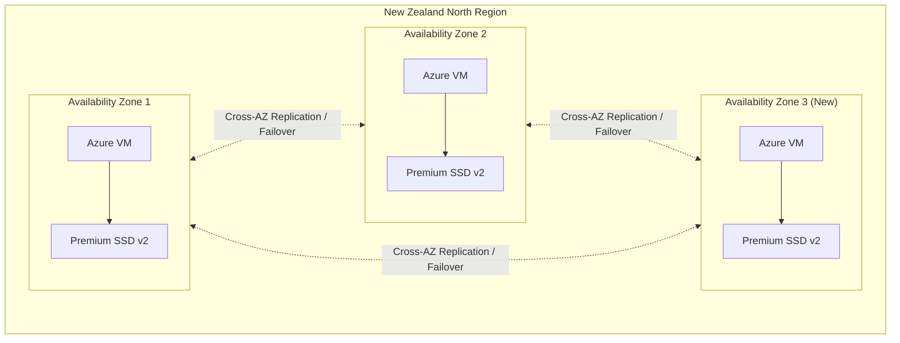

# Azure Disk Storage: Premium SSD v2 が New Zealand North リージョンの第 3 Availability Zone で利用可能に

**リリース日**: 2026-02-27

**サービス**: Azure Disk Storage

**機能**: Premium SSD v2 が New Zealand North リージョンの第 3 Availability Zone で GA

**ステータス**: Launched (GA)

[このアップデートのインフォグラフィックを見る](https://takech9203.github.io/azure-news-summary/20260227-premium-ssd-v2-new-zealand-north-az3.html)

## 概要

Azure Premium SSD v2 Disk Storage が New Zealand North リージョンの第 3 Availability Zone (AZ) で利用可能になった。これにより、New Zealand North は Premium SSD v2 を 3 つの Availability Zone すべてで利用できるリージョンとなり、ニュージーランドにおけるミッションクリティカルなワークロードの耐障害性が大幅に向上する。

Premium SSD v2 は Azure 仮想マシン向けの次世代汎用ブロックストレージであり、サブミリ秒のレイテンシと優れたコストパフォーマンスを提供する。容量・IOPS・スループットをそれぞれ独立して調整できるため、ワークロードの要件に合わせた柔軟なパフォーマンスチューニングが可能である。

今回のアップデートにより、New Zealand North リージョンのユーザーは 3 つの AZ にまたがるゾーン冗長構成を採用でき、データセンター障害に対する耐障害性を最大化できるようになった。

**アップデート前の課題**

- New Zealand North で Premium SSD v2 を利用できる AZ が 2 つに限られており、ゾーン冗長構成の選択肢が制限されていた
- 2 AZ 構成では、単一 AZ 障害時のフェイルオーバー先が 1 つしかなく、可用性リスクが高かった

**アップデート後の改善**

- 3 つの AZ すべてで Premium SSD v2 が利用可能となり、完全なゾーン冗長構成が実現
- AZ 間でのワークロード分散の柔軟性が向上し、より堅牢な DR / HA 構成を設計可能に
- ニュージーランド国内のデータ主権要件を満たしつつ、最高レベルの可用性を確保

## アーキテクチャ図



3 つの Availability Zone に Premium SSD v2 ディスクを分散配置することで、単一データセンター障害に対する耐障害性を確保し、ゾーン冗長アーキテクチャを実現できる。

## サービスアップデートの詳細

### 主要機能

1. **第 3 AZ での Premium SSD v2 サポート**
   - New Zealand North リージョンの 3 つ目の Availability Zone で Premium SSD v2 が利用可能に
   - これにより New Zealand North は「Three Availability Zones」カテゴリに昇格

2. **独立したパフォーマンスチューニング**
   - 容量 (1 GiB ~ 64 TiB)、IOPS (最大 80,000)、スループット (最大 1,200 MB/s) をそれぞれ独立して設定可能
   - 24 時間以内に最大 4 回のパフォーマンス変更が可能 (ディスク作成を含む)
   - ダウンタイムなしでパフォーマンスを調整可能

3. **サブミリ秒レイテンシ**
   - Premium SSD v2 は 99.9% の時間でサブミリ秒のレイテンシを提供
   - ホストキャッシュは非対応だが、低レイテンシにより同等の効果を実現

4. **Instant Access Incremental Snapshots 対応**
   - Premium SSD v2 で即時アクセス増分スナップショットが利用可能
   - スナップショット作成直後にディスク復元が可能で、復元直後からフルパフォーマンスを発揮
   - AZ 間でのスナップショット復元もサポート

## 技術仕様

| 項目 | 詳細 |
|------|------|
| 最大ディスクサイズ | 65,536 GiB (64 TiB) |
| 最大 IOPS | 80,000 |
| 最大スループット | 1,200 MB/s |
| ベースライン IOPS (無料) | 3,000 |
| ベースラインスループット (無料) | 125 MB/s |
| IOPS スケーリング | 6 GiB 以上で 500 IOPS/GiB |
| スループットスケーリング | 0.25 MB/s per provisioned IOPS |
| レイテンシ | サブミリ秒 (99.9% SLA) |
| セクターサイズ | 4k (デフォルト) / 512E |
| ホストキャッシュ | 非対応 |
| OS ディスクとしての使用 | 非対応 |
| SKU | PremiumV2_LRS |
| パフォーマンス変更回数 | 24 時間以内に最大 4 回 |

## 設定方法

### 前提条件

1. Azure サブスクリプションが有効であること
2. 最新の Azure CLI または Azure PowerShell モジュールがインストールされていること
3. VM を Availability Zone を指定して作成すること (Premium SSD v2 はゾーナル VM にのみアタッチ可能)

### Azure CLI

```bash
# Premium SSD v2 ディスクを New Zealand North の AZ 3 に作成
az disk create -n myPremiumSSDv2Disk -g myResourceGroup \
  --size-gb 100 \
  --disk-iops-read-write 5000 \
  --disk-mbps-read-write 150 \
  --location newzealandnorth \
  --zone 3 \
  --sku PremiumV2_LRS \
  --logical-sector-size 4096

# VM を同じリージョン・AZ に作成してディスクをアタッチ
az vm create -n myVM -g myResourceGroup \
  --image Ubuntu2204 \
  --zone 3 \
  --size Standard_D4s_v3 \
  --location newzealandnorth \
  --attach-data-disks myPremiumSSDv2Disk
```

```bash
# 対応リージョン・AZ をプログラムで確認
az vm list-skus --resource-type disks \
  --query "[?name=='PremiumV2_LRS'].{Region:locationInfo[0].location, Zones:locationInfo[0].zones}"
```

```bash
# パフォーマンスの動的調整 (ダウンタイム不要)
az disk update --resource-group myResourceGroup \
  --name myPremiumSSDv2Disk \
  --disk-iops-read-write 10000 \
  --disk-mbps-read-write 300
```

### Azure Portal

1. Azure Portal にサインインし、**Virtual machines** に移動
2. VM 作成時に **Availability options** で **Availability zone** を選択
3. ゾーン 3 を選択 (New Zealand North)
4. **Disks** ページで **Create and attach a new disk** を選択
5. **Disk SKU** で **Premium SSD v2** を選択
6. 容量・IOPS・スループットを必要に応じて設定
7. セクターサイズ (4k または 512E) を選択してデプロイ

## メリット

### ビジネス面

- **データ主権の確保**: ニュージーランド国内でデータを保持しつつ、最高レベルの可用性を実現
- **コスト最適化**: 容量・IOPS・スループットを個別に設定できるため、必要なパフォーマンスのみに課金される
- **SLA の向上**: 3 AZ 構成により、単一 AZ 障害時のサービス継続性が向上
- **ディスクストライピング不要**: パフォーマンスを柔軟に調整できるため、複数ディスクのストライピングによるパフォーマンス確保が不要

### 技術面

- **完全なゾーン冗長**: 3 つの AZ すべてで利用可能となり、真のゾーン冗長アーキテクチャを構築可能
- **サブミリ秒レイテンシ**: トランザクション集約型ワークロード (SQL Server, Oracle, SAP HANA 等) に最適
- **動的パフォーマンス調整**: ダウンタイムなしで IOPS / スループットを変更可能
- **即時スナップショット復元**: Instant Access Incremental Snapshots によりバックアップ / リストアの迅速化

## デメリット・制約事項

- OS ディスクとしては使用不可 (データディスクのみ)
- Azure Compute Gallery との併用不可
- ホストキャッシュ非対応
- ゾーナル VM にのみアタッチ可能 (Availability Zone を指定して VM を作成する必要がある)
- 現時点では LRS (ローカル冗長ストレージ) 構成のみサポート
- 24 時間以内のパフォーマンス変更は最大 4 回まで (ディスク作成を含む)
- リージョンあたりサブスクリプションあたりのデフォルト容量上限は 100 TiB (クォータ増加リクエストにより拡張可能)

## ユースケース

### ユースケース 1: ニュージーランド国内の金融サービス向けデータベース基盤

**シナリオ**: ニュージーランドの金融機関が、データ主権要件を満たしつつ高可用性のデータベース基盤を構築する。SQL Server Always On 可用性グループを 3 つの AZ に分散配置する。

**実装例**:

```bash
# AZ 1 にプライマリノード用ディスクを作成
az disk create -n sqlPrimaryDisk -g sqlRG \
  --size-gb 512 --disk-iops-read-write 20000 --disk-mbps-read-write 500 \
  --location newzealandnorth --zone 1 --sku PremiumV2_LRS

# AZ 2 にセカンダリノード用ディスクを作成
az disk create -n sqlSecondary1Disk -g sqlRG \
  --size-gb 512 --disk-iops-read-write 10000 --disk-mbps-read-write 250 \
  --location newzealandnorth --zone 2 --sku PremiumV2_LRS

# AZ 3 にセカンダリノード用ディスクを作成 (今回新たに利用可能)
az disk create -n sqlSecondary2Disk -g sqlRG \
  --size-gb 512 --disk-iops-read-write 10000 --disk-mbps-read-write 250 \
  --location newzealandnorth --zone 3 --sku PremiumV2_LRS
```

**効果**: 3 AZ にまたがる SQL Server Always On 構成により、単一データセンター障害時も自動フェイルオーバーでサービス継続が可能。セカンダリノードの IOPS を抑えることでコストを最適化しつつ、必要時にはパフォーマンスを動的に引き上げ可能。

### ユースケース 2: SAP HANA のゾーン冗長構成

**シナリオ**: ニュージーランドで SAP HANA ワークロードを運用する企業が、3 AZ 構成で HSR (HANA System Replication) を構築する。

**効果**: Premium SSD v2 のサブミリ秒レイテンシにより SAP HANA の要件を満たしつつ、3 AZ にまたがるレプリケーションで最高レベルの可用性を実現。

## 料金

Premium SSD v2 の料金は容量・IOPS・スループットの 3 つの要素で構成される。

| 項目 | 詳細 |
|------|------|
| ディスク容量 | GiB 単位で課金 (時間課金) |
| プロビジョニング IOPS | 3,000 IOPS まで無料、超過分は IOPS 単位で課金 |
| プロビジョニングスループット | 125 MB/s まで無料、超過分は MB/s 単位で課金 |

具体的な料金はリージョンにより異なるため、[Azure Managed Disks 料金ページ](https://azure.microsoft.com/pricing/details/managed-disks/) で New Zealand North リージョンの料金を確認することを推奨する。

Premium SSD v1 と比較して、Premium SSD v2 は必要なパフォーマンスのみに課金される従量制モデルであるため、ワークロードによっては大幅なコスト削減が期待できる。

## 利用可能リージョン

Premium SSD v2 の 3 Availability Zone サポートリージョン (New Zealand North を含む):

Austria East, Australia East, Brazil South, Canada Central, Central India, Central US, China North 3, East Asia, East US, East US 2, France Central, Germany West Central, Indonesia Central, Israel Central, Italy North, Japan East, Korea Central, Malaysia West, Mexico Central, **New Zealand North**, North Europe, Norway East, Poland Central, Spain Central, South African North, South Central US, Southeast Asia, Sweden Central, Switzerland North, UAE North, UK South, US Gov Virginia, West Europe, West US 2, West US 3

## 関連サービス・機能

- **Azure Ultra Disks**: Premium SSD v2 よりもさらに高い IOPS (最大 400,000) とスループット (最大 10,000 MB/s) を必要とするワークロード向け
- **Premium SSD (v1)**: OS ディスクとして使用可能な従来型のプレミアム SSD。固定サイズ・固定パフォーマンスモデル
- **Instant Access Incremental Snapshots**: Premium SSD v2 で即時アクセス増分スナップショットを利用可能。スナップショット作成直後からディスク復元とフルパフォーマンスを実現
- **Azure Virtual Machines**: Premium SSD v2 をデータディスクとしてアタッチ。DSv3, Ddsv4, Esv5, M-series など幅広い VM シリーズに対応

## 参考リンク

- [インフォグラフィック](https://takech9203.github.io/azure-news-summary/20260227-premium-ssd-v2-new-zealand-north-az3.html)
- [公式アップデート情報](https://azure.microsoft.com/updates?id=558078)
- [Azure Blog - Instant Access Incremental Snapshots](https://azure.microsoft.com/en-us/blog/instant-access-incremental-snapshots-restore-without-waiting/)
- [Microsoft Learn - Azure ディスクの種類](https://learn.microsoft.com/en-us/azure/virtual-machines/disks-types)
- [Microsoft Learn - Premium SSD v2 のデプロイ](https://learn.microsoft.com/en-us/azure/virtual-machines/disks-deploy-premium-v2)
- [料金ページ](https://azure.microsoft.com/pricing/details/managed-disks/)

## まとめ

Azure Premium SSD v2 が New Zealand North リージョンの第 3 Availability Zone で GA となったことで、同リージョンは 3 つすべての AZ で Premium SSD v2 を利用可能な完全対応リージョンとなった。これにより、ニュージーランドにおけるデータ主権要件を満たしつつ、3 AZ にまたがるゾーン冗長構成を採用した高可用性アーキテクチャの構築が可能になる。

Solutions Architect への推奨アクション:
- New Zealand North で 2 AZ 構成の Premium SSD v2 ワークロードを運用している場合、第 3 AZ の追加を検討し、耐障害性を向上させる
- 新規のミッションクリティカルなワークロード (SQL Server, SAP HANA, Oracle 等) を New Zealand North にデプロイする際は、3 AZ 構成を標準アーキテクチャとして採用する
- Premium SSD v2 の動的パフォーマンス調整機能を活用し、ピーク時と通常時でコストを最適化する

---

**タグ**: #Azure #DiskStorage #PremiumSSDv2 #NewZealandNorth #AvailabilityZone #GA #Storage #HighAvailability
