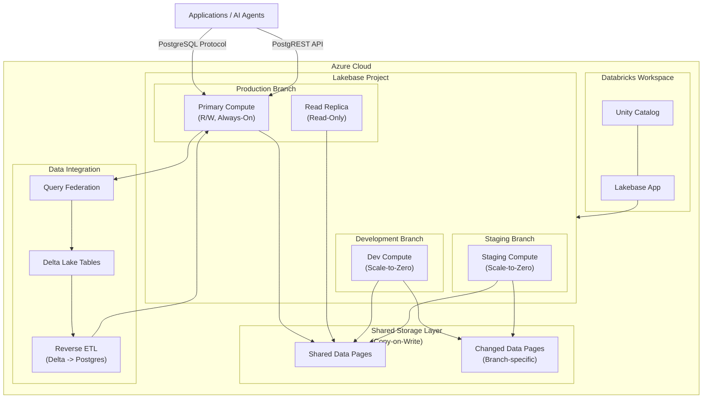

# Azure Databricks: Lakebase Postgres 一般提供開始 (GA)

**リリース日**: 2026-03-02

**サービス**: Azure Databricks

**機能**: Lakebase Postgres (マネージド PostgreSQL OLTP データベース)

**ステータス**: Launched (GA)

[このアップデートのインフォグラフィックを見る](https://takech9203.github.io/azure-news-summary/20260302-azure-databricks-lakebase.html)

## 概要

Azure Databricks Lakebase の一般提供 (GA) が発表された。Lakebase は、Databricks Data Intelligence Platform に統合されたフルマネージドの PostgreSQL データベースサービスであり、Lakehouse にオンライントランザクション処理 (OLTP) 機能を提供する。従来の分析ワークロードに加えて、リアルタイムのトランザクショナルアプリケーションを同一プラットフォーム上で構築可能となる。

Lakebase の最大の特徴は、次世代のストレージとコンピュートの分離アーキテクチャを採用している点にある。これにより、オートスケーリング、Scale-to-Zero、ブランチ (インスタントクローン)、インスタントリストアといった、従来の PostgreSQL マネージドサービスでは実現が困難であった機能群が利用可能となる。Lakebase は PostgreSQL 16/17 互換であり、既存の PostgreSQL アプリケーションやツールからシームレスに接続できる。

現在、Lakebase には「Lakebase Autoscaling」と「Lakebase Provisioned」の 2 つのバージョンが提供されている。Autoscaling 版は最新版であり、オートスケーリング・Scale-to-Zero・ブランチ機能を備えた次世代アーキテクチャを採用している。

**アップデート前の課題**

- Lakehouse プラットフォーム上で OLTP ワークロードを実行するためのマネージドソリューションが存在しなかった
- 開発・テスト・ステージング環境ごとに個別のデータベースサーバーを運用する必要があり、コストと管理負荷が大きかった
- 従来の PostgreSQL マネージドサービスでは、コンピュートとストレージが密結合されており、それぞれを独立してスケールすることが困難だった
- データベースのクローン作成に時間がかかり、本番データを使った開発テストのサイクルが遅延していた

**アップデート後の改善**

- Lakehouse 上で分析ワークロードと OLTP ワークロードを統合的に管理可能
- Copy-on-Write 技術によるインスタントブランチで、本番データベースの完全なコピーが瞬時に作成可能 (変更分のストレージのみ課金)
- Scale-to-Zero により、非稼働時のコンピュートコストをゼロに削減
- オートスケーリングによりワークロードの変動に自動対応し、手動でのリソース管理が不要

## アーキテクチャ図



Lakebase は、ストレージとコンピュートを分離したアーキテクチャを採用している。各ブランチは独自のコンピュートを持ちつつ、Copy-on-Write 技術により共有ストレージレイヤーを通じてデータを効率的に共有する。アプリケーションからは標準の PostgreSQL プロトコルまたは PostgREST 互換の Data API 経由で接続する。

## サービスアップデートの詳細

### 主要機能

1. **オートスケーリング**
   - ワークロードの需要に応じてコンピュートリソースが自動的にスケールアップ/ダウン
   - CPU 負荷、メモリ使用量、ワーキングセットサイズの 3 つのメトリクスを監視してスケーリングを判断
   - ユーザー定義の最小/最大 Compute Unit (CU) 範囲内で動作 (最大 32 CU まで自動スケーリング対応)
   - 1 CU = 2 GB RAM (Autoscaling 版)
   - ダウンタイムや接続中断なしでスケーリングが実行される

2. **Scale-to-Zero**
   - 一定期間の非アクティブ状態の後、コンピュートが自動的にサスペンド
   - デフォルトのタイムアウトは 5 分、最小 60 秒から設定可能
   - サスペンド中のコンピュートコストはゼロ
   - 新しいクエリ到着時に数百ミリ秒で自動的に再アクティベーション
   - データ、接続文字列、認証情報はサスペンド中も保持

3. **ブランチ (インスタントクローン)**
   - Git のブランチに類似したデータベース環境の分岐機能
   - Copy-on-Write 技術により、データベースサイズに関係なく瞬時にブランチを作成
   - 変更データのみストレージコストが発生 (例: 100 GB データベースで 1 GB 変更した場合、追加ストレージは約 1 GB)
   - 親子関係の階層構造 (production -> staging -> feature-test)
   - ブランチリセットにより親ブランチの最新状態を瞬時に反映可能

4. **インスタントリストア (ポイントインタイムリカバリ)**
   - 設定したリストアウィンドウ内 (0 - 30 日) の任意の時点にデータベースを復元可能
   - 誤ったデータ削除やスキーマ変更からの迅速な復旧
   - 監査やコンプライアンス対応のための過去データへのアクセス

5. **Read Replica**
   - 同一ストレージレイヤーを共有する読み取り専用コンピュートエンドポイント
   - データ複製なしで瞬時に作成可能
   - 読み取りワークロードのスケールアウトに有効

6. **Data API (PostgREST 互換)**
   - HTTP 経由でデータベースに直接アクセス可能な RESTful インターフェース
   - PostgREST 互換の API で、既存のツールやフレームワークと統合可能

7. **Unity Catalog 統合**
   - Lakebase データベースを Unity Catalog に登録可能
   - Delta Lake テーブルとの Reverse ETL (Delta -> Postgres 同期)
   - Query Federation によるクロスデータソースクエリ

## 技術仕様

| 項目 | 詳細 |
|------|------|
| PostgreSQL 互換バージョン | PostgreSQL 16 / PostgreSQL 17 |
| Compute Unit (CU) | 1 CU = 2 GB RAM (Autoscaling 版) |
| オートスケーリング範囲 | 最大 32 CU (max - min <= 16 CU) |
| 固定サイズコンピュート | 36 CU - 112 CU (32 CU 超のワークロード向け) |
| Scale-to-Zero タイムアウト | 最小 60 秒、デフォルト 5 分 |
| 再アクティベーション時間 | 数百ミリ秒 |
| ポイントインタイムリストア | 0 - 30 日のリストアウィンドウ |
| 接続プロトコル | PostgreSQL ワイヤプロトコル、PostgREST 互換 Data API |
| リソース階層 | Workspace > Project > Branch > Compute / Database |
| IaC サポート | Asset Bundles, Terraform (Beta) |
| プログラマティックアクセス | REST API, CLI, SDKs (Beta) |

## メリット

### ビジネス面

- **コスト最適化**: Scale-to-Zero とオートスケーリングにより、実際の使用量に基づく課金が実現。1 日 8 時間使用の開発データベースの場合、常時稼働の約 1/3 のコストで運用可能
- **開発サイクルの短縮**: インスタントブランチにより、本番データを使った開発・テスト環境を瞬時に構築。データシーディングスクリプトや環境構築の待ち時間を排除
- **プラットフォーム統合**: 分析 (OLAP) とトランザクション (OLTP) のワークロードを同一の Databricks プラットフォーム上で管理可能。データサイロの解消とガバナンスの統一
- **マルチテナント対応**: テナントごとのデータベースを Scale-to-Zero で運用することで、非アクティブテナントのコストを削減

### 技術面

- **PostgreSQL 完全互換**: PostgreSQL 16/17 互換のため、既存アプリケーション、ORM、ドライバーをそのまま利用可能
- **ストレージ/コンピュート分離**: 独立したスケーリングにより、リソースの無駄を最小化
- **Copy-on-Write**: ブランチ作成時にデータの物理コピーが不要。変更分のみストレージコストが発生
- **ダウンタイムなしのスケーリング**: オートスケーリング時に接続の中断やコンピュートの再起動が不要
- **Unity Catalog 統合**: データガバナンス、アクセス制御、データリネージを統一的に管理

## デメリット・制約事項

- **Lakebase Autoscaling では高可用性 (Readable Secondaries) が未サポート**: 高可用性が必要な場合は Lakebase Provisioned を選択する必要がある
- **Compliance Security Profile 未対応**: Autoscaling 版ではコンプライアンスセキュリティプロファイルがサポートされていない
- **Postgres -> Delta 同期が Autoscaling 版で未サポート**: Provisioned 版では Private Preview として利用可能
- **Feature Store 連携が Autoscaling 版で未サポート**: ML Feature Store との統合は Provisioned 版のみ
- **Stateful AI Agent 連携が Autoscaling 版で未サポート**: Agent Framework でのステート保存は Provisioned 版のみ
- **Billing タグ・Budget Policy が Autoscaling 版で未サポート**: コスト管理のきめ細かい制御には制限がある
- **Scale-to-Zero 再アクティベーション時のセッションコンテキストリセット**: インメモリ統計、一時テーブル、準備済みステートメント、セッション設定がリセットされる
- **Provisioned 版と Autoscaling 版間の直接マイグレーション不可**: pg_dump/pg_restore または Reverse ETL を使用する必要がある
- **Databricks Apps UI 統合が Autoscaling 版で未サポート**: 接続認証情報を手動で設定する必要がある

## ユースケース

### ユースケース 1: AI エージェント / リアルタイムアプリケーション

**シナリオ**: AI エージェントやチャットボットのバックエンドデータベースとして Lakebase を利用する。業務時間帯は高いトラフィックが発生するが、夜間や週末はほぼアクセスがない。

**実装例**:

```
Lakebase Autoscaling 設定:
- Production Branch: オートスケーリング (2 - 16 CU)、Scale-to-Zero 無効
- Development Branch: オートスケーリング (2 - 8 CU)、Scale-to-Zero 有効 (5 分)

接続: 標準 PostgreSQL ドライバー経由
```

**効果**: オートスケーリングにより業務時間帯のトラフィックスパイクに自動対応しつつ、Development ブランチは非稼働時のコストがゼロになる。本番データを使ったテスト環境をブランチで瞬時に構築可能。

### ユースケース 2: マイクロサービスアーキテクチャの OLTP 層

**シナリオ**: マイクロサービスごとに独立したデータベースが必要なアーキテクチャにおいて、サービス間のデータガバナンスを Unity Catalog で統一管理しつつ、各サービスの OLTP ニーズを Lakebase で満たす。

**実装例**:

```
Project 構成:
- service-users (Project) -> production / development ブランチ
- service-orders (Project) -> production / staging / development ブランチ
- service-inventory (Project) -> production / development ブランチ

Unity Catalog で全 Project を統合管理
Query Federation で分析ワークロードからクロスサービスクエリ実行
```

**効果**: 各サービスが独立した PostgreSQL データベースを持ちつつ、Unity Catalog による統合的なデータガバナンスを実現。Query Federation により、分析チームが全サービスのデータを横断的に参照可能。

### ユースケース 3: ブランチベースの CI/CD ワークフロー

**シナリオ**: Pull Request ごとにデータベースのブランチを作成し、スキーマ変更の自動テストを実行する。テスト完了後はブランチを削除し、本番へのマイグレーションを適用する。

**実装例**:

```
CI/CD パイプライン:
1. PR 作成時 -> production ブランチからインスタントブランチを作成
2. マイグレーションスクリプトをブランチに適用
3. 自動テスト実行
4. テスト成功 -> PR マージ、本番にマイグレーション適用
5. テスト用ブランチを削除
```

**効果**: 本番データの完全なコピーに対してスキーマ変更を事前検証可能。ブランチ作成はデータベースサイズに関係なく瞬時。Scale-to-Zero により、テスト中以外のコンピュートコストはゼロ。

## 利用可能リージョン

**Lakebase Autoscaling**:
`eastus`, `eastus2`, `centralus`, `southcentralus`, `westus`, `westus2`, `canadacentral`, `brazilsouth`, `northeurope`, `uksouth`, `westeurope`, `australiaeast`, `centralindia`, `southeastasia`

**Lakebase Provisioned**:
`westus`, `westus2`, `eastus`, `eastus2`, `centralus`, `southcentralus`, `northeurope`, `westeurope`, `australiaeast`, `brazilsouth`, `canadacentral`, `centralindia`, `southeastasia`, `uksouth`

## 関連サービス・機能

- **Unity Catalog**: Lakebase データベースの登録、データガバナンス、アクセス制御の統合管理
- **Delta Lake**: Reverse ETL (Delta -> Postgres 同期) および Query Federation によるデータ連携
- **Databricks Apps**: Lakebase をバックエンドとしたアプリケーション構築 (Provisioned 版で UI 統合サポート)
- **Databricks Agent Framework**: AI エージェントのステート管理 (Provisioned 版でサポート)
- **Azure Database for PostgreSQL**: 既存の Azure PostgreSQL マネージドサービス。Lakebase は Databricks プラットフォーム統合と Copy-on-Write ブランチ機能で差別化
- **Lakehouse Federation**: 外部データソースへのフェデレーテッドクエリ機能

## 参考リンク

- [インフォグラフィック](https://takech9203.github.io/azure-news-summary/20260302-azure-databricks-lakebase.html)
- [公式アップデート情報](https://azure.microsoft.com/updates?id=557991)
- [Microsoft Learn - Lakebase Postgres](https://learn.microsoft.com/en-us/azure/databricks/oltp/)
- [Microsoft Learn - Lakebase Autoscaling](https://learn.microsoft.com/en-us/azure/databricks/oltp/projects/about)
- [Microsoft Learn - Scale to Zero](https://learn.microsoft.com/en-us/azure/databricks/oltp/projects/scale-to-zero)
- [Microsoft Learn - Branches](https://learn.microsoft.com/en-us/azure/databricks/oltp/projects/branches)
- [Microsoft Learn - Autoscaling](https://learn.microsoft.com/en-us/azure/databricks/oltp/projects/autoscaling)
- [Microsoft Learn - Limitations](https://learn.microsoft.com/en-us/azure/databricks/oltp/projects/limitations)

## まとめ

Azure Databricks Lakebase の GA は、Lakehouse アーキテクチャに OLTP 機能を本格的に統合する重要なマイルストーンである。ストレージとコンピュートの分離、Copy-on-Write ブランチ、Scale-to-Zero、オートスケーリングといった次世代機能により、従来のマネージド PostgreSQL サービスとは一線を画すコスト効率と開発体験を提供する。

Solutions Architect としての推奨アクションは以下の通りである。

1. **評価開始**: Lakehouse プラットフォーム上で OLTP ワークロードを統合したいユースケースがある場合、Lakebase Autoscaling の評価を開始する
2. **バージョン選定**: 高可用性 (Readable Secondaries) や Feature Store 連携が必要な場合は Provisioned 版を検討し、コスト最適化とブランチワークフローを重視する場合は Autoscaling 版を選択する
3. **既存環境との比較**: Azure Database for PostgreSQL や他のマネージド PostgreSQL を使用している場合、Unity Catalog 統合やブランチ機能による開発効率向上の観点から移行のメリットを評価する
4. **制約事項の確認**: Autoscaling 版は高可用性や一部のアプリケーション統合が未サポートのため、本番ワークロードの要件と照らし合わせて適切なバージョンを選択する

---

**タグ**: #AzureDatabricks #Lakebase #PostgreSQL #OLTP #ScaleToZero #Autoscaling #Lakehouse #GA #AI #Analytics
