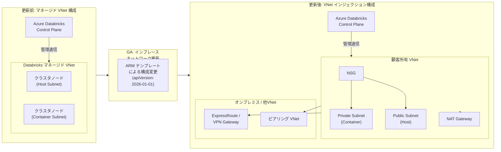

# Azure Databricks: ワークスペースネットワーク構成の更新機能が GA

**リリース日**: 2026-03-02

**サービス**: Azure Databricks

**機能**: ワークスペースネットワーク構成の更新 (Update Workspace Network Configuration)

**ステータス**: Launched (GA)

[このアップデートのインフォグラフィックを見る](https://takech9203.github.io/azure-news-summary/20260302-azure-databricks-workspace-network-config.html)

## 概要

Azure Databricks ワークスペースのネットワーク構成を、既存のワークスペースを再作成することなく変更できる機能が一般提供 (GA) となった。これにより、Azure Databricks マネージド VNet から顧客所有の VNet (VNet インジェクション) への移行、VNet インジェクション済みワークスペースの別 VNet への移行、および既存 VNet インジェクションワークスペースのサブネット変更がサポートされる。

従来、Azure Databricks ワークスペースのネットワーク構成は作成時に決定され、後から変更することができなかった。マネージド VNet で作成したワークスペースを VNet インジェクションに切り替えるには、新しいワークスペースの再作成とデータ・設定の移行が必要であり、大きな運用負荷が発生していた。本アップデートにより、既存ワークスペースのネットワーク構成をインプレースで更新できるようになり、Solutions Architect にとってネットワーク設計の柔軟性が大幅に向上した。

**アップデート前の課題**

- マネージド VNet から VNet インジェクションへの変更にはワークスペースの再作成が必要だった
- ワークスペース再作成に伴い、ノートブック、ジョブ、クラスタ設定、権限設定などの移行作業が発生していた
- 初期構築時にネットワーク設計を確定させる必要があり、段階的なセキュリティ強化が困難だった
- VNet インジェクション済みワークスペースのサブネット変更やVNet移行も不可能だった

**アップデート後の改善**

- 既存ワークスペースをそのまま維持しながらネットワーク構成を変更可能
- マネージド VNet から VNet インジェクションへのインプレース移行が可能
- VNet インジェクション済みワークスペースの別 VNet への移行が可能
- 既存 VNet インジェクションワークスペースのサブネット差し替えが可能
- 段階的なセキュリティ強化アプローチが採用可能に

## アーキテクチャ図



本図は、マネージド VNet 構成のワークスペースから VNet インジェクション構成への移行フローを示している。インプレース更新により、ワークスペースを再作成することなく、顧客所有の VNet に移行し、NSG、NAT Gateway、ExpressRoute、VNet ピアリングなどのネットワーク機能を利用できるようになる。

## サービスアップデートの詳細

### 主要機能

1. **マネージド VNet から VNet インジェクションへの移行**
   - 既存ワークスペースのネットワーク構成を ARM テンプレート経由で更新
   - NSG の作成、新規 VNet の作成、ワークスペーステンプレートの編集の 3 ステップで完了
   - apiVersion `2026-01-01` を使用した ARM テンプレートのデプロイが必要

2. **VNet インジェクション済みワークスペースの VNet 移行**
   - 既に VNet インジェクション済みのワークスペースを別の VNet に移行可能
   - マネージド VNet からの移行と同じ手順で実行可能

3. **サブネットの差し替え**
   - 既存 VNet インジェクションワークスペースの Private Subnet / Public Subnet を新しいサブネットに変更可能
   - IP アドレス空間の拡張やサブネット再構成に対応

## 技術仕様

| 項目 | 詳細 |
|------|------|
| ARM API バージョン | `2026-01-01` |
| 対象ネットワーク構成 | マネージド VNet、VNet インジェクション |
| VNet CIDR 範囲 | `/16` - `/24` |
| サブネット CIDR 範囲 | `/26` 以上を推奨 (最小 `/28`) |
| 必要なサブネット数 | 2 (Private Subnet / Public Subnet) |
| 更新完了までの時間 | 約 15 分以内 |
| Terraform サポート | 非対応 |
| 必要な Azure ロール | Network Contributor、または `Microsoft.Network/virtualNetworks/subnets/join/action` と `Microsoft.Network/virtualNetworks/subnets/write` のカスタムロール |

## 設定方法

### 前提条件

1. ワークスペースが Azure Load Balancer を使用していないこと (使用している場合はアカウントチームに連絡)
2. 実行中のすべてのクラスタとジョブを停止すること
3. Network Contributor ロールまたは同等のカスタムロール権限を持つこと
4. 移行先の VNet がワークスペースと同一リージョン・同一サブスクリプションにあること

### ステップ 1: NSG の作成

Azure Portal で「Deploy a custom template」から以下の ARM テンプレートをデプロイし、NSG を作成する。

```json
{
  "$schema": "https://schema.management.azure.com/schemas/2019-04-01/deploymentTemplate.json#",
  "contentVersion": "1.0.0.0",
  "parameters": {
    "location": {
      "type": "string",
      "defaultValue": "[resourceGroup().location]"
    },
    "NSGName": {
      "type": "string",
      "defaultValue": "databricks-nsg-01"
    }
  },
  "resources": [
    {
      "apiVersion": "2020-05-01",
      "type": "Microsoft.Network/networkSecurityGroups",
      "name": "[parameters('NSGName')]",
      "location": "[parameters('location')]"
    }
  ],
  "outputs": {
    "existingNSGId": {
      "type": "string",
      "value": "[resourceId('Microsoft.Network/networkSecurityGroups', parameters('NSGName'))]"
    }
  }
}
```

### ステップ 2: VNet の作成

Azure Quickstart テンプレート `databricks-vnet-for-vnet-injection-with-nat-gateway` を使用して、NAT Gateway 付きの新規 VNet を作成する。デプロイ時にステップ 1 で作成した NSG の ID を指定する。

### ステップ 3: ワークスペースの更新

1. Azure Portal でワークスペースの「Export template」からテンプレートを取得
2. `apiVersion` を `2026-01-01` に変更
3. `vnetAddressPrefix`、`natGatewayName`、`publicIpName` パラメータを削除
4. 以下のパラメータを `resources.properties.parameters` に追加

```json
{
  "customPrivateSubnetName": {
    "value": "<private-subnet-name>"
  },
  "customPublicSubnetName": {
    "value": "<public-subnet-name>"
  },
  "customVirtualNetworkId": {
    "value": "/subscriptions/<subscription-id>/resourceGroups/<resource-group>/providers/Microsoft.Network/virtualNetworks/<vnet-name>"
  }
}
```

### 更新後の検証

| テスト項目 | 手順 |
|-----------|------|
| 新規クラスタの動作確認 | 新しいクラスタを作成しジョブを実行 |
| 既存クラスタの動作確認 | 更新前に作成されたクラスタでジョブを実行 |

更新完了まで約 15 分を要する。ワークスペースのステータスが「Active」に戻ってから検証を実施すること。

## メリット

### ビジネス面

- ワークスペース再作成に伴うダウンタイムと移行コストを大幅に削減
- セキュリティ要件の変化に応じた段階的なネットワーク強化が可能
- コンプライアンス要件への柔軟な対応 (オンプレミス接続、Private Link 等)
- 既存の分析ワークロードやジョブ設定を維持したまま移行可能

### 技術面

- カスタムルーティング (UDR)、ファイアウォール規則、ExpressRoute 接続などの高度なネットワーク制御が利用可能に
- NSG によるきめ細かいトラフィック制御の実装が可能
- IP アドレス範囲の柔軟な設定により企業ネットワークとの競合を回避
- NAT Gateway による安定したエグレス IP アドレスの確保
- Private Link によるバックエンド接続のセキュア化

## デメリット・制約事項

- Terraform による操作は非対応 (ARM テンプレートのみ)
- Azure Load Balancer を使用しているワークスペースは直接更新不可 (アカウントチームへの連絡が必要)
- 更新中はすべてのクラスタとジョブを停止する必要がある (ダウンタイムが発生)
- バックエンド Private Link 接続が設定済みの場合、VNet 移行後に手動で再設定が必要
- サブネット CIDR 範囲はデプロイ後に変更不可 (サブネット自体の差し替えで対応)
- 2026 年 3 月 31 日以降、新規 VNet ではデフォルトのアウトバウンドアクセスが廃止されるため、NAT Gateway 等の明示的なアウトバウンド接続方法が必須

## ユースケース

### ユースケース 1: マネージド VNet ワークスペースのセキュリティ強化

**シナリオ**: PoC フェーズでマネージド VNet を使用して Azure Databricks ワークスペースを構築したが、本番環境への移行に伴い、企業のセキュリティポリシーに準拠した VNet インジェクション構成が必要になった。

**効果**: ノートブック、ジョブ、権限設定などを維持したまま、VNet インジェクションへ移行可能。ワークスペース再作成の工数 (数日 - 数週間) を削減し、移行リスクを最小化。

### ユースケース 2: VNet のアドレス空間拡張

**シナリオ**: VNet インジェクション済みのワークスペースで、クラスタ台数の増加により IP アドレスが不足してきた。より大きな CIDR 範囲を持つサブネットに移行したい。

**効果**: 新しいサブネットを作成し、既存ワークスペースのサブネット構成を更新することで、ワークスペースを維持したまま IP アドレス空間を拡張可能。

### ユースケース 3: オンプレミスネットワークとの接続確立

**シナリオ**: ExpressRoute や VPN Gateway を経由してオンプレミスのデータソースに接続する必要が生じた。マネージド VNet ではオンプレミス接続のカスタムルーティングが設定できない。

**効果**: VNet インジェクションへの移行により、UDR を使用したオンプレミスへのカスタムルーティングや、ExpressRoute/VPN Gateway 経由の接続が可能になる。

## 利用可能リージョン

Azure Databricks が利用可能なすべてのリージョンで提供される。

## 関連サービス・機能

- **Azure Virtual Network (VNet)**: Databricks ワークスペースのデプロイ先となる仮想ネットワーク基盤
- **Azure NAT Gateway**: VNet インジェクション環境における安定したエグレス IP アドレスの提供に推奨
- **Azure Private Link**: Databricks ワークスペースへのプライベート接続およびバックエンド Private Link の構成に使用
- **Network Security Group (NSG)**: VNet インジェクション環境でのトラフィック制御に必須
- **Azure ExpressRoute / VPN Gateway**: VNet インジェクション環境からオンプレミスネットワークへの接続に使用

## 参考リンク

- [インフォグラフィック](https://takech9203.github.io/azure-news-summary/20260302-azure-databricks-workspace-network-config.html)
- [公式アップデート情報](https://azure.microsoft.com/updates?id=558060)
- [Microsoft Learn - ワークスペースネットワーク構成の更新](https://learn.microsoft.com/en-us/azure/databricks/security/network/classic/update-workspaces)
- [Microsoft Learn - VNet インジェクション](https://learn.microsoft.com/en-us/azure/databricks/security/network/classic/vnet-inject)
- [Microsoft Learn - Azure Databricks ネットワーキング概要](https://learn.microsoft.com/en-us/azure/databricks/security/network/)

## まとめ

Azure Databricks ワークスペースのネットワーク構成更新機能の GA は、既存ワークスペースを再作成することなくネットワーク構成を変更できるようにする重要なアップデートである。特に、マネージド VNet から VNet インジェクションへのインプレース移行が可能になったことで、PoC から本番環境への移行や段階的なセキュリティ強化が大幅に容易になった。

Solutions Architect としての推奨アクションは以下の通り:

1. マネージド VNet で運用中のワークスペースがある場合、VNet インジェクションへの移行を計画する
2. 2026 年 3 月 31 日以降の新規 VNet におけるアウトバウンドアクセス廃止に備え、NAT Gateway の導入を検討する
3. Terraform 非対応のため、ARM テンプレートベースの IaC パイプラインを準備する
4. 移行前にバックエンド Private Link 接続の有無を確認し、必要に応じて再構成計画を立てる

---

**タグ**: #AzureDatabricks #VNetInjection #NetworkConfiguration #GA #Security #Networking #AI #MachineLearning #Analytics
