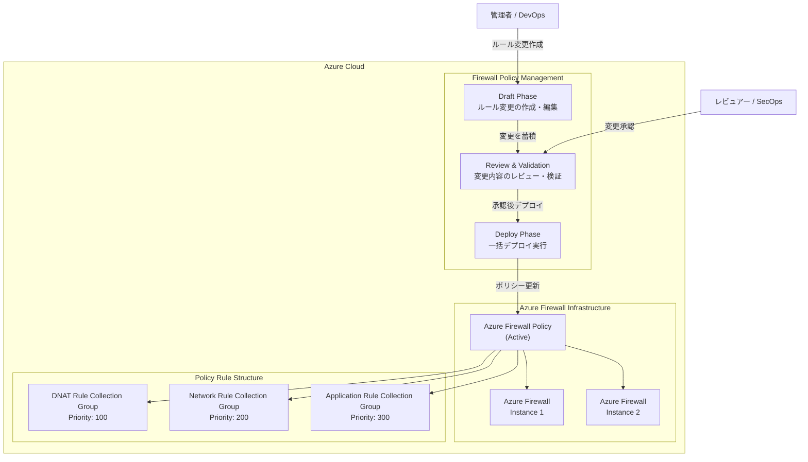

# Azure Firewall: Draft & Deploy 機能

**リリース日**: 2026-03-03

**サービス**: Azure Firewall

**機能**: Draft & Deploy on Azure Firewall Policy

**ステータス**: Launched (GA)

[このアップデートのインフォグラフィックを見る](https://takech9203.github.io/azure-news-summary/20260303-azure-firewall-draft-and-deploy.html)

## 概要

Azure Firewall Policy に新たに導入された Draft & Deploy 機能は、ファイアウォールポリシーの管理に 2 フェーズアプローチを採用し、デプロイ時間の短縮と運用中断の最小化を実現する新機能である。従来、ファイアウォールポリシーの変更はすべてリアルタイムで適用され、即座にフルデプロイメントがトリガーされていたが、本機能の導入により、変更内容を「ドラフト」として事前に準備・検証し、準備が整った段階で一括して「デプロイ」する運用が可能となった。

この機能は、Azure Firewall のすべての SKU（Basic、Standard、Premium）で利用可能な Firewall Policy に対して適用される。大規模な企業環境において、複数のルール変更を安全かつ効率的に管理するためのワークフローを提供し、Solutions Architect にとってファイアウォールポリシーのライフサイクル管理を大幅に改善するものである。

**アップデート前の課題**

- ファイアウォールポリシーへの変更が即座にデプロイされるため、個々の小さな変更ごとにフルデプロイメントが発生し、デプロイ時間が長くなっていた
- 複数のルール変更を一括で適用する仕組みがなく、変更途中の不完全な状態がプロダクション環境に反映されるリスクがあった
- ポリシー変更のレビューや承認プロセスをファイアウォール管理ワークフローに組み込むことが困難だった
- 変更のたびにファイアウォールのデプロイが実行されるため、ネットワーク接続への影響が発生する可能性があった

**アップデート後の改善**

- ドラフトフェーズで複数の変更を事前に蓄積し、一括でデプロイできるようになり、デプロイ回数と所要時間が大幅に削減された
- デプロイ前にドラフト内容をレビュー・検証できるため、誤設定のリスクが低減された
- 変更管理のワークフロー（レビュー、承認、デプロイ）をファイアウォールポリシー管理に自然に組み込めるようになった
- デプロイのタイミングを制御できるため、メンテナンスウィンドウに合わせた変更適用が可能になった

## アーキテクチャ図

この図は Draft & Deploy の 2 フェーズワークフローを示している。管理者がドラフトフェーズでルール変更を作成し、レビュアーが検証・承認した後、デプロイフェーズでアクティブな Azure Firewall Policy に一括適用される。ポリシーは複数の Azure Firewall インスタンスに関連付けられ、DNAT、Network、Application の各ルールコレクショングループで構成される。

## サービスアップデートの詳細

### 主要機能

1. **ドラフトフェーズ（Draft Phase）**
   - ファイアウォールポリシーへの変更をドラフトとして作成・保存できる
   - 複数のルール変更（DNAT ルール、ネットワークルール、アプリケーションルール）をドラフト内に蓄積可能
   - ドラフト状態の変更はプロダクション環境に影響しない
   - 変更内容をチーム間で共有・レビューするためのワークフローを支援

2. **デプロイフェーズ（Deploy Phase）**
   - ドラフト内のすべての変更を一括してアクティブなポリシーに適用
   - デプロイ回数を最小化することで、ファイアウォールへの影響を低減
   - デプロイのタイミングを管理者が制御可能

3. **2 フェーズによるポリシー管理の分離**
   - ポリシーの「編集」と「適用」を明確に分離
   - 変更管理プロセス（Change Management）との統合が容易
   - 複数の管理者が協調してポリシー変更を準備できる

4. **デプロイ時間の短縮**
   - 複数の変更を個別にデプロイする代わりに一括デプロイすることで、累積的なデプロイ時間を大幅に短縮
   - デプロイによるネットワーク中断の回数を最小化

## 技術仕様

| 項目 | 詳細 |
|------|------|
| 対象リソース | Azure Firewall Policy |
| 対応 SKU | Basic, Standard, Premium |
| 対応ルールタイプ | DNAT ルール、ネットワークルール、アプリケーションルール |
| ポリシー階層 | 親ポリシー・子ポリシーの階層構造をサポート |
| 管理方法 | Azure Portal, REST API, Azure PowerShell, Azure CLI, Terraform |
| ポリシースコープ | リージョン横断・サブスクリプション横断で利用可能 |
| 高可用性 | 組み込みの高可用性（ペアリージョンへの自動フェイルオーバー） |

## 設定方法

### 前提条件

1. Azure サブスクリプションを保有していること
2. Azure Firewall Policy が作成済みであること（Basic, Standard, または Premium）
3. Azure Firewall Policy の管理に必要な RBAC ロール（Network Contributor 以上）が割り当てられていること

### Azure Portal

1. Azure Portal にサインインし、対象の Azure Firewall Policy に移動する
2. Draft & Deploy セクション（またはポリシー編集画面）から「新しいドラフトを作成」を選択する
3. ドラフト内でルールコレクショングループ、ルールコレクション、個別ルールの追加・変更・削除を行う
4. 変更内容をレビューし、問題がないことを確認する
5. 「デプロイ」を選択して、ドラフトの変更を一括適用する

## メリット

### ビジネス面

- **運用コストの削減**: デプロイ回数の減少により、運用チームの作業負荷が軽減される
- **ダウンタイムの最小化**: 一括デプロイにより、ファイアウォール変更に伴うネットワーク中断の頻度を低減
- **変更管理プロセスの強化**: ITIL などの変更管理フレームワークとの統合が容易になり、コンプライアンス要件への対応が改善される
- **チーム間の協調**: ドラフトを共有することで、ネットワークチームとセキュリティチームの連携が向上

### 技術面

- **デプロイ時間の最適化**: 複数の変更を一括デプロイすることで、個別デプロイの累積時間と比較して大幅に短縮
- **設定ミスの防止**: デプロイ前のレビュー・検証フェーズにより、誤ったルールがプロダクション環境に適用されるリスクを低減
- **ポリシー管理のライフサイクル改善**: 編集、レビュー、デプロイの明確なフェーズ分離により、Infrastructure as Code (IaC) パイプラインとの統合が容易
- **影響範囲の制御**: デプロイタイミングを制御することで、メンテナンスウィンドウ内での変更適用が可能

## デメリット・制約事項

- ドラフト機能を使用する場合、ドラフトとアクティブポリシーの間で状態の不整合が発生しないよう、運用手順の整備が必要
- 複数の管理者が同時にドラフトを編集する場合の競合管理に注意が必要
- Azure Firewall Policy の料金は従来と変わらず、ファイアウォールとの関連付けに基づいて課金される（ドラフト機能自体に追加料金は発生しない見込み）

## ユースケース

### ユースケース 1: 大規模なルール変更のバッチ適用

**シナリオ**: 企業のネットワークチームが、四半期ごとのセキュリティレビューに基づき、50 以上のファイアウォールルールを一括で更新する必要がある。

**実装例**:

1. Draft & Deploy のドラフトフェーズで、すべてのルール変更を作成・蓄積
2. セキュリティチームがドラフト内容をレビュー・承認
3. 計画されたメンテナンスウィンドウ内で一括デプロイを実行

**効果**: 従来 50 回のデプロイが必要だった変更を 1 回のデプロイで完了でき、デプロイ時間を大幅に短縮。また、レビュープロセスを経ることで設定ミスのリスクを低減。

### ユースケース 2: マルチチーム環境でのポリシー変更管理

**シナリオ**: ネットワークチーム、セキュリティチーム、アプリケーションチームがそれぞれ異なるルール変更を要求する環境で、変更を安全に統合する。

**実装例**:

1. 各チームがドラフトフェーズで必要なルール変更を提案
2. ネットワークアーキテクトがすべての変更を統合・レビュー
3. 承認後、統合されたドラフトを一括デプロイ

**効果**: チーム間の変更が競合するリスクを低減し、デプロイ前に全体的な整合性を確認できる。

### ユースケース 3: 開発・テスト環境での事前検証

**シナリオ**: 本番環境のファイアウォールポリシー変更を、まずドラフトとして準備し、テスト環境で検証してから本番に適用する。

**実装例**:

1. 本番環境のポリシーに対してドラフトを作成
2. 同等の変更をテスト環境に先行適用して影響を確認
3. テスト結果が問題なければ、本番環境のドラフトをデプロイ

**効果**: 本番環境への変更適用前にリスクを最小化できる。

## 料金

Azure Firewall の料金体系は従来と同様で、Draft & Deploy 機能自体に追加料金は発生しない。Azure Firewall の主な料金構成は以下の通り。

| 項目 | 説明 |
|------|------|
| デプロイ料金 | ファイアウォールデプロイごとの固定時間単位料金 |
| データ処理料金 | ファイアウォールで処理されたデータ量（GB 単位）に応じた料金 |
| キャパシティユニット料金 | Standard / Premium で利用可能な時間単位のキャパシティ料金 |

※ 部分的な時間（1 時間未満）は 1 時間として課金される。Azure Firewall の SKU（Basic, Standard, Premium）により料金が異なる。最新の料金は [Azure Firewall 料金ページ](https://azure.microsoft.com/pricing/details/azure-firewall/) を参照。

Firewall Policy の料金は、ファイアウォールとの関連付けに基づいて課金される。0 または 1 つのファイアウォールに関連付けられたポリシーは無料。複数のファイアウォールに関連付けられたポリシーは固定料金で課金される。

## 利用可能リージョン

Azure Firewall がサポートされるすべてのリージョンで利用可能。詳細は [Azure リージョン別利用可能サービス](https://azure.microsoft.com/global-infrastructure/services/?products=azure-firewall) を参照。

## 関連サービス・機能

- **Azure Firewall Manager**: 複数のサブスクリプションにまたがる Azure Firewall の一元管理を提供。Draft & Deploy 機能と組み合わせることで、大規模環境でのポリシー管理がさらに効率化される
- **Azure Firewall Policy（階層ポリシー）**: 親ポリシーと子ポリシーの継承関係を活用したポリシー管理。Draft & Deploy と併用することで、階層的なポリシー変更管理が可能
- **Azure Virtual WAN**: Secured Virtual Hub 環境での Azure Firewall デプロイ。Draft & Deploy により、Virtual WAN 環境のファイアウォールポリシー管理も改善
- **Azure DDoS Protection**: Azure Firewall と組み合わせたネットワークセキュリティの多層防御
- **Azure Web Application Firewall (WAF)**: L7 レベルの Web アプリケーション保護。Azure Firewall のネットワークレベル保護と相互補完的に機能

## 参考リンク

- [インフォグラフィック](https://takech9203.github.io/azure-news-summary/20260303-azure-firewall-draft-and-deploy.html)
- [公式アップデート情報](https://azure.microsoft.com/updates?id=558072)
- [Microsoft Learn - Azure Firewall の概要](https://learn.microsoft.com/en-us/azure/firewall/overview)
- [Microsoft Learn - Azure Firewall Policy ルールセット](https://learn.microsoft.com/en-us/azure/firewall/policy-rule-sets)
- [Microsoft Learn - Azure Firewall Manager ポリシー概要](https://learn.microsoft.com/en-us/azure/firewall-manager/policy-overview)
- [料金ページ](https://azure.microsoft.com/pricing/details/azure-firewall/)

## まとめ

Azure Firewall の Draft & Deploy 機能は、ファイアウォールポリシー管理におけるデプロイの効率化と安全性向上を実現する重要なアップデートである。従来のリアルタイム適用モデルから、ドラフト作成とデプロイの 2 フェーズモデルへの移行により、複数のルール変更を一括で管理・適用できるようになった。

Solutions Architect への推奨アクション:

1. **既存環境の評価**: 現在のファイアウォールポリシー変更ワークフローを見直し、Draft & Deploy 機能の導入メリットを評価する
2. **運用手順の更新**: Draft & Deploy のワークフローに合わせた変更管理手順（ドラフト作成、レビュー、承認、デプロイ）を策定する
3. **段階的導入**: まず非本番環境で Draft & Deploy のワークフローを検証し、チームが慣れた段階で本番環境に展開する
4. **IaC パイプラインとの統合検討**: Terraform や ARM テンプレートを使用した既存のデプロイパイプラインに Draft & Deploy を統合する方法を検討する

特に大規模な企業環境や複数チームが関与するファイアウォール管理において、本機能は運用効率とセキュリティの両面で大きな価値を提供する。

---

**タグ**: #AzureFirewall #Networking #Security #FirewallPolicy #DraftAndDeploy #GA
