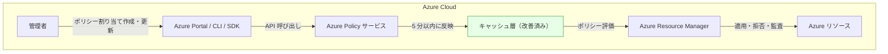

# Azure Policy: ポリシー適用の高速化とログイン/ログアウト ワークアラウンドの廃止

**リリース日**: 2026-03-04

**サービス**: Azure Policy

**機能**: ポリシー適用の高速化とログイン/ログアウト ワークアラウンドの廃止

**ステータス**: Retirement

[このアップデートのインフォグラフィックを見る](https://takech9203.github.io/azure-news-summary/20260304-azure-policy-faster-enforcement-retirement.html)

## 概要

Microsoft は、Azure Policy サービスの応答性を向上させるために長年にわたり大幅な投資を行ってきた。その結果、Resource Manager モードのポリシーにおけるポリシー割り当ての作成および更新が 5 分以内に適用されるようになった。

これまで、ポリシーの割り当てや更新がすぐに反映されない場合、ユーザーは Azure Portal からログアウトして再ログインすることでキャッシュを更新し、ポリシーの適用を強制するというワークアラウンドが広く知られていた。今回のアップデートでは、キャッシュ更新の改善により、このワークアラウンドが不要となったため、正式に廃止される。

**アップデート前の課題**

- ポリシー割り当ての作成・更新後、適用までに時間がかかることがあった
- キャッシュの更新が遅延し、ポリシーが即座に反映されないケースがあった
- ログアウト/ログインによるキャッシュ強制更新のワークアラウンドが必要な場合があった

**アップデート後の改善**

- Resource Manager モードのポリシー割り当ての作成・更新が 5 分以内に適用される
- キャッシュ更新の改善により、ワークアラウンドが不要になった
- ログイン/ログアウト ワークアラウンドは正式に廃止される

## アーキテクチャ図

Azure Policy サービスがキャッシュ層を改善したことにより、ポリシーの割り当てや更新が 5 分以内に Resource Manager へ反映されるようになった。これにより、以前必要だったログイン/ログアウトによるキャッシュ強制更新が不要となった。

## サービスアップデートの詳細

### 主要な変更点

1. **ポリシー適用の高速化**
   - Resource Manager モードのポリシー割り当ての作成および更新が 5 分以内に適用されるようになった
   - 以前は適用までの時間が不定であり、24 時間の標準コンプライアンス評価サイクルを待つ必要がある場合もあった

2. **ログイン/ログアウト ワークアラウンドの廃止**
   - キャッシュ更新の改善により、Azure Portal からのログアウト/再ログインでキャッシュをリフレッシュする手法が不要となった
   - このワークアラウンドは正式に廃止され、今後はサポート対象外となる

3. **キャッシュ更新メカニズムの改善**
   - Azure Policy サービス内部のキャッシュ更新が高速化された
   - ポリシー評価のトリガーがより迅速に処理されるようになった

## 技術仕様

| 項目 | 詳細 |
|------|------|
| 対象モード | Resource Manager モードのポリシー |
| ポリシー適用時間 | 割り当て作成・更新から 5 分以内 |
| 廃止対象 | ログイン/ログアウトによるキャッシュ強制更新ワークアラウンド |
| 評価トリガー（個別リソース） | リソースのデプロイ・更新から約 15 分 |
| 標準コンプライアンス評価サイクル | 24 時間ごと |

## 必要な対応

### 確認事項

1. ログイン/ログアウトのワークアラウンドを使用している運用手順書やスクリプトがないか確認する
2. キャッシュ更新を目的としたログアウト/ログインの自動化処理がある場合は削除する
3. ポリシーが 5 分以内に適用されることを前提とした運用フローに更新する

### 対応が必要なケース

- 自動化スクリプト内でキャッシュリフレッシュのためにログアウト/ログインを実行している場合
- 運用手順書にポリシー適用を促すためのログアウト/ログイン手順が含まれている場合
- CI/CD パイプラインでポリシー適用の待機処理にワークアラウンドを組み込んでいる場合

## メリット

### 運用面

- ポリシー適用までの待ち時間が短縮され、運用効率が向上する
- ワークアラウンドが不要になることで、運用手順が簡素化される
- ポリシー変更の反映が予測可能になり、変更管理が容易になる

### 技術面

- 5 分以内のポリシー適用により、セキュリティポリシーやコンプライアンスルールがより迅速に有効化される
- キャッシュ更新の改善により、ポリシー評価の一貫性が向上する
- オンデマンド評価スキャンとの併用で、より柔軟なポリシー管理が可能になる

## デメリット・制約事項

- ログイン/ログアウト ワークアラウンドに依存した既存のスクリプトや手順は更新が必要
- 5 分以内の適用は Resource Manager モードのポリシーが対象であり、Resource Provider モードのポリシーには異なるタイミングが適用される場合がある
- 大規模なポリシーやイニシアティブの評価には、5 分以上の時間がかかる可能性がある

## 関連サービス・機能

- **Azure Resource Manager**: ポリシーの適用対象となるリソース管理プラットフォーム
- **Azure Policy コンプライアンス**: ポリシー準拠状況の評価・レポート機能
- **Azure Policy Insights**: ポリシー評価結果の取得・分析 API
- **Azure Resource Graph**: コンプライアンスデータのクエリ・エクスポート機能

## 参考リンク

- [インフォグラフィック](https://takech9203.github.io/azure-news-summary/20260304-azure-policy-faster-enforcement-retirement.html)
- [公式アップデート情報](https://azure.microsoft.com/updates?id=558102)
- [Azure Policy の概要 - Microsoft Learn](https://learn.microsoft.com/en-us/azure/governance/policy/overview)
- [ポリシーコンプライアンスデータの取得 - Microsoft Learn](https://learn.microsoft.com/en-us/azure/governance/policy/how-to/get-compliance-data)
- [Azure Policy のトラブルシューティング - Microsoft Learn](https://learn.microsoft.com/en-us/azure/governance/policy/troubleshoot/general)

## まとめ

Azure Policy サービスのキャッシュ更新メカニズムが改善され、Resource Manager モードのポリシー割り当ての作成・更新が 5 分以内に適用されるようになった。これに伴い、従来広く知られていたログイン/ログアウトによるキャッシュ強制更新のワークアラウンドが正式に廃止される。

管理者やインフラ担当者は、このワークアラウンドに依存した運用手順書や自動化スクリプトがないか確認し、該当する場合は速やかに更新することが推奨される。ポリシーの適用が高速化されたことにより、セキュリティポリシーやコンプライアンスルールの即時適用がより確実になり、ガバナンスの強化につながる。

---

**タグ**: #Azure #AzurePolicy #Management #Governance #Compliance #Retirement
