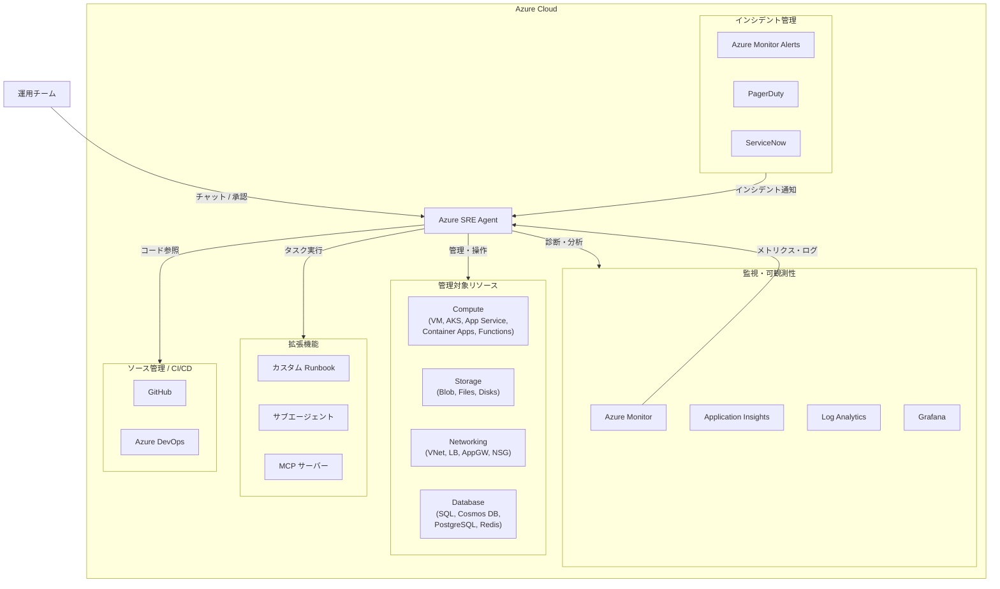

# Azure SRE Agent: 一般提供開始 (GA) と新機能の追加

**リリース日**: 2026-03-11

**サービス**: Azure SRE Agent

**機能**: AI 駆動の運用エージェントが一般提供開始、新機能を搭載

**ステータス**: Launched (GA)

[このアップデートのインフォグラフィックを見る](https://takech9203.github.io/azure-news-summary/20260311-azure-sre-agent-ga.html)

## 概要

Azure SRE Agent が一般提供 (GA) となった。Azure SRE Agent は、AI を活用したサイト信頼性エンジニアリング (SRE) アシスタントであり、本番環境の問題診断と解決、運用トイルの削減、平均復旧時間 (MTTR) の短縮を支援するサービスである。

GA リリースでは、深いコンテキスト理解に基づく診断機能や自動化されたレスポンスワークフローが導入された。エージェントは Azure Monitor、Application Insights、Log Analytics などの監視ツールと統合し、PagerDuty や ServiceNow などのインシデント管理プラットフォームとも連携する。さらに、GitHub や Azure DevOps とのソースコード連携も可能である。

本サービスは、Azure CLI および REST API を通じてすべての Azure サービスを管理でき、カスタム Runbook やサブエージェントによる拡張性も備えている。ノーコードのビジュアルインターフェースでカスタムサブエージェントを構築でき、運用ドメインごとに専門化されたエージェントを作成できる。

**アップデート前の課題**

- インシデント発生時に複数のツールを手動で切り替えながら調査・診断を行う必要があり、MTTR が長くなりがちだった
- 定型的な運用タスク (監視、アラート対応、リソース管理) が手動で行われ、運用チームの負担が大きかった
- Azure リソースの状態監視とインシデント管理が分散しており、統合的な運用が困難だった

**アップデート後の改善**

- AI によるインシデントの自動トリアージ、根本原因分析 (RCA)、緩和策の提案が可能になった
- スケジュールタスクによる定型運用の自動化で、運用トイルを大幅に削減できる
- Azure Monitor、PagerDuty、ServiceNow などとの統合により、エンドツーエンドのインシデント対応ワークフローが実現した
- カスタムサブエージェントにより、環境固有の運用要件に対応できる

## アーキテクチャ図

Azure SRE Agent は中核となるエージェントとして、監視ツールからデータを収集し、インシデント管理プラットフォームからの通知を受け取り、管理対象リソースに対して操作を実行する。カスタム Runbook やサブエージェントで機能を拡張できる。

## サービスアップデートの詳細

### 主要機能

1. **インシデント自動対応**
   - インシデント管理プラットフォーム (Azure Monitor Alerts、PagerDuty、ServiceNow) と連携し、トリアージ、緩和、解決を自動化する
   - RCA タイムラインの生成と緩和策の提案を行い、MTTR を短縮する

2. **スケジュールタスクの自動化**
   - 定期的なプロアクティブアラートやアクションを設定し、定型的な運用タスクを自動実行する
   - ユーザーが定義したスケジュールに基づいてタスクを実行する

3. **カスタムサブエージェント**
   - ノーコードのビジュアルインターフェースで、特定の運用ドメイン (VM、データベース、ネットワーク、セキュリティ) 向けの専門エージェントを構築できる
   - Model Context Protocol (MCP) サーバーを通じて外部ツールやデータソースと接続できる
   - エージェントハンドオフワークフローにより、複雑なマルチドメインインシデントに対応できる

4. **Azure サービスの包括的管理**
   - Azure CLI および REST API を通じて、Compute、Storage、Networking、Database など全 Azure サービスを管理可能
   - カスタム Runbook で Azure CLI コマンドや REST API 呼び出しを実行できる

5. **自然言語チャットインターフェース**
   - チャットベースのインターフェースでエージェントに質問や指示を行える
   - エージェントが実行するアクションは、ユーザーの承認が必要なため安全に運用できる

## 技術仕様

| 項目 | 詳細 |
|------|------|
| サポート言語 (チャット) | 英語のみ |
| 管理対象 | Azure サブスクリプション内のリソースグループ単位 |
| 認証 | Managed Identity (エージェント作成時に自動生成) |
| 必要な権限 | Role Based Access Control Administrator または User Access Administrator |
| 自動作成リソース | Application Insights、Log Analytics workspace、Managed Identity |
| ファイアウォール要件 | `*.azuresre.ai` を許可リストに追加 |

## 設定方法

### 前提条件

1. アクティブなサブスクリプションを持つ Azure アカウント
2. `Microsoft.Authorization/roleAssignments/write` 権限を持つユーザーアカウント (Role Based Access Control Administrator または User Access Administrator)
3. ファイアウォール設定で `*.azuresre.ai` ドメインを許可

### Azure Portal

1. [Azure Portal](https://aka.ms/sreagent/portal) を開き、**Create** を選択する
2. **Create agent** ペインで以下の値を入力する:
   - **Subscription**: Azure サブスクリプションを選択
   - **Resource group**: エージェント専用のリソースグループを選択または新規作成
   - **Agent name**: エージェントの名前を入力
   - **Region**: East US 2 を選択
3. **Choose resource groups** で監視対象のリソースグループを選択する
4. **Create** を選択してデプロイを開始する

### インシデント管理の設定 (PagerDuty の例)

1. SRE Agent リソースで **Incident management** タブを選択
2. **Incident platform** を選択
3. ドロップダウンリストから **PagerDuty** を選択
4. API キーを入力
5. **Save** を選択

## メリット

### ビジネス面

- MTTR の短縮によるサービス可用性の向上とダウンタイムコストの削減
- 運用トイルの削減により、エンジニアが高付加価値タスクに集中できる
- インシデント対応の一貫性向上による運用品質の安定化

### 技術面

- Azure Monitor、Application Insights、Log Analytics との深い統合による包括的な可観測性
- カスタム Runbook とサブエージェントによる柔軟な拡張性
- MCP サーバーを通じた外部ツール (Grafana、Azure Data Explorer) との統合
- ノーコードのビジュアルインターフェースで運用自動化の構築が容易

## デメリット・制約事項

- チャットインターフェースは英語のみ対応であり、日本語でのやり取りはできない
- リージョンの利用可能性はテナント構成によって異なる
- エージェントが実行するアクションはユーザー承認が必要なため、完全な無人自動化には制約がある
- エージェント作成時に Application Insights、Log Analytics workspace、Managed Identity が自動作成されるため、リソース管理に留意が必要

## ユースケース

### ユースケース 1: Web アプリケーションのパフォーマンス低下対応

**シナリオ**: Azure App Service でホストされている Web アプリケーションのレスポンスタイムが急激に増加し、PagerDuty からインシデント通知が発生する。

**実装例**:

1. PagerDuty との連携を設定済みの SRE Agent がインシデントを自動受信
2. エージェントが Application Insights のメトリクスとログを分析し、RCA タイムラインを生成
3. チャットで「Why is my-webapp slow?」と質問し、追加の診断結果を確認
4. エージェントが提案する緩和策 (スケールアウト等) を承認して実行

**効果**: 手動調査に比べて MTTR を大幅に短縮し、サービスの可用性を迅速に回復できる。

### ユースケース 2: 定期的なリソースヘルスチェックの自動化

**シナリオ**: 複数のリソースグループにまたがる Azure リソースの健全性を毎日自動的にチェックし、問題があれば通知する。

**実装例**:

1. SRE Agent で **Schedule tasks** タブからスケジュールタスクを作成
2. 実行スケジュール (毎日午前 9 時など) を定義
3. カスタムエージェント指示で、チェック対象のリソースと確認項目を指定

**効果**: 手動チェックの手間を省き、問題を早期に発見して対処できる。

## 料金

料金に関する詳細情報は公式ページで確認が必要である。現時点で具体的な料金情報は公開されていない。

## 利用可能リージョン

エージェント作成時に選択可能なリージョンとして **East US 2** が確認されている。その他のリージョンの利用可能性はテナント構成により異なる。

## 関連サービス・機能

- **Azure Monitor**: メトリクス、ログ、アラート、ワークブックを通じて SRE Agent にデータを提供する主要な監視基盤
- **Application Insights**: アプリケーションレベルのパフォーマンス監視データを SRE Agent に提供
- **Log Analytics**: ログデータの収集と分析基盤として SRE Agent と連携
- **PagerDuty / ServiceNow**: インシデント管理プラットフォームとして SRE Agent に通知を送信し、自動対応を実現
- **Azure Kubernetes Service (AKS)**: SRE Agent がコンテナワークロードの運用管理を支援する対象サービスの一つ
- **Azure App Service / Container Apps**: SRE Agent によるトラブルシューティングが特にサポートされているサービス

## 参考リンク

- [インフォグラフィック](https://takech9203.github.io/azure-news-summary/20260311-azure-sre-agent-ga.html)
- [公式アップデート情報](https://azure.microsoft.com/updates?id=558321)
- [Microsoft Learn ドキュメント](https://learn.microsoft.com/en-us/azure/sre-agent/overview)
- [Azure SRE Agent の使い方](https://learn.microsoft.com/en-us/azure/sre-agent/usage)

## まとめ

Azure SRE Agent の GA リリースは、Azure 運用における AI 自動化の大きな進展である。インシデント対応の自動化、運用トイルの削減、MTTR の短縮を実現し、SRE チームがより高付加価値な業務に集中できる環境を提供する。PagerDuty や ServiceNow との統合、カスタムサブエージェントによる拡張性、ノーコードのビジュアルビルダーなど、実用的な機能が揃っている。Azure 環境で運用負荷に課題を抱えるチームは、まず Azure Portal から SRE Agent を作成し、監視対象のリソースグループを接続することで、すぐに効果を実感できるだろう。チャットインターフェースが英語のみである点には留意が必要である。

---

**タグ**: #Azure #SREAgent #GA #AI #SiteReliabilityEngineering #AzureMonitor #IncidentManagement #Automation #Operations
