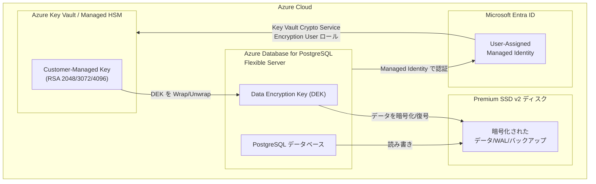

# Azure Database for PostgreSQL: Premium SSD v2 ディスクでのカスタマーマネージド暗号化キー (CMK) サポート

**リリース日**: 2026-03-11

**サービス**: Azure Database for PostgreSQL

**機能**: Premium SSD v2 ディスクでの Customer-Managed Keys (CMK) サポート

**ステータス**: In preview

[このアップデートのインフォグラフィックを見る](https://takech9203.github.io/azure-news-summary/20260311-postgresql-cmk-premium-ssd-v2.html)

## 概要

Azure Database for PostgreSQL Flexible Server において、Premium SSD v2 ディスクでカスタマーマネージド暗号化キー (Customer-Managed Keys: CMK) が利用可能になった。本機能はパブリックプレビューとして提供される。

従来、Azure Database for PostgreSQL では CMK による保存データの暗号化がサポートされていたが、Premium SSD v2 ディスクを使用する環境では利用できなかった。今回のアップデートにより、Premium SSD v2 の高性能なストレージを活用しつつ、暗号化キーを Azure Key Vault で自社管理できるようになり、データセキュリティとコンプライアンス要件への対応が強化された。

CMK を使用することで、暗号化キーのライフサイクル (作成、ローテーション、無効化、削除) を完全に制御でき、規制要件を満たしつつ高性能なデータベース基盤を構築できる。

**アップデート前の課題**

- Premium SSD v2 ディスクを使用する場合、CMK による暗号化を適用できず、サービスマネージドキー (SMK) のみ利用可能だった
- 高い IOPS やスループットが求められるワークロードで、暗号化キーの自社管理とストレージ性能の両立が困難だった
- 規制業界 (金融、医療など) で Premium SSD v2 の採用がセキュリティポリシーにより制限されるケースがあった

**アップデート後の改善**

- Premium SSD v2 ディスクでも CMK を使用して保存データを暗号化できるようになった
- 高性能ストレージとセキュリティ要件の両立が可能になった
- Azure Key Vault または Azure Key Vault Managed HSM に格納された暗号化キーで Premium SSD v2 上のデータを保護できる

## アーキテクチャ図



CMK による暗号化フローでは、Azure Key Vault に格納されたカスタマーマネージドキーが Data Encryption Key (DEK) を保護 (Wrap/Unwrap) し、その DEK が Premium SSD v2 ディスク上の全データ (データベース、WAL、バックアップ) を暗号化する。PostgreSQL サーバーは User-Assigned Managed Identity を使用して Key Vault にアクセスする。

## サービスアップデートの詳細

### 主要機能

1. **Premium SSD v2 ディスクでの CMK 暗号化**
   - Premium SSD v2 ディスクを使用する Azure Database for PostgreSQL Flexible Server で、カスタマーマネージドキーによる保存データ暗号化が可能になった
   - 対象データ: ユーザーデータベース、システムデータベース、サーバーログ、WAL (Write-Ahead Log) セグメント、バックアップ

2. **Azure Key Vault / Managed HSM 統合**
   - Azure Key Vault または Azure Key Vault Managed HSM に格納された RSA キーを使用可能
   - サポートされるキーサイズ: 2,048 ビット、3,072 ビット、4,096 ビット (4,096 ビット推奨)

3. **自動キーバージョン更新**
   - バージョンレスキー URI を使用することで、Key Vault でキーがローテーションされた際に自動的に新しいバージョンが適用される
   - 手動キーローテーションも引き続きサポート

## 技術仕様

| 項目 | 詳細 |
|------|------|
| 暗号化モード | Customer-Managed Keys (CMK) |
| サポートされるキータイプ | 非対称 RSA または RSA-HSM |
| サポートされるキーサイズ | 2,048 / 3,072 / 4,096 ビット |
| キーストア | Azure Key Vault または Azure Key Vault Managed HSM |
| 認証方式 | User-Assigned Managed Identity |
| 推奨 RBAC ロール | Key Vault Crypto Service Encryption User |
| 暗号化対象 | データベース、WAL、ログ、バックアップの全データ |
| ステータス | パブリックプレビュー |
| 暗号化モード設定タイミング | サーバー作成時のみ (作成後の変更不可) |

## 設定方法

### 前提条件

1. Azure Key Vault インスタンス (ソフトデリート有効、消去保護有効)
2. RSA キーの作成 (4,096 ビット推奨)
3. User-Assigned Managed Identity の作成
4. Managed Identity への **Key Vault Crypto Service Encryption User** ロールの付与 (RBAC モデル推奨)
5. Key Vault と PostgreSQL サーバーが同じ Microsoft Entra テナントに属すること

### Azure CLI

```bash
# Key Vault の作成 (ソフトデリートと消去保護を有効化)
az keyvault create \
  --name <keyvault-name> \
  --resource-group <resource-group> \
  --location <location> \
  --enable-soft-delete true \
  --enable-purge-protection true \
  --retention-days 90

# RSA 4096 キーの作成
az keyvault key create \
  --vault-name <keyvault-name> \
  --name <key-name> \
  --kty RSA \
  --size 4096

# User-Assigned Managed Identity の作成
az identity create \
  --name <identity-name> \
  --resource-group <resource-group> \
  --location <location>

# Managed Identity に Key Vault Crypto Service Encryption User ロールを付与
az role assignment create \
  --role "Key Vault Crypto Service Encryption User" \
  --assignee <managed-identity-principal-id> \
  --scope <keyvault-resource-id>

# CMK 暗号化を有効にして PostgreSQL Flexible Server を作成 (Premium SSD v2)
az postgres flexible-server create \
  --name <server-name> \
  --resource-group <resource-group> \
  --location <location> \
  --storage-type PremiumV2_LRS \
  --key <key-identifier-uri> \
  --identity <managed-identity-resource-id>
```

### Azure Portal

1. Azure Portal で **Azure Database for PostgreSQL Flexible Server** の作成画面を開く
2. **ストレージ** セクションで **Premium SSD v2** を選択
3. **セキュリティ** タブで **データ暗号化** を **Customer-Managed Key** に設定
4. **キー** フィールドで Azure Key Vault に格納済みの RSA キーを選択
5. **ID** フィールドで User-Assigned Managed Identity を選択
6. 自動キーバージョン更新を有効にする場合は、バージョンレスキー URI を使用するチェックボックスをオンにする
7. 設定を確認し、サーバーを作成

## メリット

### ビジネス面

- 金融、医療、政府機関などの規制業界で求められるデータ暗号化のコンプライアンス要件を満たせる
- 暗号化キーの完全な制御により、セキュリティ監査への対応が容易になる
- キーの削除によりデータを即座にアクセス不能にできるため、データ主権の要件に対応可能

### 技術面

- Premium SSD v2 の高 IOPS/スループットと CMK 暗号化を同時に利用可能
- CMK によるデータ暗号化はワークロードのパフォーマンスに悪影響を与えない
- Azure Key Vault Managed HSM との統合により FIPS 140 準拠の暗号化を実現可能
- 自動キーバージョン更新により運用負荷を軽減

## デメリット・制約事項

- CMK 暗号化はサーバー作成時にのみ設定可能であり、既存サーバーへの後付け設定は不可 (PITR で新しいサーバーに復元して CMK を設定する必要がある)
- CMK から SMK (サービスマネージドキー) への切り替えは不可 (新規サーバーへの復元が必要)
- Key Vault と PostgreSQL サーバーは同じ Microsoft Entra テナントに属する必要がある (クロステナントは非サポート)
- Key Vault へのアクセスが失われた場合、サーバーは約 60 分以内に **Inaccessible** 状態になる
- Key Vault / Managed HSM はサーバーと同じリージョンに存在する必要がある
- Geo 冗長バックアップを使用する場合、バックアップリージョンにも別の Key Vault とキーが必要
- パブリックプレビュー段階のため、本番ワークロードへの適用は慎重に検討が必要

## ユースケース

### ユースケース 1: 金融機関向け高性能トランザクションデータベース

**シナリオ**: 金融機関が高頻度トランザクション処理に Premium SSD v2 の高 IOPS を必要としつつ、PCI DSS などの規制でデータ暗号化キーの自社管理が求められるケース。

**効果**: Premium SSD v2 の性能を活かしながら、暗号化キーを Azure Key Vault Managed HSM で FIPS 140 準拠のハードウェアで管理でき、コンプライアンス要件を満たしつつ高性能なデータベース基盤を実現できる。

### ユースケース 2: 医療データプラットフォーム

**シナリオ**: 医療機関が患者データを扱うデータベースで、HIPAA 準拠のためにデータ暗号化キーの管理権限を保持する必要があり、かつ画像データや大量のレコードを扱うために高スループットが求められるケース。

**効果**: Premium SSD v2 の柔軟な IOPS/スループット設定と CMK による暗号化の組み合わせにより、セキュリティ要件と性能要件を同時に満たす医療データプラットフォームを構築できる。

## 料金

CMK による暗号化自体には追加料金は発生しない。ただし、以下の関連サービスにはそれぞれ料金がかかる。

| 項目 | 料金 |
|------|------|
| Premium SSD v2 ディスク容量 | GiB 単位で課金 |
| Premium SSD v2 プロビジョニング IOPS | 3,000 IOPS を超えた分に対して課金 (400 GiB 以下のディスクの場合) |
| Premium SSD v2 プロビジョニングスループット | 125 MB/s を超えた分に対して課金 (400 GiB 以下のディスクの場合) |
| Azure Key Vault | キー操作 (Wrap/Unwrap) に対して課金 |
| Azure Key Vault Managed HSM | HSM プール単位で課金 |

詳細な料金は [Azure Database for PostgreSQL 料金ページ](https://azure.microsoft.com/pricing/details/postgresql/flexible-server/) を参照。

## 関連サービス・機能

- **Azure Key Vault**: CMK の格納先として使用。RBAC 権限モデルによるアクセス制御を推奨
- **Azure Key Vault Managed HSM**: FIPS 140 準拠のハードウェアセキュリティモジュールで、より高いセキュリティ要件に対応
- **Premium SSD v2**: 柔軟な IOPS/スループット設定が可能な高性能マネージドディスク
- **Microsoft Entra ID**: User-Assigned Managed Identity による Key Vault への認証に使用
- **Azure Monitor**: Key Vault へのアクセス障害の検出やアラート設定に使用

## 参考リンク

- [インフォグラフィック](https://takech9203.github.io/azure-news-summary/20260311-postgresql-cmk-premium-ssd-v2.html)
- [公式アップデート情報](https://azure.microsoft.com/updates?id=557527)
- [Microsoft Learn - Data Encryption with CMK](https://learn.microsoft.com/en-us/azure/postgresql/flexible-server/concepts-data-encryption)
- [料金ページ](https://azure.microsoft.com/pricing/details/postgresql/flexible-server/)

## まとめ

Azure Database for PostgreSQL Flexible Server の Premium SSD v2 ディスクでカスタマーマネージド暗号化キー (CMK) がパブリックプレビューとしてサポートされた。これにより、高性能ストレージを必要とするワークロードにおいても、Azure Key Vault を使用した暗号化キーの自社管理が可能となり、コンプライアンス要件と性能要件の両立が実現する。金融、医療、政府機関など規制の厳しい業界での Premium SSD v2 採用が促進されることが期待される。現在パブリックプレビュー段階であるため、GA に向けた動向を注視しつつ、開発/検証環境での事前検証を推奨する。

---

**タグ**: #Azure #PostgreSQL #CustomerManagedKeys #PremiumSSDv2 #DataEncryption #AzureKeyVault #Security #InPreview
