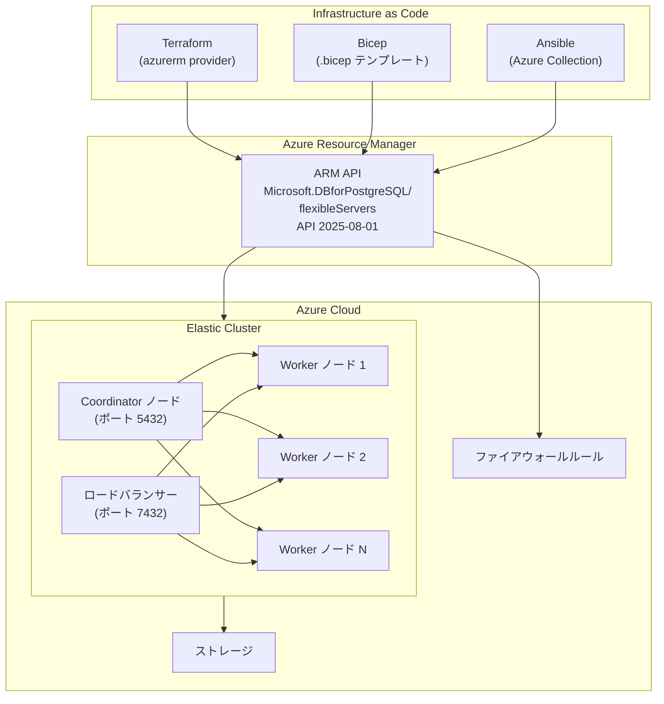

# Azure Database for PostgreSQL: Elastic Clusters の Terraform / Bicep / Ansible サポートが一般提供開始

**リリース日**: 2026-03-11

**サービス**: Azure Database for PostgreSQL

**機能**: Elastic Clusters の Terraform、Bicep、Ansible サポート

**ステータス**: Launched (GA)

[このアップデートのインフォグラフィックを見る](https://takech9203.github.io/azure-news-summary/20260311-postgresql-elastic-clusters-iac.html)

## 概要

Azure Database for PostgreSQL の Elastic Clusters において、Terraform、Bicep、Ansible による Infrastructure as Code (IaC) サポートが一般提供 (GA) となりました。これにより、水平スケールアウト可能な分散 PostgreSQL クラスターを、コードベースで一貫してプロビジョニング、スケーリング、管理できるようになります。

Elastic Clusters は、オープンソースの Citus 拡張機能をベースとした Azure のマネージドサービスであり、PostgreSQL の水平シャーディングを実現します。今回の IaC サポートにより、クラスターのライフサイクル全体をコードで管理し、CI/CD パイプラインに組み込むことが可能になりました。

**アップデート前の課題**

- Elastic Clusters のプロビジョニングは Azure Portal や Azure CLI を使った手動操作が中心で、再現性のある自動デプロイが困難だった
- 複数環境 (開発、ステージング、本番) への一貫したクラスター構成の展開に手間がかかっていた
- 既存の IaC ワークフローに Elastic Clusters を統合できず、インフラ管理の一元化が難しかった

**アップデート後の改善**

- Terraform、Bicep、Ansible のネイティブサポートにより、宣言的にクラスターを定義・デプロイ可能に
- バージョン管理されたインフラコードで環境間の一貫性を確保
- 既存の CI/CD パイプラインや IaC ワークフローに Elastic Clusters を統合可能に

## アーキテクチャ図



Terraform、Bicep、Ansible の各 IaC ツールは Azure Resource Manager API を介して Elastic Cluster を操作します。Elastic Cluster 内部では Coordinator ノードがクエリのルーティングを担い、複数の Worker ノードにデータが水平シャーディングされます。

## サービスアップデートの詳細

### 主要機能

1. **Bicep テンプレートによるデプロイ**
   - `Microsoft.DBforPostgreSQL/flexibleServers` リソースタイプの `cluster` プロパティで `clusterSize` を指定することで Elastic Cluster をプロビジョニング
   - API バージョン `2025-08-01` を使用
   - ファイアウォールルールも子リソースとして宣言的に定義可能

2. **Terraform によるデプロイ**
   - Azure Provider (`azurerm`) を使用して Elastic Cluster を管理
   - Flexible Server リソースにクラスター構成を追加することで利用可能

3. **Ansible によるデプロイ**
   - Azure Collection を使用した Playbook ベースのクラスター管理
   - 既存の構成管理ワークフローに統合可能

4. **ARM テンプレートによるデプロイ**
   - JSON 形式の ARM テンプレートでも同等のデプロイが可能
   - `cluster.clusterSize` パラメータでノード数を指定

## 技術仕様

| 項目 | 詳細 |
|------|------|
| リソースタイプ | `Microsoft.DBforPostgreSQL/flexibleServers` |
| API バージョン | `2025-08-01` |
| クラスターサイズ | 2 ノード以上 (clusterSize パラメータで指定) |
| 対応 PostgreSQL バージョン | 16、17 |
| 対応 SKU | General Purpose (例: `Standard_D4ds_v5`) |
| シャーディングモデル | 行ベースシャーディング、スキーマベースシャーディング |
| 接続ポート | 5432 (Coordinator)、7432 (ロードバランサー)、6432/8432 (PgBouncer) |
| ベース技術 | Citus (オープンソース PostgreSQL 拡張) |

## 設定方法

### 前提条件

1. アクティブなサブスクリプションを持つ Azure アカウント
2. 使用する IaC ツール (Terraform、Bicep、または Ansible) がインストールされていること
3. Azure CLI がインストールされ、認証済みであること

### Bicep テンプレート

```bicep
param administratorLogin string

@secure()
param administratorLoginPassword string

param clusterName string
param location string = 'canadacentral'
param clusterSize int = 2
param skuName string = 'Standard_D4ds_v5'
param serverEdition string = 'GeneralPurpose'
param storageSizeGB int = 64

resource server 'Microsoft.DBforPostgreSQL/flexibleServers@2025-08-01' = {
  location: location
  name: clusterName
  properties: {
    createMode: 'Default'
    version: '17'
    administratorLogin: administratorLogin
    administratorLoginPassword: administratorLoginPassword
    Storage: {
      StorageSizeGB: storageSizeGB
      Autogrow: 'Disabled'
    }
    Network: {
      publicNetworkAccess: 'Enabled'
    }
    Backup: {
      backupRetentionDays: 7
      geoRedundantBackup: 'Disabled'
    }
    highAvailability: {
      mode: 'Disabled'
    }
    cluster: {
      clusterSize: clusterSize
    }
  }
  sku: {
    name: skuName
    tier: serverEdition
  }
}
```

### Azure CLI によるデプロイ

```bash
# リソースグループの作成
az group create --name myResourceGroup --location canadacentral

# Bicep テンプレートのデプロイ
az deployment group create \
  --resource-group myResourceGroup \
  --template-file elastic-cluster-template.bicep \
  --parameters clusterName=my-elastic-cluster \
               administratorLogin=clusterAdmin \
               administratorLoginPassword=<secure-password>
```

## メリット

### ビジネス面

- 環境構築の自動化により、デプロイ時間の大幅な短縮とヒューマンエラーの削減
- 複数環境 (開発/ステージング/本番) の一貫した管理でガバナンスが向上
- インフラのバージョン管理により、変更の追跡と監査が容易に

### 技術面

- 宣言的なインフラ定義により、クラスター構成の再現性を確保
- CI/CD パイプラインへの統合で、インフラのデプロイを完全自動化
- Terraform の state 管理や Bicep のモジュール化により、大規模環境でのインフラ管理が効率化
- 既存の IaC コードベースに Elastic Clusters を追加するだけで利用開始可能

## デメリット・制約事項

- DDL (Data Definition Language) 操作やクラスター全体の操作は、Coordinator ノード (ポート 5432) への接続が必要
- テーブルやスキーマは自動的には分散されず、シャーディングモデルの選択と手動設定が必要
- ノードはすべて同じコンピュートおよびストレージ層である必要がある (ノードごとの個別スペック設定は不可)

## ユースケース

### ユースケース 1: マルチ環境への自動デプロイ

**シナリオ**: SaaS アプリケーションの開発チームが、開発・ステージング・本番の 3 環境に同一構成の Elastic Cluster をデプロイする必要がある。

**実装例**:

```bicep
// パラメータファイルで環境ごとの差分のみ管理
param clusterName string
param clusterSize int    // dev: 2, staging: 2, prod: 4
param skuName string     // dev: Standard_D4ds_v5, prod: Standard_D8ds_v5
```

**効果**: 環境間の構成ドリフトを防止し、本番環境と同等の構成でテストが可能になる。

### ユースケース 2: スキーマベースマルチテナント

**シナリオ**: テナントごとにスキーマを分離するマルチテナント SaaS で、Elastic Cluster を IaC で管理しつつ、テナント増加に伴うスケールアウトを実施する。

**実装例**:

```bash
# Bicep パラメータでノード数を変更してスケールアウト
az deployment group create \
  --resource-group myResourceGroup \
  --template-file elastic-cluster-template.bicep \
  --parameters clusterSize=4
```

**効果**: テナント数の増加に応じてノードを追加し、オンラインでデータリバランスを実行できる。

## 料金

Elastic Clusters の料金は、Azure Database for PostgreSQL Flexible Server の料金体系に基づきます。各ノードのコンピュート (vCore) とストレージに対して課金されます。

| 項目 | 詳細 |
|------|------|
| コンピュート | 選択した SKU に基づく時間課金 (例: General Purpose Standard_D4ds_v5) |
| ストレージ | プロビジョニングしたストレージ容量 (GB) に基づく月額課金 |
| バックアップ | プロビジョニングしたストレージの 100% まで無料、超過分は GB 単位で課金 |

詳細な料金は [Azure Database for PostgreSQL 料金ページ](https://azure.microsoft.com/pricing/details/postgresql/flexible-server/) を参照してください。

## 関連サービス・機能

- **Azure Database for PostgreSQL Flexible Server**: Elastic Clusters の基盤となるマネージド PostgreSQL サービス
- **Citus**: Elastic Clusters の基盤となるオープンソースの PostgreSQL 水平スケーリング拡張
- **Azure Resource Manager**: IaC ツールからのデプロイを処理するコントロールプレーン
- **Terraform Azure Provider (azurerm)**: HashiCorp が提供する Azure リソース管理用 Terraform プロバイダー

## 参考リンク

- [インフォグラフィック](https://takech9203.github.io/azure-news-summary/20260311-postgresql-elastic-clusters-iac.html)
- [公式アップデート情報](https://azure.microsoft.com/updates?id=558145)
- [Microsoft Learn - Elastic Clusters 概要](https://learn.microsoft.com/en-us/azure/postgresql/elastic-clusters/concepts-elastic-clusters)
- [Microsoft Learn - Bicep テンプレートでのクイックスタート](https://learn.microsoft.com/en-us/azure/postgresql/elastic-clusters/quickstart-create-elastic-cluster-bicep)
- [Microsoft Learn - ARM テンプレートでのクイックスタート](https://learn.microsoft.com/en-us/azure/postgresql/elastic-clusters/quickstart-create-elastic-cluster-arm-template)
- [料金ページ](https://azure.microsoft.com/pricing/details/postgresql/flexible-server/)

## まとめ

Azure Database for PostgreSQL Elastic Clusters に対する Terraform、Bicep、Ansible の IaC サポートが GA となり、水平スケールアウト可能な分散 PostgreSQL 環境をコードで一元管理できるようになりました。`Microsoft.DBforPostgreSQL/flexibleServers` リソースの `cluster.clusterSize` プロパティを指定するだけで、既存の IaC ワークフローに Elastic Clusters を統合できます。既に IaC を活用している組織は、既存のコードベースに Elastic Cluster の定義を追加することを推奨します。新規に Elastic Clusters を導入する場合は、Bicep テンプレートのクイックスタートガイドから始めることをお勧めします。

---

**タグ**: #Azure #PostgreSQL #ElasticClusters #Terraform #Bicep #Ansible #IaC #InfrastructureAsCode #GA #Databases #Citus
