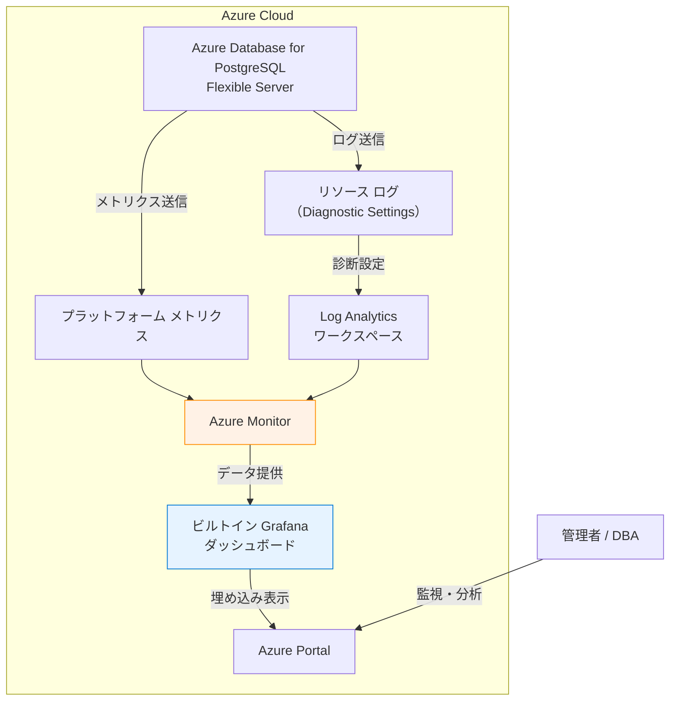

# Azure Database for PostgreSQL: Grafana ダッシュボードによるネイティブ監視機能の一般提供開始

**リリース日**: 2026-03-11

**サービス**: Azure Database for PostgreSQL

**機能**: Grafana ダッシュボードによるネイティブ監視機能

**ステータス**: Launched (GA)

[このアップデートのインフォグラフィックを見る](https://takech9203.github.io/azure-news-summary/20260311-postgresql-grafana-dashboards.html)

## 概要

Azure Database for PostgreSQL において、Azure Portal 上で直接利用できるビルトイン Grafana ダッシュボードが一般提供（GA）となった。この機能により、別途 Grafana インスタンスをセットアップ・管理することなく、Azure Portal から直接 PostgreSQL サーバーの詳細な監視が可能になる。

この機能は Azure Monitor とのネイティブ統合により実現されており、追加コストやセットアップなしで利用できる。ダッシュボードはほぼリアルタイムで更新され、サーバーの健全性とパフォーマンスの可視化を提供する。

**アップデート前の課題**

- PostgreSQL サーバーの詳細な監視には、Azure Managed Grafana などの別インスタンスのセットアップが必要だった
- Grafana ダッシュボードの構築・管理に専門知識と運用コストがかかっていた
- Azure Monitor のメトリクスとログを統合的に可視化するには、追加の設定作業が必要だった

**アップデート後の改善**

- Azure Portal 内でビルトイン Grafana ダッシュボードが即座に利用可能になった
- 追加コストなし、セットアップ不要で詳細な監視が開始できる
- メトリクスとログを同一ダッシュボード上でサイドバイサイドに確認でき、パフォーマンス問題とクエリの相関分析が容易になった

## アーキテクチャ図



Azure Database for PostgreSQL はプラットフォーム メトリクスを自動的に Azure Monitor に送信する。診断設定を構成することでリソース ログも Log Analytics ワークスペースに送信できる。ビルトイン Grafana ダッシュボードは Azure Monitor からデータを取得し、Azure Portal 内に埋め込み表示される。

## サービスアップデートの詳細

### 主要機能

1. **ビルトイン Grafana ダッシュボード**
   - Azure Portal 内に事前構築済みの Grafana ダッシュボードが埋め込まれている
   - セットアップや追加構成なしで即座に利用可能
   - ほぼリアルタイムでデータが更新される

2. **包括的なメトリクス可視化**
   - 可用性（Availability）
   - 接続数（Connections）
   - CPU 使用率
   - メモリ使用率
   - ストレージ使用量
   - WAL（Write-Ahead Log）
   - ディスク I/O
   - ネットワーク
   - トランザクション

3. **メトリクスとログのサイドバイサイド表示**
   - 診断設定を構成して PostgreSQL ログを Azure Monitor Logs にストリーミングすると、メトリクスとログを並べて表示できる
   - パフォーマンスのスパイクと特定のクエリの相関分析が可能

4. **Azure RBAC によるアクセス制御**
   - ダッシュボードはサブスクリプションとリソースグループにスコープされた Azure リソースである
   - Azure ロールベース アクセス制御（RBAC）でアクセスが管理される

5. **ARM テンプレートによるエクスポート・デプロイ**
   - Azure Resource Manager テンプレートを使用して、環境間でダッシュボードをエクスポート・デプロイ可能

## 技術仕様

| 項目 | 詳細 |
|------|------|
| 対象サービス | Azure Database for PostgreSQL Flexible Server |
| メトリクス収集間隔 | 1 分間隔（プラットフォーム メトリクス） |
| メトリクス保持期間 | 最大 93 日間 |
| Enhanced Metrics 有効化 | サーバー パラメータ `metrics.collector_database_activity` を `ON` に設定 |
| Autovacuum メトリクス有効化 | サーバー パラメータ `metrics.autovacuum_diagnostics` を `ON` に設定 |
| DatabaseName ディメンション制限 | 汎用/メモリ最適化: 50 データベース、Burstable: 10 データベース |
| ダッシュボード更新 | ほぼリアルタイム |

## 設定方法

### 前提条件

1. Azure Database for PostgreSQL Flexible Server インスタンスが稼働中であること
2. ログのサイドバイサイド表示を利用する場合は、診断設定で Log Analytics ワークスペースへのログ ストリーミングを構成すること

### Azure Portal

1. Azure Portal で対象の Azure Database for PostgreSQL Flexible Server リソースに移動する
2. 左メニューの「監視」セクションからビルトイン Grafana ダッシュボードにアクセスする
3. ダッシュボードは事前構築済みのため、追加構成なしでメトリクスが表示される

### Enhanced Metrics の有効化

Enhanced Metrics を有効にすることで、より詳細な監視が可能になる。

```bash
# Enhanced Metrics を有効化
az postgres flexible-server parameter set \
  --resource-group <resource-group> \
  --server-name <server-name> \
  --name metrics.collector_database_activity \
  --value ON

# Autovacuum メトリクスを有効化
az postgres flexible-server parameter set \
  --resource-group <resource-group> \
  --server-name <server-name> \
  --name metrics.autovacuum_diagnostics \
  --value ON
```

### 診断設定の構成（ログ表示用）

```bash
# 診断設定を作成し、ログを Log Analytics ワークスペースに送信
az monitor diagnostic-settings create \
  --resource <postgresql-server-resource-id> \
  --name "postgresql-diagnostics" \
  --workspace <log-analytics-workspace-id> \
  --logs '[{"categoryGroup":"allLogs","enabled":true}]' \
  --metrics '[{"category":"AllMetrics","enabled":true}]'
```

## メリット

### ビジネス面

- Grafana インスタンスの個別運用が不要になり、運用コストが削減される
- 追加コストなしで高品質な監視ダッシュボードを利用できる
- データベースの可用性やパフォーマンスの問題を迅速に検知でき、ダウンタイムの最小化に寄与する

### 技術面

- セットアップ不要でビルトイン ダッシュボードが即座に利用可能
- Azure Monitor とのネイティブ統合により、メトリクスとログの統合的な可視化が実現される
- Azure RBAC による細かなアクセス制御が可能
- ARM テンプレートを活用した環境間でのダッシュボード構成の移行が容易

## デメリット・制約事項

- Enhanced Metrics を利用する場合、サーバー パラメータの有効化が別途必要
- DatabaseName ディメンションを使用するメトリクスは、Burstable SKU で 10 データベース、その他の SKU で 50 データベースまでの制限がある
- ログの可視化には診断設定の構成が別途必要
- 高度なカスタマイズやマルチクラウド環境での統合監視が必要な場合は、Azure Managed Grafana の利用が推奨される

## ユースケース

### ユースケース 1: 本番環境の PostgreSQL サーバーのパフォーマンス監視

**シナリオ**: 本番環境で稼働する Azure Database for PostgreSQL Flexible Server の CPU、メモリ、接続数、ディスク I/O をリアルタイムに監視し、パフォーマンス劣化を早期に検知する。

**効果**: 追加の Grafana インスタンスを構築・管理することなく、Azure Portal から直接サーバーの健全性を確認できる。パフォーマンスのスパイクが発生した際に、ログとの相関分析により原因クエリを迅速に特定できる。

### ユースケース 2: Autovacuum のチューニングと監視

**シナリオ**: データベースのデッドタプル蓄積や Bloat の状況を監視し、Autovacuum の動作状況を確認してチューニングを行う。

**効果**: Autovacuum メトリクスを有効化することで、テーブルごとのデッドタプル数、Bloat 率、Autovacuum 実行回数をダッシュボードで確認でき、データベースのメンテナンス状況を可視化できる。

## 料金

ビルトイン Grafana ダッシュボードは追加コストなしで利用可能である。Azure Database for PostgreSQL Flexible Server のプラットフォーム メトリクスは自動的に収集され、ダッシュボードに表示される。

ログの可視化を行う場合は、診断設定で Log Analytics ワークスペースへのログ送信を構成する必要があり、Log Analytics のデータ取り込みと保持に関する料金が適用される。

| 項目 | 料金 |
|------|------|
| ビルトイン Grafana ダッシュボード | 無料（追加コストなし） |
| プラットフォーム メトリクス | Azure Database for PostgreSQL の料金に含まれる |
| Log Analytics データ取り込み | Log Analytics の料金体系に従う |

## 関連サービス・機能

- **Azure Monitor**: メトリクスとログの収集・分析基盤。ビルトイン Grafana ダッシュボードのデータソースとなる
- **Azure Managed Grafana**: より高度なカスタマイズ、マルチクラウド対応が必要な場合に利用する完全マネージド Grafana サービス
- **Log Analytics**: PostgreSQL リソース ログの保存・クエリ分析基盤
- **Azure Database for PostgreSQL Flexible Server**: 対象となる PostgreSQL マネージドサービス
- **Metrics Explorer**: Azure Monitor メトリクスの対話的な分析・アラート設定ツール

## 参考リンク

- [インフォグラフィック](https://takech9203.github.io/azure-news-summary/20260311-postgresql-grafana-dashboards.html)
- [公式アップデート情報](https://azure.microsoft.com/updates?id=558140)
- [Azure Database for PostgreSQL 監視とメトリクス - Microsoft Learn](https://learn.microsoft.com/en-us/azure/postgresql/flexible-server/concepts-monitoring)
- [Azure Managed Grafana との連携](https://aka.ms/azure-postgres-grafana)
- [Azure Monitor メトリクスの概要 - Microsoft Learn](https://learn.microsoft.com/en-us/azure/azure-monitor/essentials/data-platform-metrics)
- [料金ページ - Azure Database for PostgreSQL](https://azure.microsoft.com/pricing/details/postgresql/flexible-server/)

## まとめ

Azure Database for PostgreSQL において、Azure Portal に直接埋め込まれたビルトイン Grafana ダッシュボードが一般提供（GA）となった。この機能により、別途 Grafana インスタンスをセットアップ・管理することなく、追加コストなしでサーバーの可用性、接続数、CPU、メモリ、ストレージ、ディスク I/O、ネットワーク、トランザクションの詳細な監視が可能になる。

PostgreSQL を運用する DBA やインフラエンジニアは、Azure Portal で対象サーバーのリソースページからビルトイン ダッシュボードを確認することが推奨される。より詳細な監視が必要な場合は、Enhanced Metrics や Autovacuum メトリクスのサーバー パラメータを有効化し、診断設定でログを Log Analytics ワークスペースに送信することで、メトリクスとログの統合的な可視化を実現できる。

---

**タグ**: #Azure #AzureDatabaseForPostgreSQL #Grafana #Monitoring #AzureMonitor #Databases #GA
