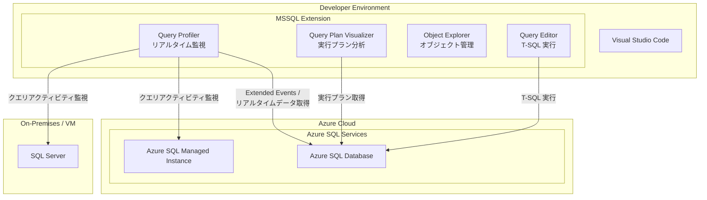

# Azure SQL Database: Query Profiler in MSSQL Extension for Visual Studio Code

**リリース日**: 2026-03-11

**サービス**: Azure SQL Database

**機能**: Query Profiler in MSSQL extension for Visual Studio Code

**ステータス**: In preview

[このアップデートのインフォグラフィックを見る](https://takech9203.github.io/azure-news-summary/20260311-sql-database-query-profiler-vscode.html)

## 概要

Visual Studio Code 向け MSSQL 拡張機能に、新たに Query Profiler がパブリックプレビューとして追加された。Query Profiler は、データベースのクエリアクティビティをリアルタイムで可視化する機能であり、Visual Studio Code 内から直接データベースの動作状況を監視・分析できるようになる。

従来、データベースのクエリパフォーマンスを分析するには SQL Server Management Studio (SSMS) や Azure Portal を別途開く必要があったが、本機能により開発者は普段の開発環境である Visual Studio Code から離れることなく、クエリの実行状況やデータベースアクティビティをリアルタイムに把握できるようになる。これにより、開発とパフォーマンスチューニングのワークフローが統合され、開発生産性の向上が期待される。

**アップデート前の課題**

- データベースのクエリパフォーマンスを分析するには、SSMS や Azure Portal など別のツールに切り替える必要があった
- Visual Studio Code で開発中にパフォーマンス問題を発見しても、別ツールでの調査が必要で、コンテキストスイッチが頻繁に発生していた
- 軽量な開発環境を好むチームにとって、リアルタイムのクエリ監視手段が限られていた
- クエリの実行状況を確認するためにフル機能の管理ツールを導入する必要があり、環境構築のオーバーヘッドが発生していた

**アップデート後の改善**

- Visual Studio Code 内から直接、リアルタイムでクエリアクティビティを監視できるようになった
- 開発環境とパフォーマンス分析ツールが統合され、コンテキストスイッチが削減された
- 軽量かつクロスプラットフォーム対応の環境でデータベースプロファイリングが可能になった
- MSSQL 拡張機能の既存機能（Query Plan Visualizer、Object Explorer など）と組み合わせた包括的なデータベース開発体験が実現した

## アーキテクチャ図

この図は、Visual Studio Code の MSSQL 拡張機能に搭載された Query Profiler が、Azure SQL Database、Azure SQL Managed Instance、および SQL Server に接続し、リアルタイムでクエリアクティビティを監視する構成を示している。Query Profiler は既存の Query Plan Visualizer や Query Editor と並んで、統合的なデータベース開発・分析環境を構成する。

## サービスアップデートの詳細

### 主要機能

1. **リアルタイムクエリ監視**
   - データベース上で実行中のクエリアクティビティをリアルタイムでキャプチャし、Visual Studio Code 内に表示する
   - クエリの実行状況、実行時間、リソース消費量などをライブで確認できる

2. **Visual Studio Code への統合**
   - MSSQL 拡張機能の一部として提供され、追加のツールをインストールする必要がない
   - 既存の Query Plan Visualizer、Object Explorer、Query Results Pane と統合された開発体験を提供する

3. **クロスプラットフォーム対応**
   - Visual Studio Code がサポートするすべてのプラットフォーム（Windows、macOS、Linux）で利用可能
   - MSSQL 拡張機能 の一部として同梱されるため、個別のインストールは不要

4. **複数データベースプラットフォーム対応**
   - Azure SQL Database、Azure SQL Managed Instance、SQL Server（オンプレミスおよび Azure VM 上）に対応
   - ハイブリッドおよびマルチクラウド環境でのデータベース監視をサポート

## 技術仕様

| 項目 | 詳細 |
|------|------|
| 機能名 | Query Profiler |
| ステータス | パブリックプレビュー |
| 提供方法 | MSSQL extension for Visual Studio Code に統合 |
| 対応データベース | Azure SQL Database, Azure SQL Managed Instance, SQL Server |
| 対応プラットフォーム | Windows (x64, x86, Arm64), macOS (x64, Arm64), Linux (Ubuntu, Debian, RHEL, Fedora 等) |
| 拡張機能バージョン | MSSQL extension v1.40.0 以降 |

## 設定方法

### 前提条件

1. Visual Studio Code がインストールされていること
2. MSSQL 拡張機能（SQL Server (mssql)）がインストールされていること
3. 監視対象のデータベースへの接続情報および適切な権限を保有していること

### Visual Studio Code

1. Visual Studio Code を開き、拡張機能マーケットプレイスから「SQL Server (mssql)」拡張機能をインストールまたは最新版に更新する
2. MSSQL 拡張機能の Connections ビューからデータベースに接続する
3. Query Profiler 機能を起動し、リアルタイムでクエリアクティビティの監視を開始する

## メリット

### ビジネス面

- **開発生産性の向上**: ツール間の切り替えが不要になり、開発者の作業効率が向上する
- **ツールコストの削減**: 高機能な有償ツールを別途導入することなく、無料の Visual Studio Code 拡張機能でクエリプロファイリングが可能
- **チーム全体のスキル向上**: 開発者がパフォーマンス分析を日常的に行えるようになり、パフォーマンス意識の高いチーム文化を醸成できる

### 技術面

- **コンテキストスイッチの削減**: 開発・デバッグ・パフォーマンス分析をすべて Visual Studio Code 内で完結できる
- **リアルタイム分析**: 問題発生時に即座にクエリアクティビティを確認でき、トラブルシューティングの時間を短縮
- **既存ツールとの相乗効果**: Query Plan Visualizer と組み合わせることで、実行中のクエリの特定からプラン分析までシームレスに行える
- **クロスプラットフォーム**: Windows、macOS、Linux のいずれの環境でも同一の分析機能を利用可能

## デメリット・制約事項

- パブリックプレビュー段階のため、機能の安定性や完全性は GA 版と異なる可能性がある
- プレビュー期間中は機能仕様が変更される可能性がある
- SSMS の SQL Server Profiler と比較して、利用可能なイベントやフィルタリングオプションが限定される可能性がある
- 大規模な本番データベースのプロファイリングには、パフォーマンスへの影響を考慮する必要がある

## ユースケース

### ユースケース 1: 開発中のクエリパフォーマンス最適化

**シナリオ**: アプリケーション開発者が Visual Studio Code でバックエンドコードを開発中に、特定の API エンドポイントのレスポンスが遅いことに気付き、原因となるクエリを特定したい。

**実装例**:

1. Visual Studio Code で MSSQL 拡張機能を使用して Azure SQL Database に接続する
2. Query Profiler を起動してリアルタイム監視を開始する
3. 問題のある API エンドポイントをテスト呼び出しする
4. Query Profiler で実行されたクエリとその実行時間を確認する
5. 問題のクエリを特定し、Query Plan Visualizer でプランを分析する

**効果**: 別ツールへの切り替えなしに、開発環境内でパフォーマンスボトルネックの特定から改善策の検証まで一貫して実施できる。

### ユースケース 2: ハイブリッド環境での統合的なデータベース監視

**シナリオ**: オンプレミスの SQL Server と Azure SQL Database の両方を運用するチームが、統一されたツールでクエリアクティビティを監視したい。

**実装例**:

1. Visual Studio Code の MSSQL 拡張機能で複数のデータベース接続を設定する
2. Query Profiler を使用して、オンプレミス SQL Server と Azure SQL Database のクエリアクティビティを同じインターフェースで監視する
3. 両環境のパフォーマンス傾向を比較・分析する

**効果**: 環境を問わず一貫したクエリ監視体験を提供し、ハイブリッド環境の運用負荷を軽減できる。

## 料金

Query Profiler は MSSQL extension for Visual Studio Code の一部として無料で提供される。MSSQL 拡張機能自体も無料でインストール・利用可能である。

ただし、接続先のデータベースサービス（Azure SQL Database、Azure SQL Managed Instance 等）の利用料金は別途発生する。

| 項目 | 料金 |
|------|------|
| MSSQL extension for VS Code | 無料 |
| Query Profiler 機能 | 無料（拡張機能に含まれる） |
| Azure SQL Database | DTU / vCore モデルに基づく従量課金 |

## 関連サービス・機能

- **Azure SQL Database**: Query Profiler の主要な接続先であり、クラウドネイティブなリレーショナルデータベースサービス
- **Azure SQL Managed Instance**: SQL Server 互換のフルマネージドインスタンスサービス。Query Profiler による監視対象として対応
- **Query Plan Visualizer**: MSSQL 拡張機能に既に搭載されている実行プラン可視化機能。Query Profiler と組み合わせてクエリ分析を強化
- **SQL Server Management Studio (SSMS)**: 従来のフル機能データベース管理ツール。SQL Server Profiler を搭載しており、Query Profiler はその軽量版の位置付け
- **Azure Monitor**: Azure SQL Database のメトリクスとログの包括的な監視ソリューション。Query Profiler はより開発者寄りのリアルタイム分析を補完

## 参考リンク

- [インフォグラフィック](https://takech9203.github.io/azure-news-summary/20260311-sql-database-query-profiler-vscode.html)
- [公式アップデート情報](https://azure.microsoft.com/updates?id=558164)
- [Microsoft Learn - MSSQL Extension for Visual Studio Code](https://learn.microsoft.com/en-us/sql/tools/visual-studio-code-extensions/mssql/mssql-extension-visual-studio-code)
- [Visual Studio Code Marketplace - SQL Server (mssql)](https://marketplace.visualstudio.com/items?itemName=ms-mssql.mssql)

## まとめ

MSSQL extension for Visual Studio Code への Query Profiler 追加は、データベース開発者のワークフローを大幅に改善するアップデートである。Visual Studio Code 内から直接リアルタイムでクエリアクティビティを監視できるようになり、開発・デバッグ・パフォーマンスチューニングの統合的な体験が実現する。

Solutions Architect への推奨アクション:

1. **プレビュー機能の評価**: 開発環境で Query Profiler を試用し、チームの開発ワークフローへの適合性を評価する
2. **既存ツールとの比較**: SSMS の SQL Server Profiler や Azure Monitor と比較し、各ツールの使い分けを整理する
3. **開発チームへの展開**: Visual Studio Code を主要開発環境として使用するチームに対して、MSSQL 拡張機能の最新版への更新を推奨する
4. **GA 版のリリース追跡**: パブリックプレビューから GA への移行スケジュールを注視し、本番環境での利用計画を策定する

特に Visual Studio Code を中心とした開発環境を採用しているチームにとって、データベースパフォーマンス分析のハードルを下げ、日常的なパフォーマンス最適化を促進する有用な機能である。

---

**タグ**: #AzureSQLDatabase #VisualStudioCode #MSSQLExtension #QueryProfiler #DatabasePerformance #Preview #HybridCloud
