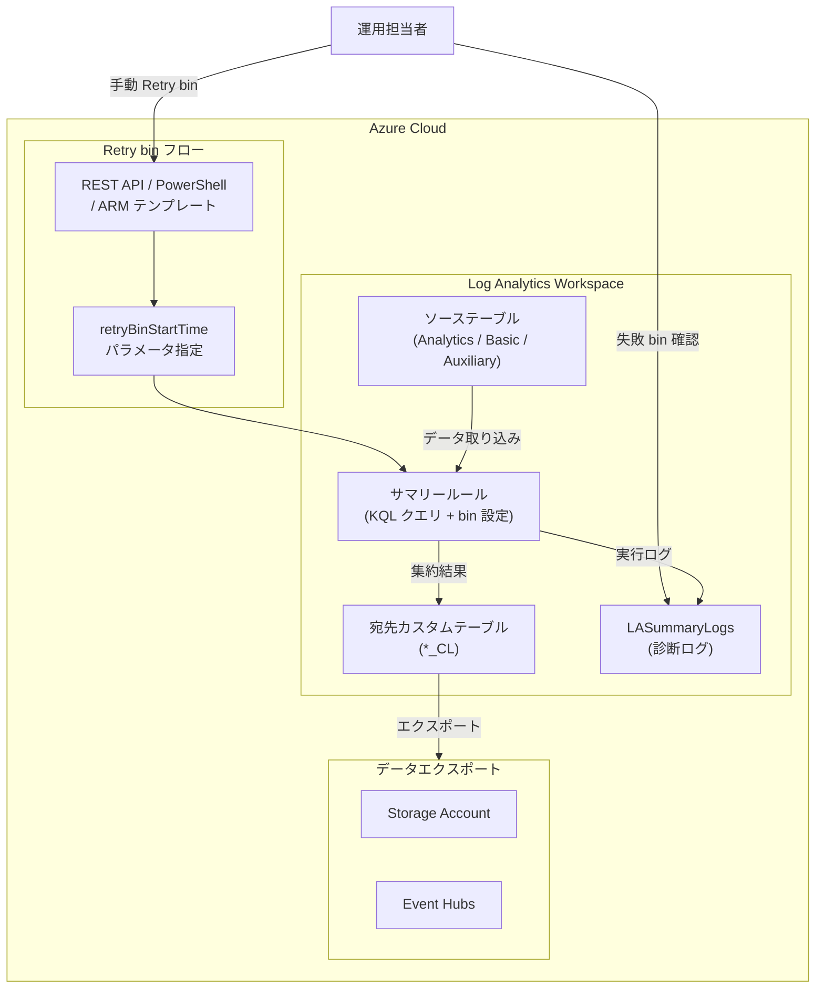

# Azure Monitor: Log Analytics サマリールールで手動 "Retry bin" が一般提供開始

**リリース日**: 2026-03-12

**サービス**: Azure Monitor

**機能**: Log Analytics ワークスペースのサマリールールにおける手動 "Retry bin" サポート

**ステータス**: Launched (GA)

[このアップデートのインフォグラフィックを見る](https://takech9203.github.io/azure-news-summary/20260312-log-analytics-summary-rules-retry-bin.html)

## 概要

Azure Monitor の Log Analytics ワークスペースにおけるサマリールール (Summary rules) に、手動で特定の bin を再実行できる "Retry bin" 機能が一般提供 (GA) として追加された。

サマリールールは、Log Analytics ワークスペース内でバッチ集計を実行し、集約結果をカスタム宛先テーブルに再取り込みする機能である。サマリールールの実行において特定の bin が失敗した場合、集約データセットにギャップが生じる可能性があった。今回追加された "Retry bin" 機能により、bin レベルの障害を手動で修復し、データの完全性を回復できるようになった。

サマリールールには自動リトライ機構が組み込まれており、失敗した bin に対して 8 時間以内に最大 10 回の再試行を行う。しかし、自動リトライが全て失敗した場合、これまでは手動でデータギャップを修復する手段が限られていた。今回の "Retry bin" 機能により、API、PowerShell、ARM テンプレートを通じて特定の bin を指定して再実行できるようになった。

**アップデート前の課題**

- サマリールールの自動リトライ (最大 10 回) が失敗した場合、bin レベルの障害を修復する手段が限られていた
- 集約データセットにギャップが生じても、特定の bin だけを再実行する手動操作が困難だった
- 8 回連続で bin リトライが発生すると、ルールが `isActive: false` に設定され停止するため、運用への影響が大きかった

**アップデート後の改善**

- API、PowerShell、ARM テンプレートを使って特定の bin を指定して手動で再実行できるようになった
- `retryBinStartTime` パラメータで再実行する bin の開始時刻を正確に指定可能
- `LASummaryLogs` テーブルで失敗した bin を特定し、ピンポイントで修復できる
- データの完全性を回復し、サマリーレポートの信頼性を維持できるようになった

## アーキテクチャ図



サマリールールはソーステーブルからデータを集約し、カスタム宛先テーブルに結果を書き込む。bin が失敗した場合、運用担当者は LASummaryLogs で失敗を確認し、API 経由で Retry bin を実行してデータギャップを修復する。

## サービスアップデートの詳細

### 主要機能

1. **手動 Retry bin**
   - 失敗した bin を `retryBinStartTime` パラメータで指定して手動再実行できる
   - REST API (PUT)、PowerShell、ARM テンプレートの 3 つの方法で実行可能
   - 指定する `binStartTime` はルールの `binSize` の区切りに合致する必要がある (例: binSize が 20 分の場合、10:00、10:20、10:40 のいずれか)

2. **失敗 bin の監視と検出**
   - Log Analytics ワークスペースの診断設定で **Summary Logs** カテゴリを有効化すると、`LASummaryLogs` テーブルに実行詳細が記録される
   - `LASummaryLogs | where Status == "Failed"` クエリで失敗した bin を検出できる
   - ログアラートルールを設定して、bin 失敗時にプロアクティブな通知を受け取ることが可能

3. **データ完全性の検証**
   - `make-series` と `dcount` を使用したクエリで、特定期間内の bin 実行状況を可視化できる
   - timechart で表示することでデータギャップを視覚的に確認可能

## 技術仕様

| 項目 | 詳細 |
|------|------|
| API バージョン | `2025-07-01` |
| Retry bin パラメータ | `retryBinStartTime` (形式: `%Y-%n-%eT%H:%M %Z`) |
| Retry bin の制約 | `binStartTime` は `RuleLastModifiedTime` 以降であること |
| binSize の区切りに合致 | 指定する `binStartTime` は `binSize` の倍数に一致する必要あり |
| サポートされる binSize | 20, 30, 60, 120, 180, 360, 720, 1440 (分) |
| ワークスペースあたりの最大ルール数 | 100 (アクティブルール) |
| 自動リトライ | 8 時間以内に最大 10 回 |
| 連続失敗時の動作 | 8 回連続 bin リトライ失敗でルールが `isActive: false` に設定 |
| 利用可能環境 | パブリッククラウドのみ |

## 設定方法

### 前提条件

1. Log Analytics ワークスペースに対する `Microsoft.Operationalinsights/workspaces/summarylogs/write` 権限 (Log Analytics Contributor ロール等)
2. 診断設定で **Summary Logs** カテゴリが有効化されていること (失敗 bin の検出に必要)
3. 既存のサマリールールが作成済みであること

### REST API

```bash
# 失敗した bin を手動で再実行する
curl -X PUT \
  "https://management.azure.com/subscriptions/{subscriptionId}/resourceGroups/{resourcegroup}/providers/Microsoft.OperationalInsights/workspaces/{workspace}/summarylogs/{ruleName}?api-version=2025-07-01" \
  -H "Authorization: Bearer {token}" \
  -H "Content-Type: application/json" \
  -d '{
    "properties": {
      "retryBinStartTime": "2026-02-16T10:00:00Z"
    }
  }'
```

### PowerShell

```powershell
# 失敗した bin を手動で再実行する
$body = @{
    properties = @{
        retryBinStartTime = "2026-02-16T10:00:00Z"
    }
} | ConvertTo-Json -Depth 5

Invoke-RestMethod `
    -Method Put `
    -Uri "https://management.azure.com/subscriptions/$subscriptionId/resourceGroups/$resourceGroup/providers/Microsoft.OperationalInsights/workspaces/$workspace/summarylogs/$ruleName?api-version=2025-07-01" `
    -Headers @{
        "Authorization" = "Bearer $token"
        "Content-Type"  = "application/json"
    } `
    -Body $body
```

### Azure Portal

Azure Portal のサマリールール管理画面から Retry bin 操作が可能である。診断設定で Summary Logs カテゴリを有効化し、LASummaryLogs テーブルで失敗した bin を確認した上で、API または PowerShell 経由で再実行を行う。

## メリット

### ビジネス面

- 集約データのギャップを修復できるため、月次・年次レポートの信頼性が向上する
- サマリーデータに基づくダッシュボードやアラートの正確性が維持される
- 運用チームが自発的にデータ品質を管理できるようになる

### 技術面

- bin レベルの粒度で再実行を制御でき、不必要な再処理を回避できる
- REST API、PowerShell、ARM テンプレートの 3 通りの方法で操作可能
- LASummaryLogs テーブルとの組み合わせにより、障害検出から修復までのワークフローが完結する
- 自動化スクリプトに組み込むことで、失敗検出と再実行を自動化できる

## デメリット・制約事項

- `retryBinStartTime` は `RuleLastModifiedTime` 以降の時刻でなければならず、ルール変更前の古い bin は再実行できない
- 指定する `binStartTime` は `binSize` の区切りに正確に一致する必要がある
- サマリールールはパブリッククラウドでのみ利用可能であり、Azure Government や Azure China では使用できない
- Lighthouse を介したクロステナントクエリのサマリールールには対応していない
- 宛先テーブルへのワークスペース変換 (workspace transformation) の追加はサポートされていない

## ユースケース

### ユースケース 1: セキュリティ監査レポートのデータギャップ修復

**シナリオ**: セキュリティチームが月次監査レポート用に SigninLogs のサマリーを集計しているが、一時的なサービス障害により特定の時間帯の bin が失敗し、レポートにギャップが発生した。

**実装例**:

```kusto
# 失敗した bin を特定する
LASummaryLogs
| where RuleName == "SigninLogsSummary"
| where Status == "Failed"
| project BinStartTime, Status, FailureReason
```

```bash
# 特定された失敗 bin を再実行する
curl -X PUT \
  "https://management.azure.com/subscriptions/{subId}/resourceGroups/{rg}/providers/Microsoft.OperationalInsights/workspaces/{ws}/summarylogs/SigninLogsSummary?api-version=2025-07-01" \
  -H "Authorization: Bearer {token}" \
  -H "Content-Type: application/json" \
  -d '{"properties": {"retryBinStartTime": "2026-03-01T02:00:00Z"}}'
```

**効果**: 監査レポートのデータ完全性を回復し、コンプライアンス要件を満たすことができる。

### ユースケース 2: コスト最適化のためのサマリーデータ修復

**シナリオ**: 大量のコンテナログを Basic テーブルに保存し、サマリールールで集約データを Analytics テーブルに送信している。bin 失敗によりコスト分析に使う集約データが欠損した。

**実装例**:

```kusto
# データの完全性を確認する
let ruleName = "ContainerLogsSummary";
let stepSize = 60m;
LASummaryLogs
| where RuleName == ruleName
| where Status == 'Succeeded'
| make-series dcount(BinStartTime) default=0 on BinStartTime from datetime("2026-03-01") to datetime("2026-03-12") step stepSize
| render timechart
```

**効果**: 集約データのギャップを埋めることで、正確なコスト分析と最適化の意思決定が可能になる。

## 料金

Retry bin 自体に追加料金は発生しない。サマリールールの通常の料金モデルが適用される。

| ソーステーブルプラン | クエリコスト | サマリー結果の取り込みコスト |
|------|------|------|
| Analytics | 無料 | Analytics ログの取り込み料金 |
| Basic / Auxiliary | データスキャン料金 | Analytics ログの取り込み料金 |

Retry bin を実行した場合、再実行された bin のクエリコストと結果の取り込みコストが通常通り発生する。詳細は [Azure Monitor の料金ページ](https://azure.microsoft.com/pricing/details/monitor/) を参照。

## 利用可能リージョン

サマリールールはパブリッククラウドでのみ利用可能である。パブリッククラウド内の Log Analytics ワークスペースがサポートされているすべてのリージョンで使用できる。

## 関連サービス・機能

- **Azure Monitor**: サマリールールを提供する親サービスであり、メトリクス、ログ、アラートの統合監視基盤
- **Log Analytics ワークスペース**: サマリールールが動作する基盤であり、ソーステーブルと宛先テーブルをホストする
- **LASummaryLogs テーブル**: サマリールールの実行状態を記録する診断テーブルで、失敗 bin の検出に使用される
- **Azure Monitor アラート**: LASummaryLogs と組み合わせてログアラートルールを設定し、bin 失敗をプロアクティブに通知できる
- **データエクスポートルール**: サマリーデータをカスタムテーブルから Storage Account や Event Hubs にエクスポートして外部統合に利用できる
- **Microsoft Sentinel**: サマリールールチュートリアルがあり、セキュリティ分析でのサマリーデータ活用を支援する

## 参考リンク

- [インフォグラフィック](https://takech9203.github.io/azure-news-summary/20260312-log-analytics-summary-rules-retry-bin.html)
- [公式アップデート情報](https://azure.microsoft.com/updates?id=558656)
- [Microsoft Learn ドキュメント - サマリールール](https://learn.microsoft.com/en-us/azure/azure-monitor/logs/summary-rules)
- [料金ページ](https://azure.microsoft.com/pricing/details/monitor/)

## まとめ

Log Analytics サマリールールにおける手動 "Retry bin" 機能の GA リリースは、サマリーデータの運用信頼性を向上させる重要なアップデートである。これまで自動リトライが失敗した場合にデータギャップの修復が困難だったが、`retryBinStartTime` パラメータを使用して特定の bin を手動で再実行できるようになった。REST API、PowerShell、ARM テンプレートの 3 つの方法で操作可能であり、LASummaryLogs テーブルでの失敗検出と組み合わせることで、障害検出から修復までのワークフローが完結する。サマリールールを使ってコスト最適化やセキュリティ監査を行っている環境では、診断設定を有効化し、失敗 bin に対するアラートルールを設定した上で、Retry bin を活用することを推奨する。

---

**タグ**: #Azure #AzureMonitor #LogAnalytics #SummaryRules #RetryBin #GA #Monitoring #DataAggregation #KQL
