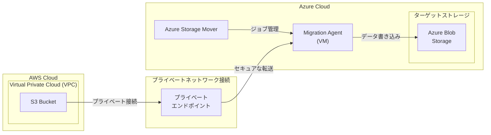

# Azure Storage Mover: AWS S3 から Azure Blob へのプライベートデータ転送 (パブリックプレビュー)

**リリース日**: 2026-03-12

**サービス**: Azure Storage Mover

**機能**: AWS S3 Virtual Private Cloud から Azure Blob Storage へのプライベートネットワーク経由の直接データ移行

**ステータス**: In preview

[このアップデートのインフォグラフィックを見る](https://takech9203.github.io/azure-news-summary/20260312-storage-mover-aws-s3-private-transfer.html)

## 概要

Azure Storage Mover に、AWS S3 の Virtual Private Cloud (VPC) 内のデータを Azure Blob Storage へプライベートネットワーク経由で直接移行する機能がパブリックプレビューとして追加された。

これまで Azure Storage Mover は AWS S3 バケットから Azure Blob コンテナへの移行をサポートしていたが、今回のアップデートにより、プライベートネットワーキングを利用したセキュアなデータ転送が可能になった。手動でのパイプライン構築やサードパーティツールの利用が不要となり、Azure CLI およびインフラストラクチャ・アズ・コード (IaC) による自動化もサポートされる。

**アップデート前の課題**

- AWS S3 VPC 内のデータを Azure に移行する際、パブリックインターネットを経由する必要があり、セキュリティ上の懸念があった
- VPC 内のプライベートデータを移行するには、手動でデータパイプラインを構築するか、サードパーティツールを利用する必要があった
- クラウド間のプライベートデータ転送を自動化する仕組みが限られていた

**アップデート後の改善**

- AWS S3 VPC 内のデータをプライベートネットワーク経由で Azure Blob Storage に直接転送できるようになった
- 手動パイプラインやサードパーティツールが不要になり、移行プロセスが簡素化された
- Azure CLI および IaC によるデータ転送の自動化が可能になった
- フルマネージドサービスとして、移行の進捗管理と監視が一元化された

## アーキテクチャ図

AWS S3 VPC 内のデータが、プライベートネットワーク接続を経由して Azure Storage Mover の Migration Agent に転送され、Azure Blob Storage に書き込まれる。Azure Storage Mover がジョブの管理とオーケストレーションを担当する。

## サービスアップデートの詳細

### 主要機能

1. **プライベートネットワーク経由のデータ転送**
   - AWS S3 VPC 内のデータをパブリックインターネットを経由せずに Azure Blob Storage へ移行可能
   - セキュリティポリシーが厳格な環境でもクラウド間移行を実現

2. **Azure CLI サポート**
   - コマンドラインからの移行ジョブの作成・管理・監視が可能
   - スクリプトによるバッチ処理や定期実行の自動化に対応

3. **インフラストラクチャ・アズ・コード (IaC) サポート**
   - ARM テンプレートや Bicep などによる移行構成のコード管理が可能
   - 再現性のある移行プロセスをコードとして定義・管理できる

4. **フルマネージドサービス**
   - Azure Storage Mover のクラウド管理機能により、移行の進捗をプロジェクト単位・ジョブ単位で追跡可能
   - 単一の Storage Mover インスタンスで複数のソースと複数のターゲットの移行を管理

## 技術仕様

| 項目 | 詳細 |
|------|------|
| ソース | AWS S3 バケット (VPC 内) |
| ターゲット | Azure Blob コンテナ (FNS / HNS 対応) |
| ネットワーク | プライベートネットワーク接続 |
| 制限事項 | Glacier / Glacier Deep Archive ストレージクラスは移行不可 |
| 自動化 | Azure CLI、IaC (ARM / Bicep) サポート |
| エージェント | Hyper-V または VMware 上の VM として展開 |
| ステータス | パブリックプレビュー |

## メリット

### ビジネス面

- サードパーティツールのライセンスコストが不要になり、移行コストを削減できる
- プライベートネットワーク経由の転送により、コンプライアンス要件を満たしやすくなる
- フルマネージドサービスにより、移行プロジェクトの管理負荷が軽減される

### 技術面

- パブリックインターネットを経由しないため、データ転送のセキュリティが向上する
- Azure CLI および IaC による自動化で、手動作業によるエラーリスクが低減する
- 単一の Storage Mover リソースで複数の移行ソース・ターゲットを一元管理できる
- 差分転送に対応しており、繰り返し実行時は変更分のみを転送する

## デメリット・制約事項

- 本機能はパブリックプレビューであり、本番ワークロードでの利用は慎重に検討する必要がある
- AWS S3 の Glacier および Glacier Deep Archive ストレージクラスのデータは移行できない
- Migration Agent を Hyper-V または VMware 上の VM として展開する必要がある (他の仮想化環境はサポート対象外)
- プレビュー期間中は機能やサポート範囲が変更される可能性がある

## ユースケース

### ユースケース 1: マルチクラウド統合でのデータ集約

**シナリオ**: AWS と Azure の両方を利用しているマルチクラウド環境において、AWS S3 VPC 内に保存されたデータを Azure Blob Storage に集約し、Azure 上の分析基盤で統合的に活用する。

**効果**: プライベートネットワーク経由でセキュアにデータを転送でき、手動パイプラインの構築・運用コストを削減しながら、データ分析基盤の統合を加速できる。

### ユースケース 2: AWS から Azure へのクラウド移行

**シナリオ**: セキュリティポリシーが厳格な企業において、AWS S3 VPC 内の機密データをパブリックインターネットを経由せずに Azure Blob Storage へ移行する。

**効果**: コンプライアンス要件を満たしながら、IaC による自動化で大規模なデータ移行を効率的に実行できる。

## 料金

Azure Storage Mover サービスの利用自体は、現時点では無料で提供されている。ただし、以下のコストが発生する可能性がある。

| 項目 | 詳細 |
|------|------|
| Storage Mover サービス利用料 | 無料 (将来の機能追加で変更の可能性あり) |
| ターゲット Azure Storage 利用料 | ストレージトランザクションおよびストレージ容量に基づく従量課金 |
| ネットワーク利用料 | Azure へのアップロードトラフィックに対する通常のネットワーク料金 |
| AWS 側のデータ転送料 | AWS のデータ転送料金が別途発生する可能性あり |

## 関連サービス・機能

- **Azure Blob Storage**: データ移行のターゲットストレージ。FNS および HNS (ADLS Gen2) 対応のコンテナをサポート
- **Azure Data Box**: 大規模データの初期バルク移行に使用し、Storage Mover でオンライン差分同期を行う組み合わせが可能
- **Azure Storage Mover Agent**: ソースストレージ付近に展開する VM ベースの移行アプライアンス

## 参考リンク

- [インフォグラフィック](https://takech9203.github.io/azure-news-summary/20260312-storage-mover-aws-s3-private-transfer.html)
- [公式アップデート情報](https://azure.microsoft.com/updates?id=558651)
- [Microsoft Learn - Azure Storage Mover ドキュメント](https://learn.microsoft.com/en-us/azure/storage-mover/)
- [Microsoft Learn - Azure Storage Mover の概要](https://learn.microsoft.com/en-us/azure/storage-mover/service-overview)
- [Microsoft Learn - Azure Storage Mover の料金](https://learn.microsoft.com/en-us/azure/storage-mover/billing)
- [Microsoft Learn - エンドポイント管理](https://learn.microsoft.com/en-us/azure/storage-mover/endpoint-manage)

## まとめ

Azure Storage Mover に AWS S3 VPC からのプライベートデータ転送機能がパブリックプレビューとして追加された。これにより、パブリックインターネットを経由せずに AWS S3 から Azure Blob Storage へのセキュアなデータ移行が可能になる。Azure CLI および IaC による自動化もサポートされており、手動パイプラインやサードパーティツールの利用が不要になる。

セキュリティ要件が厳格な環境での AWS から Azure へのデータ移行や、マルチクラウド環境でのデータ集約を検討している場合は、本プレビュー機能の検証を推奨する。本番利用にあたっては、GA (一般提供) のリリースを待つことが望ましい。

---

**タグ**: #AzureStorageMover #Migration #Storage #AWS #S3 #PrivateNetworking #PublicPreview #DataMigration #HybridCloud #MultiCloud
