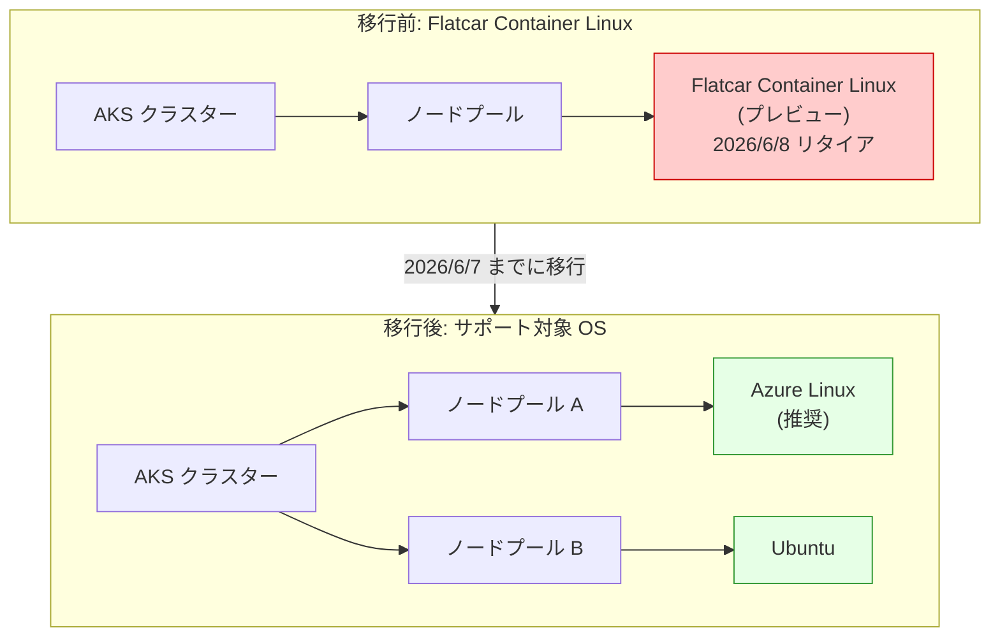

# Azure Kubernetes Service (AKS): Flatcar Container Linux (プレビュー) のリタイア

**リリース日**: 2026-03-16

**サービス**: Azure Kubernetes Service (AKS)

**機能**: Flatcar Container Linux for AKS (プレビュー) のリタイア

**ステータス**: Retirement

[このアップデートのインフォグラフィックを見る](https://takech9203.github.io/azure-news-summary/20260316-aks-flatcar-container-linux-retirement.html)

## 概要

Microsoft は、Azure Kubernetes Service (AKS) における Flatcar Container Linux (プレビュー) のサポートを 2026 年 6 月 8 日に終了することを発表した。Flatcar Container Linux は、コンテナワークロードに特化した軽量 Linux ディストリビューションとして AKS のプレビュー機能として提供されていたが、今後はサポート対象外となる。

現在 Flatcar Container Linux を使用しているユーザーは、2026 年 6 月 7 日までに、Azure Linux または Ubuntu などのサポート対象の OS に移行する必要がある。移行期間中（現在から 2026 年 6 月 7 日まで）は引き続き Flatcar Container Linux を使用することが可能であるが、リタイア日以降は機能の提供およびセキュリティ更新が停止される。

**移行前の状態**

- Flatcar Container Linux (プレビュー) をノード OS として使用している AKS クラスターが稼働中
- プレビュー機能のため、本番ワークロードでの使用は推奨されていなかった
- リタイア後はセキュリティパッチやバグ修正が提供されなくなる

**移行後の改善**

- Azure Linux や Ubuntu など、GA (一般提供) されたサポート対象 OS への移行により、継続的なセキュリティ更新を受けられる
- Azure Linux はコンテナワークロードに最適化されており、Flatcar からの移行先として推奨される
- サポート対象 OS を使用することで、Microsoft のサポートを受けることが可能になる

## アーキテクチャ図



Flatcar Container Linux を使用しているノードプールを、Azure Linux または Ubuntu をノード OS とする新しいノードプールに移行する流れを示している。移行先として Azure Linux が推奨されるが、Ubuntu も選択可能である。

## サービスアップデートの詳細

### 主要な変更点

1. **Flatcar Container Linux (プレビュー) のリタイア**
   - AKS における Flatcar Container Linux のサポートが 2026 年 6 月 8 日に終了する
   - リタイア日以降、Flatcar Container Linux のノードイメージは提供されなくなる
   - セキュリティパッチやバグ修正も停止される

2. **移行期間の提供**
   - 現在から 2026 年 6 月 7 日までの間は、引き続き Flatcar Container Linux を使用可能
   - この期間中に、サポート対象の OS への移行を完了する必要がある

3. **推奨される移行先**
   - **Azure Linux**: Microsoft が開発したコンテナ最適化 Linux ディストリビューション。軽量で攻撃対象面が小さく、コンテナワークロードに特化している
   - **Ubuntu**: AKS で広く使用されている汎用 Linux ディストリビューション。幅広いパッケージエコシステムと長期サポートが特徴

## 技術仕様

| 項目 | 詳細 |
|------|------|
| リタイア対象 | Flatcar Container Linux for AKS (プレビュー) |
| リタイア日 | 2026 年 6 月 8 日 |
| 移行期限 | 2026 年 6 月 7 日 |
| 推奨移行先 (1) | Azure Linux (AzureLinux) |
| 推奨移行先 (2) | Ubuntu (AKSUbuntu) |
| 影響範囲 | Flatcar Container Linux を使用している全ての AKS ノードプール |

## 移行手順

### 前提条件

1. Azure CLI がインストールされ、最新バージョンに更新されていること
2. 対象の AKS クラスターへのアクセス権限があること
3. 移行先の OS (Azure Linux または Ubuntu) を決定していること

### 現在の OS SKU の確認

```bash
# ノードプールの OS SKU を確認する
az aks nodepool show \
    --resource-group <RESOURCE_GROUP> \
    --cluster-name <CLUSTER_NAME> \
    --name <NODEPOOL_NAME> \
    --query osSku
```

### 方法 1: 新しいノードプールの作成と移行

```bash
# Azure Linux を使用した新しいノードプールを作成する
az aks nodepool add \
    --resource-group <RESOURCE_GROUP> \
    --cluster-name <CLUSTER_NAME> \
    --name <NEW_NODEPOOL_NAME> \
    --os-sku AzureLinux \
    --node-count <NODE_COUNT>

# ワークロードを新しいノードプールに移動する
# (nodeSelector や affinity の更新が必要な場合がある)

# 古い Flatcar ノードプールを削除する
az aks nodepool delete \
    --resource-group <RESOURCE_GROUP> \
    --cluster-name <CLUSTER_NAME> \
    --name <OLD_NODEPOOL_NAME>
```

### 方法 2: Ubuntu を使用する場合

```bash
# Ubuntu を使用した新しいノードプールを作成する
az aks nodepool add \
    --resource-group <RESOURCE_GROUP> \
    --cluster-name <CLUSTER_NAME> \
    --name <NEW_NODEPOOL_NAME> \
    --os-sku Ubuntu \
    --node-count <NODE_COUNT>
```

### Azure Portal

Azure Portal でも以下の手順で移行が可能である:

1. AKS クラスターのページを開く
2. 「ノードプール」セクションに移動する
3. 「ノードプールの追加」をクリックし、OS SKU として「Azure Linux」または「Ubuntu」を選択する
4. ワークロードを新しいノードプールに移動する
5. 古い Flatcar ノードプールを削除する

## 移行時の注意事項

### 確認事項

- Flatcar 固有の設定やカスタマイズ (Ignition 設定など) がある場合、移行先 OS に対応した設定に変換する必要がある
- ノードプールに適用されているラベルや taint を新しいノードプールにも設定すること
- PodDisruptionBudget を適切に設定し、ワークロードの可用性を維持しながら移行すること
- 移行前に、移行先 OS でのアプリケーションの動作テストを実施すること

### Azure Linux を選択する場合の考慮点

- Azure Linux はコンテナワークロードに最適化されており、Flatcar と同様に軽量な OS である
- 必要最小限のパッケージのみが含まれるため、攻撃対象面が小さい
- Microsoft が開発・メンテナンスしており、Azure に最適化されたカーネルが使用されている

## デメリット・制約事項

- 移行にはダウンタイムが発生する可能性がある (ノードプールの追加・削除が伴うため)
- Flatcar 固有の設定 (Ignition 設定など) は、移行先 OS の設定形式に手動で変換する必要がある
- 移行先 OS によってはパッケージの違いにより、一部のワークロードの動作確認が必要となる場合がある

## 関連サービス・機能

- **Azure Linux**: Microsoft 製のコンテナ最適化 Linux ディストリビューション。AKS のノード OS として推奨される移行先
- **Azure Kubernetes Service (AKS)**: コンテナオーケストレーションサービス。複数のノード OS をサポート
- **AKS ノードイメージアップグレード**: ノードプールの OS イメージを最新バージョンに更新する機能

## 参考リンク

- [インフォグラフィック](https://takech9203.github.io/azure-news-summary/20260316-aks-flatcar-container-linux-retirement.html)
- [公式アップデート情報](https://azure.microsoft.com/updates?id=557929)
- [Azure Linux を AKS で使用する - Microsoft Learn](https://learn.microsoft.com/en-us/azure/aks/use-azure-linux)
- [AKS ノードイメージのアップグレード - Microsoft Learn](https://learn.microsoft.com/en-us/azure/aks/upgrade-node-image)
- [Ubuntu から Azure Linux への移行 - Microsoft Learn](https://learn.microsoft.com/en-us/azure/azure-linux/tutorial-azure-linux-migration)

## まとめ

Azure Kubernetes Service (AKS) における Flatcar Container Linux (プレビュー) が 2026 年 6 月 8 日にリタイアとなる。現在 Flatcar Container Linux を使用している AKS ノードプールがある場合は、2026 年 6 月 7 日までに Azure Linux または Ubuntu への移行を完了する必要がある。

移行先としては、コンテナワークロードに最適化された Azure Linux が推奨される。Azure Linux は軽量で攻撃対象面が小さく、Microsoft が開発・メンテナンスを行っているため、Flatcar Container Linux からの移行先として適している。移行は新しいノードプールを作成し、ワークロードを移動した後に古いノードプールを削除する手順で実施する。早期に移行計画を策定し、テスト環境での動作検証を経て本番環境の移行を進めることが推奨される。

---

**タグ**: #Azure #AKS #AzureKubernetesService #Containers #Compute #FlatcarLinux #AzureLinux #Retirement #Migration
