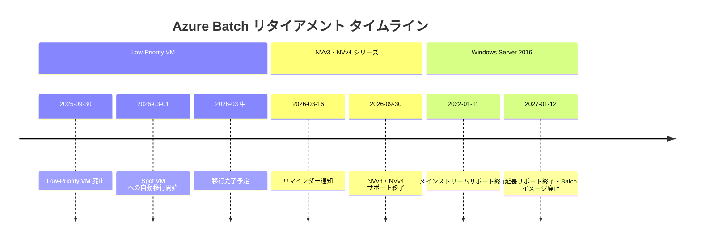

# Azure Batch: 複数のリタイアメント通知 (Windows Server 2016 / Low-Priority VM / NVv3・NVv4 シリーズ)

**リリース日**: 2026-03-16

**サービス**: Azure Batch

**機能**: Windows Server 2016 イメージ廃止、Low-Priority VM から Spot VM への移行、NVv3・NVv4 シリーズ VM の廃止

**ステータス**: Retirement

[このアップデートのインフォグラフィックを見る](https://takech9203.github.io/azure-news-summary/20260316-batch-retirements-2026.html)

## 概要

Microsoft は Azure Batch サービスに関連する 3 つのリタイアメント通知を発表した。これらはいずれも Azure Batch プールで使用されるインフラストラクチャの廃止・移行に関するもので、Batch ワークロードを運用している組織は計画的な対応が求められる。

1 つ目は、Azure Batch プールにおける Windows Server 2016 Marketplace イメージのサポートが 2027 年 1 月 12 日に終了することである。Windows Server 2016 のメインストリームサポートは 2022 年 1 月 11 日に既に終了しており、延長サポートの終了に合わせた措置となる。

2 つ目は、Azure Batch の Low-Priority VM が 2025 年 9 月 30 日に廃止され、2026 年 3 月からシステム主導で Spot VM への移行が開始されることである。この移行は Azure Batch と Commerce チームの連携により、制御された方法で数日間かけて実施される。

3 つ目は、Azure Batch プールにおける NVv3 シリーズ (NVIDIA Tesla M60 GPU) および NVv4 シリーズ (AMD Radeon Instinct MI25 GPU) の VM サポートが 2026 年 9 月 30 日に終了することである。GPU アクセラレーション ワークロードを実行しているユーザーは、後継シリーズへの移行が必要となる。

## アーキテクチャ図



このタイムラインは 3 つのリタイアメントの主要マイルストーンを時系列で示している。最も直近の対応が必要なのは Low-Priority VM の Spot VM 移行であり、次に NVv3・NVv4 シリーズ、最後に Windows Server 2016 の順となる。

## サービスアップデートの詳細

### 1. Windows Server 2016 Marketplace イメージのサポート終了

**廃止日**: 2027 年 1 月 12 日

- Windows Server 2016 のメインストリームサポートは 2022 年 1 月 11 日に終了済み
- 延長サポートが 2027 年 1 月 12 日に終了するのに合わせ、Azure Batch プールでの Marketplace イメージサポートも終了する
- Azure Batch は定期的に、サポート終了 (End-of-Life) に達したオペレーティングシステムのサポートを廃止している
- 廃止後は、Windows Server 2016 イメージを使用した新規プールの作成や既存プールのスケールアウトができなくなる

**推奨される移行先**:
- Windows Server 2019 以降の Marketplace イメージ
- Windows Server 2022 Marketplace イメージ

### 2. Low-Priority VM から Spot VM への移行

**移行開始日**: 2026 年 3 月 1 日

- Azure Batch の Low-Priority VM は 2025 年 9 月 30 日に正式に廃止された
- 2026 年 3 月初旬より、システム主導で既存の Low-Priority コンピュートノードが Spot ベースのコンピュートノードへ移行される
- 移行は制御された方法で実施され、数日間で完了する見込み
- 移行中に実行中のワークロードが中断・停止されることはない
- 移行完了後、すべてのアクティブな Low-Priority コンピュートノードは Spot ベースのコンピュートノードに変換される
- Azure Batch API や SDK で Low-Priority プロパティを使用しても、自動的に Spot ベースのコンピュートノード割り当てに変換される

**主な変更点**:
- `targetLowPriorityNodes` は `targetSpotNodes` として動作する
- 料金モデルが Low-Priority 価格から Spot 価格に変更される
- エビクションポリシーが設定可能になる (delete または deallocate)
- Batch マネージドプール割り当てモードでも Spot VM が利用可能になる

### 3. NVv3・NVv4 シリーズ VM の廃止

**廃止日**: 2026 年 9 月 30 日

**NVv3 シリーズ**:
- NVIDIA Tesla M60 GPU 搭載
- Intel Xeon E5-2690 v4 (Broadwell) プロセッサ
- 12 - 48 vCPU、112 - 448 GiB メモリ
- 1 - 4 GPU (各 16 GB VRAM)
- GPU アクセラレーション グラフィックスおよびバーチャルデスクトップ向け

**NVv4 シリーズ**:
- AMD Radeon Instinct MI25 GPU 搭載
- AMD EPYC 7V12 (Rome) プロセッサ
- 4 - 32 vCPU、14 - 112 GiB メモリ
- 1/8 - 1 GPU (2 - 16 GB VRAM)
- パーシャル GPU をサポート (1/8 GPU からフル GPU まで)
- Windows ゲスト OS のみサポート

## 技術仕様

| 項目 | 詳細 |
|------|------|
| Windows Server 2016 廃止日 | 2027 年 1 月 12 日 |
| Low-Priority VM 廃止日 | 2025 年 9 月 30 日 (廃止済み) |
| Low-Priority VM 自動移行開始日 | 2026 年 3 月 1 日 |
| NVv3 シリーズ廃止日 | 2026 年 9 月 30 日 |
| NVv4 シリーズ廃止日 | 2026 年 9 月 30 日 |
| NVv3 GPU | NVIDIA Tesla M60 (16 GB) |
| NVv4 GPU | AMD Radeon Instinct MI25 (16 GB) |
| Spot VM エビクションポリシー | delete または deallocate |
| Spot VM 価格モデル | 標準 VM 価格に対する変動割引 |

## 必要な対応

### Windows Server 2016 イメージ利用者

1. Azure Batch プールで Windows Server 2016 イメージを使用しているか確認する
2. Windows Server 2019 以降のイメージへの移行計画を策定する
3. アプリケーションの互換性テストを実施する
4. 2027 年 1 月 12 日までに移行を完了する

### Low-Priority VM 利用者

移行はシステム主導で自動的に行われるため、事前のアクションは不要である。ただし、以下の点を確認することを推奨する。

1. Spot VM の価格モデルを確認し、コストへの影響を把握する
2. エビクションポリシーの設定を確認する

### Azure CLI による Spot VM プール作成

```bash
az batch pool create \
  --id "spot-pool-001" \
  --vm-size "Standard_D2s_v3" \
  --target-low-priority-nodes 5 \
  --enable-inter-node-communication false \
  --image "Canonical:ubuntu-24_04-lts:server" \
  --node-agent-sku-id "batch.node.ubuntu 24.04" \
  --account-name <batch-account-name> \
  --account-endpoint "https://<batch-account-name>.<region>.batch.azure.com"
```

### Azure CLI による移行後の検証

```bash
az batch pool show \
  --account-name <batch-account-name> \
  --account-endpoint "https://<batch-account-name>.<region>.batch.azure.com" \
  --pool-id <pool-id> \
  --query "{PoolID:id, VMSize:vmSize, SpotNodes:scaleSettings.targetLowPriorityNodes, State:state}"
```

### NVv3・NVv4 シリーズ利用者

1. Azure Batch プールで NVv3 または NVv4 シリーズを使用しているか確認する
2. 後継の GPU シリーズへの移行を計画する
3. 2026 年 9 月 30 日までに移行を完了する

## メリット

### Low-Priority VM から Spot VM への移行

- Spot VM はユーザーサブスクリプションモードと Batch マネージドモードの両方で利用可能になる
- エビクションポリシーが設定可能になり、ワークロード特性に応じた柔軟な運用が可能になる
- Azure 全体の Spot VM エコシステムとの統合が強化される

### 技術面

- Spot VM は Azure 全体で利用可能な標準機能であり、単一インスタンス VM や Virtual Machine Scale Sets でも利用できる
- 移行はシステム主導で透過的に実施され、ワークロードの中断がない
- 既存のコードや設定の変更は不要で、Low-Priority プロパティの使用が自動的に Spot に変換される

## デメリット・制約事項

- Spot VM は容量不足時にプリエンプション (強制回収) される可能性がある
- 料金モデルが Low-Priority の固定割引から Spot の変動割引に変わるため、コストが変動する可能性がある
- NVv3・NVv4 シリーズの廃止により、GPU ワークロードの移行作業が発生する
- Windows Server 2016 依存のレガシーアプリケーションは OS アップグレードに伴う検証作業が必要になる
- NVv4 シリーズは Windows ゲスト OS のみのサポートであるため、Linux ベースの代替サイズへの移行時にはワークロードの再検証が必要

## 関連サービス・機能

- **Azure Batch Spot VM**: Low-Priority VM の後継として、余剰キャパシティを活用したコスト最適化を提供
- **Azure Virtual Machines**: NVv3・NVv4 シリーズの廃止は Azure VM 全体に影響するため、Batch 以外の VM 利用者も対応が必要
- **Azure Virtual Machine Scale Sets**: Spot VM は Scale Sets でも利用可能
- **Azure Compute Gallery**: カスタムイメージを使用した Batch プール構成に関連

## 参考リンク

- [インフォグラフィック](https://takech9203.github.io/azure-news-summary/20260316-batch-retirements-2026.html)
- [公式アップデート情報: Windows Server 2016 サポート終了](https://azure.microsoft.com/updates?id=549077)
- [公式アップデート情報: Low-Priority VM から Spot VM への移行](https://azure.microsoft.com/updates?id=543279)
- [公式アップデート情報: NVv3・NVv4 シリーズ廃止リマインダー](https://azure.microsoft.com/updates?id=516070)
- [Low-Priority VM から Spot VM への移行ガイド - Microsoft Learn](https://learn.microsoft.com/en-us/azure/batch/low-priority-vms-retirement-migration-guide)
- [Azure Batch での Spot VM の使用 - Microsoft Learn](https://learn.microsoft.com/en-us/azure/batch/batch-spot-vms)
- [NVv3 シリーズ - Microsoft Learn](https://learn.microsoft.com/en-us/azure/virtual-machines/sizes/gpu-accelerated/nvv3-series)
- [NVv4 シリーズ - Microsoft Learn](https://learn.microsoft.com/en-us/azure/virtual-machines/sizes/gpu-accelerated/nvv4-series)

## まとめ

Azure Batch サービスに関する 3 つのリタイアメントが同時に発表された。最も緊急性が高いのは Low-Priority VM から Spot VM への自動移行で、2026 年 3 月に既に開始されている。ただし、この移行はシステム主導で透過的に実施されるため、ユーザー側の事前対応は基本的に不要である。料金モデルの変更による請求への影響を確認することが推奨される。

次に対応が必要なのは NVv3・NVv4 シリーズの 2026 年 9 月 30 日の廃止である。GPU アクセラレーション ワークロードを実行している場合は、後継シリーズへの移行計画を早期に策定すべきである。

Windows Server 2016 の廃止は 2027 年 1 月 12 日であり、時間的余裕はあるが、OS アップグレードに伴うアプリケーション互換性テストの工数を考慮し、計画的に対応することが推奨される。

---

**タグ**: #Azure #AzureBatch #Retirement #SpotVM #GPU #NVv3 #NVv4 #WindowsServer2016 #Migration
