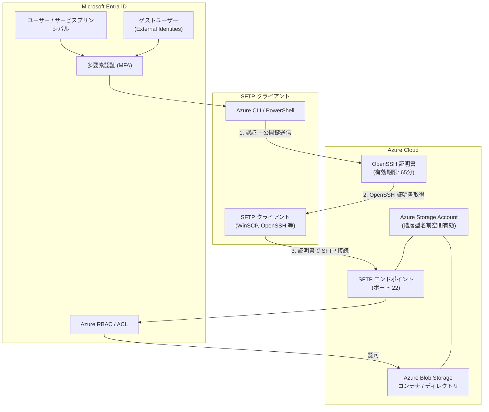

# Azure Blob Storage: SFTP における Microsoft Entra ID ベースのアクセス (パブリックプレビュー)

**リリース日**: 2026-03-16

**サービス**: Azure Blob Storage

**機能**: SFTP における Microsoft Entra ID ベースのアクセス

**ステータス**: In preview

[このアップデートのインフォグラフィックを見る](https://takech9203.github.io/azure-news-summary/20260316-blob-storage-sftp-entra-id.html)

## 概要

Azure Blob Storage の SFTP エンドポイントにおいて、Microsoft Entra ID ベースの認証・認可がパブリックプレビューとして提供開始された。これにより、従来のローカルユーザー (パスワードまたは SSH 鍵) に加え、Microsoft Entra ID の ID (ユーザー、サービスプリンシパル、ゲストユーザー) を使用して SFTP 接続が可能になる。

従来の Azure Blob Storage SFTP では、ストレージアカウントごとにローカルユーザーを作成・管理する必要があり、パスワードやSSH 鍵の配布・ローテーションなどの運用負荷が課題であった。今回の Entra ID 統合により、既存の企業 ID 基盤をそのまま活用でき、RBAC や ACL による統一的なアクセス制御が実現される。

また、Microsoft Entra External Identities を利用することで、外部パートナーやベンダーに対しても、別の ID 管理システムを構築することなくセキュアな SFTP アクセスを提供できるようになる。

**アップデート前の課題**

- ストレージアカウントごとにローカルユーザーの作成・管理が必要であった
- パスワードや SSH 鍵の配布・ローテーションの運用負荷が高かった
- ローカルユーザーは Azure RBAC や ABAC と相互運用できず、アクセス制御モデルが分離していた
- 外部ユーザーへの SFTP アクセス付与には、別途ローカルユーザーの管理が必要であった

**アップデート後の改善**

- Microsoft Entra ID の既存 ID (ユーザー、グループ、サービスプリンシパル) をそのまま SFTP 認証に利用可能
- Azure RBAC および ACL による統一的なアクセス制御が SFTP にも適用される
- 多要素認証 (MFA) による強化されたセキュリティを SFTP 接続でも利用可能
- Entra External Identities によるゲストユーザーへのセキュアな SFTP アクセス提供が可能

## アーキテクチャ図



Microsoft Entra ID で認証後、OpenSSH 証明書を取得し、その証明書を使用して SFTP エンドポイントに接続する。認可は Azure RBAC および ACL に基づいて行われる。

## サービスアップデートの詳細

### 主要機能

1. **Microsoft Entra ID 認証の統合**
   - ユーザー、サービスプリンシパル、ゲストユーザーが Entra ID の ID で SFTP に接続可能
   - Azure CLI (`az sftp cert`) または Azure PowerShell (`New-AzSftpCertificate`) で OpenSSH 証明書を取得
   - .NET SDK による証明書取得もサポート

2. **OpenSSH 証明書ベースの認証**
   - Entra ID 認証後、65 分間有効な OpenSSH 証明書が発行される
   - RSA 鍵のみサポート (ECDSA は非サポート)
   - 標準的な SFTP クライアント (WinSCP 6.0 以降、OpenSSH 等) で利用可能

3. **Azure RBAC / ACL との統合**
   - Storage Blob Data Contributor や Storage Blob Data Owner などの既存ロールが SFTP にも適用される
   - POSIX スタイルの ACL による細粒度のアクセス制御をサポート
   - REST API、SDK、Portal 経由のアクセスと同じ権限モデルを SFTP でも利用可能

4. **外部コラボレーション (Entra External Identities)**
   - ゲストユーザーを Microsoft Entra ID に招待し、SFTP アクセスを付与可能
   - 外部パートナーやベンダーとの安全なファイル転送を実現
   - 別の ID 管理システムの構築が不要

## 技術仕様

| 項目 | 詳細 |
|------|------|
| ステータス | パブリックプレビュー |
| 認証方式 | OpenSSH 証明書 (RSA のみ) |
| 証明書の有効期限 | 65 分 |
| サポートされる ID | ユーザー、サービスプリンシパル、ゲストユーザー |
| 必要なストレージアカウント | 汎用 v2 または Premium ブロック Blob アカウント |
| 前提条件 | 階層型名前空間 (HNS) の有効化 |
| アクセス制御 | Azure RBAC、ACL (ABAC は部分サポート) |
| SFTP ポート | 22 |
| 対応 CLI | Azure CLI (`az sftp`)、Azure PowerShell (`Az.Sftp`) |
| パスワード認証 | 非サポート (SFTP クライアント側に Entra ID ネイティブ統合がないため) |

## 設定方法

### 前提条件

1. 汎用 v2 または Premium ブロック Blob ストレージアカウント (階層型名前空間有効)
2. ストレージアカウントで SFTP サポートが有効化されていること
3. Azure サブスクリプションで `SFTP Entra ID Support` プレビュー機能が登録されていること
4. Azure CLI または Azure PowerShell がインストールされていること

### Azure CLI

```bash
# 1. プレビュー機能の登録
az feature register --namespace Microsoft.Storage --name SFTPEntraIDSupport

# 2. Entra ID で認証
az login

# 3. SSH 鍵ペアの生成 (RSA のみサポート)
ssh-keygen -t rsa

# 4. OpenSSH 証明書の取得
az sftp cert --public-key-file /path/to/id_rsa.pub --file /path/to/my_cert.pub

# 5. SFTP 接続
sftp -o PubkeyAcceptedKeyTypes="rsa-sha2-256-cert-v01@openssh.com,rsa-sha2-256" \
     -o IdentityFile="/path/to/id_rsa" \
     -o CertificateFile="/path/to/my_cert.pub" \
     storageaccountname.username@storageaccountname.blob.core.windows.net
```

```bash
# Azure CLI で証明書取得と接続を一括実行
az sftp connect --storage-account <account_name>
```

### Azure PowerShell

```powershell
# 1. Entra ID で認証
Connect-AzAccount

# 2. OpenSSH 証明書の取得
New-AzSftpCertificate -PublicKeyFile "\id_rsa.pub" -CertificatePath "\my_cert.cert"

# 3. SFTP 接続
Connect-AzSftp -StorageAccount "<account_name>" -CertificateFile "/my_cert.pub"
```

## メリット

### ビジネス面

- ローカルユーザーの作成・管理が不要になり、運用コストが削減される
- 既存の企業 ID 基盤 (Entra ID) を活用でき、ID 管理の一元化が実現する
- 外部パートナーとのファイル共有に Entra External Identities を利用でき、コラボレーションが容易になる
- SFTP ワークフローの初期セットアップ時間が短縮される

### 技術面

- Azure RBAC / ACL による統一的なアクセス制御モデルが SFTP にも適用される
- 多要素認証 (MFA) によるセキュリティ強化が可能
- OpenSSH 証明書の有効期限が 65 分と短く、長期間有効な認証情報のリスクが軽減される
- サービスプリンシパルによる自動化ワークフローの実装が容易

## デメリット・制約事項

- パブリックプレビュー段階であり、本番ワークロードでの使用は推奨されない
- パスワード認証は非サポート (OpenSSH 証明書のみ)
- RSA 鍵のみサポートされ、ECDSA は利用不可
- ABAC (属性ベースアクセス制御) は部分サポートであり、Storage Blob Data Owner ロールとの併用時にタイムアウトエラーが発生する可能性がある
- ABAC のサブオペレーション (Blob.List、Blob.Read 等) は正しく動作しない場合がある
- ホームディレクトリの設定は非サポート。接続後に cd コマンドでコンテナに移動する必要がある
- 接続文字列にコンテナ名を含めることができない
- 証明書の有効期限が 65 分であるため、長時間のファイル転送には証明書の更新が必要
- 有効化するとサブスクリプション内の全ストレージアカウントに適用される

## ユースケース

### ユースケース 1: レガシーシステムとの統合

**シナリオ**: 既存のレガシーシステムが SFTP を使用してファイルを転送しているが、ローカルユーザー管理の負荷を削減したい場合。

**効果**: サービスプリンシパルを使用して Entra ID で認証し、Azure RBAC で細粒度のアクセス制御を適用できる。ローカルユーザーの管理が不要になり、運用負荷が大幅に削減される。

### ユースケース 2: 外部パートナーとのセキュアなファイル共有

**シナリオ**: 外部のビジネスパートナーやベンダーに対して SFTP でファイルアクセスを提供する必要がある場合。

**効果**: Entra External Identities でゲストユーザーとして招待し、適切な RBAC ロールを付与することで、別の ID 管理システムを構築することなくセキュアなファイル共有が実現される。

## 料金

SFTP エンドポイントの有効化には時間単位のコストが発生する。詳細な料金については [Azure Blob Storage の料金ページ](https://azure.microsoft.com/pricing/details/storage/blobs/) を参照。

Entra ID ベースのアクセス自体に追加料金は記載されていないが、通常の SFTP 料金およびストレージのトランザクション・容量・ネットワーク料金が適用される。SFTP トランザクションはストレージアカウントの Read、Write、Other トランザクションに変換される。

SFTP を常時有効にすると継続的にコストが発生するため、データ転送時のみ有効にすることが推奨されている。

## 関連サービス・機能

- **Microsoft Entra ID**: SFTP 接続の認証・認可基盤として使用される
- **Microsoft Entra External Identities**: 外部ユーザー (ゲストユーザー) への SFTP アクセス提供に使用される
- **Azure Data Lake Storage Gen2**: 階層型名前空間 (HNS) の基盤技術。SFTP サポートには HNS の有効化が必須
- **Azure Blob Storage SFTP (ローカルユーザー)**: 従来のローカルユーザーベースの SFTP 認証。Entra ID ベースのアクセスと共存可能

## 参考リンク

- [インフォグラフィック](https://takech9203.github.io/azure-news-summary/20260316-blob-storage-sftp-entra-id.html)
- [公式アップデート情報](https://azure.microsoft.com/updates?id=558662)
- [Microsoft Learn - SFTP support for Azure Blob Storage](https://learn.microsoft.com/en-us/azure/storage/blobs/secure-file-transfer-protocol-support)
- [Microsoft Learn - Authorize SFTP access using Microsoft Entra ID (preview)](https://learn.microsoft.com/en-us/azure/storage/blobs/secure-file-transfer-protocol-support-entra-id-based-access)
- [Microsoft Learn - SFTP の制限事項と既知の問題](https://learn.microsoft.com/en-us/azure/storage/blobs/secure-file-transfer-protocol-known-issues)
- [料金ページ](https://azure.microsoft.com/pricing/details/storage/blobs/)

## まとめ

Azure Blob Storage SFTP における Microsoft Entra ID ベースのアクセスは、従来のローカルユーザー管理の課題を解決する重要なアップデートである。企業の既存 ID 基盤 (Entra ID) をそのまま活用し、RBAC や ACL による統一的なアクセス制御、MFA によるセキュリティ強化が SFTP 接続にも適用される。

パブリックプレビュー段階であるため、ABAC の部分サポートやホームディレクトリ設定の非サポートなど制約事項が存在するが、ローカルユーザー管理の廃止、外部パートナーとのコラボレーション強化、セキュリティポスチャの向上など、多くのメリットがある。SFTP を利用しているユーザーは、プレビュー期間中にこの機能を評価し、GA 後の本番導入に向けた準備を進めることが推奨される。

---

**タグ**: #Azure #BlobStorage #SFTP #EntraID #認証 #セキュリティ #パブリックプレビュー #ExternalIdentities #RBAC #ACL
