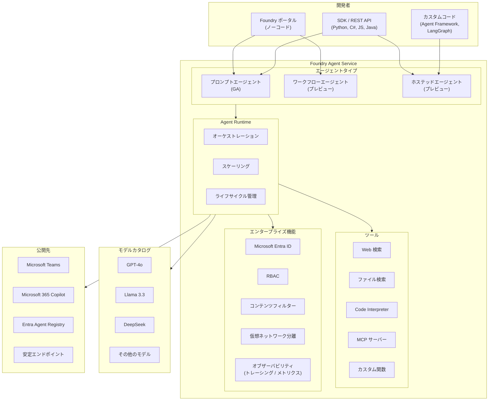

# Foundry Agent Service: 一般提供開始 (GA)

**リリース日**: 2026-03-17

**サービス**: Microsoft Foundry

**機能**: Foundry Agent Service

**ステータス**: Launched (GA)

[このアップデートのインフォグラフィックを見る](https://takech9203.github.io/azure-news-summary/20260317-foundry-agent-service-ga.html)

## 概要

Microsoft Foundry Agent Service が一般提供 (GA) として正式にリリースされた。Foundry Agent Service は、AI エージェントの構築、デプロイ、スケーリングを行うためのフルマネージドプラットフォームであり、再設計された API フォーマットとランタイムエクスペリエンスを提供する。このGA リリースは、プロトタイプから本番環境への移行を確実に行うための本番グレードの機能を中心に構成されている。

Foundry Agent Service では、Foundry モデルカタログから多数のモデルを利用でき、Foundry ポータルでのノーコードによるプロンプトエージェントの作成や、SDK および REST API を使用したコードベースのホステッドエージェントのデプロイが可能である。Agent Framework、LangGraph、または独自コードで構築したエージェントをコンテナとしてデプロイできる。

サービスはホスティング、スケーリング、ID 管理、オブザーバビリティ、エンタープライズセキュリティを自動的に処理するため、開発者はエージェントロジックに集中できる。

**アップデート前の課題**

- AI エージェントの構築からプロダクション運用までのライフサイクル管理が複雑で、インフラストラクチャの構築・管理に多大な労力が必要だった
- エージェントのスケーリング、ID 管理、オブザーバビリティなどのエンタープライズ要件を個別に実装する必要があった
- プロトタイプから本番環境への移行において、API の安定性やランタイムの信頼性に懸念があった

**アップデート後の改善**

- フルマネージドプラットフォームにより、エージェントのホスティング、スケーリング、セキュリティが自動化された
- 再設計された GA 版 API (api-version: 2025-05-01) により、安定した本番グレードのインターフェースが提供される
- エンドツーエンドのトレーシング、メトリクス、Application Insights 統合によるオブザーバビリティが標準搭載された
- Microsoft Entra ID、RBAC、コンテンツフィルター、仮想ネットワーク分離によるエンタープライズグレードのセキュリティが組み込まれた

## アーキテクチャ図



Foundry Agent Service は、開発者がポータルまたは SDK を通じてエージェントを作成し、Agent Runtime がオーケストレーション、スケーリング、ツール呼び出しを管理する構成である。モデルカタログから任意のモデルを選択でき、構築したエージェントは Microsoft Teams や Microsoft 365 Copilot を含む複数のチャネルに公開できる。

## サービスアップデートの詳細

### 主要機能

1. **プロンプトエージェント (GA)**
   - 指示、モデル選択、ツールの構成のみで定義するエージェント。Foundry ポータルでノーコードで作成可能、または API/SDK から作成可能
   - ラピッドプロトタイピングや社内ツールに最適

2. **ワークフローエージェント (プレビュー)**
   - 複数のアクションのシーケンスやマルチエージェントの連携を宣言的に定義
   - Foundry ポータルのビジュアルビルダーまたは VS Code での YAML 定義をサポート
   - 分岐ロジック、ヒューマンインザループ、グループチャットパターンに対応

3. **ホステッドエージェント (プレビュー)**
   - Agent Framework、LangGraph、独自コードで構築したエージェントをコンテナとしてデプロイ
   - ランタイム、スケーリング、インフラストラクチャは Foundry が管理

4. **組み込みツール**
   - Web 検索、ファイル検索、メモリ、Code Interpreter、MCP サーバー、カスタム関数を標準提供
   - マネージド認証 (サービスマネージド資格情報および On-Behalf-Of 認証) をサポート

5. **エージェント ID とセキュリティ**
   - 各エージェントに専用の Microsoft Entra ID を付与可能
   - RBAC による細粒度のアクセス制御
   - コンテンツフィルターによるプロンプトインジェクション (XPIA を含む) の軽減

6. **バージョニングと公開**
   - エージェントのバージョンが自動スナップショットされ、任意のバージョンへのロールバックが可能
   - 安定エンドポイントへの公開、Microsoft Teams / Microsoft 365 Copilot / Entra Agent Registry への配信

## 技術仕様

| 項目 | 詳細 |
|------|------|
| GA API バージョン | 2025-05-01 |
| プレビュー API バージョン | 2025-05-15-preview |
| エージェントあたりの最大ファイル数 | 10,000 |
| 最大ファイルサイズ | 512 MB |
| アップロードファイル合計最大サイズ | 300 GB |
| スレッドあたりの最大メッセージ数 | 100,000 |
| メッセージあたりの最大テキストサイズ | 1,500,000 文字 |
| エージェントあたりの最大ツール数 | 128 |
| ベクトルストア添付の最大トークン数 | 2,000,000 トークン |
| 対応 SDK | Python, C#, JavaScript/TypeScript, Java |
| 対応フレームワーク | Agent Framework, LangGraph, カスタムコード |

## 設定方法

### 前提条件

1. Azure サブスクリプション
2. サブスクリプションスコープでの **Azure AI Account Owner** ロール (または **Contributor** / **Owner** ロール)
3. プロジェクトレベルでの **Azure AI User** ロール

### Azure Portal

1. [Microsoft Foundry ポータル](https://ai.azure.com) にアクセスする
2. ホームページで **Create an agent** をクリックする
3. プロジェクト名を入力し、必要に応じて **Advanced options** でカスタマイズする
4. **Create** を選択してリソースのプロビジョニングを待つ (アカウント、プロジェクト、gpt-4o モデルのデプロイ、デフォルトエージェントが自動作成される)
5. エージェントプレイグラウンドで指示を設定し、チャットテストを開始する

### Python SDK

```bash
# パッケージのインストール
pip install azure-ai-projects azure-identity

# Azure へのログイン
az login
```

```python
import os
from azure.ai.projects import AIProjectClient
from azure.identity import DefaultAzureCredential
from azure.ai.agents.models import CodeInterpreterTool

project_client = AIProjectClient(
    endpoint=os.getenv("PROJECT_ENDPOINT"),
    credential=DefaultAzureCredential(),
)

with project_client:
    code_interpreter = CodeInterpreterTool()
    agent = project_client.agents.create_agent(
        model=os.getenv("MODEL_DEPLOYMENT_NAME"),
        name="my-agent",
        instructions="You are a helpful assistant.",
        tools=code_interpreter.definitions,
        tool_resources=code_interpreter.resources,
    )

    thread = project_client.agents.threads.create()
    message = project_client.agents.messages.create(
        thread_id=thread.id,
        role="user",
        content="Hello, agent!",
    )

    run = project_client.agents.runs.create_and_process(
        thread_id=thread.id,
        agent_id=agent.id,
    )
```

### REST API

```bash
# エージェントの作成
curl --request POST \
  --url $AZURE_AI_FOUNDRY_PROJECT_ENDPOINT/assistants?api-version=2025-05-01 \
  -H "Authorization: Bearer $AGENT_TOKEN" \
  -H "Content-Type: application/json" \
  -d '{
    "instructions": "You are a helpful agent.",
    "name": "my-agent",
    "tools": [{"type": "code_interpreter"}],
    "model": "gpt-4o"
  }'
```

## メリット

### ビジネス面

- フルマネージドプラットフォームにより、インフラストラクチャの管理コストを削減し、エージェント開発に集中できる
- ノーコードのプロンプトエージェントにより、開発者以外のチームメンバーもエージェントを迅速に作成可能
- Microsoft Teams や Microsoft 365 Copilot への公開により、既存の業務ツールにエージェントを統合できる
- バージョニングとロールバック機能により、本番環境での安全なリリース管理が可能

### 技術面

- Agent Runtime がオーケストレーション、スケーリング、ライフサイクル管理を自動処理
- エンドツーエンドのトレーシングと Application Insights 統合により、エージェントの動作を詳細に可視化可能
- 複数の SDK (Python, C#, JS, Java) と REST API をサポートし、既存の開発ワークフローに統合しやすい
- Foundry モデルカタログから GPT-4o、Llama、DeepSeek 等の多様なモデルを利用でき、コード変更なしでモデルを切り替え可能
- 仮想ネットワーク分離やBYOR (Bring Your Own Resources) により、コンプライアンス要件に対応可能

## デメリット・制約事項

- ホステッドエージェントとワークフローエージェントはまだパブリックプレビュー段階であり、GA は プロンプトエージェントのみ
- ホステッドエージェントはプレビュー期間中、プライベートネットワーキングをサポートしていない
- 一部のツール (メモリ、Web 検索等) はプレビュー段階であり、リージョンによって利用可能なツールが異なる
- ファイル検索は Italy North および Brazil South では利用不可
- Code Interpreter は全リージョンで利用可能ではない
- エージェントサービスのファイル、メッセージ、ツール数の上限は固定であり、引き上げリクエストは不可

## ユースケース

### ユースケース 1: カスタマーサポート自動化

**シナリオ**: プロンプトエージェントを使用して、ファイル検索ツールと Web 検索ツールを組み合わせた FAQ 対応エージェントを構築し、Microsoft Teams に公開する。

**効果**: ノーコードで迅速に構築でき、既存のナレッジベースを検索してユーザーの質問に自動回答。Teams 統合により、従業員が普段使うツール上で直接利用可能。

### ユースケース 2: マルチエージェントによる業務プロセス自動化

**シナリオ**: ワークフローエージェントを使用して、データ収集エージェント、分析エージェント、レポート作成エージェントを連携させ、承認フロー付きの定期レポート生成パイプラインを構築する。

**効果**: 複数エージェントの協調動作とヒューマンインザループにより、品質を担保しながら業務プロセスを自動化。

### ユースケース 3: 独自フレームワークによる高度なエージェント

**シナリオ**: ホステッドエージェントを使用して、LangGraph で構築した複雑な推論ロジックを持つエージェントをコンテナとしてデプロイし、カスタム関数ツールで社内 API と連携する。

**効果**: フレームワークの自由度を維持しながら、Foundry のスケーリングとセキュリティ基盤を活用。

## 料金

Foundry Agent Service の料金は、エージェントが使用するモデルデプロイメントの従量課金に基づく。Foundry プラットフォーム自体の探索は無料であり、個々の機能やモデルの利用に対して通常料金が課金される。

Microsoft は Agent pre-purchase plan を提供しており、Agent Commit Units (ACU) の 1 年間のメータープランで段階的な割引 (5%、10%、または 15%) が適用される。

詳細な料金情報は [Foundry Agent Service 料金ページ](https://aka.ms/AgentService_pricing) を参照。

## 利用可能リージョン

Foundry Agent Service は Azure OpenAI Responses API と同じリージョンで利用可能。ただし、全てのツールが全リージョンで利用可能ではない (例: ファイル検索は Italy North および Brazil South で利用不可)。詳細なツール別リージョン対応表は公式ドキュメントを参照。

## 関連サービス・機能

- **Microsoft Foundry**: AI アプリケーション構築のための統合プラットフォーム。Agent Service は Foundry のサブサービスとして提供される
- **Azure OpenAI Service**: Agent Service が利用するモデル (GPT-4o 等) のバックエンド
- **Microsoft Entra ID**: エージェントの ID 管理と認証基盤
- **Application Insights**: エージェントのトレーシングとメトリクスの収集先
- **Azure AI Search**: ファイル検索ツールのバックエンドとして利用可能
- **Microsoft Teams / Microsoft 365 Copilot**: エージェントの公開・配信先チャネル

## 参考リンク

- [インフォグラフィック](https://takech9203.github.io/azure-news-summary/20260317-foundry-agent-service-ga.html)
- [公式アップデート情報](https://azure.microsoft.com/updates?id=557141)
- [Microsoft Learn ドキュメント - Foundry Agent Service 概要](https://learn.microsoft.com/en-us/azure/foundry/agents/overview)
- [Microsoft Learn ドキュメント - クォータとリージョン](https://learn.microsoft.com/en-us/azure/foundry/agents/concepts/limits-quotas-regions)
- [料金ページ](https://aka.ms/AgentService_pricing)

## まとめ

Foundry Agent Service の GA リリースにより、AI エージェントの構築から本番運用までのライフサイクルをフルマネージドで管理できるプラットフォームが正式に利用可能となった。プロンプトエージェント (GA)、ワークフローエージェント (プレビュー)、ホステッドエージェント (プレビュー) の 3 種類のエージェントタイプを提供し、ノーコードから高度なカスタムコードまで幅広い開発スタイルに対応する。

Solutions Architect としては、まず Foundry ポータルでプロンプトエージェントを試用し、組み込みツール (ファイル検索、Code Interpreter、Web 検索等) の活用を検討することを推奨する。本番環境への移行に際しては、エージェント ID の構成、RBAC の設定、仮想ネットワーク分離の検討、およびオブザーバビリティの設定を計画に含めることが重要である。

---

**タグ**: #AI #MachineLearning #MicrosoftFoundry #AgentService #GA #AIエージェント #フルマネージド
