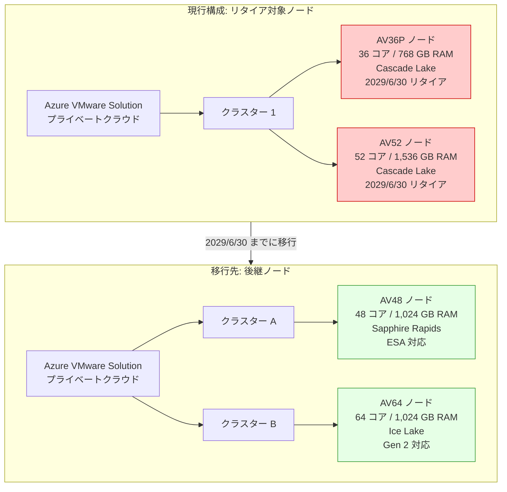

# Azure VMware Solution: AV36P および AV52 ノードのリタイア

**リリース日**: 2026-03-17

**サービス**: Azure VMware Solution

**機能**: AV36P および AV52 ノードのリタイア

**ステータス**: Retirement

[このアップデートのインフォグラフィックを見る](https://takech9203.github.io/azure-news-summary/20260317-vmware-solution-av36p-av52-retirement.html)

## 概要

Microsoft は、Azure VMware Solution で使用されている AV36P および AV52 ノードを 2029 年 6 月 30 日にリタイアすることを発表した。AV36P は Cascade Lake マイクロアーキテクチャを採用した 36 コアノード (768 GB RAM)、AV52 は同じく Cascade Lake の 52 コアノード (1,536 GB RAM) であり、いずれも Azure VMware Solution のプライベートクラウドを構成するベアメタルホストとして広く利用されてきた。

現在 AV36P または AV52 の予約インスタンス (RI) を使用しているユーザーに対して、既存の RI 条件はこのアナウンスの影響を受けないことが明示されている。ただし、リタイア日に向けて、現在の RI 有効期限の確認と、後継ノードへの移行計画の策定が推奨される。

後継ノードとしては、AV48 (Sapphire Rapids、48 コア、1,024 GB RAM) や AV64 (Ice Lake、64 コア、1,024 GB RAM) が利用可能である。特に AV64 は Azure VMware Solution Generation 2 にも対応しており、Azure Virtual Network への直接接続が可能な新しいネットワークアーキテクチャをサポートしている。

**リタイア前の状態**

- AV36P (36 コア / 768 GB RAM) および AV52 (52 コア / 1,536 GB RAM) でプライベートクラウドを運用中
- Cascade Lake 世代の CPU を使用しており、新しい世代のノードと比較してパフォーマンスや機能面で制約がある
- AV64 の拡張には AV36P または AV52 のベースクラスターが前提条件として必要であった

**リタイア後の改善**

- AV48 (Sapphire Rapids) や AV64 (Ice Lake) など、より新しい世代の CPU を採用したノードへの移行により、パフォーマンスが向上する
- AV64 では Azure VMware Solution Generation 2 の新しいネットワークアーキテクチャ (Azure Virtual Network への直接接続) が利用可能
- AV48 は vSAN Express Storage Architecture (ESA) に対応しており、ストレージの効率が向上する

## アーキテクチャ図

AV36P および AV52 ノードから、後継の AV48 または AV64 ノードへの移行パスを示している。移行先のノードはワークロードの要件に応じて選択する。

## サービスアップデートの詳細

### 主要な変更点

1. **AV36P ノードのリタイア**
   - 2029 年 6 月 30 日に AV36P ノードのサポートが終了する
   - Cascade Lake 世代 (Intel Xeon Gold 6240)、36 物理コア、768 GB RAM の構成
   - vSAN OSA アーキテクチャ、キャッシュ層 1.5 TB (Intel Cache)、容量層 19.20 TB (NVMe)

2. **AV52 ノードのリタイア**
   - 2029 年 6 月 30 日に AV52 ノードのサポートが終了する
   - Cascade Lake 世代 (Intel Xeon Platinum 8270)、52 物理コア、1,536 GB RAM の構成
   - vSAN OSA アーキテクチャ、キャッシュ層 1.5 TB (Intel Cache)、容量層 38.40 TB (NVMe)

3. **予約インスタンス (RI) への影響**
   - 現在の AV36P および AV52 の RI 条件はこのアナウンスの影響を受けない
   - RI の有効期限を確認し、リタイア日との整合性を検討することが推奨される

## 技術仕様

| 項目 | AV36P (リタイア対象) | AV52 (リタイア対象) | AV48 (後継候補) | AV64 (後継候補) |
|------|------|------|------|------|
| CPU | Intel Xeon Gold 6240 (Cascade Lake) | Intel Xeon Platinum 8270 (Cascade Lake) | Intel Xeon Gold 6442Y (Sapphire Rapids) | Intel Xeon Platinum 8370C (Ice Lake) |
| 物理コア数 | 36 (18 x 2) | 52 (26 x 2) | 48 (24 x 2) | 64 (32 x 2) |
| 論理コア数 | 72 | 104 | 96 | 128 |
| RAM | 768 GB | 1,536 GB | 1,024 GB | 1,024 GB |
| vSAN アーキテクチャ | OSA | OSA | ESA | OSA / ESA (Gen 2) |
| vSAN キャッシュ層 | 1.5 TB (Intel Cache) | 1.5 TB (Intel Cache) | N/A | 3.84 TB (NVMe) / N/A (ESA) |
| vSAN 容量層 | 19.20 TB (NVMe) | 38.40 TB (NVMe) | 25.6 TB (NVMe) | 15.36 TB / 19.25 TB (NVMe) |
| ネットワーク | 100 Gbps | 100 Gbps | 100 Gbps | 100 Gbps |
| リタイア日 | 2029/6/30 | 2029/6/30 | - | - |

## 推奨される対応

### 前提条件

1. 現在使用しているノードタイプと RI の有効期限を確認すること
2. ワークロードの CPU、メモリ、ストレージ要件を把握していること
3. 移行先のノードタイプを決定していること

### 移行先の選定ガイドライン

**AV36P からの移行の場合:**

- **AV48 への移行**: コア数が 36 から 48 に増加し、RAM が 768 GB から 1,024 GB に増加する。vSAN ESA に対応しており、ストレージ効率が向上する。CPU/RAM のバランスが類似しているため、移行しやすい
- **AV64 への移行**: コア数が 36 から 64 に大幅増加し、コンピューティング性能が向上する。Azure VMware Solution Generation 2 に対応

**AV52 からの移行の場合:**

- **AV64 への移行**: AV52 の 52 コアに対して 64 コアとなり、コンピューティング性能が向上する。ただし RAM は 1,536 GB から 1,024 GB に減少するため、メモリ集約型ワークロードの場合は注意が必要
- メモリ要件が高い場合は、AV64 のノード数を増やすか、Azure NetApp Files などの外部ストレージとの組み合わせを検討すること

### Azure Portal

1. Azure Portal で Azure VMware Solution のプライベートクラウドを開く
2. 現在のクラスター構成とノードタイプを確認する
3. 移行先のノードタイプで新しいクラスターを追加する
4. VMware HCX や vMotion を使用してワークロードを移行する
5. 古いクラスターのノードを削除する

## デメリット・制約事項

- AV52 (1,536 GB RAM) から AV64 (1,024 GB RAM) への移行では、ノード単位のメモリ容量が減少するため、メモリ集約型のワークロードでは追加ノードが必要になる可能性がある
- AV64 はベースクラスター (AV36、AV36P、AV48、または AV52) が前提条件として必要な場合がある (Generation 1 での拡張時)
- 異なる世代のノード間での vMotion では、Enhanced vMotion Compatibility (EVC) の互換性に注意が必要である。AV64 は Ice Lake EVC モードを使用するが、AV36P や AV52 は明示的な EVC モードが無効化されている
- リタイア日までの約 3 年間で段階的な移行計画の策定が推奨される

## 関連サービス・機能

- **Azure VMware Solution Generation 2**: AV64 SKU で利用可能な新しいアーキテクチャ。VMware vSphere ホストが Azure Virtual Network に直接接続される
- **VMware HCX**: ワークロードのモビリティ、マイグレーション、ネットワーク拡張サービスを提供。ノード移行時に活用可能
- **VMware vMotion**: 仮想マシンのライブマイグレーション機能。クラスター間のワークロード移行に使用
- **Azure NetApp Files / Azure Elastic SAN**: Azure VMware Solution のデータストア容量を vSAN 以外に拡張するためのストレージサービス

## 参考リンク

- [インフォグラフィック](https://takech9203.github.io/azure-news-summary/20260317-vmware-solution-av36p-av52-retirement.html)
- [公式アップデート情報](https://azure.microsoft.com/updates?id=557094)
- [Azure VMware Solution の概要 - Microsoft Learn](https://learn.microsoft.com/en-us/azure/azure-vmware/introduction)
- [プライベートクラウドとクラスターのアーキテクチャ - Microsoft Learn](https://learn.microsoft.com/en-us/azure/azure-vmware/architecture-private-clouds)

## まとめ

Azure VMware Solution の AV36P および AV52 ノードが 2029 年 6 月 30 日にリタイアとなる。リタイアまで約 3 年の猶予があるが、現在これらのノードを使用しているユーザーは、予約インスタンス (RI) の有効期限を確認し、後継ノードへの移行計画を早期に策定することが推奨される。

移行先としては、AV48 (Sapphire Rapids、48 コア、1,024 GB RAM、ESA 対応) や AV64 (Ice Lake、64 コア、1,024 GB RAM、Generation 2 対応) が候補となる。特に AV52 から AV64 への移行ではノード単位の RAM 容量が減少するため、ワークロードのメモリ要件を事前に評価する必要がある。異なる CPU 世代間での vMotion では EVC 互換性に注意が必要であり、移行手順のテストを事前に実施することが重要である。

---

**タグ**: #Azure #AzureVMwareSolution #VMware #Compute #AV36P #AV52 #AV48 #AV64 #Retirement #Migration
