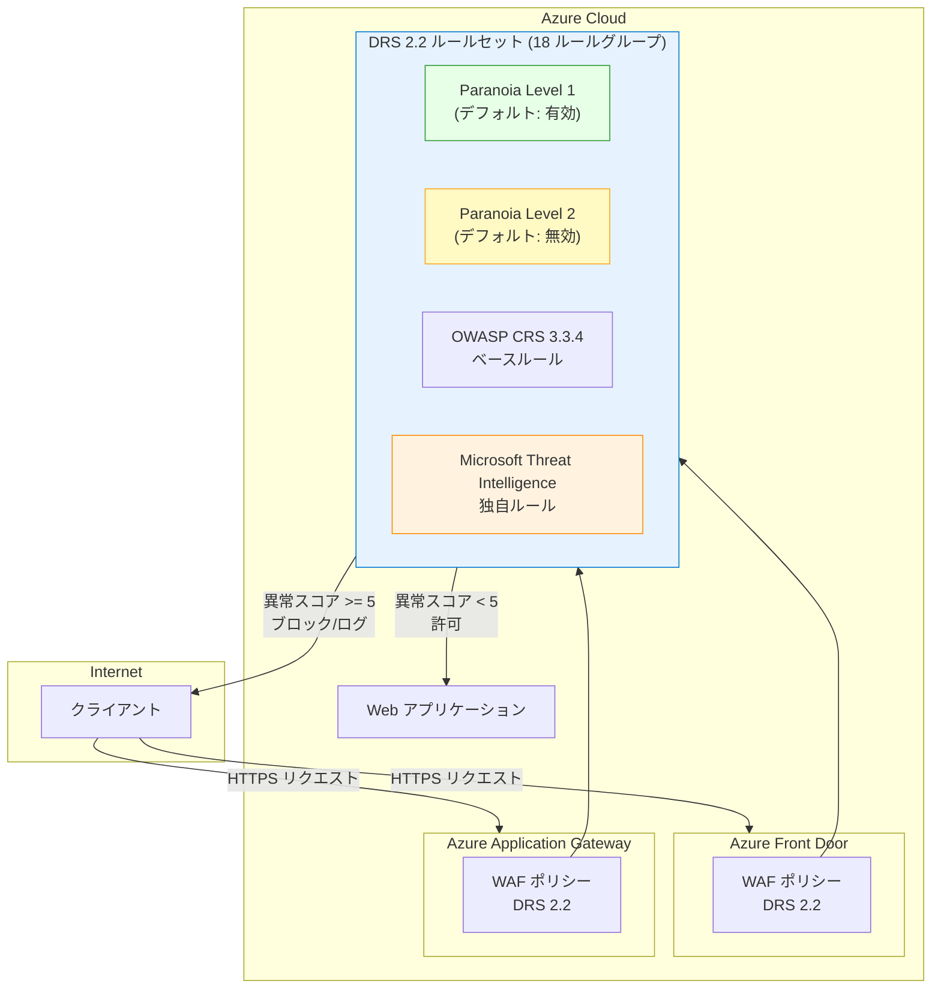

# Azure Web Application Firewall: Default Rule Set (DRS) 2.2 の一般提供とルールセットサポートポリシーの更新

**リリース日**: 2026-03-17

**サービス**: Azure Web Application Firewall (WAF)

**機能**: Default Rule Set (DRS) 2.2 の一般提供およびマネージドルールセットサポートポリシーの更新

**ステータス**: Launched (GA)

[このアップデートのインフォグラフィックを見る](https://takech9203.github.io/azure-news-summary/20260317-waf-drs-2-2-ruleset-policy.html)

## 概要

Microsoft は、Azure Application Gateway および Azure Front Door 上の Azure Web Application Firewall (WAF) において、Default Rule Set (DRS) 2.2 の一般提供 (GA) を発表した。これに伴い、マネージドルールセットのサポートポリシーも更新され、より明確で予測可能なサポートライフサイクルが提供される。

DRS 2.2 は、OWASP Core Rule Set (CRS) 3.3.4 をベースとしており、従来の DRS 2.1 (CRS 3.3.2 ベース) から大幅に強化されている。Microsoft Threat Intelligence チームによる独自の保護ルールの追加、誤検知の削減、Java インジェクションルールの拡張、ファイルアップロードチェックの導入など、多岐にわたる改善が含まれる。

また、DRS 2.2 では明示的な Paranoia Level (PL) の概念が導入され、PL1 (デフォルト) と PL2 の2段階でセキュリティレベルを調整できるようになった。これにより、セキュリティ要件に応じた柔軟なチューニングが可能となる。

**アップデート前の課題**

- 従来のルールセット (DRS 2.1 以前) では、CRS 3.3.2 ベースのため最新の攻撃パターンへの対応が限定的であった
- マネージドルールセットのサポートライフサイクルが不明確で、バージョンアップの計画が立てにくかった
- 誤検知が発生しやすく、チューニングの負担が大きかった

**アップデート後の改善**

- CRS 3.3.4 ベースの最新ルールセットにより、より広範な攻撃パターンに対応
- 明確なサポートライフサイクルにより、計画的なルールセット管理が可能に
- 誤検知の削減と Paranoia Level の導入により、柔軟かつ効率的なセキュリティチューニングが実現
- 新しい MS-ThreatIntel-XSS ルールグループの追加により、XSS 攻撃への保護が強化

## アーキテクチャ図



Azure Front Door および Application Gateway の両方で DRS 2.2 を WAF ポリシーとして適用する構成を示している。DRS 2.2 は OWASP CRS 3.3.4 ベースのルールと Microsoft Threat Intelligence の独自ルールで構成され、異常スコアリングに基づいてリクエストの許可/ブロックを判定する。

## サービスアップデートの詳細

### 主要機能

1. **DRS 2.2 の一般提供 (GA)**
   - Azure Application Gateway および Azure Front Door の両方で利用可能
   - OWASP CRS 3.3.4 をベースとした最新のルールセット
   - 18 のルールグループで構成され、広範な脅威カテゴリに対応

2. **新しい MS-ThreatIntel-XSS ルールグループ**
   - DRS 2.1 にはなかった XSS 攻撃に特化した Microsoft Threat Intelligence ルールグループが追加
   - ルール ID 99032001 および 99032002 を含む

3. **Paranoia Level の明示的サポート**
   - PL1 (デフォルト): 基本的なセキュリティ保護。誤検知が最小限
   - PL2 (デフォルトでは無効): より積極的な検出。チューニングが必要
   - Paranoia Level 3 および 4 は現在 Azure WAF では未サポート

4. **Java インジェクションルールの拡張**
   - Java 固有の攻撃に対する検出ルールが拡充

5. **ファイルアップロードチェックの導入**
   - 初期セットのファイルアップロード保護ルールが追加

6. **マネージドルールセットサポートポリシーの更新**
   - ルールセットバージョンのサポートライフサイクルがより明確に定義
   - 予測可能なサポート期間により、計画的なバージョンアップが可能に

## 技術仕様

| 項目 | 詳細 |
|------|------|
| ルールセットバージョン | DRS 2.2 |
| ベース | OWASP CRS 3.3.4 |
| ルールグループ数 | 18 |
| 対応プラットフォーム | Azure Application Gateway, Azure Front Door |
| 異常スコアリング | 有効 (DRS 2.0 以降) |
| ブロック閾値 | 異常スコア 5 以上 |
| Paranoia Level | PL1 (デフォルト), PL2 (手動有効化) |
| 動作モード | Detection (検出), Prevention (防止) |
| リクエストボディサイズ上限 | 2 MB |
| ファイルアップロード上限 | 4 GB |
| 前バージョン (DRS 2.1) ベース | OWASP CRS 3.3.2 |

### DRS 2.2 ルールグループ一覧

| ルールグループ | 説明 |
|------|------|
| General | 一般的な保護ルール |
| METHOD-ENFORCEMENT | HTTP メソッドの制限 (PUT, PATCH) |
| PROTOCOL-ENFORCEMENT | プロトコルおよびエンコーディングの問題からの保護 |
| PROTOCOL-ATTACK | ヘッダーインジェクション、リクエストスマグリング、レスポンス分割からの保護 |
| LFI | ローカルファイルインクルージョン攻撃からの保護 |
| RFI | リモートファイルインクルージョン攻撃からの保護 |
| RCE | リモートコード実行攻撃からの保護 |
| PHP | PHP インジェクション攻撃からの保護 |
| NODEJS | Node.js 攻撃からの保護 |
| XSS | クロスサイトスクリプティング攻撃からの保護 |
| SQLI | SQL インジェクション攻撃からの保護 |
| SESSION-FIXATION | セッション固定攻撃からの保護 |
| SESSION-JAVA | Java 攻撃からの保護 |
| MS-ThreatIntel-WebShells | Web シェル攻撃からの保護 |
| MS-ThreatIntel-AppSec | アプリケーションセキュリティ攻撃からの保護 |
| MS-ThreatIntel-SQLI | SQL インジェクション攻撃からの保護 (Microsoft 独自) |
| MS-ThreatIntel-CVEs | 既知の CVE 脆弱性からの保護 |
| MS-ThreatIntel-XSS | XSS 攻撃からの保護 (Microsoft 独自、DRS 2.2 で新規追加) |

### 異常スコアリング

| ルール重大度 | 異常スコア加算値 |
|------|------|
| Critical | 5 |
| Error | 4 |
| Warning | 3 |
| Notice | 2 |

## 設定方法

### 前提条件

1. Azure Application Gateway (WAF v2 SKU) または Azure Front Door Premium が構成済みであること
2. WAF ポリシーが作成済みであること
3. ルールセットバージョン変更時は、既存のルールオーバーライドとエクスクルージョンの移行計画があること

### ルールセットバージョンの変更に関する注意事項

Azure Portal でルールセットバージョンを変更すると、既存のカスタマイズ (ルール状態、ルールアクション、ルールレベルのエクスクルージョン) がデフォルトにリセットされる。既存のカスタマイズを保持するには、PowerShell、CLI、REST API、またはテンプレートを使用してバージョン変更を行うことが推奨される。

### Azure CLI (Application Gateway)

```bash
# WAF ポリシーのマネージドルールセットを DRS 2.2 に更新する
az network application-gateway waf-policy managed-rule rule-set update \
    --policy-name <WAF_POLICY_NAME> \
    --resource-group <RESOURCE_GROUP> \
    --type Microsoft_DefaultRuleSet \
    --version 2.2
```

### Azure CLI (Front Door)

```bash
# Front Door WAF ポリシーのマネージドルールセットを DRS 2.2 に更新する
az network front-door waf-policy managed-rule-definition list
```

### Azure Portal

1. Azure Portal で WAF ポリシーを開く
2. 「マネージドルール」セクションに移動する
3. ルールセットバージョンとして DRS 2.2 を選択する
4. 必要に応じて個別のルールやルールグループのアクションをカスタマイズする
5. Detection モードでテストした後、Prevention モードに切り替える

## メリット

### ビジネス面

- 明確なサポートライフサイクルにより、セキュリティ対策の計画と予算策定が容易になる
- 最新の脅威インテリジェンスに基づく保護により、ビジネスリスクを低減できる
- 誤検知の削減により、正当なユーザートラフィックへの影響を最小化できる

### 技術面

- OWASP CRS 3.3.4 ベースにより、最新の攻撃シグネチャに対応
- Paranoia Level の導入により、セキュリティレベルを段階的に調整可能
- Microsoft Threat Intelligence による独自ルールが Spring4Shell、Log4j、Apache Struts などの高プロファイル CVE に対する保護を提供
- URL デコード以外の変換もサポートする改善された WAF エンジンを使用

## デメリット・制約事項

- Azure Portal からのルールセットバージョン変更時に既存のカスタマイズがリセットされるため、CLI/PowerShell/テンプレートの使用が推奨される
- Paranoia Level 3 および 4 は現在 Azure WAF では未サポート
- PL2 ルールを有効化する場合、誤検知のチューニングが必要になる
- ルールセットアップグレード時に、テスト環境での検証が必須となるため運用負荷が発生する
- DRS 2.1 は Azure Front Door Premium でのみ利用可能 (DRS 2.2 も同様の制約がある可能性がある)

## ユースケース

### ユースケース 1: DRS 2.1 からのアップグレード

**シナリオ**: 既に DRS 2.1 を使用している Web アプリケーションで、最新の脅威保護を適用したい場合

**実装例**:

```bash
# 現在のルールセットバージョンを確認する
az network application-gateway waf-policy managed-rule rule-set list \
    --policy-name <WAF_POLICY_NAME> \
    --resource-group <RESOURCE_GROUP>

# DRS 2.2 にアップグレードする (既存のオーバーライドを保持)
az network application-gateway waf-policy managed-rule rule-set update \
    --policy-name <WAF_POLICY_NAME> \
    --resource-group <RESOURCE_GROUP> \
    --type Microsoft_DefaultRuleSet \
    --version 2.2
```

**効果**: CRS 3.3.4 ベースの最新ルール、新規 MS-ThreatIntel-XSS ルールグループ、改善された誤検知率により、より精度の高い Web アプリケーション保護が実現される。

### ユースケース 2: 高セキュリティ要件のアプリケーション

**シナリオ**: 金融系や医療系など、高度なセキュリティ要件がある Web アプリケーションで、PL2 を有効化してより積極的な脅威検出を行いたい場合

**効果**: PL2 ルールの有効化により、PL1 では検出されない攻撃パターンも捕捉可能となる。ただし、誤検知のチューニングが必要となるため、まず Detection モードで動作を確認し、エクスクルージョンを設定した上で Prevention モードに移行することが推奨される。

## 関連サービス・機能

- **Azure Application Gateway**: リージョナルな L7 ロードバランサー。WAF v2 SKU で DRS 2.2 をサポート
- **Azure Front Door**: グローバル L7 ロードバランサー。Premium SKU で DRS 2.2 をサポート
- **Azure Web Application Firewall (WAF)**: Application Gateway および Front Door 上で動作する Web アプリケーションファイアウォール
- **Microsoft Threat Intelligence**: DRS 2.2 の独自ルール (MS-ThreatIntel-*) の基盤となる脅威インテリジェンス
- **Microsoft Sentinel**: WAF ログの取り込みと分析のための SIEM サービス

## 参考リンク

- [インフォグラフィック](https://takech9203.github.io/azure-news-summary/20260317-waf-drs-2-2-ruleset-policy.html)
- [公式アップデート情報](https://azure.microsoft.com/updates?id=558016)
- [Application Gateway WAF CRS ルールグループとルール - Microsoft Learn](https://learn.microsoft.com/en-us/azure/web-application-firewall/ag/application-gateway-crs-rulegroups-rules)
- [Azure Front Door WAF DRS ルールグループとルール - Microsoft Learn](https://learn.microsoft.com/en-us/azure/web-application-firewall/afds/waf-front-door-drs)
- [WAF on Application Gateway のベストプラクティス - Microsoft Learn](https://learn.microsoft.com/en-us/azure/web-application-firewall/ag/best-practices)
- [Azure WAF エンジン - Microsoft Learn](https://learn.microsoft.com/en-us/azure/web-application-firewall/ag/waf-engine)

## まとめ

Azure Web Application Firewall の Default Rule Set (DRS) 2.2 が Azure Application Gateway および Azure Front Door で一般提供 (GA) となった。DRS 2.2 は OWASP CRS 3.3.4 をベースとし、18 のルールグループ、Paranoia Level のサポート、新規 MS-ThreatIntel-XSS ルールグループ、Java インジェクションルールの拡張、ファイルアップロードチェックの導入など、多数の改善が含まれる。

併せて、マネージドルールセットのサポートポリシーが更新され、より明確で予測可能なサポートライフサイクルが提供されることとなった。現在 DRS 2.1 以前のバージョンを使用している場合は、DRS 2.2 へのアップグレードが推奨される。アップグレード時は、既存のルールオーバーライドとエクスクルージョンを保持するために、Azure CLI、PowerShell、REST API、またはテンプレートの使用が推奨される。テスト環境での検証を経て、本番環境へのデプロイを進めることが重要である。

---

**タグ**: #Azure #WAF #WebApplicationFirewall #ApplicationGateway #AzureFrontDoor #Networking #Security #DRS #OWASP #ThreatIntelligence
