# Azure Red Hat OpenShift: Managed Identity and Workload Identity

**リリース日**: 2026-03-18

**サービス**: Azure Red Hat OpenShift

**機能**: Managed Identity and Workload Identity

**ステータス**: Launched (GA)

[このアップデートのインフォグラフィックを見る](https://takech9203.github.io/azure-news-summary/20260318-aro-managed-workload-identity.html)

## 概要

Azure Red Hat OpenShift (ARO) において、マネージド ID およびワークロード ID が一般提供 (GA) となった。これにより、有効期限のあるサービスプリンシパルの資格情報を使用せずに、OpenShift クラスターおよびアプリケーションを Azure 上で運用できるようになる。

従来、ARO クラスターは Azure API と対話するために Microsoft Entra サービスプリンシパルを必要としていた。サービスプリンシパルはデフォルトで 1 年で期限切れとなるため、資格情報のローテーション管理が運用上の負担となっていた。今回のアップデートにより、マネージド ID を使用したクラスターレベルの認証と、ワークロード ID を使用したアプリケーションレベルの認証が利用可能となり、Azure の ID 管理のベストプラクティスに沿った運用が実現される。

**アップデート前の課題**

- ARO クラスターのデプロイおよび運用にサービスプリンシパルの資格情報 (クライアント ID とシークレット) が必要であった
- サービスプリンシパルはデフォルトで 1 年で期限切れとなり、期限切れ前に資格情報をローテーションする運用管理が必要であった
- 長期間有効な資格情報がセキュリティリスクとなり、漏洩した場合の影響範囲が大きかった
- クラスター上のアプリケーションが Azure リソースにアクセスする際にも、個別にサービスプリンシパルを管理する必要があった

**アップデート後の改善**

- マネージド ID により、クラスターレベルでサービスプリンシパルの資格情報が不要になった
- ワークロード ID により、アプリケーション (Pod) レベルで OIDC フェデレーションを通じた短期トークンベースの認証が可能になった
- 資格情報のローテーション管理が不要になり、運用負荷が軽減された
- Azure の他のサービス (AKS など) と同様の ID 管理モデルに統一され、セキュリティポスチャが向上した

## アーキテクチャ図

```mermaid
flowchart TD
    subgraph Azure["Azure Cloud"]
        subgraph ARO["Azure Red Hat OpenShift Cluster"]
            subgraph CP["Control Plane"]
                MI["Managed Identity<br/>クラスター認証"]
                OIDC["OIDC Issuer<br/>トークン発行"]
            end
            subgraph WN["Worker Nodes"]
                Pod["Application Pod"]
                SA["Kubernetes<br/>Service Account"]
                SAT["Projected Service<br/>Account Token"]
            end
        end

        EntraID["Microsoft Entra ID<br/>トークン検証・発行"]
        FIC["Federated Identity<br/>Credential"]

        subgraph Resources["Azure Resources"]
            KV["Azure Key Vault"]
            Storage["Azure Storage"]
            ACR["Azure Container<br/>Registry"]
            LB["Azure Load<br/>Balancer"]
        end
    end

    MI -->|"クラスターリソースの<br/>管理操作"| LB
    MI -->|"コンテナイメージの<br/>プル"| ACR

    Pod --> SA
    SA --> SAT
    SAT -->|"1. Service Account<br/>Token を提示"| EntraID
    OIDC -->|"2. 公開鍵で<br/>トークンを検証"| EntraID
    FIC -->|"3. フェデレーション<br/>信頼関係"| EntraID
    EntraID -->|"4. Microsoft Entra<br/>トークンを発行"| Pod

    Pod -->|"5. Entra トークンで<br/>Azure リソースにアクセス"| KV
    Pod -->|"5. Entra トークンで<br/>Azure リソースにアクセス"| Storage
```



この図は、ARO クラスターにおけるマネージド ID とワークロード ID の認証フローを示している。クラスターレベルではマネージド ID が Azure リソース (Load Balancer、Container Registry など) の管理に使用され、アプリケーションレベルではワークロード ID が OIDC フェデレーションを通じて Kubernetes Service Account Token を Microsoft Entra トークンに交換し、Azure リソースへの安全なアクセスを実現する。

## サービスアップデートの詳細

### 主要機能

1. **クラスターレベルのマネージド ID サポート**
   - ARO クラスターの作成時にマネージド ID を使用できるようになり、サービスプリンシパルの資格情報が不要になった
   - Azure Load Balancer、Azure Container Registry などのクラスターインフラストラクチャリソースへのアクセスにマネージド ID が使用される
   - 資格情報の自動管理により、ローテーション作業が不要になった

2. **ワークロード ID によるアプリケーション認証**
   - OpenShift 上のアプリケーション (Pod) が、OIDC フェデレーションを通じて Microsoft Entra ID から短期トークンを取得できる
   - Kubernetes Service Account と Microsoft Entra ID のフェデレーション信頼関係を構成することで、Pod が Azure リソースに安全にアクセスできる
   - Azure Identity クライアントライブラリ (DefaultAzureCredential) をそのまま使用可能

3. **サービスプリンシパルからの移行パス**
   - 既存のサービスプリンシパルベースの ARO クラスターからマネージド ID ベースのクラスターへの移行が可能

## 技術仕様

| 項目 | 詳細 |
|------|------|
| 機能名 | Managed Identity and Workload Identity for Azure Red Hat OpenShift |
| ステータス | 一般提供 (GA) |
| マネージド ID | クラスターレベルの Azure リソース管理に使用 |
| ワークロード ID | アプリケーション (Pod) レベルの Azure リソースアクセスに使用 |
| 認証プロトコル | OpenID Connect (OIDC) フェデレーション |
| トークン発行 | Microsoft Entra ID |
| 対応クライアントライブラリ | Azure Identity SDK (.NET 1.9.0+, Go 1.3.0+, Java 1.9.0+, Node.js 3.2.0+, Python 1.13.0+) |
| フェデレーション ID 資格情報の上限 | マネージド ID あたり最大 20 個 |

## メリット

### ビジネス面

- **運用コストの削減**: サービスプリンシパルの資格情報ローテーション管理が不要になり、運用チームの負荷が軽減される
- **セキュリティインシデントリスクの低減**: 長期間有効な資格情報が不要になることで、資格情報漏洩による影響を最小化できる
- **コンプライアンス対応の強化**: 資格情報レスの認証モデルにより、セキュリティ監査やコンプライアンス要件への対応が容易になる

### 技術面

- **資格情報管理の排除**: サービスプリンシパルのシークレットを管理・保存・ローテーションする必要がなくなる
- **短期トークンベースの認証**: ワークロード ID は短期間で失効するトークンを使用するため、トークン漏洩時のリスクが限定的
- **Azure エコシステムとの統一**: AKS と同様のワークロード ID モデルを採用しており、Azure 全体で一貫した ID 管理が可能
- **既存コードの互換性**: Azure Identity SDK の DefaultAzureCredential をそのまま使用できるため、アプリケーションコードの変更が最小限

## デメリット・制約事項

- フェデレーション ID 資格情報はマネージド ID あたり最大 20 個に制限されている
- フェデレーション ID 資格情報の追加後、反映まで数秒の遅延が発生する場合がある
- 既存のサービスプリンシパルベースのクラスターからの移行には計画的な対応が必要

## ユースケース

### ユースケース 1: Azure Key Vault からのシークレット取得

**シナリオ**: ARO クラスター上のアプリケーションが、Azure Key Vault に格納されたデータベース接続文字列や API キーを安全に取得したい。

**実装例**:

```python
from azure.keyvault.secrets import SecretClient
from azure.identity import DefaultAzureCredential

# ワークロード ID により自動的に認証される
credential = DefaultAzureCredential()
client = SecretClient(
    vault_url="https://my-keyvault.vault.azure.net/",
    credential=credential
)
secret = client.get_secret("database-connection-string")
```

**効果**: サービスプリンシパルのシークレットをアプリケーションに埋め込む必要がなくなり、Key Vault へのアクセスがワークロード ID を通じて安全に行われる。

### ユースケース 2: Azure Storage への安全なデータアクセス

**シナリオ**: ARO クラスター上のデータ処理アプリケーションが、Azure Blob Storage のデータを読み書きする必要がある。

**実装例**:

```python
from azure.storage.blob import BlobServiceClient
from azure.identity import DefaultAzureCredential

credential = DefaultAzureCredential()
blob_service_client = BlobServiceClient(
    account_url="https://mystorageaccount.blob.core.windows.net",
    credential=credential
)
```

**効果**: ストレージアカウントキーやサービスプリンシパルの資格情報を使用せず、ワークロード ID による RBAC ベースのアクセス制御が実現される。

## 関連サービス・機能

- **Azure Kubernetes Service (AKS)**: ARO と同様にワークロード ID をサポートしており、同じ認証モデルを採用している
- **Microsoft Entra ID**: マネージド ID およびワークロード ID のトークン発行と検証を担うアイデンティティプラットフォーム
- **Azure Key Vault**: ワークロード ID を使用したシークレット・証明書・暗号鍵の安全な取得先として頻繁に使用される
- **Azure Container Registry**: マネージド ID を使用したコンテナイメージのプルに使用される

## 参考リンク

- [インフォグラフィック](https://takech9203.github.io/azure-news-summary/20260318-aro-managed-workload-identity.html)
- [公式アップデート情報](https://azure.microsoft.com/updates?id=557917)
- [Microsoft Learn - Azure Red Hat OpenShift ドキュメント](https://learn.microsoft.com/azure/openshift/)
- [Microsoft Learn - サービスプリンシパルの作成](https://learn.microsoft.com/azure/openshift/howto-create-service-principal)
- [Microsoft Learn - Microsoft Entra Workload ID 概要 (AKS)](https://learn.microsoft.com/azure/aks/workload-identity-overview)

## まとめ

Azure Red Hat OpenShift におけるマネージド ID およびワークロード ID の一般提供は、ARO クラスターのセキュリティと運用性を大幅に向上させるアップデートである。サービスプリンシパルの資格情報管理という運用上の負担を排除し、短期トークンベースの認証モデルへの移行を可能にする。

Solutions Architect への推奨アクション:

1. **新規クラスターでのマネージド ID 採用**: 新たに ARO クラスターをデプロイする際は、サービスプリンシパルではなくマネージド ID を使用する
2. **既存クラスターの移行計画**: サービスプリンシパルベースの既存クラスターについて、マネージド ID への移行計画を策定する
3. **ワークロード ID の適用**: クラスター上のアプリケーションが Azure リソースにアクセスする箇所を洗い出し、ワークロード ID の導入を検討する
4. **Azure Identity SDK の確認**: アプリケーションが使用している Azure Identity クライアントライブラリのバージョンがワークロード ID に対応しているか確認する

特にセキュリティポリシーとして長期間有効な資格情報の使用を制限している組織にとって、本アップデートは ARO 採用の障壁を大きく下げるものである。

---

**タグ**: #AzureRedHatOpenShift #ManagedIdentity #WorkloadIdentity #Containers #Security #GA #MicrosoftEntraID #OIDC #CredentialLess
