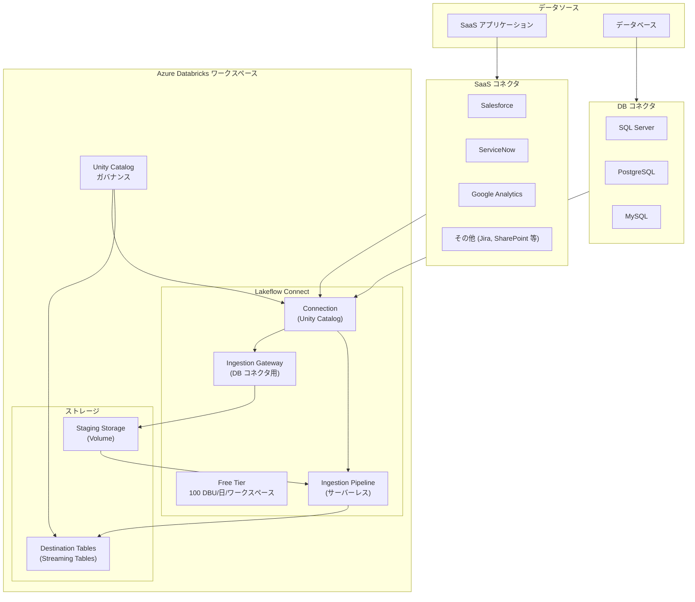

# Azure Databricks: Lakeflow Connect Free Tier の一般提供開始

**リリース日**: 2026-03-18

**サービス**: Azure Databricks

**機能**: Lakeflow Connect Free Tier

**ステータス**: Launched (GA)

[このアップデートのインフォグラフィックを見る](https://takech9203.github.io/azure-news-summary/20260318-databricks-lakeflow-connect-free-tier.html)

## 概要

Azure Databricks において、Lakeflow Connect Free Tier が一般提供 (GA) として利用可能になった。Lakeflow Connect は、SaaS アプリケーションやデータベースからのデータインジェストを行うフルマネージドコネクタサービスであり、今回の Free Tier により、各ワークスペースで 1 日あたり 100 DBU (Databricks Unit) が無料で提供される。

この無料枠により、1 ワークスペースあたり 1 日約 1 億レコードのデータインジェストが可能となる。Lakeflow Connect は Unity Catalog によるガバナンスのもと、サーバーレスコンピュートと Lakeflow Spark Declarative Pipelines を基盤として動作し、効率的なインクリメンタルな読み取りと書き込みにより、高速でスケーラブルかつコスト効率の高いデータインジェストを実現する。

**アップデート前の課題**

- SaaS アプリケーションやデータベースからのデータインジェストには、パイプラインの構築と運用に DBU コストが発生し、特に小規模な検証や PoC では費用対効果が課題だった
- データインジェストの評価や試用において、事前にコストを見積もる必要があり、導入の障壁となっていた

**アップデート後の改善**

- 各ワークスペースで 1 日あたり 100 DBU が無料で利用可能となり、追加コストなしでデータインジェストを開始できる
- 約 1 億レコード/日の無料インジェスト容量により、多くのユースケースで無料枠内での運用が可能
- 本番環境と同じフルマネージドの Lakeflow Connect 機能をコストの懸念なく評価できる

## アーキテクチャ図

Lakeflow Connect は SaaS アプリケーションおよびデータベースからデータを取り込むフルマネージドサービスである。SaaS コネクタは API 経由で直接データを取得し、データベースコネクタは Ingestion Gateway を経由して変更データをキャプチャする。いずれもサーバーレスの Ingestion Pipeline により Streaming Tables に書き込まれ、Unity Catalog によるガバナンスが適用される。

## サービスアップデートの詳細

### 主要機能

1. **Free Tier (無料枠)**
   - 各ワークスペースに 1 日あたり 100 DBU を無料提供
   - SaaS アプリケーションおよびデータベースからのインジェストに適用
   - 約 1 億レコード/日のデータインジェスト容量に相当

2. **SaaS コネクタ**
   - Salesforce、ServiceNow、Google Analytics、Workday Reports が GA (一般提供)
   - Jira、SharePoint、Confluence、HubSpot、Zendesk Support 等が Beta
   - Dynamics 365、MySQL、PostgreSQL が Public Preview
   - サーバーレスコンピュートで動作し、API 経由でデータを取得

3. **データベースコネクタ**
   - SQL Server が GA、MySQL および PostgreSQL が Public Preview
   - Ingestion Gateway による継続的な変更データキャプチャ (CDC)
   - Staging Storage によるデータの一時保管と柔軟なスケジュール実行

4. **インクリメンタルインジェスト**
   - 初回は全データを取得し、以降は変更分のみを効率的にインジェスト
   - 変更トラッキングや CDC など、データソースに応じた最適な方式を自動選択

5. **Unity Catalog 統合**
   - Connection オブジェクトによる認証情報の安全な管理
   - Destination Tables への自動ガバナンス適用
   - `system.billing.usage` テーブルによるコスト監視

6. **自動障害復旧**
   - コネクタ障害時の自動リトライ (指数バックオフ)
   - カーソル位置の記録による中断箇所からの再開

## 技術仕様

| 項目 | 詳細 |
|------|------|
| Free Tier 容量 | 100 DBU / ワークスペース / 日 |
| 推定インジェスト量 | 約 1 億レコード / ワークスペース / 日 |
| コンピュート | サーバーレス (Ingestion Pipeline)、クラシック (Ingestion Gateway) |
| パイプラインあたりの最大テーブル数 | 250 (コネクタにより異なる) |
| スキーマ進化 | 新規/削除カラム: 対応、データ型変更: 非対応 (コネクタにより異なる) |
| ネットワーキング | Private Link、VNet ピアリング、ExpressRoute 対応 |
| デプロイ方式 | UI、API、Declarative Automation Bundles (CLI) |
| Staging データ保持期間 | 30 日 (自動パージ) |

## メリット

### ビジネス面

- 無料枠によりコストリスクなくデータインジェストの評価・検証を開始できる
- 1 日あたり約 1 億レコードの無料インジェスト容量は、多くの中小規模のデータソースをカバー可能
- フルマネージドサービスにより、データエンジニアリングチームの運用負荷を大幅に削減

### 技術面

- サーバーレスコンピュートにより、インフラストラクチャの管理が不要
- インクリメンタルインジェストにより DBU 消費を最適化し、Free Tier 内での運用を最大化
- Unity Catalog 統合により、インジェストされたデータに自動的にガバナンスが適用される
- 18 種類以上のマネージドコネクタにより、主要な SaaS アプリケーションやデータベースへの接続をコードレスで実現

## デメリット・制約事項

- Free Tier は 1 ワークスペースあたり 1 日 100 DBU に制限されており、大量データのインジェストには追加コストが必要
- 一部のコネクタは Beta またはPublic Preview 段階であり、本番利用には注意が必要
- データベースコネクタの Ingestion Gateway はクラシックコンピュートで動作し、サーバーレスではない
- スキーマ進化においてデータ型変更は多くのコネクタで非対応
- 外部サービスの変更やメンテナンスにより、コネクタの動作が影響を受ける可能性がある

## ユースケース

### ユースケース 1: SaaS データの統合分析基盤構築

**シナリオ**: 営業部門が使用する Salesforce のデータを Azure Databricks に無料でインジェストし、他のデータソースと組み合わせた統合分析ダッシュボードを構築する。

**効果**: Free Tier の範囲内で Salesforce データのインジェストパイプラインを構築・運用でき、追加コストなしで営業データの分析基盤を立ち上げ可能。

### ユースケース 2: データベース移行の事前検証

**シナリオ**: オンプレミスの SQL Server データベースから Azure Databricks への移行を検討しており、Free Tier を利用してデータインジェストの性能やデータ品質を事前に検証する。

**効果**: 本番移行前にコストの懸念なくインジェストパイプラインの動作を確認でき、移行計画の精度を向上させることが可能。

### ユースケース 3: 複数 SaaS アプリのデータレイクハウス統合

**シナリオ**: Google Analytics、ServiceNow、Jira など複数の SaaS アプリケーションのデータを Lakehouse に統合し、部門横断的な分析基盤を構築する。

**効果**: 各 SaaS のデータをマネージドコネクタで自動取り込みし、Unity Catalog による統合ガバナンスのもとで分析可能。小規模であれば Free Tier 内で複数コネクタを同時運用可能。

## 料金

Lakeflow Connect の課金は DBU (Databricks Unit) ベースで行われ、`system.billing.usage` テーブルの `billing_origin_product = 'LAKEFLOW_CONNECT'` で使用量を追跡できる。

| 項目 | 詳細 |
|------|------|
| Free Tier | 100 DBU / ワークスペース / 日 |
| 課金単位 | DBU (使用時間はミリ秒単位で記録) |
| 課金対象 | パイプライン処理 (COMPUTE_TIME) |

無料枠: 各ワークスペースで 1 日あたり 100 DBU が SaaS アプリケーションおよびデータベースからのインジェスト用に無料提供される。Free Tier を超過した場合は通常の DBU 料金が適用される。詳細な DBU 単価は [Azure Databricks 料金ページ](https://azure.microsoft.com/en-us/pricing/details/databricks/) を参照。

## 関連サービス・機能

- **Lakeflow Spark Declarative Pipelines**: Lakeflow Connect のインジェストパイプラインの基盤として使用されるデータパイプラインフレームワーク
- **Unity Catalog**: Connection オブジェクトや Destination Tables のガバナンスを提供するメタデータ管理サービス
- **Azure Databricks Lakebase**: Databricks のデータレイクハウスストレージ基盤。インジェストされたデータの格納先
- **Databricks Workflows**: インジェストパイプラインのスケジュール実行とオーケストレーションを管理

## 参考リンク

- [インフォグラフィック](https://takech9203.github.io/azure-news-summary/20260318-databricks-lakeflow-connect-free-tier.html)
- [公式アップデート情報](https://azure.microsoft.com/updates?id=558810)
- [Microsoft Learn ドキュメント - Lakeflow Connect 概要](https://learn.microsoft.com/en-us/azure/databricks/ingestion/lakeflow-connect/)
- [Microsoft Learn ドキュメント - コスト監視](https://learn.microsoft.com/en-us/azure/databricks/ingestion/lakeflow-connect/monitor-costs)
- [料金ページ](https://azure.microsoft.com/en-us/pricing/details/databricks/)

## まとめ

Lakeflow Connect Free Tier の一般提供により、Azure Databricks ユーザーは各ワークスペースで 1 日あたり 100 DBU (約 1 億レコード相当) を無料でデータインジェストに利用できるようになった。Salesforce、SQL Server、Google Analytics など 18 種類以上のマネージドコネクタを通じて、SaaS アプリケーションやデータベースからのデータ取り込みを追加コストなしで開始できる。

Solutions Architect としては、まず Free Tier を活用してインジェストパイプラインの構築と評価を行い、Unity Catalog によるガバナンス構成を含めたデータ統合基盤の設計を進めることを推奨する。特に複数の SaaS データソースを持つ組織にとって、コストの懸念なくデータレイクハウスへの統合を開始できる点は大きなメリットである。

---

**タグ**: #AzureDatabricks #LakeflowConnect #FreeTier #DataIngestion #GA #Analytics #AI #MachineLearning
