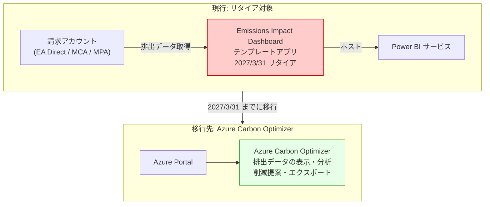

# Emissions Impact Dashboard for Azure: リタイアのお知らせ

**リリース日**: 2026-03-18

**サービス**: Power BI / Azure Carbon Optimization

**機能**: Emissions Impact Dashboard for Azure のリタイア

**ステータス**: Retirement

[このアップデートのインフォグラフィックを見る](https://takech9203.github.io/azure-news-summary/20260318-emissions-dashboard-retirement.html)

## 概要

Microsoft は、Power BI でホストされている Emissions Impact Dashboard for Azure を 2027 年 3 月 31 日にリタイアすることを発表した。リタイア後はダッシュボードへのアクセスが不可能となり、テクニカルサポートも終了する。

Emissions Impact Dashboard for Azure は、Azure クラウドサービスの利用に伴う炭素排出量を可視化する Power BI テンプレートアプリである。Microsoft の炭素会計手法はスコープ 1、2、3 すべてをカバーしており、2018 年にスタンフォード大学により検証された手法に基づいている。EA Direct、MCA、MPA の請求アカウントを持つユーザーが利用可能であった。

代替ソリューションとして Azure Carbon Optimizer が推奨されている。Azure Carbon Optimizer は Azure ポータルにネイティブに統合されたカーボン最適化ソリューションであり、排出データの表示・分析、排出量の削減提案、データエクスポート機能を提供する。

**リタイアまでに必要なアクション**

- リタイア日 (2027 年 3 月 31 日) までに排出データをエクスポートして履歴レポートを保持すること
- 代替ソリューションとして Azure Carbon Optimizer への移行を検討すること

## アーキテクチャ図

Emissions Impact Dashboard (Power BI テンプレートアプリ) から Azure Carbon Optimizer (Azure ポータル統合) への移行パスを示している。

## サービスアップデートの詳細

### 主要な変更点

1. **Emissions Impact Dashboard for Azure のリタイア**
   - 2027 年 3 月 31 日にリタイアとなる
   - リタイア後はダッシュボードへのアクセスおよびテクニカルサポートが終了する
   - Power BI でホストされているテンプレートアプリが対象

2. **データエクスポートの推奨**
   - リタイア前に排出データをエクスポートして履歴レポートを保持することが強く推奨される

3. **代替ソリューション: Azure Carbon Optimizer**
   - Azure ポータルに統合されたカーボン最適化機能
   - 排出データの表示・分析、削減提案、データエクスポート機能を提供
   - Power BI Pro ライセンスが不要で、Azure ポータルから直接利用可能

## 技術仕様

| 項目 | Emissions Impact Dashboard (リタイア対象) | Azure Carbon Optimizer (代替) |
|------|------|------|
| ホスト環境 | Power BI サービス | Azure Portal |
| 必要ライセンス | Power BI Pro | Azure サブスクリプション |
| 対応アカウント | EA Direct / MCA / MPA | Azure サブスクリプション |
| 炭素排出スコープ | スコープ 1、2、3 | 排出データの表示・分析 |
| データエクスポート | 手動 | エクスポート機能あり |
| リタイア日 | 2027/3/31 | - |

## 推奨される対応

### 前提条件

1. 現在 Emissions Impact Dashboard を利用しているかどうかを確認すること
2. 履歴データの保持要件を確認すること

### データエクスポート手順

リタイア前に以下のデータエクスポートを実施する:

1. Power BI サービスで Emissions Impact Dashboard アプリを開く
2. 排出データをエクスポートして履歴レポートを保持する
3. エクスポートしたデータを安全な場所に保管する

### Azure Carbon Optimizer への移行

1. Azure Portal にアクセスする
2. 「Carbon optimization」を検索する
3. 排出データの表示・分析機能を確認する
4. 必要に応じてデータエクスポートを設定する

## デメリット・制約事項

- 2027 年 3 月 31 日以降、Emissions Impact Dashboard のデータにアクセスできなくなるため、事前のデータエクスポートが必須である
- 2024 年 2 月に排出データの計算手法が更新されており、過去のデータとの比較時には手法の変更を考慮する必要がある
- CSP (Cloud Solution Provider) 経由で Azure を購入している顧客は Emissions Impact Dashboard を直接利用できず、CSP パートナーと連携する必要があった

## 関連サービス・機能

- **Azure Carbon Optimizer**: Azure ポータルに統合されたカーボン最適化機能。Emissions Impact Dashboard の代替として推奨されている
- **Emissions Impact Dashboard for Microsoft 365**: Microsoft 365 向けの排出量ダッシュボード。本アナウンスは Azure 向けのみが対象
- **Microsoft Cloud for Sustainability**: Microsoft のサステナビリティ関連ソリューション群

## 参考リンク

- [インフォグラフィック](https://takech9203.github.io/azure-news-summary/20260318-emissions-dashboard-retirement.html)
- [公式アップデート情報](https://azure.microsoft.com/updates?id=558278)
- [Emissions Impact Dashboard for Azure - Microsoft Learn](https://learn.microsoft.com/en-us/power-bi/connect-data/service-connect-to-emissions-impact-dashboard)
- [Carbon optimization in Azure - Microsoft Learn](https://learn.microsoft.com/en-us/azure/carbon-optimization/)
- [Azure Carbon Optimization フィードバック](https://feedback.azure.com/d365community/forum/1694d59b-a692-ee11-be37-00224827362a)

## まとめ

Emissions Impact Dashboard for Azure が 2027 年 3 月 31 日にリタイアとなる。現在このダッシュボードを利用しているユーザーは、リタイア日までに排出データをエクスポートして履歴レポートを保持し、代替ソリューションである Azure Carbon Optimizer への移行を検討することが推奨される。Azure Carbon Optimizer は Azure ポータルにネイティブに統合されており、Power BI Pro ライセンスが不要で、排出データの表示・分析や削減提案などの機能を提供している。

---

**タグ**: #Azure #PowerBI #Sustainability #CarbonOptimization #EmissionsImpactDashboard #Retirement
