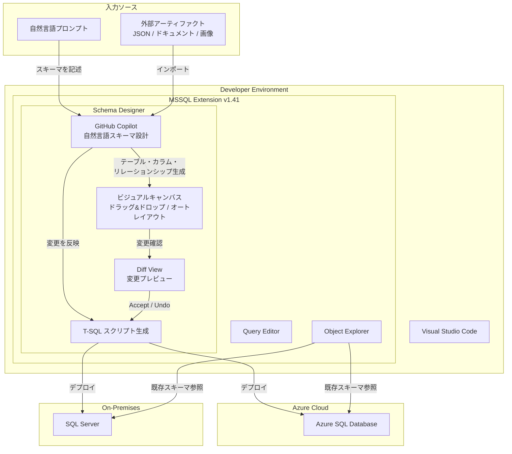

# Azure SQL Database: GitHub Copilot integration in Schema Designer for the MSSQL extension

**リリース日**: 2026-03-18

**サービス**: Azure SQL Database

**機能**: GitHub Copilot integration in Schema Designer for the MSSQL extension

**ステータス**: In preview

[このアップデートのインフォグラフィックを見る](https://takech9203.github.io/azure-news-summary/20260318-sql-copilot-schema-designer.html)

## 概要

Visual Studio Code 向け MSSQL 拡張機能 (v1.41) の Schema Designer に、GitHub Copilot との統合機能がパブリックプレビューとして導入された。これにより、ビジュアルスキーマデザイン体験に AI アシスタント機能が加わり、自然言語でデータベーススキーマを設計・変更できるようになった。

Schema Designer は従来からドラッグ&ドロップやオートレイアウト、T-SQL スクリプト生成といったビジュアルスキーマモデリング機能を提供していたが、今回の Copilot 統合により、自然言語プロンプトでテーブル、カラム、データ型、リレーションシップを自動生成する機能が追加された。変更はビジュアルダイアグラムと T-SQL スクリプトの両方にリアルタイムで反映される。

**アップデート前の課題**

- データベーススキーマの設計はビジュアルデザイナーでの手動操作や T-SQL の記述が必要であり、特に初期設計段階での作業効率に改善の余地があった
- 既存スキーマの変更には、テーブル定義やリレーションシップを個別に手動で修正する必要があった
- JSON ファイルやドキュメントなどの外部アーティファクトからスキーマを生成するには、手動でのマッピング作業が必要だった

**アップデート後の改善**

- 自然言語プロンプトでスキーマの新規作成・変更が可能になり、ラピッドプロトタイピングが容易になった
- 各変更に対して個別の Accept / Undo コントロールが提供され、AI 生成結果を細かく制御できる
- Diff View によりデプロイ前に保留中の変更をプレビューでき、schema.table / schema.column 形式で変更内容を明確に把握できる
- JSON ファイル、ドキュメント、画像などの外部アーティファクトをインポートし、対応するスキーマ要素を自動生成できる

## アーキテクチャ図

この図は、Visual Studio Code の MSSQL 拡張機能内で GitHub Copilot が自然言語や外部アーティファクトからスキーマ要素を生成し、ビジュアルキャンバスと T-SQL スクリプトに反映した後、Diff View で確認してデータベースにデプロイするワークフローを示している。

## サービスアップデートの詳細

### 主要機能

1. **自然言語によるスキーマ作成**
   - 会話的なプロンプトでテーブル、カラム、データ型、リレーションシップを記述すると、Copilot がスキーマ要素を自動生成する
   - 生成結果はビジュアルダイアグラムと T-SQL スクリプトの両方にリアルタイムで反映される

2. **スキーマの進化的変更**
   - 既存スキーマに対して、自然言語でカラムの追加、リネーム、データ型変更などを指示できる
   - 各変更に個別の Accept / Undo コントロールが付与され、きめ細かい制御が可能

3. **Diff View による変更レビュー**
   - データベースへのデプロイ前に保留中の変更をすべてプレビューできる
   - schema.table、schema.column 形式の修飾名により、変更対象が明確に表示される

4. **外部アーティファクトからのスキーマ生成**
   - JSON ファイル、ドキュメント、画像をデザイナーに取り込み、Copilot が対応するスキーマ要素を自動生成する
   - 既存のデータ構造定義からデータベーススキーマへの変換が容易になる

5. **バリデーションとガードレール**
   - 主キーの欠如、無効なデータ型、正規化に関する問題など、設計上の潜在的な問題を自動検出しフラグ付けする
   - 設計段階で問題を早期に発見できる

## 技術仕様

| 項目 | 詳細 |
|------|------|
| 機能名 | GitHub Copilot in Schema Designer |
| ステータス | パブリックプレビュー |
| 提供方法 | MSSQL extension for Visual Studio Code (v1.41) に統合 |
| 操作方法 | ビジュアルキャンバス上で自然言語プロンプトを入力 |
| 出力形式 | ビジュアルダイアグラム + T-SQL スクリプト |
| 対応プラットフォーム | Windows, macOS, Linux |
| 必須 VS Code バージョン | 1.98.0 以上 |

## 設定方法

### 前提条件

1. Visual Studio Code (1.98.0 以上) がインストールされていること
2. MSSQL 拡張機能 (SQL Server (mssql)) がバージョン 1.41 以上に更新されていること
3. GitHub Copilot 拡張機能がインストールされ、有効なサブスクリプションを持っていること
4. 対象データベースへの接続情報および適切な権限を保有していること

### Visual Studio Code

1. MSSQL 拡張機能を最新版 (v1.41 以上) に更新する
2. Object Explorer からデータベースに接続する
3. Schema Designer を開く
4. ビジュアルキャンバス上で GitHub Copilot に自然言語でスキーマの設計・変更を指示する
5. Diff View で変更内容を確認し、Accept / Undo で個別に制御する
6. 確定した変更を T-SQL スクリプトとしてデータベースにデプロイする

## メリット

### ビジネス面

- **データベース設計の迅速化**: 自然言語プロンプトによりスキーマの初期設計やプロトタイピングが大幅に高速化される
- **開発者の学習コスト削減**: T-SQL のスキーマ定義構文に精通していなくても、自然言語でデータベース設計が可能になる
- **設計品質の向上**: バリデーション機能により、主キーの欠如や正規化の問題などを設計段階で早期に検出できる

### 技術面

- **ビジュアルとコードの同期**: ビジュアルダイアグラムと T-SQL スクリプトがリアルタイムで同期され、両方の視点でスキーマを確認できる
- **変更の細粒度制御**: 各 AI 生成変更に個別の Accept / Undo が付与され、不要な変更を選択的に取り消せる
- **外部アーティファクト対応**: JSON やドキュメントからのスキーマ自動生成により、既存のデータ定義を効率的にデータベーススキーマへ変換できる

## デメリット・制約事項

- パブリックプレビュー段階のため、機能仕様が変更される可能性がある
- GitHub Copilot の自然言語スキーマ設計を利用するには、有効な GitHub Copilot サブスクリプションが必要
- プレビュー期間中は一部の機能が制限される可能性がある

## ユースケース

### ユースケース 1: 新規アプリケーションのデータベース設計

**シナリオ**: 開発チームが新規 Web アプリケーションのデータベーススキーマを迅速に設計し、プロトタイプを構築したい。

**実装例**:

1. Visual Studio Code の MSSQL 拡張機能で Schema Designer を開く
2. GitHub Copilot に「ユーザー管理、商品カタログ、注文管理のテーブルを作成し、適切なリレーションシップを設定してほしい」と自然言語で指示する
3. 生成されたスキーマをビジュアルキャンバスで確認し、必要に応じて個別の変更を Accept / Undo する
4. Diff View で最終的な変更内容を確認した後、T-SQL スクリプトとしてデプロイする

**効果**: 自然言語による指示だけで、リレーションシップを含む複数テーブルのスキーマを短時間で設計でき、プロトタイピングのスピードが大幅に向上する。

### ユースケース 2: 外部定義からのスキーマ生成

**シナリオ**: 既存の JSON データ構造定義やドキュメントに基づいて、対応するデータベーススキーマを構築したい。

**実装例**:

1. Schema Designer に既存の JSON ファイルやドキュメントをインポートする
2. Copilot がデータ構造を解析し、対応するテーブル・カラム・データ型を自動生成する
3. バリデーション機能で主キーやデータ型の問題を確認し、修正する

**効果**: 外部データ定義からデータベーススキーマへの変換作業を自動化し、手動マッピングによるミスを削減できる。

## 料金

Schema Designer と GitHub Copilot 統合機能は MSSQL 拡張機能の一部として提供され、拡張機能自体は無料である。

| 項目 | 料金 |
|------|------|
| MSSQL extension for VS Code | 無料 |
| GitHub Copilot Individual | $10/月 |
| GitHub Copilot Business | $19/ユーザー/月 |
| Azure SQL Database | DTU / vCore モデルに基づく従量課金 |

※ GitHub Copilot の統合機能を利用するには GitHub Copilot のサブスクリプションが別途必要。接続先データベースサービスの利用料金も別途発生する。

## 関連サービス・機能

- **MSSQL extension for VS Code**: Schema Designer を含む Visual Studio Code 拡張機能。Object Explorer、Query Editor、Query Plan Visualizer などの機能を提供
- **Azure SQL Database**: Schema Designer の主要な接続先データベースサービス
- **GitHub Copilot**: AI アシスタントとして自然言語によるスキーマ設計を支援。MSSQL 拡張機能では Schema Designer 以外にも Query の説明・パフォーマンス分析・リライト機能を提供
- **SQL Server**: オンプレミス環境で Schema Designer の接続先として利用可能

## 参考リンク

- [インフォグラフィック](https://takech9203.github.io/azure-news-summary/20260318-sql-copilot-schema-designer.html)
- [公式アップデート情報](https://azure.microsoft.com/updates?id=558169)
- [Azure SQL Blog - MSSQL Extension v1.41 リリース記事](https://devblogs.microsoft.com/azure-sql/vscode-mssql-march-2026/)
- [Visual Studio Code Marketplace - SQL Server (mssql)](https://marketplace.visualstudio.com/items?itemName=ms-mssql.mssql)

## まとめ

MSSQL extension for Visual Studio Code の Schema Designer に GitHub Copilot が統合されたことで、自然言語によるデータベーススキーマの設計・変更が可能になった。ビジュアルキャンバス上で自然言語プロンプトを入力するだけでテーブル、カラム、リレーションシップが自動生成され、各変更に対する個別の Accept / Undo コントロールや Diff View による変更プレビューにより、AI 生成結果を安全に管理できる。

Solutions Architect への推奨アクション:

1. **プレビュー機能の評価**: 開発環境で MSSQL 拡張機能を v1.41 以上に更新し、Schema Designer での Copilot 統合を試用する
2. **プロトタイピングへの活用**: 新規プロジェクトのデータベース設計フェーズで、自然言語によるスキーマ生成を活用してプロトタイピングを高速化する
3. **外部アーティファクトの活用**: 既存の JSON 定義やドキュメントからのスキーマ自動生成機能を評価し、データモデル変換の効率化を検討する
4. **バリデーション機能の活用**: 設計レビュープロセスに Copilot のバリデーション機能を組み込み、主キーやデータ型の問題を早期に検出する体制を構築する

特にデータベース設計の初期段階やプロトタイピングにおいて、開発スピードと設計品質の向上が期待できる機能である。

---

**タグ**: #AzureSQLDatabase #SchemaDesigner #GitHubCopilot #MSSQLExtension #VisualStudioCode #DatabaseDesign #Preview
