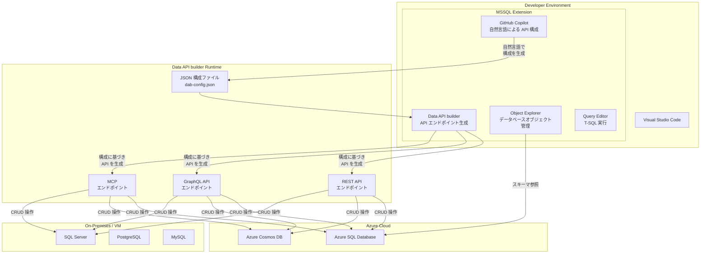

# Azure SQL Database: Data API builder with built-in GitHub Copilot in MSSQL Extension

**リリース日**: 2026-03-18

**サービス**: Azure SQL Database

**機能**: Data API builder with built-in GitHub Copilot in MSSQL extension

**ステータス**: In preview

[このアップデートのインフォグラフィックを見る](https://takech9203.github.io/azure-news-summary/20260318-sql-database-data-api-builder-copilot.html)

## 概要

Visual Studio Code 向け MSSQL 拡張機能に、Data API builder (DAB) がパブリックプレビューとして統合された。GitHub Copilot との連携機能が組み込まれており、自然言語を用いた対話的な操作でデータベースから REST および GraphQL の API エンドポイントを生成するバックエンド構築体験が、開発ワークフローに直接提供される。

Data API builder は、データベースオブジェクトを REST や GraphQL エンドポイントとして公開するオープンソースの構成ベースエンジンである。従来は CLI やスタンドアロンの VS Code 拡張機能を通じて利用していたが、今回のアップデートにより MSSQL 拡張機能内から直接利用できるようになり、GitHub Copilot のエージェントモードと連携することで、自然言語による API 構成の生成が可能となった。

**アップデート前の課題**

- Data API builder の設定には JSON 構成ファイルを手動で記述するか、CLI コマンドを使用する必要があり、学習コストが高かった
- データベーススキーマから API を生成するまでの手順が複数のツール間にまたがっており、ワークフローが断片化していた
- REST / GraphQL API のバックエンド構築には、データベース接続・エンティティ定義・権限設定など多くの構成項目を個別に管理する必要があった
- 開発者がデータベース開発と API 生成を同一環境で行う手段が限られていた

**アップデート後の改善**

- MSSQL 拡張機能内から Data API builder を直接利用でき、ツール間の切り替えが不要になった
- GitHub Copilot との統合により、自然言語で API 構成を生成できるガイド付き体験が提供される
- REST、GraphQL、および MCP エンドポイントの生成が Visual Studio Code 内で完結する
- データベース接続から API エンドポイントの構成・起動までのワークフローが統合された

## アーキテクチャ図

この図は、Visual Studio Code の MSSQL 拡張機能内で GitHub Copilot が自然言語による入力から Data API builder の構成ファイルを生成し、その構成に基づいて REST / GraphQL / MCP エンドポイントが各種データベースに対して生成される開発ワークフローを示している。

## サービスアップデートの詳細

### 主要機能

1. **GitHub Copilot によるガイド付き API 構成生成**
   - 自然言語のチャットやエージェントモードを通じて、Data API builder の構成ファイルを対話的に生成できる
   - データベーススキーマを参照し、公開するエンティティや権限設定を自然言語で指示可能

2. **REST / GraphQL エンドポイントの生成**
   - データベースのテーブル、ビュー、ストアドプロシージャを REST および GraphQL エンドポイントとして公開
   - ページネーション、フィルタリング、ソート、カラム選択などの機能が自動的に提供される

3. **MCP エンドポイントのサポート**
   - Data API builder バージョン 1.7 以降で、Model Context Protocol (MCP) エンドポイントもサポート
   - AI エージェントアプリケーションからのデータアクセスを容易にする

4. **MSSQL 拡張機能との統合**
   - Object Explorer でデータベーススキーマを確認しながら、同一環境で API 構成を作成できる
   - 既存の接続管理機能をそのまま活用し、データベース接続の再設定が不要

## 技術仕様

| 項目 | 詳細 |
|------|------|
| 機能名 | Data API builder in MSSQL extension |
| ステータス | パブリックプレビュー |
| 提供方法 | MSSQL extension for Visual Studio Code に統合 |
| 対応 API | REST, GraphQL, MCP (v1.7 以降) |
| 対応データベース | SQL Server, Azure SQL Database, Azure Cosmos DB, PostgreSQL, MySQL |
| GitHub Copilot 連携 | エージェントモード / 自然言語チャットによる構成生成 |
| 対応プラットフォーム | Windows, macOS, Linux |
| Data API builder ライセンス | MIT ライセンス（オープンソース） |

## 設定方法

### 前提条件

1. Visual Studio Code がインストールされていること
2. MSSQL 拡張機能（SQL Server (mssql)）が最新版に更新されていること
3. GitHub Copilot 拡張機能がインストールされ、有効なサブスクリプションを持っていること
4. 対象データベースへの接続情報および適切な権限を保有していること

### Visual Studio Code

1. Visual Studio Code で MSSQL 拡張機能を最新版に更新する
2. Object Explorer からデータベースに接続する
3. GitHub Copilot のチャットまたはエージェントモードで、公開したいエンティティや API の要件を自然言語で指示する
4. 生成された Data API builder 構成ファイル (dab-config.json) を確認・調整する
5. Data API builder を起動して REST / GraphQL エンドポイントを利用開始する

## メリット

### ビジネス面

- **バックエンド開発の大幅な効率化**: カスタム API コードの記述が不要になり、データベースから直接 API を公開できるため、開発期間を短縮できる
- **開発者の学習コスト削減**: GitHub Copilot による自然言語インターフェースにより、Data API builder の構成ファイル仕様を詳細に学習する必要がない
- **ツールコストの削減**: Data API builder 自体はオープンソース (MIT ライセンス) で無料であり、追加ライセンスコストが不要

### 技術面

- **統合された開発体験**: データベース管理・クエリ実行・API 生成を Visual Studio Code 内で完結できる
- **マルチデータベース対応**: SQL Server、Azure SQL Database、Azure Cosmos DB、PostgreSQL、MySQL に対応し、複数データソースの同時接続も可能
- **セキュリティ機能の組み込み**: Microsoft Entra ID、カスタム JWT、Azure App Service 認証に対応したロールベースのアクセス制御が標準搭載
- **CI/CD パイプラインの簡素化**: カスタム API コードが不要になることで、ビルド・デプロイパイプラインの複雑さが軽減される

## デメリット・制約事項

- パブリックプレビュー段階のため、機能仕様が変更される可能性がある
- GitHub Copilot による構成生成を利用するには、有効な GitHub Copilot サブスクリプションが必要
- 複雑なビジネスロジックを含む API には対応できず、汎用的な CRUD 操作が中心である
- プレビュー期間中は一部の機能が制限される可能性がある

## ユースケース

### ユースケース 1: Web アプリケーション向け API の迅速な構築

**シナリオ**: フロントエンド開発チームが、既存の Azure SQL Database 上のテーブルに対する REST API を短期間で構築し、Web アプリケーションから利用したい。

**実装例**:

1. Visual Studio Code の MSSQL 拡張機能で Azure SQL Database に接続する
2. GitHub Copilot に対して「Products テーブルと Orders テーブルを REST API として公開し、読み取りは匿名、書き込みは認証済みユーザーのみに制限したい」と指示する
3. 生成された dab-config.json を確認し、必要に応じて調整する
4. Data API builder を起動して API エンドポイントの動作を確認する

**効果**: カスタム API コードを一行も書くことなく、ページネーション・フィルタリング・ソート機能を備えた REST API を短時間で構築できる。

### ユースケース 2: GraphQL API によるモバイルアプリケーションのバックエンド

**シナリオ**: モバイルアプリケーション開発チームが、必要なデータだけを効率的に取得できる GraphQL API を構築したい。

**実装例**:

1. MSSQL 拡張機能でデータベースに接続し、Object Explorer でスキーマを確認する
2. GitHub Copilot を使用して、関連するテーブルとリレーションシップを含む GraphQL API の構成を生成する
3. Data API builder の GraphQL エンドポイントを起動し、ネストされたクエリの動作を確認する

**効果**: GraphQL の特性を活かし、モバイルアプリケーションが必要なフィールドのみを取得する効率的な API を、コーディング不要で構築できる。

## 料金

Data API builder はオープンソース (MIT ライセンス) であり、ツール自体の利用は無料である。MSSQL 拡張機能も無料で提供される。

| 項目 | 料金 |
|------|------|
| MSSQL extension for VS Code | 無料 |
| Data API builder | 無料（オープンソース） |
| GitHub Copilot Individual | $10/月 |
| GitHub Copilot Business | $19/ユーザー/月 |
| Azure SQL Database | DTU / vCore モデルに基づく従量課金 |

※ GitHub Copilot の統合機能を利用するには GitHub Copilot のサブスクリプションが別途必要。接続先データベースサービスの利用料金も別途発生する。

## 関連サービス・機能

- **Data API builder**: データベースオブジェクトを REST / GraphQL エンドポイントとして公開するオープンソースエンジン。今回のアップデートの中核コンポーネント
- **Azure SQL Database**: Data API builder の主要な接続先データベースサービス
- **GitHub Copilot**: AI アシスタントとして自然言語による Data API builder 構成の生成を支援
- **MSSQL extension for VS Code**: Data API builder の統合先となる Visual Studio Code 拡張機能。Object Explorer、Query Editor、Query Plan Visualizer などの機能を提供
- **Azure Cosmos DB**: Data API builder がサポートする NoSQL データベース。マルチデータソース構成で SQL データベースと併用可能
- **Microsoft Fabric**: Data API builder は Microsoft Fabric の基盤コンポーネントとしても位置付けられている

## 参考リンク

- [インフォグラフィック](https://takech9203.github.io/azure-news-summary/20260318-sql-database-data-api-builder-copilot.html)
- [公式アップデート情報](https://azure.microsoft.com/updates?id=558178)
- [Microsoft Learn - Data API builder ドキュメント](https://learn.microsoft.com/azure/data-api-builder/)
- [Microsoft Learn - Data API builder 概要](https://learn.microsoft.com/azure/data-api-builder/overview)
- [Visual Studio Code Marketplace - SQL Server (mssql)](https://marketplace.visualstudio.com/items?itemName=ms-mssql.mssql)
- [GitHub リポジトリ - Data API builder](https://github.com/Azure/data-api-builder)

## まとめ

MSSQL extension for Visual Studio Code への Data API builder 統合と GitHub Copilot 連携は、データベースから API エンドポイントを生成するまでのワークフローを大幅に簡素化するアップデートである。自然言語による対話的な構成生成により、Data API builder の学習コストが低減され、開発者はデータベーススキーマから REST / GraphQL API を迅速に構築できるようになる。

Solutions Architect への推奨アクション:

1. **プレビュー機能の評価**: 開発環境で MSSQL 拡張機能を最新版に更新し、Data API builder と GitHub Copilot の連携を試用する
2. **既存プロジェクトへの適用検討**: カスタム CRUD API を実装しているプロジェクトで、Data API builder による置き換えが可能かを評価する
3. **セキュリティ要件の確認**: Data API builder のロールベースアクセス制御や認証プロバイダーが、組織のセキュリティポリシーを満たすかを検証する
4. **マルチデータベース環境の活用**: Azure SQL Database だけでなく、Cosmos DB や PostgreSQL などの複数データソースを統合的に API 化する構成を検討する

特にプロトタイピングや、汎用的な CRUD 操作が中心の API バックエンド構築において、開発スピードとコスト効率の大幅な向上が期待できる機能である。

---

**タグ**: #AzureSQLDatabase #DataAPIBuilder #GitHubCopilot #REST #GraphQL #VisualStudioCode #MSSQLExtension #Preview #OpenSource
