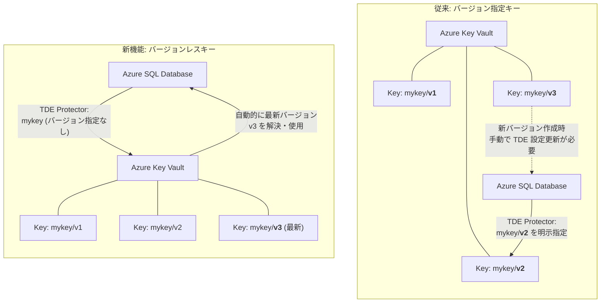

# Azure SQL Database: Transparent Data Encryption (TDE) のバージョンレスキーサポート

**リリース日**: 2026-03-18

**サービス**: Azure SQL Database

**機能**: Versionless key support for transparent data encryption (TDE)

**ステータス**: Launched (GA)

[このアップデートのインフォグラフィックを見る](https://takech9203.github.io/azure-news-summary/20260318-sql-database-tde-versionless-keys.html)

## 概要

Azure SQL Database の Transparent Data Encryption (TDE) において、バージョンレスキー（Versionless Key）のサポートが一般提供（GA）となった。これにより、カスタマーマネージドキー（CMK）を使用した TDE の構成時に、Azure Key Vault または Managed HSM 内のキーの特定バージョンを参照する必要がなくなり、暗号化キーの管理が大幅に簡素化される。

従来の TDE with CMK では、キー識別子にバージョン番号を含める必要があり、キーローテーション時にはデータベース側の TDE プロテクター設定も更新する必要があった。バージョンレスキー識別子を使用することで、Azure SQL Database は常に Azure Key Vault 内の最新の有効なキーバージョンを自動的に解決して使用する。これにより、キーローテーションのワークフローが簡素化され、運用ミスのリスクが低減される。

**アップデート前の課題**

- TDE プロテクターの設定時に、Azure Key Vault キーの特定バージョン（`https://<vault>.vault.azure.net/keys/<key>/<version>`）を明示的に指定する必要があった
- キーローテーション時に、新しいキーバージョンに合わせて TDE プロテクターの構成を手動で更新する必要があった
- バージョン指定の管理が煩雑になり、誤ったバージョンの参照や設定漏れによるオペレーションミスが発生するリスクがあった
- 自動キーローテーションを利用しない場合、キー更新プロセスに複数のステップが必要だった

**アップデート後の改善**

- バージョンレスキー識別子（`https://<vault>.vault.azure.net/keys/<key>`）で TDE プロテクターを設定できるようになった
- Azure SQL Database が自動的に最新の有効なキーバージョンを解決・使用するため、キーローテーション時の TDE プロテクター設定の更新が不要になった
- キー管理の構成がシンプルになり、オペレーションミスのリスクが低減した
- Azure Key Vault の自動キーローテーション機能と組み合わせることで、エンドツーエンドのゼロタッチキーローテーションが実現可能になった

## アーキテクチャ図



この図は、従来のバージョン指定キーとバージョンレスキーの動作の違いを示している。従来方式ではキーの特定バージョンを明示的に指定する必要があり、新バージョン作成時に手動更新が必要だったのに対し、バージョンレスキーでは Azure SQL Database がキー名のみで自動的に最新バージョンを解決するため、キーローテーション時の設定更新が不要になる。

## サービスアップデートの詳細

### 主要機能

1. **バージョンレスキー識別子のサポート**
   - TDE プロテクターの設定時にキーバージョンを省略したキー識別子（`https://<vault>.vault.azure.net/keys/<key>`）を使用可能
   - Azure SQL Database が Azure Key Vault または Managed HSM 内の最新の有効なキーバージョンを自動的に解決して使用する

2. **自動キーローテーションとの連携**
   - Azure Key Vault の自動キーローテーション機能と組み合わせることで、エンドツーエンドのゼロタッチキーローテーションを実現
   - TDE プロテクターの自動ローテーションが有効な場合、新しいキーバージョンが検出されると 24 時間以内に自動的にローテーションが実行される

3. **Azure Key Vault および Managed HSM 対応**
   - Azure Key Vault（Standard / Premium）と Azure Key Vault Managed HSM の両方でバージョンレスキーをサポート

## 技術仕様

| 項目 | 詳細 |
|------|------|
| 機能名 | Versionless key support for TDE |
| ステータス | 一般提供（GA） |
| 対象サービス | Azure SQL Database |
| サポートされるキーストア | Azure Key Vault, Azure Key Vault Managed HSM |
| バージョンレスキー識別子の形式 | `https://<vault>.vault.azure.net/keys/<key>` |
| バージョン指定キー識別子の形式 | `https://<vault>.vault.azure.net/keys/<key>/<version>` |
| 自動ローテーション検出間隔 | 新バージョン検出後 24 時間以内 |
| 必要な Key Vault 権限 | Get, wrapKey, unwrapKey |

## 設定方法

### 前提条件

1. Azure SQL Database の論理サーバーが作成済みであること
2. Azure Key Vault または Managed HSM にキーが作成済みであること
3. サーバーのマネージド ID（システム割り当てまたはユーザー割り当て）が Key Vault に対して Get、wrapKey、unwrapKey 権限を持っていること

### Azure CLI

```bash
# バージョンレスキー識別子を使用して TDE プロテクターを設定する
# キー URI にバージョン番号を含めない
az sql server tde-key set \
  --server-name <server-name> \
  --resource-group <resource-group> \
  --server-key-type AzureKeyVault \
  --kid "https://<vault-name>.vault.azure.net/keys/<key-name>"
```

### Azure Portal

1. Azure Portal で Azure SQL Database の論理サーバーに移動する
2. 「セキュリティ」セクションから「透過的なデータ暗号化」を選択する
3. 「カスタマーマネージドキー」を選択し、Azure Key Vault からキーを選択する
4. バージョンレスキー識別子（バージョン番号なし）を使用してキーを設定する
5. 必要に応じて「自動キーローテーション」を有効にする

## メリット

### ビジネス面

- **運用コストの削減**: キーローテーション時の手動設定更新が不要になり、運用作業の工数が削減される
- **コンプライアンス対応の簡素化**: 定期的なキーローテーションが容易になり、セキュリティポリシーへの準拠が容易になる
- **インシデントリスクの低減**: 設定ミスによるデータベースアクセス不能のリスクが軽減される

### 技術面

- **ゼロタッチキーローテーション**: Azure Key Vault の自動ローテーションと組み合わせて完全自動化が可能
- **構成のシンプル化**: TDE プロテクターの設定にキーバージョンを管理する必要がなくなる
- **Geo レプリケーションとの互換性**: プライマリ・セカンダリサーバー間でのキー管理が簡素化される

## デメリット・制約事項

- バージョンレスキー識別子は現時点で Azure SQL Database のみでサポートされており、Azure SQL Managed Instance では利用できない
- 常に最新のキーバージョンが使用されるため、以前のバージョンへの意図的な固定はできない
- Key Vault または Managed HSM へのネットワーク接続が継続的に必要であり、アクセスが失われるとデータベースが「アクセス不可」状態になる可能性がある（30 分以内にアクセスが復旧すれば自動回復する）
- Key Vault がファイアウォールの背後にある場合、「信頼された Microsoft サービスのバイパスを許可」オプションを有効にする必要がある

## ユースケース

### ユースケース 1: 定期的なキーローテーションの自動化

**シナリオ**: セキュリティポリシーにより 90 日ごとの暗号化キーローテーションが義務付けられている企業が、Azure SQL Database の TDE キーを自動でローテーションしたい。

**実装例**:

```bash
# Azure Key Vault で自動キーローテーションポリシーを設定
az keyvault key rotation-policy update \
  --vault-name <vault-name> \
  --name <key-name> \
  --value @rotation-policy.json

# バージョンレスキー識別子で TDE プロテクターを設定
az sql server tde-key set \
  --server-name <server-name> \
  --resource-group <resource-group> \
  --server-key-type AzureKeyVault \
  --kid "https://<vault-name>.vault.azure.net/keys/<key-name>" \
  --auto-rotation-enabled true
```

**効果**: Key Vault が自動でキーを更新し、Azure SQL Database が自動で最新バージョンを検出して使用するため、キーローテーションプロセス全体が自動化される。

### ユースケース 2: マルチデータベース環境での統一的なキー管理

**シナリオ**: 複数の Azure SQL Database を運用するチームが、全データベースの TDE キーを統一的に管理したい。

**実装例**:

```bash
# 共通のバージョンレスキー識別子で複数サーバーの TDE プロテクターを設定
for server in server1 server2 server3; do
  az sql server tde-key set \
    --server-name $server \
    --resource-group <resource-group> \
    --server-key-type AzureKeyVault \
    --kid "https://<vault-name>.vault.azure.net/keys/<key-name>"
done
```

**効果**: すべてのサーバーが同一のバージョンレスキー識別子を参照するため、キーローテーション時に個別サーバーの設定更新が不要になる。

## 料金

TDE のバージョンレスキーサポート自体は追加料金なしで利用可能である。ただし、関連サービスの利用料金が別途発生する。

| 項目 | 料金 |
|------|------|
| TDE バージョンレスキー機能 | 追加料金なし |
| Azure Key Vault（Standard） | キー操作ごとの従量課金 |
| Azure Key Vault（Premium / HSM） | キー操作ごとの従量課金（Standard より高額） |
| Azure Key Vault Managed HSM | プール単位の時間課金 |
| Azure SQL Database | vCore / DTU モデルに基づく従量課金 |

## 関連サービス・機能

- **Azure Key Vault**: TDE のカスタマーマネージドキーを格納するキーストア。自動キーローテーション機能と組み合わせてゼロタッチローテーションを実現する
- **Azure Key Vault Managed HSM**: FIPS 140-2 Level 3 準拠のハードウェアセキュリティモジュール。より厳格なセキュリティ要件がある場合に使用する
- **TDE 自動キーローテーション**: Azure SQL Database の TDE プロテクターを自動的にローテーションする機能。バージョンレスキーとの併用で運用負荷をさらに軽減する
- **ユーザー割り当てマネージド ID (UMI)**: サーバー作成前に Key Vault へのアクセス権を事前設定でき、TDE with CMK をサーバー作成時に有効化可能にする
- **Azure Policy**: カスタマーマネージドキーによる TDE の使用をサーバー作成・更新時に強制するビルトインポリシーが提供されている

## 参考リンク

- [インフォグラフィック](https://takech9203.github.io/azure-news-summary/20260318-sql-database-tde-versionless-keys.html)
- [公式アップデート情報](https://azure.microsoft.com/updates?id=558183)
- [Microsoft Learn - Customer-managed TDE overview](https://learn.microsoft.com/azure/azure-sql/database/transparent-data-encryption-byok-overview)
- [Microsoft Learn - TDE with CMK using user-assigned managed identity](https://learn.microsoft.com/azure/azure-sql/database/transparent-data-encryption-byok-identity)
- [Microsoft Learn - TDE protector key rotation](https://learn.microsoft.com/azure/azure-sql/database/transparent-data-encryption-byok-key-rotation)
- [Azure Key Vault pricing](https://azure.microsoft.com/pricing/details/key-vault/)

## まとめ

Azure SQL Database の TDE におけるバージョンレスキーサポートの一般提供は、カスタマーマネージドキーを使用した暗号化キー管理を大幅に簡素化するアップデートである。特定のキーバージョンを参照する必要がなくなり、Azure Key Vault の自動ローテーション機能と組み合わせることで、完全に自動化されたキーライフサイクル管理が実現可能になる。

Solutions Architect への推奨アクション:

1. **既存環境の評価**: 現在バージョン指定キーで TDE を運用している Azure SQL Database を特定し、バージョンレスキーへの移行を検討する
2. **自動ローテーションの有効化**: バージョンレスキーと Azure Key Vault の自動キーローテーション機能を組み合わせて、キーローテーションの完全自動化を検討する
3. **Managed Instance への対応状況の確認**: 現時点ではバージョンレスキーは Azure SQL Database のみのサポートであるため、Managed Instance を使用している場合は今後のサポート拡大を注視する
4. **Azure Policy の適用**: カスタマーマネージドキーの使用を組織全体で強制する場合、ビルトインの Azure Policy の活用を検討する

セキュリティコンプライアンスの要件として定期的な暗号化キーローテーションを求められる組織にとって、運用負荷を大幅に削減できる実用的な機能改善である。

---

**タグ**: #AzureSQLDatabase #TDE #TransparentDataEncryption #CustomerManagedKeys #AzureKeyVault #Security #Encryption #GA
