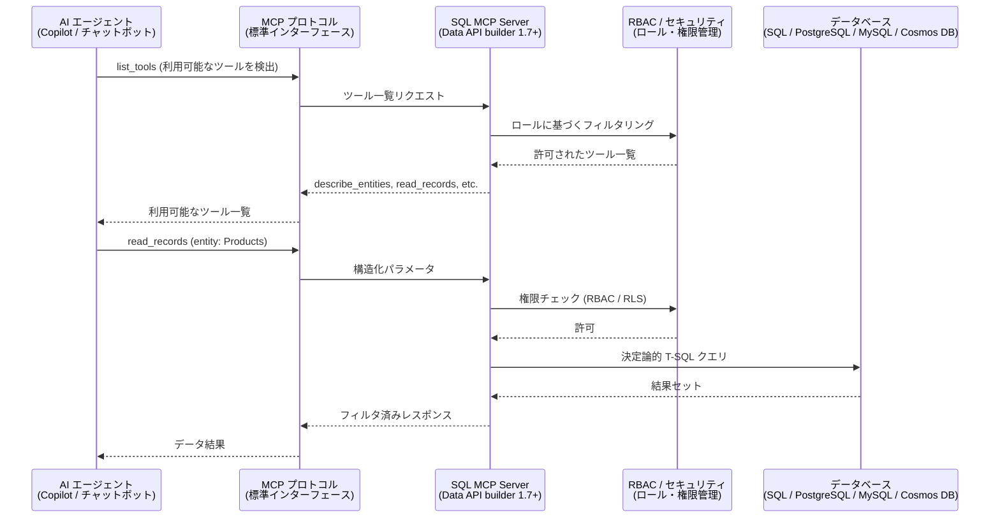

# Azure SQL Database: SQL MCP Server

**リリース日**: 2026-03-18

**サービス**: Azure SQL Database

**機能**: SQL MCP Server

**ステータス**: In preview

[このアップデートのインフォグラフィックを見る](https://takech9203.github.io/azure-news-summary/20260318-sql-mcp-server.html)

## 概要

SQL MCP Server は、Data API builder (DAB) バージョン 1.7 以降に搭載された Model Context Protocol (MCP) の実装であり、AI エージェントがデータベースと安全にやり取りするための仕組みを提供する。データベースを直接公開したり、脆弱な自然言語パーシング (NL2SQL) に依存したりすることなく、AI エージェントをデータワークフローに組み込むための、シンプルかつ予測可能でセキュアな手段である。

Model Context Protocol (MCP) は、AI エージェントが外部ツールを発見して呼び出す方法を定義する標準プロトコルである。SQL MCP Server は、この MCP を通じてデータベースのテーブル、ビュー、ストアドプロシージャを「ツール」として AI エージェントに公開する。エージェントはデータベースに直接アクセスするのではなく、DAB の抽象化レイヤーを通じて操作を行うため、内部スキーマの露出を防ぎつつ、ロールベースのアクセス制御 (RBAC) が一貫して適用される。

SQL MCP Server は「NL2SQL」ではなく「NL2DAB」モデルを採用している点が特徴的である。モデルが非決定論的な SQL を直接生成するのではなく、DAB のエンティティ抽象化レイヤーと組み込みのクエリビルダーを通じて、完全に決定論的な T-SQL を生成する。これにより、NL2SQL に伴うリスクやオーバーヘッドを排除しながら、安全性と信頼性を確保している。

**アップデート前の課題**

- AI エージェントからデータベースにアクセスするには、直接 SQL を生成する NL2SQL アプローチに頼る必要があり、非決定論的な出力による誤りのリスクがあった
- データベーススキーマが AI エージェントに直接露出する可能性があり、セキュリティ上の懸念があった
- AI エージェントとデータベース間のインタラクションに標準化されたプロトコルがなく、ツールごとに異なる統合方法が必要だった
- 既存のデータベース MCP サーバーの多くは、本番環境での利用に十分なセキュリティやアクセス制御を備えていなかった

**アップデート後の改善**

- MCP 標準プロトコルを通じて AI エージェントがデータベース操作を安全に実行可能になった
- DAB の既存のエンティティ抽象化、RBAC、キャッシュ、テレメトリを活用した本番環境対応の統合が実現した
- NL2DAB モデルにより、決定論的で予測可能なクエリ生成が保証される
- REST、GraphQL、MCP の全エンドポイントで一貫したセキュリティルールが単一の構成ファイルで管理できる

## アーキテクチャ図



SQL MCP Server は、AI エージェントとデータベースの間に DAB の抽象化レイヤーを介在させる。エージェントは MCP プロトコルを通じてツールを発見・呼び出しし、すべてのリクエストは RBAC による権限チェックを経てからデータベースに到達する。

## サービスアップデートの詳細

### 主要機能

1. **6 つの DML ツール**
   - `describe_entities`: 現在のロールが利用可能なエンティティとその操作を返す。データベースへのクエリは行わず、構成ファイルのインメモリ情報から取得する
   - `create_record`: テーブルに新しいレコードを挿入する
   - `read_records`: テーブルやビューに対してフィルタリング、ソート、ページネーション、フィールド選択をサポートしたクエリを実行する。結果は自動的にキャッシュされる
   - `update_record`: 既存レコードを更新する。主キーと更新フィールドを指定する
   - `delete_record`: 既存レコードを削除する。トランザクションサポート付き
   - `execute_entity`: ストアドプロシージャを実行する。入力パラメータと出力結果をサポート

2. **NL2DAB モデル (NL2SQL ではない)**
   - AI モデルが直接 SQL を生成するのではなく、DAB のエンティティ抽象化レイヤーを通じて構造化パラメータを送信する
   - DAB 内蔵のクエリビルダーが決定論的な T-SQL を生成するため、同じ入力に対して常に同じ出力が得られる
   - 非決定論的な SQL 生成に伴うリスク、オーバーヘッド、デバッグ困難性を排除

3. **エンティティ記述 (description) プロパティ**
   - エンティティ、フィールド、パラメータにセマンティックな説明を付与可能
   - AI エージェントがデータの意味を正確に理解し、適切なクエリを生成する助けとなる
   - DAB バージョン 1.7 で導入された `fields` 配列構文で、フィールドごとに `description` と `primary-key` を定義

4. **セキュリティモデル (RBAC 統合)**
   - DAB の既存のロールベースアクセス制御 (RBAC) がすべての MCP ツールに自動適用される
   - エンティティごとにロール別のアクション (read / create / update / delete) を定義可能
   - フィールドレベルの include / exclude によるデータ公開範囲の制御
   - 行レベルセキュリティ (RLS) ポリシーの適用
   - REST、GraphQL、MCP のすべてのエンドポイントで一貫したセキュリティルール

5. **DDL 非サポート (意図的設計)**
   - SQL MCP Server は DML (データ操作) のみをサポートし、DDL (スキーマ変更) はサポートしない
   - テーブル作成やスキーマ変更といった操作は、本番環境で AI エージェントが実行すべきではないという設計思想

## 技術仕様

| 項目 | 詳細 |
|------|------|
| MCP プロトコルバージョン | 2025-06-18 (固定デフォルト) |
| トランスポート | Streamable HTTP、stdio |
| HTTP エンドポイント | `/mcp` (デフォルトパス) |
| 対応 DAB バージョン | 1.7 以降 |
| DML ツール数 | 6 (describe_entities, create_record, read_records, update_record, delete_record, execute_entity) |
| リクエストサイズ制限 (stdio) | 1 MB |
| キャッシュ | read_records の結果は自動キャッシュ (L1 / L2) |
| テレメトリ | OpenTelemetry (OTEL) 対応 |
| ライセンス | オープンソース (無料) |

## 設定方法

### 前提条件

1. Data API builder バージョン 1.7 以降がインストールされていること
2. 対応するデータベース (SQL Server、Azure SQL Database、PostgreSQL、MySQL、Azure Cosmos DB) への接続情報

### DAB CLI による初期設定

```bash
# DAB 構成ファイルの初期化
dab init --database-type mssql --connection-string "<your-connection-string>" --config dab-config.json --host-mode development
```

### エンティティの追加

```bash
# テーブルをエンティティとして追加 (セマンティック説明付き)
dab add Products \
  --source dbo.Products \
  --source.type table \
  --permissions "anonymous:*" \
  --description "Product catalog with pricing information"

# フィールドの説明を追加
dab update Products \
  --fields.name ProductID \
  --fields.description "Unique identifier for each product" \
  --fields.primary-key true
```

### MCP の構成 (dab-config.json)

MCP は DAB 1.7 以降でデフォルトで有効であり、追加設定なしで SQL MCP Server が利用可能になる。制限が必要な場合のみ構成を変更する。

```json
{
  "runtime": {
    "mcp": {
      "enabled": true,
      "path": "/mcp",
      "dml-tools": {
        "describe-entities": true,
        "create-record": true,
        "read-records": true,
        "update-record": true,
        "delete-record": true,
        "execute-entity": true
      }
    }
  }
}
```

### サーバーの起動とテスト

```bash
# HTTP トランスポートで起動
dab start

# stdio トランスポートで起動 (ローカル開発用)
dab start --mcp-stdio

# 特定ロールで stdio 起動
dab start --mcp-stdio role:admin
```

### MCP Inspector によるテスト

```bash
# DAB を起動した後、別のターミナルで MCP Inspector を起動
npx -y @modelcontextprotocol/inspector http://localhost:5000/mcp
```

## 対応データベース

| データベース | サポート状況 |
|------|------|
| Microsoft SQL Server | 対応 |
| Azure SQL Database | 対応 |
| Azure Cosmos DB (NoSQL) | 対応 |
| PostgreSQL | 対応 |
| MySQL | 対応 |
| SQL Data Warehouse | 対応 |

## メリット

### ビジネス面

- AI エージェントをデータワークフローに統合することで、業務プロセスの自動化範囲が拡大する
- SQL を直接記述せずに内部自動化を構築でき、開発者以外のチームメンバーもデータ操作が容易になる
- 既存の DAB 構成を活用でき、MCP のために追加のインフラや設定が不要である

### 技術面

- NL2DAB モデルにより決定論的なクエリ生成が保証され、本番環境での信頼性が高い
- REST、GraphQL、MCP の全エンドポイントで一貫した RBAC が適用されるため、セキュリティ管理が統一される
- OpenTelemetry 対応のトレーシングにより、分散システム全体での AI エージェントの動作を可視化可能
- オープンソースかつ無料で利用可能であり、任意のクラウドやオンプレミスで実行できる

## デメリット・制約事項

- DDL (スキーマ変更) 操作はサポートされない。スキーマ変更には別途 VS Code の MSSQL 拡張機能などを使用する必要がある
- JOIN 操作は `read_records` ツールで直接サポートされない。ビューやストアドプロシージャを事前に作成して対応する必要がある
- stdio トランスポートのリクエストサイズは 1 MB に制限されている
- フィールドの `description` メタデータを構成に含めないと、エージェントはエンティティ名のみしか認識できず、精度が低下する可能性がある
- パブリックプレビュー段階であり、GA に向けて仕様変更の可能性がある

## ユースケース

### ユースケース 1: Copilot やチャットボットによる安全な CRUD 操作

**シナリオ**: 社内の Copilot チャットボットが、顧客情報データベースに対して安全にデータ照会や更新を行う。

**実装例**:

```json
{
  "entities": {
    "Customers": {
      "description": "顧客マスターデータ",
      "source": { "object": "dbo.Customers", "type": "table" },
      "permissions": [
        {
          "role": "support-agent",
          "actions": [
            {
              "action": "read",
              "fields": {
                "include": ["CustomerID", "Name", "Email", "Plan"],
                "exclude": ["CreditCardNumber"]
              }
            }
          ]
        }
      ]
    }
  }
}
```

**効果**: サポート担当の AI エージェントは顧客情報を参照できるが、クレジットカード番号などの機密フィールドにはアクセスできない。RBAC により、ロールに応じた操作のみが許可される。

### ユースケース 2: 読み取り専用のレポーティングエンドポイント

**シナリオ**: BI ツールや分析エージェントが、データベースの売上データを読み取り専用で参照する。

**実装例**:

```json
{
  "runtime": {
    "mcp": {
      "enabled": true,
      "dml-tools": {
        "describe-entities": true,
        "read-records": true,
        "create-record": false,
        "update-record": false,
        "delete-record": false,
        "execute-entity": false
      }
    }
  }
}
```

**効果**: ランタイムレベルで書き込み系ツールを無効化することで、エージェントにはデータの読み取りのみが許可される。ロール設定に関わらず、書き込みツール自体が AI エージェントに公開されない。

## 料金

SQL MCP Server は Data API builder の機能として提供される。Data API builder はオープンソースかつ無料で利用可能である。データベース自体の利用料金 (Azure SQL Database、Azure Cosmos DB 等) は別途発生する。

## 関連サービス・機能

- **Data API builder (DAB)**: SQL MCP Server の基盤となるオープンソースエンジン。REST / GraphQL / MCP エンドポイントを単一の構成ファイルで管理する
- **Azure SQL Database**: SQL MCP Server が対応するプライマリデータベースサービス
- **Azure Cosmos DB**: NoSQL データベースとして SQL MCP Server からアクセス可能
- **Data API builder with GitHub Copilot in MSSQL Extension**: VS Code の MSSQL 拡張機能で DAB の構成を自然言語で生成する関連機能 (同日プレビュー発表)
- **Azure Key Vault**: DAB 1.7 で追加されたシークレット管理統合。接続文字列などの機密値を安全に管理

## 参考リンク

- [インフォグラフィック](https://takech9203.github.io/azure-news-summary/20260318-sql-mcp-server.html)
- [公式アップデート情報](https://azure.microsoft.com/updates?id=558150)
- [SQL MCP Server 概要 - Microsoft Learn](https://learn.microsoft.com/azure/data-api-builder/mcp/overview)
- [DML ツールリファレンス - Microsoft Learn](https://learn.microsoft.com/azure/data-api-builder/mcp/data-manipulation-language-tools)
- [Data API builder 1.7 リリースノート](https://learn.microsoft.com/azure/data-api-builder/whats-new/version-1-7)
- [Data API builder ドキュメント](https://learn.microsoft.com/azure/data-api-builder/)

## まとめ

SQL MCP Server は、AI エージェントとデータベースの統合における重要な標準化の一歩である。従来の NL2SQL アプローチが抱えていた非決定論的な出力のリスクを、NL2DAB モデルにより解消し、本番環境での利用に耐えうるセキュリティと信頼性を提供する。Data API builder 1.7 以降にアップグレードするだけで MCP 機能が利用可能となるため、既存の DAB ユーザーは最小限の変更で AI エージェント統合を開始できる。Solutions Architect としては、Copilot やカスタム AI エージェントからのデータベースアクセスが必要なシナリオにおいて、SQL MCP Server の採用を検討することを推奨する。

---

**タグ**: #Azure #AzureSQLDatabase #DataAPIBuilder #MCP #ModelContextProtocol #SQLMCPServer #AIエージェント #データベース #パブリックプレビュー
