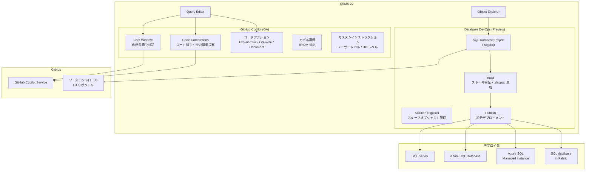

# SQL Server Management Studio 22: GitHub Copilot GA と Database DevOps (SQL Projects)

**リリース日**: 2026-03-18

**サービス**: SQL Server Management Studio

**機能**: GitHub Copilot in SSMS (GA) / Database DevOps powered by SQL Projects (Preview)

**ステータス**: Launched (GA) / In preview

[このアップデートのインフォグラフィックを見る](https://takech9203.github.io/azure-news-summary/20260318-ssms-22-copilot-sql-projects.html)

## 概要

SQL Server Management Studio (SSMS) 22.4.1 のリリースにおいて、2 つの重要なアップデートが発表された。GitHub Copilot in SSMS の一般提供 (GA) 開始と、Database DevOps ワークロード (プレビュー) の導入である。

GitHub Copilot in SSMS は、プレビュー期間を経て正式に GA となった。SSMS 上で自然言語による T-SQL クエリの開発、コードの説明・修正・最適化、チャットベースのデータベース操作支援を AI アシスタントとして提供する。コード補完 (Code Completions) や次の編集提案 (Next Edit Suggestions) もクエリエディタ内で直接利用可能である。GA にあわせて、ユーザーレベルのカスタムインストラクション機能も追加された。

Database DevOps ワークロードは、SQL database projects (Microsoft.Build.Sql) を SSMS 内で利用可能にするプレビュー機能である。データベーススキーマをコードとして管理 (schema-as-code) し、ソースコントロールとの統合、ビルドによるスキーマ検証、.dacpac を通じた環境へのデプロイメントを SSMS から直接実行できるようになった。

**アップデート前の課題**

- SSMS でのクエリ作成は手動での T-SQL 記述に依存しており、スキーマを参照しながらの複雑なクエリ開発に時間がかかっていた
- GitHub Copilot in SSMS はプレビュー段階であり、JSON-RPC エラーや不正確な応答生成などの問題が報告されていた
- データベーススキーマの変更管理は SSMS 外のツール (Visual Studio + SSDT、Azure Data Studio) に依存しており、DBA のワークフローが分断されていた
- データベースの変更をソースコントロールで管理し CI/CD パイプラインに統合するには、別途開発環境のセットアップが必要だった

**アップデート後の改善**

- GitHub Copilot が GA となり、安定した AI 支援によるクエリ開発、コード説明・修正・最適化が SSMS 内で利用可能になった
- カスタムインストラクション機能により、組織やプロジェクト固有のコーディング規約を Copilot に適用できるようになった
- Database DevOps ワークロードにより、SSMS 内でスキーマをコードとして管理し、ビルド・デプロイのワークフローを完結できるようになった
- SqlPackage による既存データベースからのスキーマ抽出と、SSMS の Publish ダイアログによるデプロイメントが統合された

## アーキテクチャ図



SSMS 22 では、GitHub Copilot による AI 支援と Database DevOps による schema-as-code ワークフローが統合され、クエリ開発からスキーマ管理・デプロイメントまでを単一の環境で完結できる構成となっている。

## サービスアップデートの詳細

### GitHub Copilot in SSMS (GA)

1. **チャットウインドウ**
   - 自然言語でデータベースに関する質問やクエリ作成を依頼可能
   - アクティブなクエリエディタの接続先データベースのスキーマをコンテキストとして自動認識
   - `.sql` ファイルや `.sqlplan` ファイルを追加コンテキストとしてアタッチ可能

2. **コード補完 (Code Completions)**
   - クエリエディタ内で T-SQL を記述中にリアルタイムでコード提案を表示
   - 新規コード提案と既存コードの編集提案の両方に対応
   - 部分的または全体的な補完の受け入れが可能

3. **右クリックコードアクション**
   - Explain: 選択したコードの説明を生成
   - Fix: エラーのあるコードの修正を提案
   - Optimize: クエリのパフォーマンス最適化を提案
   - Document: コードのドキュメントを生成

4. **モデル選択と BYOM (Bring Your Own Model)**
   - チャットウインドウ内でモデルを選択可能
   - 組織独自のモデルを Copilot に統合する BYOM に対応

5. **カスタムインストラクション**
   - ユーザーレベルのカスタムインストラクションにより、Copilot の応答をカスタマイズ可能
   - データベースインストラクション (拡張プロパティ `CONSTITUTION.md`) によるデータベース固有の指示にも対応

### Database DevOps ワークロード (Preview)

1. **SQL Database Projects (Microsoft.Build.Sql)**
   - データベーススキーマをコードとして `.sql` ファイルで管理
   - オブジェクトタイプごとのフォルダ構成 (例: `dbo/Tables`, `dbo/StoredProcedures`)
   - SDK スタイルの `.sqlproj` プロジェクトファイルによる構成管理 (最小 SDK バージョン: 2.1.0)

2. **スキーマ抽出**
   - SqlPackage の Extract アクションにより、既存データベースからスキーマを個別の `.sql` ファイルとして抽出可能
   - `/p:ExtractTarget=SchemaObjectType` パラメータでオブジェクトタイプ別のフォルダ構成に整理

3. **ビルドとスキーマ検証**
   - Solution Explorer からプロジェクトをビルドし、T-SQL 構文やオブジェクト間の依存関係を検証
   - ビルド成功時に `.dacpac` ファイルを `bin\Debug` フォルダに生成
   - エラーと警告の詳細をビルド出力に表示

4. **Publish によるデプロイメント**
   - Publish ダイアログからターゲットデータベースへのデプロイメントを実行
   - `.dacpac` とターゲットデータベースの差分比較により、必要な `CREATE`/`ALTER`/`DROP` 文を自動生成
   - Generate Script オプションにより、適用前にデプロイスクリプトのレビューが可能
   - 冪等なデプロイプロセスにより、同一 `.dacpac` を複数環境に繰り返しデプロイ可能

## 技術仕様

| 項目 | 詳細 |
|------|------|
| SSMS バージョン | 22.4.1 |
| Visual Studio ベース | Visual Studio 18.4.1 [11612.150] |
| GitHub Copilot ステータス | 一般提供 (GA) |
| Database DevOps ステータス | パブリックプレビュー |
| SQL Projects SDK | Microsoft.Build.Sql (最小バージョン 2.1.0) |
| 対応プラットフォーム | Windows x64, Windows Arm64 |
| 対応接続先 | SQL Server, Azure SQL Database, Azure SQL Managed Instance, Azure Synapse Analytics, SQL database in Fabric |

## 設定方法

### 前提条件

1. SQL Server Management Studio 22 (最新バージョン 22.4.1)
2. GitHub Copilot: GitHub アカウントと Copilot サブスクリプション (Copilot Free プランも利用可能)
3. Database DevOps: .NET SDK のインストール

### GitHub Copilot の有効化

1. Visual Studio Installer で SSMS のインストールを変更し、**AI Assistance** ワークロードを追加
2. SSMS を起動し、右上の **GitHub Copilot** バッジから **Open Chat Window to Sign In** を選択
3. GitHub アカウントでサインイン、または **Sign up for Copilot Free** で新規登録
4. ブラウザでの認証完了後、SSMS に戻り Copilot の利用を開始

### Database DevOps の有効化

1. Visual Studio Installer で SSMS のインストールを変更し、**Database DevOps** ワークロードを追加
2. 既存データベースからプロジェクトを作成する場合:

```bash
# SqlPackage による既存データベースのスキーマ抽出
sqlpackage /Action:Extract /SourceConnectionString:"<connection-string>" /TargetFile:"<temp-folder>" /p:ExtractTarget=SchemaObjectType
```

3. SSMS で **File** > **Open** > **Project/Solution** から `.sqlproj` ファイルを開く
4. Solution Explorer でプロジェクトを右クリックし、**Build** でスキーマ検証、**Publish** でデプロイメントを実行

## メリット

### ビジネス面

- AI 支援による T-SQL 開発の生産性向上により、データベース関連タスクの所要時間を短縮
- schema-as-code アプローチにより、データベース変更の監査証跡とガバナンスを強化
- 開発・ステージング・本番環境への一貫したデプロイメントにより、リリースリスクを低減
- DBA と開発者のワークフローが SSMS 内で完結し、ツール間の切り替えコストを削減

### 技術面

- Copilot がデータベースのスキーマコンテキストを自動認識し、環境に適した提案を生成
- SQL Projects のビルドプロセスがオブジェクト間の依存関係を検証し、デプロイ前にエラーを検出
- .dacpac による冪等デプロイメントにより、CI/CD パイプラインとの統合が容易
- BYOM により組織のセキュリティポリシーに準拠した AI モデルの利用が可能

## デメリット・制約事項

- Database DevOps ワークロードはプレビュー段階であり、本番環境での利用は慎重な評価が必要
- SSMS は SDK スタイルの Microsoft.Build.Sql プロジェクトのみをサポートしており、従来の SQL プロジェクトは変換が必要
- GitHub Copilot の利用には GitHub アカウントとサブスクリプションが必要 (Copilot Free プランは月間利用制限あり)
- GitHub Copilot のサポートは GitHub が提供しており、Microsoft サポートの対象外

## ユースケース

### ユースケース 1: AI 支援によるクエリ開発とトラブルシューティング

**シナリオ**: DBA がパフォーマンス問題のあるクエリの調査と改善を行う場合。Copilot Chat で自然言語によりクエリの意図を説明し、最適化提案を受ける。

**効果**: 複雑なクエリの解析・最適化にかかる時間を短縮し、スキーマを考慮した正確な提案を受けることで品質を向上

### ユースケース 2: データベーススキーマの変更管理とデプロイメント

**シナリオ**: 開発チームがデータベーススキーマの変更を Git で管理し、SSMS の SQL Projects を使ってビルド・検証・デプロイを行う。

**効果**: アプリケーションコードと同様の CI/CD ワークフローをデータベース変更にも適用でき、環境間の一貫性とデプロイメントの信頼性を確保

## 料金

GitHub Copilot の料金プランは GitHub が管理している。

| プラン | 料金 |
|------|------|
| Copilot Free | 無料 (月間利用制限あり) |
| Copilot Pro | GitHub の料金ページを参照 |
| Copilot Business | GitHub の料金ページを参照 |
| Copilot Enterprise | GitHub の料金ページを参照 |

SSMS 自体は無料でダウンロード・利用可能。Database DevOps ワークロード (プレビュー) も追加料金なし。

## 関連サービス・機能

- **Azure SQL Database**: SSMS の主要な接続先の一つ。Copilot と SQL Projects の両方でフルサポート
- **SQL Server Data Tools (SSDT)**: Visual Studio での SQL Projects 開発環境。SSMS の Database DevOps は SSDT の機能を SSMS に統合したもの
- **Azure Data Studio**: SQL 開発向けの軽量エディタ。SQL Database Projects 拡張機能を先行提供していた
- **SqlPackage**: スキーマの抽出・デプロイメントを行う CLI ツール。SSMS の Database DevOps と連携して利用

## 参考リンク

- [インフォグラフィック](https://takech9203.github.io/azure-news-summary/20260318-ssms-22-copilot-sql-projects.html)
- [公式アップデート情報 - GitHub Copilot in SSMS GA](https://azure.microsoft.com/updates?id=558134)
- [公式アップデート情報 - Database DevOps in SSMS](https://azure.microsoft.com/updates?id=558155)
- [Microsoft Learn - GitHub Copilot in SSMS](https://learn.microsoft.com/en-us/ssms/github-copilot/get-started)
- [Microsoft Learn - Database DevOps in SSMS](https://learn.microsoft.com/en-us/ssms/database-devops)
- [Microsoft Learn - SSMS 22 リリースノート](https://learn.microsoft.com/en-us/ssms/release-notes-22)
- [Microsoft Learn - SQL Database Projects](https://learn.microsoft.com/en-us/sql/tools/sql-database-projects/sql-database-projects)
- [SSMS ダウンロード](https://aka.ms/ssms/22/release/vs_SSMS.exe)

## まとめ

SSMS 22.4.1 のリリースにより、GitHub Copilot の GA と Database DevOps ワークロードのプレビュー導入という 2 つの重要なアップデートが実現した。これにより、SSMS はクエリ開発における AI 支援と、データベーススキーマの変更管理・デプロイメントの両面で大幅に強化された。

DBA や開発者にとっては、まず SSMS 22.4.1 へのアップデートを行い、GitHub Copilot のセットアップを完了することを推奨する。Database DevOps ワークロードについては、プレビュー段階ではあるが、開発・テスト環境で SQL Projects によるスキーマ管理ワークフローを評価し、将来的な CI/CD パイプラインへの統合を検討することが望ましい。

---

**タグ**: #SQL Server Management Studio #SSMS #GitHub Copilot #Database DevOps #SQL Projects #AI #Azure SQL Database #Databases #Hybrid + multicloud
