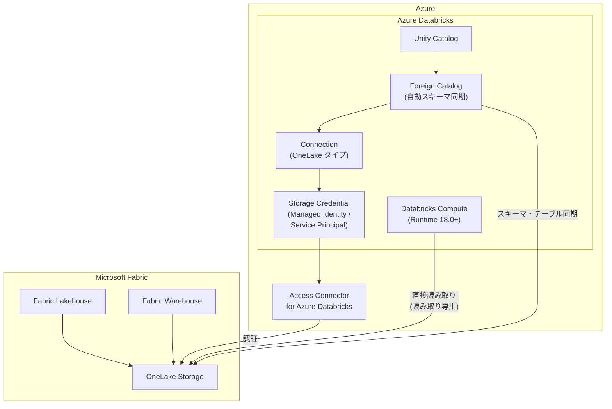

# Azure Databricks: OneLake Catalog Federation のパブリックプレビュー開始

**リリース日**: 2026-03-19

**サービス**: Azure Databricks

**機能**: OneLake Catalog Federation

**ステータス**: In preview

[このアップデートのインフォグラフィックを見る](https://takech9203.github.io/azure-news-summary/20260319-databricks-onelake-catalog-federation.html)

## 概要

Azure Databricks において、OneLake Catalog Federation がパブリックプレビューとして利用可能になった。この機能により、Microsoft Fabric の OneLake に格納されたデータを、コピーや移動することなく Azure Databricks から直接クエリできるようになる。Unity Catalog を OneLake カタログに接続すると、Fabric Lakehouse や Warehouse のスキーマとテーブルが自動的に同期され、Azure Databricks 側から即座にアクセス可能となる。

OneLake Catalog Federation は、Lakehouse Federation の「カタログフェデレーション」カテゴリに分類される機能である。従来のクエリフェデレーション (JDBC 経由でリモートデータベースにクエリをプッシュダウンする方式) とは異なり、カタログフェデレーションは OneLake のオブジェクトストレージに直接アクセスしてクエリを実行する。これにより、クエリは Databricks コンピュート上でのみ実行されるため、クエリフェデレーションと比較してコスト効率とパフォーマンスに優れている。

データアクセスは読み取り専用であり、SELECT クエリのみがサポートされる。書き込み操作は利用できない。

**アップデート前の課題**

- Microsoft Fabric OneLake のデータを Azure Databricks で分析するには、データのコピーや ETL パイプラインの構築が必要だった
- データの重複管理によるストレージコストの増加と、データ鮮度の低下が課題だった
- Fabric と Databricks の間でデータガバナンスを統一的に管理する手段が限られていた

**アップデート後の改善**

- OneLake のデータをコピーせずに Azure Databricks から直接クエリ可能となり、データの重複を排除
- Unity Catalog による統合ガバナンスのもと、Fabric のデータに対してアクセス制御や監査を適用可能
- スキーマとテーブルの自動同期により、手動でのメタデータ管理が不要

## アーキテクチャ図



Unity Catalog の Foreign Catalog が OneLake に接続し、Fabric Lakehouse または Warehouse のスキーマとテーブルを自動同期する。クエリは Databricks コンピュート上で実行され、OneLake ストレージに直接アクセスするため、JDBC プッシュダウンのオーバーヘッドが発生しない。

## サービスアップデートの詳細

### 主要機能

1. **カタログフェデレーション (ストレージ直接アクセス)**
   - JDBC 経由のクエリフェデレーションとは異なり、OneLake のオブジェクトストレージに直接アクセス
   - クエリは Databricks コンピュート上でのみ実行されるため、コスト効率とパフォーマンスに優れる

2. **スキーマ・テーブルの自動同期**
   - Foreign Catalog を作成すると、Fabric Lakehouse または Warehouse のスキーマとテーブルが Unity Catalog に自動同期
   - 3 レベル名前空間 (`catalog.schema.table`) でクエリ可能

3. **非構造化データアクセス (Beta)**
   - Lakehouse の `/Files` フォルダに格納された非構造化データに Unity Catalog Volumes 経由で読み取り専用アクセス可能
   - `create_volume_for_lakehouse_files` オプションにより自動的に Volume を作成
   - Databricks Runtime 18.1 以上または SQL Warehouse 2026.10 以上が必要

4. **Unity Catalog によるガバナンス**
   - `USE CATALOG`、`USE SCHEMA`、`SELECT` 等の Unity Catalog 権限モデルによるアクセス制御
   - 既存の Unity Catalog のガバナンスポリシーを OneLake のデータにも適用可能

## 技術仕様

| 項目 | 詳細 |
|------|------|
| ステータス | パブリックプレビュー |
| 対応データアイテム | Fabric Lakehouse、Fabric Warehouse |
| 認証方式 | Azure Managed Identity (推奨)、Azure Service Principal |
| コンピュート要件 | Databricks Runtime 18.0 以上 (Standard アクセスモード) |
| SQL Warehouse 要件 | バージョン 2025.40 以上 |
| アクセス種別 | 読み取り専用 (SELECT のみ) |
| 非構造化データアクセス | Beta (Runtime 18.1 以上、SQL Warehouse 2026.10 以上) |
| クロステナント認証 | Service Principal 方式でサポート |

## 設定方法

### 前提条件

1. Unity Catalog が有効化された Azure Databricks ワークスペース
2. Databricks Runtime 18.0 以上のコンピュートリソース (Standard アクセスモード)
3. Fabric テナント側で「Service principals can use Fabric APIs」テナント設定が有効化されていること
4. Fabric テナント側で「Allow apps running outside of Fabric to access data via OneLake」テナント設定が有効化されていること
5. Fabric ワークスペース側で「Authenticate with OneLake user-delegated SAS tokens」が有効化されていること
6. `CREATE CONNECTION` および `CREATE STORAGE CREDENTIAL` 権限 (メタストア管理者またはこれらの権限を持つユーザー)

### 設定手順

**Step 1: Azure 認証の設定**

Managed Identity を使用する場合、Azure Portal で「Access Connector for Azure Databricks」リソースを作成し、リソース ID を記録する。

**Step 2: Fabric でのアクセス許可設定**

Fabric ワークスペースの「Manage access」から、Managed Identity または Service Principal に Member 以上のロールを付与する。

**Step 3: Storage Credential の作成**

Unity Catalog で、Step 1 で作成した認証情報を参照する Storage Credential を作成する。

**Step 4: Connection の作成**

```sql
CREATE CONNECTION <connection-name> TYPE onelake
OPTIONS (
  workspace '<fabric-workspace-id>',
  credential '<storage-credential-name>'
);
```

**Step 5: Foreign Catalog の作成**

```sql
CREATE FOREIGN CATALOG <catalog-name> USING CONNECTION <connection-name>
OPTIONS (
  data_item '<fabric-data-item-id>'
);
```

作成後、Fabric のテーブルが自動同期され、以下のようにクエリ可能となる。

```sql
SELECT * FROM <catalog-name>.<schema-name>.<table-name>;
```

## メリット

### ビジネス面

- データのコピーが不要となり、ストレージコストと ETL パイプラインの運用コストを削減
- Fabric と Databricks の両方に投資している組織において、データの一元管理と柔軟な分析基盤の使い分けが可能
- データの鮮度が向上し、コピーに伴う遅延やデータ不整合のリスクを排除

### 技術面

- オブジェクトストレージへの直接アクセスにより、JDBC プッシュダウン方式と比較して高いクエリパフォーマンスを実現
- Unity Catalog の統合ガバナンスにより、Fabric のデータに対しても Databricks の権限モデル、監査、リネージ追跡を適用可能
- SQL および 3 レベル名前空間による標準的なアクセス方法で、既存の Databricks ワークロードとの統合が容易
- Service Principal 方式によるクロステナント認証をサポートし、組織間のデータ連携にも対応

## デメリット・制約事項

- 読み取り専用アクセスのみサポートされており、書き込み操作は利用できない
- 複合データ型 (配列、マップ、構造体) はサポートされていない
- マテリアライズドビューおよびビューはサポートされていない
- Dedicated アクセスモードのコンピュートはサポートされていない
- Databricks Runtime 18.0 以上が必要であり、古いランタイムバージョンでは利用できない
- パブリックプレビュー段階であり、本番環境での利用には SLA の確認が必要
- 非構造化データアクセスは Beta 段階で、さらに新しいランタイム (18.1 以上) が必要

## ユースケース

### ユースケース 1: Fabric と Databricks のハイブリッド分析基盤

**シナリオ**: 組織内で Microsoft Fabric を BI およびレポーティング用に、Azure Databricks を高度な機械学習・AI ワークロード用に使い分けている。Fabric Lakehouse に蓄積されたデータを Databricks の ML パイプラインで直接利用したい。

**効果**: データのコピーや ETL パイプラインの構築なしに、Fabric のデータを Databricks の ML/AI ワークロードで直接利用でき、データの鮮度を保ちながら開発サイクルを短縮可能。

### ユースケース 2: 段階的な Unity Catalog への移行

**シナリオ**: 既存の Microsoft Fabric 環境のデータを Unity Catalog で統合管理したいが、一度にすべてを移行するのはリスクが高い。カタログフェデレーションを利用して段階的にデータを統合していく。

**効果**: データを物理的に移動せずに Unity Catalog のガバナンスを適用でき、移行リスクを最小化しながら統合ガバナンス基盤を段階的に構築可能。

## 関連サービス・機能

- **Unity Catalog**: Azure Databricks の統合データ・AI ガバナンスソリューション。OneLake フェデレーションの基盤として機能する
- **Microsoft Fabric OneLake**: Microsoft のユニファイドデータレイク。Fabric Lakehouse および Warehouse のストレージ基盤
- **Lakehouse Federation**: Databricks のクエリフェデレーションプラットフォーム。OneLake 以外にも Snowflake、BigQuery、SQL Server 等をサポート
- **Lakeflow Connect**: SaaS アプリケーションやデータベースからのデータインジェストサービス。フェデレーションと異なり、データを Databricks に取り込む方式

## 参考リンク

- [インフォグラフィック](https://takech9203.github.io/azure-news-summary/20260319-databricks-onelake-catalog-federation.html)
- [公式アップデート情報](https://azure.microsoft.com/updates?id=558927)
- [Microsoft Learn ドキュメント - OneLake Catalog Federation](https://learn.microsoft.com/en-us/azure/databricks/query-federation/onelake)
- [Microsoft Learn ドキュメント - Lakehouse Federation 概要](https://learn.microsoft.com/en-us/azure/databricks/query-federation/)
- [Microsoft Learn ドキュメント - Unity Catalog](https://learn.microsoft.com/en-us/azure/databricks/data-governance/unity-catalog/)

## まとめ

OneLake Catalog Federation のパブリックプレビュー開始により、Azure Databricks から Microsoft Fabric OneLake のデータをコピーなしで直接クエリできるようになった。カタログフェデレーション方式により、オブジェクトストレージへの直接アクセスによる高いパフォーマンスと、Unity Catalog の統合ガバナンスが実現される。

Solutions Architect としては、Fabric と Databricks の両方を活用している環境において、データの重複管理を解消し統合ガバナンスを適用するための有力な選択肢として評価を推奨する。まずは開発環境で Foreign Catalog の作成とクエリの動作確認を行い、読み取り専用や複合データ型非対応などの制約がワークロードに影響しないかを検証することが望ましい。

---

**タグ**: #AzureDatabricks #OneLake #CatalogFederation #UnityCatalog #MicrosoftFabric #Preview #Analytics #AI #MachineLearning
