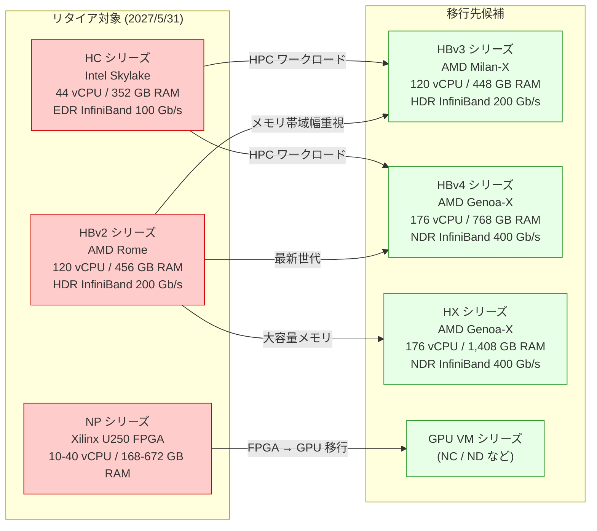

# Azure Virtual Machines: HC / HBv2 / NP シリーズ HPC VM のリタイア

**リリース日**: 2026-03-19

**サービス**: Azure Virtual Machines

**機能**: HC / HBv2 / NP シリーズ VM のリタイア

**ステータス**: Retirement

[このアップデートのインフォグラフィックを見る](https://takech9203.github.io/azure-news-summary/20260319-hpc-vm-series-retirement.html)

## 概要

Microsoft は、Azure のハイパフォーマンスコンピューティング (HPC) および FPGA アクセラレーション向け仮想マシンである HC シリーズ、HBv2 シリーズ、NP シリーズの 3 つの VM シリーズを 2027 年 5 月 31 日にリタイアすることを発表した。これらのシリーズはいずれも旧世代のプロセッサやインターコネクトを使用しており、より新しい世代の VM シリーズへの移行が推奨されている。

HC シリーズは Intel Xeon Platinum 8168 (Skylake) プロセッサと 100 Gb/s EDR InfiniBand を搭載し、構造解析や分子動力学シミュレーションなどの HPC ワークロードに使用されてきた。HBv2 シリーズは AMD EPYC 7V12 (Rome) プロセッサと 200 Gb/s HDR InfiniBand を搭載し、流体力学や有限要素解析などのメモリ帯域幅を要求するワークロードに対応してきた。NP シリーズは Xilinx (現 AMD) Alveo U250 FPGA を搭載し、機械学習推論やビデオトランスコーディングなどのアクセラレーションワークロードに使用されてきた。

リタイア日以降、これらの VM サイズでの新規デプロイおよび既存 VM の運用ができなくなるため、2027 年 5 月 31 日までに後継シリーズへの移行を完了する必要がある。

**リタイア前の状態**

- HC シリーズ (Skylake / EDR InfiniBand 100 Gb/s) で HPC ワークロードを運用中
- HBv2 シリーズ (Rome / HDR InfiniBand 200 Gb/s) でメモリ帯域幅集約型ワークロードを運用中
- NP シリーズ (Xilinx U250 FPGA) で FPGA アクセラレーションワークロードを運用中

**リタイア後の改善**

- HBv3 シリーズ (Milan-X / HDR InfiniBand 200 Gb/s) や HBv4 シリーズ (Genoa-X / NDR InfiniBand 400 Gb/s) への移行により、CPU 性能・メモリ帯域幅・InfiniBand 速度が大幅に向上する
- HBv4 / HX シリーズでは AMD 3D V-Cache テクノロジーにより、L3 キャッシュ容量が最大 2,304 MB に拡大し、多くのワークロードで実効メモリ帯域幅が向上する
- NP シリーズからは GPU VM シリーズへの移行により、より広いアクセラレーションエコシステムの活用が可能になる

## アーキテクチャ図

リタイア対象の 3 シリーズと、それぞれのワークロード特性に応じた推奨移行先を示している。HC / HBv2 シリーズは HBv3 / HBv4 / HX シリーズへ、NP シリーズは GPU VM シリーズへの移行が推奨される。

## サービスアップデートの詳細

### 主要な変更点

1. **HC シリーズのリタイア**
   - 対象 VM サイズ: Standard_HC44rs、Standard_HC44-16rs、Standard_HC44-32rs
   - Intel Xeon Platinum 8168 (Skylake)、最大 44 vCPU、352 GB RAM
   - 100 Gb/s Mellanox EDR InfiniBand 搭載
   - 推奨移行先: HBv3 シリーズまたは HBv4 シリーズ

2. **HBv2 シリーズのリタイア**
   - 対象 VM サイズ: Standard_HB120rs_v2、Standard_HB120-96rs_v2、Standard_HB120-64rs_v2、Standard_HB120-32rs_v2、Standard_HB120-16rs_v2
   - AMD EPYC 7V12 (Rome)、最大 120 vCPU、456 GB RAM
   - 200 Gb/s Mellanox HDR InfiniBand 搭載
   - 推奨移行先: HBv3 シリーズ、HBv4 シリーズ、または HX シリーズ

3. **NP シリーズのリタイア**
   - 対象 VM サイズ: Standard_NP10s、Standard_NP20s、Standard_NP40s
   - Intel Xeon 8171M (Skylake)、Xilinx (AMD) Alveo U250 FPGA 搭載
   - 最大 40 vCPU、672 GB RAM、最大 4 基の FPGA (合計 256 GB FPGA メモリ)
   - 推奨移行先: GPU VM シリーズ (ワークロードに応じて選定)

## 技術仕様

### リタイア対象シリーズの比較

| 項目 | HC シリーズ | HBv2 シリーズ | NP シリーズ |
|------|------|------|------|
| プロセッサ | Intel Xeon Platinum 8168 (Skylake) | AMD EPYC 7V12 (Rome) | Intel Xeon 8171M (Skylake) |
| 最大 vCPU 数 | 44 | 120 | 40 |
| メモリ | 352 GB | 456 GB | 672 GB |
| メモリ帯域幅 | 191 GB/s | 350 GB/s | - |
| InfiniBand | EDR 100 Gb/s | HDR 200 Gb/s | なし |
| アクセラレータ | なし | なし | Xilinx Alveo U250 FPGA (最大 4 基) |
| リタイア日 | 2027/5/31 | 2027/5/31 | 2027/5/31 |

### 推奨移行先シリーズの比較

| 項目 | HBv3 シリーズ | HBv4 シリーズ | HX シリーズ |
|------|------|------|------|
| プロセッサ | AMD EPYC 7V73X (Milan-X) | AMD EPYC 9V33X (Genoa-X) | AMD EPYC 9V33X (Genoa-X) |
| 最大 vCPU 数 | 120 | 176 | 176 |
| メモリ | 448 GB | 768 GB | 1,408 GB |
| メモリ帯域幅 | 350 GB/s | 780 GB/s | 780 GB/s |
| L3 キャッシュ | 1,536 MB | 2,304 MB | 2,304 MB |
| InfiniBand | HDR 200 Gb/s | NDR 400 Gb/s | NDR 400 Gb/s |
| 3D V-Cache | あり | あり | あり |

## 推奨される対応

### 前提条件

1. 現在使用している VM サイズとリージョンを確認すること
2. ワークロードの CPU コア数、メモリ容量、InfiniBand / FPGA 要件を把握していること
3. 移行先の VM シリーズがデプロイ先リージョンで利用可能であることを確認すること

### 移行先の選定ガイドライン

**HC シリーズからの移行:**

- **HBv3 シリーズ**: HC の 44 vCPU / 352 GB RAM に対して 120 vCPU / 448 GB RAM を提供。InfiniBand が EDR (100 Gb/s) から HDR (200 Gb/s) に向上する。Milan-X の 3D V-Cache により L3 キャッシュが大幅に拡大し、多くの HPC ワークロードで性能が向上する
- **HBv4 シリーズ**: 最大 176 vCPU / 768 GB RAM を提供。NDR InfiniBand (400 Gb/s) により MPI 通信性能がさらに向上する。最新世代への移行を推奨

**HBv2 シリーズからの移行:**

- **HBv3 シリーズ**: 同じ 120 vCPU 構成が利用可能。プロセッサが Rome から Milan-X にアップグレードされ、3D V-Cache による性能向上が見込める。HDR InfiniBand は同一
- **HBv4 シリーズ**: 最大 176 vCPU に拡張可能。InfiniBand が HDR (200 Gb/s) から NDR (400 Gb/s) に倍増する
- **HX シリーズ**: メモリ容量が 1,408 GB と大容量。メモリ集約型の HPC ワークロード (EDA、リザーバシミュレーションなど) に最適

**NP シリーズからの移行:**

- NP シリーズは FPGA アクセラレーションに特化した VM であり、直接的な後継シリーズは現時点で公式に発表されていない。ワークロードの種類に応じて GPU VM シリーズへの移行を検討すること

## デメリット・制約事項

- NP シリーズから GPU VM シリーズへの移行では、FPGA 向けに開発されたアプリケーション (Vitis/XRT ベースのカスタムロジックなど) の GPU 向けへの書き換えが必要になる場合がある
- HC シリーズ (Intel Skylake) から HBv3/HBv4 シリーズ (AMD EPYC) への移行では、Intel 固有の最適化 (Intel MKL、AVX-512 など) を使用しているアプリケーションの再検証が必要になる可能性がある
- 移行先シリーズのリージョン展開状況により、現在のリージョンで同一の VM サイズが利用できない場合がある
- HBv4 / HX シリーズは Generation 1 VM をサポートしていないため、Generation 2 VM イメージへの変更が必要である

## ユースケース

### ユースケース 1: 流体力学シミュレーション (HC → HBv4)

**シナリオ**: HC シリーズで OpenFOAM や ANSYS Fluent を使用した CFD シミュレーションを実行しているケース

**効果**: HBv4 シリーズへの移行により、vCPU 数が 44 から最大 176 に増加し、InfiniBand が EDR (100 Gb/s) から NDR (400 Gb/s) に高速化される。3D V-Cache による L3 キャッシュ拡大 (60.5 MB → 2,304 MB) により、メッシュデータへのアクセスが高速化され、シミュレーション全体の性能向上が期待できる

### ユースケース 2: 有限要素解析 (HBv2 → HBv3)

**シナリオ**: HBv2 シリーズで大規模な構造解析 (LS-DYNA、Abaqus など) を実行しているケース

**効果**: HBv3 シリーズへの移行により、同一の 120 vCPU 構成を維持しつつ、Milan-X プロセッサの 3D V-Cache (1,536 MB L3) によりキャッシュミスが減少し、ソルバー性能が向上する。既存の MPI 構成やジョブスケジューラの設定変更は最小限で済む

## 関連サービス・機能

- **Azure CycleCloud**: HPC クラスターのプロビジョニングと管理。VM シリーズの変更時にクラスターテンプレートの更新が必要
- **Azure Batch**: HPC ワークロードのスケジューリングとジョブ管理。プール構成で VM サイズの変更が必要
- **Azure HPC On-Demand Platform (HPC Pack)**: オンプレミスと Azure のハイブリッド HPC 環境。ノードテンプレートの更新が必要

## 参考リンク

- [インフォグラフィック](https://takech9203.github.io/azure-news-summary/20260319-hpc-vm-series-retirement.html)
- [公式アップデート情報 - HC シリーズ](https://azure.microsoft.com/updates?id=548543)
- [公式アップデート情報 - HBv2 シリーズ](https://azure.microsoft.com/updates?id=548525)
- [公式アップデート情報 - NP シリーズ](https://azure.microsoft.com/updates?id=548497)
- [HC シリーズ VM サイズ - Microsoft Learn](https://learn.microsoft.com/en-us/azure/virtual-machines/sizes/high-performance-compute/hc-series)
- [HBv2 シリーズ VM サイズ - Microsoft Learn](https://learn.microsoft.com/en-us/azure/virtual-machines/sizes/high-performance-compute/hbv2-series)
- [NP シリーズ VM サイズ - Microsoft Learn](https://learn.microsoft.com/en-us/azure/virtual-machines/sizes/fpga-accelerated/np-series)
- [HBv3 シリーズ VM サイズ - Microsoft Learn](https://learn.microsoft.com/en-us/azure/virtual-machines/sizes/high-performance-compute/hbv3-series)
- [HBv4 シリーズ VM サイズ - Microsoft Learn](https://learn.microsoft.com/en-us/azure/virtual-machines/sizes/high-performance-compute/hbv4-series)
- [HX シリーズ VM サイズ - Microsoft Learn](https://learn.microsoft.com/en-us/azure/virtual-machines/sizes/high-performance-compute/hx-series)

## まとめ

Azure の HPC / FPGA 向け旧世代 VM である HC シリーズ、HBv2 シリーズ、NP シリーズが 2027 年 5 月 31 日にリタイアとなる。リタイアまで約 14 か月の猶予があるが、HPC ワークロードの移行にはアプリケーションの再検証やジョブスケジューラの設定変更が伴うため、早期の移行計画策定が推奨される。

HC / HBv2 シリーズのユーザーは、HBv3 シリーズ (Milan-X / HDR 200 Gb/s) または HBv4 シリーズ (Genoa-X / NDR 400 Gb/s) への移行を検討すべきである。特に HBv4 / HX シリーズでは AMD 3D V-Cache と NDR InfiniBand により、多くの HPC ワークロードで大幅な性能向上が期待できる。NP シリーズのユーザーは、FPGA ワークロードの特性を評価し、GPU VM シリーズへの移行を含めた代替手段を検討する必要がある。

---

**タグ**: #Azure #VirtualMachines #HPC #HC #HBv2 #NP #HBv3 #HBv4 #HX #FPGA #InfiniBand #Retirement #Migration #Compute
