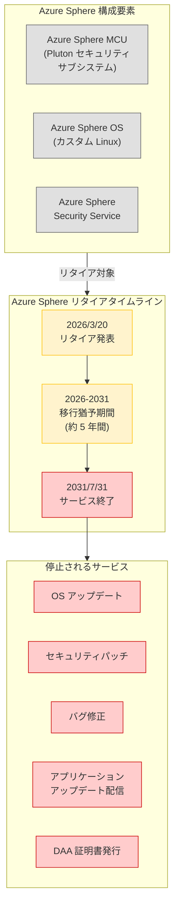

# Azure Sphere: Azure Sphere サービスのリタイア

**リリース日**: 2026-03-20

**サービス**: Azure Sphere

**機能**: Azure Sphere サービスのリタイア

**ステータス**: Retirement

[このアップデートのインフォグラフィックを見る](https://takech9203.github.io/azure-news-summary/20260320-azure-sphere-retirement.html)

## 概要

Microsoft は、IoT デバイス向けのセキュアプラットフォームである Azure Sphere サービスを 2031 年 7 月 31 日にリタイアすることを発表した。リタイア日以降、すべての顧客アプリケーション、OS、バグ修正およびセキュリティアップデートの提供が停止され、DAA (Device Authentication and Attestation) 証明書の発行も終了する。

Azure Sphere は、セキュアな MCU (マイクロコントローラーユニット)、カスタム Linux ベースの OS、およびクラウドベースのセキュリティサービスの 3 つのコンポーネントで構成される包括的な IoT セキュリティソリューションである。ハードウェアレベルの信頼の根拠 (Root of Trust) を備えた Pluton セキュリティサブシステム、多層防御、パスワードレス認証などの高度なセキュリティ機能を提供し、インターネット接続デバイスのセキュアな運用を実現してきた。

リタイアまで約 5 年の猶予期間が設けられているが、Azure Sphere を使用しているデバイスメーカーおよびエンドユーザーは、代替ソリューションへの移行計画を策定する必要がある。

**リタイア前の状態**

- Azure Sphere MCU を搭載した IoT デバイスが Azure Sphere Security Service を通じて OS およびアプリケーションの自動アップデートを受信
- DAA 証明書によるパスワードレスのデバイス認証とクラウド接続
- Pluton セキュリティサブシステムによるハードウェアベースのセキュリティ保護
- エラーレポートサービスによるデバイスの遠隔監視・診断

**リタイア後の推奨アクション**

- 2031 年 7 月 31 日までに代替 IoT セキュリティソリューションへの移行を完了すること
- OS アップデート、セキュリティパッチ、バグ修正が停止するため、リタイア日以降はデバイスのセキュリティが維持されなくなることに留意すること
- DAA 証明書の発行停止により、新規デバイスのクラウド認証ができなくなるため、認証方式の変更を計画すること

## アーキテクチャ図

Azure Sphere の 3 つの構成要素 (MCU、OS、Security Service) がリタイア対象であり、2031 年 7 月 31 日のサービス終了後にすべてのクラウドベースサービスが停止されることを示している。

## サービスアップデートの詳細

### 主要な変更点

1. **OS およびセキュリティアップデートの停止**
   - Azure Sphere OS の自動アップデート配信が 2031 年 7 月 31 日に終了する
   - セキュリティパッチおよびバグ修正の提供が停止される
   - リタイア日以降、新たに発見された脆弱性に対するパッチが提供されなくなる

2. **アプリケーションアップデート配信の停止**
   - Azure Sphere Security Service を通じたアプリケーションソフトウェアの OTA (Over-the-Air) アップデート配信が終了する
   - デバイスメーカーによるアプリケーションの遠隔更新が不可能になる

3. **DAA 証明書発行の停止**
   - デバイス認証・アテステーション (DAA) 証明書の発行が終了する
   - 新規デバイスの Azure Sphere Security Service への登録およびクラウドサービスとのセキュアな接続確立ができなくなる

4. **エラーレポートサービスの停止**
   - デバイスからのクラッシュレポートおよび運用データの収集・分析が終了する

## 技術仕様

### Azure Sphere 構成要素の概要

| 項目 | 詳細 |
|------|------|
| MCU アーキテクチャ | ARM Cortex-A (高レベルアプリ) + ARM Cortex-M (リアルタイム) |
| セキュリティサブシステム | Microsoft Pluton (ハードウェア Root of Trust) |
| OS | カスタム Linux ベース OS |
| 通信 | 802.11 b/g/n Wi-Fi (2.4GHz / 5GHz)、Ethernet |
| 最小メモリ | 4 MB RAM / 16 MB Flash |
| クラウドサービス | Azure Sphere Security Service (認証・アップデート・エラーレポート) |
| リタイア日 | 2031 年 7 月 31 日 |

### リタイアによる影響

| 影響項目 | リタイア前 | リタイア後 |
|------|------|------|
| OS アップデート | 自動配信 | 停止 |
| セキュリティパッチ | 自動適用 | 停止 |
| アプリケーション配信 | OTA 配信可能 | 停止 |
| デバイス認証 | DAA 証明書による認証 | 証明書発行停止 |
| エラーレポート | クラウド収集・分析 | 停止 |

## 推奨される対応

### 前提条件

1. Azure Sphere を使用しているデバイスの台数、配置場所、用途を棚卸しすること
2. 各デバイスのアプリケーション構成とクラウド接続先 (Azure IoT Hub 等) を把握すること
3. リタイアまでの移行スケジュールを策定すること

### 移行計画のガイドライン

1. **デバイスインベントリの作成**: Azure Sphere Security Service に登録されているすべてのデバイスとデバイスグループを確認し、対象範囲を明確にする
2. **代替プラットフォームの評価**: IoT デバイスのセキュリティ要件に基づき、代替となるハードウェアおよびソフトウェアプラットフォームを評価する
3. **段階的移行の実施**: リタイアまで約 5 年の猶予があるため、段階的な移行計画を立て、パイロットプロジェクトから開始することを推奨する
4. **クラウド接続の再設計**: DAA 証明書に依存しない認証方式 (X.509 証明書、SAS トークン等) への移行を計画する

## デメリット・制約事項

- Azure Sphere は MCU ハードウェア、OS、クラウドサービスが一体となったソリューションであるため、ソフトウェアのみの変更では代替が困難であり、ハードウェアの置き換えが必要になる場合がある
- 既に製品として出荷済みのデバイスについては、物理的なハードウェア交換が必要になる可能性があり、フィールドでの対応コストが大きくなる場合がある
- Pluton セキュリティサブシステムに依存したセキュリティアーキテクチャを採用しているため、同等のハードウェアベースセキュリティを提供する代替ソリューションの選定に時間を要する可能性がある
- リタイア日以降もデバイスのハードウェア自体は動作し続けるが、セキュリティアップデートが停止するため、セキュリティリスクが時間とともに増大する

## ユースケース

### ユースケース 1: 製造業の IoT デバイス監視

**シナリオ**: Azure Sphere MCU を搭載した産業用センサーデバイスで工場設備の温度・振動・稼働状況を監視し、Azure IoT Hub 経由でクラウドにデータを送信しているケース

**効果**: リタイアまでに代替 MCU プラットフォームへの移行を計画し、Azure IoT Hub との接続を X.509 証明書ベースの認証に切り替えることで、クラウドモニタリング機能を維持できる。5 年間の猶予を活用して段階的にデバイスを更新することで、運用への影響を最小化できる

### ユースケース 2: 家電メーカーのコネクテッドデバイス

**シナリオ**: Azure Sphere を搭載したスマート家電 (食洗機、冷蔵庫等) で、ファームウェアの OTA アップデートとエラー診断を Azure Sphere Security Service 経由で実施しているケース

**効果**: 製品ライフサイクルを考慮し、次世代製品では代替 IoT プラットフォームを採用する。既存出荷済み製品については、リタイア日までにアップデートサービスの代替手段を整備するか、最終アップデートで安定版ファームウェアを配信する計画を策定する

## 関連サービス・機能

- **Azure IoT Hub**: IoT デバイスとクラウド間の双方向通信を提供。Azure Sphere デバイスの多くが接続先として使用しており、代替プラットフォームでも引き続き利用可能
- **Azure IoT Central**: フルマネージドの IoT アプリケーションプラットフォーム。Azure Sphere からの移行先としてデバイス管理機能を活用できる
- **Azure RTOS (Eclipse ThreadX)**: リアルタイム OS。Azure Sphere MCU のリアルタイムコアで使用可能であり、代替プラットフォームでも引き続き利用可能
- **Microsoft Defender for IoT**: IoT / OT 環境のセキュリティ監視。Azure Sphere リタイア後のデバイスセキュリティ強化に活用できる

## 参考リンク

- [インフォグラフィック](https://takech9203.github.io/azure-news-summary/20260320-azure-sphere-retirement.html)
- [公式アップデート情報](https://azure.microsoft.com/updates?id=557123)
- [Azure Sphere とは - Microsoft Learn](https://learn.microsoft.com/en-us/azure-sphere/product-overview/what-is-azure-sphere)
- [Azure Sphere ドキュメント - Microsoft Learn](https://learn.microsoft.com/en-us/azure-sphere/)

## まとめ

Azure Sphere サービスが 2031 年 7 月 31 日にリタイアとなり、OS アップデート、セキュリティパッチ、アプリケーション配信、DAA 証明書発行を含むすべてのクラウドサービスが停止される。リタイアまで約 5 年の猶予期間があるが、Azure Sphere はハードウェア (MCU)、OS、クラウドサービスが一体となったソリューションであるため、移行にはハードウェアの置き換えを含む包括的な計画が必要となる。

Azure Sphere を使用しているデバイスメーカーは、早期にデバイスインベントリを作成し、代替 IoT プラットフォームの評価を開始することが推奨される。特に、既に出荷済みの製品については物理的なデバイス交換が必要になる可能性があるため、製品ライフサイクルとリタイアスケジュールを照合し、段階的な移行計画を策定すべきである。

---

**タグ**: #Azure #AzureSphere #IoT #Security #MCU #Pluton #Retirement #Migration #DAA #OTA
