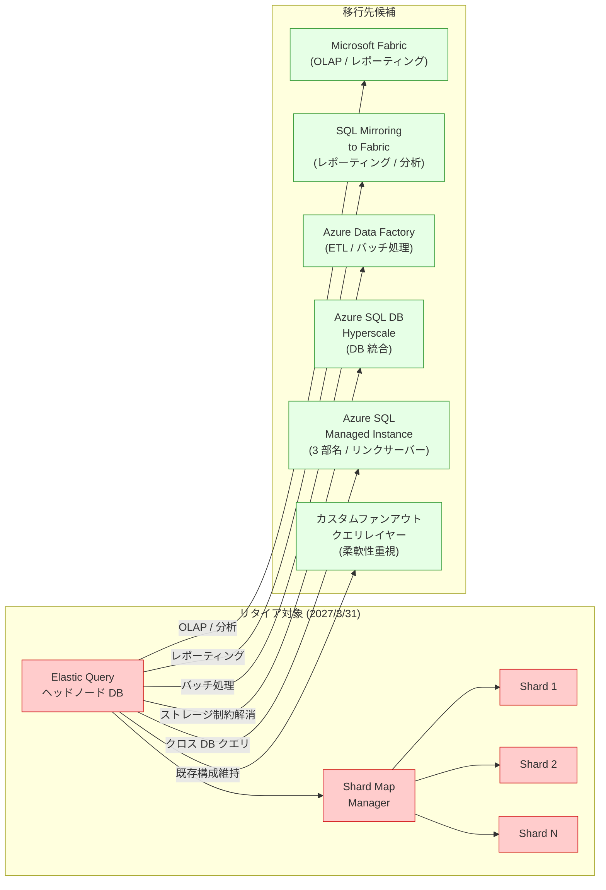

# Azure SQL Database: Elastic query - Shard_Map_Manager モードのリタイア

**リリース日**: 2026-03-20

**サービス**: Azure SQL Database

**機能**: Elastic query - Shard_Map_Manager モードのサポート終了

**ステータス**: Retirement

[このアップデートのインフォグラフィックを見る](https://takech9203.github.io/azure-news-summary/20260320-sql-elastic-query-shard-map-retirement.html)

## 概要

Microsoft は、Azure SQL Database の Elastic query における Shard_Map_Manager モード (水平パーティショニング) のサポートを 2027 年 3 月 31 日に終了することを発表した。Elastic query の `EXTERNAL DATA SOURCE` タイプ `SHARD_MAP_MANAGER` を使用した外部データソースの作成が不可能になり、既存のワークロードは引き続き動作するものの、更新やサポートは提供されなくなる。

Elastic query の Shard_Map_Manager モードは、シャードマップを使用して水平パーティショニングされたデータベース群に対してクロスデータベースクエリを実行する機能である。シャードマップマネージャーが各シャードの配置情報を管理し、ヘッドノードとなるデータベースから全シャードに対して並列クエリを実行することで、スケールアウトされたデータ層に対するレポーティングを可能にしていた。

なお、垂直パーティショニング (クロスデータベースクエリ) で使用される `EXTERNAL DATA SOURCE` タイプ `RDBMS` は今回のリタイア対象に含まれていない。影響を受けるのは `SHARD_MAP_MANAGER` タイプを使用しているワークロードのみである。

**リタイア前の状態**

- Elastic query の `SHARD_MAP_MANAGER` 外部データソースタイプを使用して、シャーディングされたデータベース群に対するクロスシャードクエリを実行可能
- シャードマップによる自動的なシャード検出と並列クエリ実行をサポート

**リタイア後の変更**

- 新規の `SHARD_MAP_MANAGER` タイプの外部データソース作成が不可能になる
- 既存ワークロードは動作を継続するが、サポートおよび更新は提供されない
- Microsoft Fabric、Azure Data Factory、Azure SQL Database Hyperscale、Azure SQL Managed Instance などへの移行が推奨される

## アーキテクチャ図

Elastic query の Shard_Map_Manager モードによるクロスシャードクエリ構成 (左) と、ユースケースに応じた移行先候補 (右) を示している。移行先はワークロードの特性に応じて選定する必要がある。

## サービスアップデートの詳細

### 主要な変更点

1. **Shard_Map_Manager 外部データソースのサポート終了**
   - 2027 年 3 月 31 日以降、`CREATE EXTERNAL DATA SOURCE ... TYPE = SHARD_MAP_MANAGER` による新規作成が不可能になる
   - 既存の外部データソースおよびそれを参照する外部テーブルは引き続き動作するが、サポート対象外となる

2. **垂直パーティショニング (RDBMS タイプ) は影響なし**
   - `EXTERNAL DATA SOURCE` タイプ `RDBMS` を使用したクロスデータベースクエリ (垂直パーティショニング) は今回のリタイア対象外

## 技術仕様

| 項目 | 詳細 |
|------|------|
| 対象機能 | Elastic query - `EXTERNAL DATA SOURCE` タイプ `SHARD_MAP_MANAGER` |
| サポート終了日 | 2027 年 3 月 31 日 |
| 影響範囲 | 水平パーティショニング (シャーディング) モードのみ |
| 既存ワークロード | サポート終了後も動作は継続するが、更新・サポートは提供されない |
| 新規作成 | サポート終了後は `SHARD_MAP_MANAGER` タイプの外部データソース作成が不可 |

## 推奨される移行先

### Microsoft Fabric

**最適なケース**: OLAP (オンライン分析処理) およびレポーティングシナリオ

大規模な分析とレポーティングに対応し、シームレスなデータ統合と高度な分析ワークロードを実現する。ただし、既存ソリューションのリアーキテクチャやチームの再トレーニングが必要になる場合がある。

### SQL Mirroring to Fabric

**最適なケース**: 集約データに対するレポーティングと分析

SQL データベースを Fabric にミラーリングすることで、集約データに対するレポーティングと分析を簡素化できる。ソースデータとミラーリングデータ間のレイテンシおよび同期要件を考慮する必要がある。

### ETL ベースのアプローチ (Azure Data Factory)

**最適なケース**: バッチ処理およびスケジュールされたデータ移動

Azure Data Factory (ADF) を使用した ETL パイプラインにより、柔軟なスケジュール型のデータ移動と変換が可能。バッチ処理には適しているが、データの鮮度にはタイムラグが生じる場合がある。

### Azure SQL Database Hyperscale

**最適なケース**: ストレージ制約のためにシャーディングを導入していたワークロード

Hyperscale はあらゆるサイズのデータベースをサポートし、高速なバックアップ・リストアと高い並行性を提供する。シャーディングがストレージ制約への対応策だった場合、モノリシックなデータベースへの統合が可能。

### Azure SQL Managed Instance

**最適なケース**: 3 部名 (three-part name) やリンクサーバーを使用したクロスデータベースクエリ

Azure SQL Managed Instance は 3 部名クエリとリンクサーバーをネイティブにサポートしている。ポイントツーポイントのクロスデータベースクエリに Elastic query を使用していた場合の自然な移行先となる。

### Elastic Jobs

**最適なケース**: 結果集約なしで個別データベースに対するクエリを実行するケース

個別のデータベースやシャードに対してクエリを実行し、結果の集約が不要な場合に適している。結果集約はサポートしていないため、独立したクエリ実行で十分なシナリオに限定される。

### カスタムファンアウトクエリレイヤー

**最適なケース**: 既存の Azure SQL Database アーキテクチャを維持しつつ最大限の柔軟性が必要なケース

カスタムのファンアウトおよび集約レイヤーを構築することで、既存のアーキテクチャを維持しつつ最大限の柔軟性を確保できる。開発工数、継続的なメンテナンス、堅牢なエラーハンドリングの実装が必要となる。

## デメリット・制約事項

- Elastic query の Shard_Map_Manager モードは現在もプレビュー機能であり、GA (一般提供) には至らずにサポート終了となる
- 移行先の選定はワークロードの特性に大きく依存し、単一の代替手段では全てのケースをカバーできない
- Microsoft Fabric や Hyperscale への移行では、既存のアプリケーションロジックやクエリパターンのリアーキテクチャが必要になる可能性がある
- ETL ベースのアプローチではリアルタイム性が失われる
- カスタムファンアウトレイヤーの構築には開発・運用コストが伴う

## 関連サービス・機能

- **Azure SQL Database Elastic query (垂直パーティショニング)**: `RDBMS` タイプの外部データソースを使用したクロスデータベースクエリ。今回のリタイア対象外
- **Elastic Database クライアントライブラリ**: シャードマップの作成・管理に使用されるクライアントライブラリ。Shard_Map_Manager モードの前提となる
- **Elastic Database ツール**: シャーディング構成の管理ツール群。分割/マージサービスなどを含む
- **Microsoft Fabric**: 大規模な分析ワークロード向けの統合分析プラットフォーム
- **Azure Data Factory**: データ統合・ETL サービス

## 参考リンク

- [インフォグラフィック](https://takech9203.github.io/azure-news-summary/20260320-sql-elastic-query-shard-map-retirement.html)
- [公式アップデート情報](https://azure.microsoft.com/updates?id=558086)
- [Elastic query 概要 - Microsoft Learn](https://learn.microsoft.com/en-us/azure/azure-sql/database/elastic-query-overview)
- [水平パーティショニングでの Elastic query - Microsoft Learn](https://learn.microsoft.com/en-us/azure/azure-sql/database/elastic-query-horizontal-partitioning)
- [Shard Map Manager モードからの移行ガイド - Microsoft Learn](https://learn.microsoft.com/en-us/azure/azure-sql/database/elastic-query-horizontal-partitioning-migration)
- [シャードマップ管理 - Microsoft Learn](https://learn.microsoft.com/en-us/azure/azure-sql/database/elastic-scale-shard-map-management)

## まとめ

Azure SQL Database の Elastic query における Shard_Map_Manager モード (水平パーティショニング) が 2027 年 3 月 31 日にサポート終了となる。サポート終了日以降も既存ワークロードは動作を継続するが、新規の外部データソース作成が不可能になり、更新やサポートも提供されなくなる。

サポート終了まで約 1 年の猶予があるが、移行先の選定はワークロードの特性に大きく依存するため、早期の評価と計画策定が推奨される。OLAP やレポーティング用途であれば Microsoft Fabric や SQL Mirroring to Fabric、ストレージ制約のためにシャーディングを導入していた場合は Hyperscale への統合、クロスデータベースクエリが必要であれば Azure SQL Managed Instance が有力な移行先となる。まずは現在のワークロードの利用パターンを分析し、Microsoft Learn の移行ガイドを参照して適切な移行先を選定することを推奨する。

---

**タグ**: #Azure #SQLDatabase #ElasticQuery #ShardMapManager #Sharding #Retirement #Migration #MicrosoftFabric #Hyperscale #ManagedInstance #DataFactory
