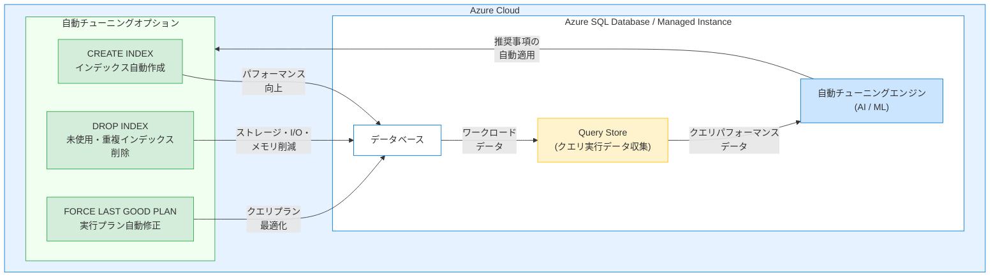

# Azure SQL: 2026 年 3 月中旬アップデート

**リリース日**: 2026-03-20

**サービス**: Azure SQL Database / Azure SQL Managed Instance

**機能**: 自動インデックス管理およびパフォーマンス最適化のアップデート

**ステータス**: In preview

[このアップデートのインフォグラフィックを見る](https://takech9203.github.io/azure-news-summary/20260320-sql-mid-march-updates.html)

## 概要

2026 年 3 月中旬、Azure SQL Database および Azure SQL Managed Instance に対して、ストレージ容量、I/O、メモリの消費を削減し、インデックスメンテナンスジョブに時間と労力を費やすことなくパフォーマンスを向上させるアップデートがプレビューとして公開された。

Azure SQL の自動チューニング機能は、AI と機械学習を活用してクエリの実行を継続的に監視し、データベースのパフォーマンスを自動的に最適化する。今回のアップデートでは、インデックス管理に関連する機能強化が行われ、手動でのインデックスメンテナンス作業を削減しながら、ストレージ、I/O、メモリの効率的な利用を実現することが目的とされている。

**アップデート前の課題**

- インデックスの作成・削除・再構築を DBA が手動で管理する必要があり、運用負荷が高かった
- 未使用インデックスや重複インデックスがストレージ容量、I/O、メモリを不必要に消費していた
- ワークロードの変化に応じたインデックス最適化がリアクティブな対応になりがちであった

**アップデート後の改善**

- インデックスメンテナンスジョブへの手動介入を削減し、自動的にパフォーマンスを最適化
- ストレージ容量、I/O、メモリの消費を自動的に削減
- ワークロードの変化に適応したインデックス管理が可能に

## アーキテクチャ図



Azure SQL の自動チューニングエンジンが Query Store から収集したクエリ実行データを分析し、CREATE INDEX、DROP INDEX、FORCE LAST GOOD PLAN の 3 つのオプションを自動的に適用することで、データベースのパフォーマンスを継続的に最適化する仕組みを示している。

## サービスアップデートの詳細

### 主要機能

1. **CREATE INDEX (インデックスの自動作成)**
   - ワークロードのパフォーマンスを向上させる可能性のあるインデックスを自動的に特定し作成する
   - 作成後にクエリパフォーマンスの改善が確認されない場合、変更は自動的にロールバックされる
   - データベースの空き容量が最大データサイズの 10% を下回ると推定される場合、インデックス推奨は生成されない
   - クラスター化インデックスまたはヒープが 10 GB を超えるテーブルには推奨が提供されない

2. **DROP INDEX (未使用・重複インデックスの自動削除)**
   - 過去 90 日間使用されていないインデックスおよび重複インデックスを自動的に削除する
   - プライマリキーやユニーク制約をサポートするユニークインデックスは削除対象外
   - インデックスヒントを使用するクエリがワークロードに存在する場合、またはパーティション切り替えを行う場合は自動的に無効化される
   - Premium / Business Critical サービスティアでは未使用インデックスは削除されず、重複インデックスのみが削除される

3. **FORCE LAST GOOD PLAN (自動プラン修正)**
   - 以前の良好なプランよりも遅い実行プランを使用しているクエリを特定し、最後に確認された良好なプランを強制適用する
   - Azure SQL Database および Azure SQL Managed Instance の両方でサポート

## 技術仕様

| 項目 | Azure SQL Database | Azure SQL Managed Instance |
|------|------|------|
| CREATE INDEX | サポート (プレビュー) | 非サポート |
| DROP INDEX | サポート (プレビュー) | 非サポート |
| FORCE LAST GOOD PLAN | サポート | サポート |
| 検証期間 | 30 分 - 72 時間 | -- |
| チューニング履歴保持期間 | 21 日間 | -- |
| 構成方法 | Azure Portal / REST API / T-SQL | T-SQL |

## 設定方法

### 前提条件

1. Azure SQL Database または Azure SQL Managed Instance が作成済みであること
2. Query Store が有効化されていること (Read-Write モード)
3. SQL Database contributor 以上の RBAC ロールが付与されていること

### T-SQL

```sql
-- 自動チューニングを Azure 既定値で有効化
ALTER DATABASE CURRENT
SET AUTOMATIC_TUNING = AUTO;

-- 個別オプションを有効化
ALTER DATABASE CURRENT
SET AUTOMATIC_TUNING
(CREATE_INDEX = ON, DROP_INDEX = ON, FORCE_LAST_GOOD_PLAN = ON);

-- サーバーレベルの設定を継承
ALTER DATABASE CURRENT
SET AUTOMATIC_TUNING = INHERIT;
```

### Azure Portal

1. Azure Portal でデータベースまたはサーバーに移動する
2. メニューから「自動チューニング」を選択する
3. 有効化するチューニングオプション (CREATE INDEX、DROP INDEX、FORCE LAST GOOD PLAN) を選択する
4. 「適用」をクリックする

サーバーレベルで設定した場合、そのサーバー配下のすべてのデータベースに自動的に適用される。データベース単位で個別にオーバーライドすることも可能である。

## メリット

### ビジネス面

- DBA の運用負荷を大幅に削減し、より戦略的な業務にリソースを割り当てられる
- インデックス管理の自動化により、人的ミスによるパフォーマンス劣化リスクを軽減できる
- 数十万のデータベースにスケールアウト可能な自動チューニングにより、大規模環境の管理コストを削減できる

### 技術面

- AI / 機械学習ベースの継続的なパフォーマンスチューニングにより、ワークロードの変化に自動適応する
- 不要なインデックスの自動削除により、ストレージ容量、I/O、メモリの消費を最適化する
- パフォーマンスの改善が検証されない場合は自動的にロールバックされるため、安全にチューニングを適用できる

## デメリット・制約事項

- CREATE INDEX および DROP INDEX は Azure SQL Database のみでサポートされ、Azure SQL Managed Instance では利用できない
- Azure 既定値では CREATE_INDEX と DROP_INDEX が無効 (OFF) となっているため、明示的に有効化する必要がある
- Azure Resource Manager (ARM) テンプレートによる自動チューニング設定はサポートされていない
- Query Store が無効化されている場合、またはストレージ不足で停止している場合は、自動チューニングが機能しない
- クラスター化インデックスまたはヒープが 10 GB を超えるテーブルにはインデックス推奨が生成されない
- 本機能はプレビュー段階であり、GA 時に仕様が変更される可能性がある

## ユースケース

### ユースケース 1: 多数のデータベースを運用する SaaS プロバイダー

**シナリオ**: テナントごとに個別の Azure SQL Database を持つ SaaS アプリケーションで、数百のデータベースのインデックス管理を少数の DBA チームで運用しているケース

**効果**: サーバーレベルで自動チューニングを有効化することで、すべてのテナントデータベースに対してインデックスの自動作成・削除が適用される。DBA は個々のデータベースのインデックスを手動管理する必要がなくなり、運用効率が大幅に向上する

### ユースケース 2: ワークロードが変動する EC サイト

**シナリオ**: セールイベントや季節変動によりクエリパターンが大きく変化する EC サイトのバックエンドで、手動でのインデックスチューニングが追いつかないケース

**効果**: FORCE LAST GOOD PLAN によりクエリプランのリグレッションが自動修正され、CREATE INDEX / DROP INDEX によりワークロードの変化に応じたインデックスが自動的に管理される。急激なワークロード変動時にもパフォーマンスの安定性が維持される

## 料金

自動チューニング機能は Azure SQL Database および Azure SQL Managed Instance のサービス料金に含まれており、追加料金は発生しない。データベース自体の料金は購入モデル (DTU ベース / vCore ベース) およびサービスティアにより異なる。

| 購入モデル | サービスティア | 特徴 |
|------|------|------|
| vCore ベース | General Purpose | バランスの取れたコンピュートとストレージ |
| vCore ベース | Business Critical | 高可用性・高 I/O パフォーマンス |
| vCore ベース | Hyperscale | 最大 100 TB の自動スケーリングストレージ |
| DTU ベース | Basic / Standard / Premium | 事前構成済みのリソースバンドル |

## 関連サービス・機能

- **Azure SQL Database**: インデックス自動作成・削除および自動プラン修正の全オプションをサポートするリレーショナルデータベースサービス
- **Azure SQL Managed Instance**: FORCE LAST GOOD PLAN による自動プラン修正をサポート。CREATE INDEX / DROP INDEX は非サポート
- **Query Store**: 自動チューニングの基盤となるクエリ実行データの収集・保持機能。自動チューニングを利用するには有効化が必須
- **Azure Monitor**: 自動チューニングの診断データを Azure Monitor にストリーミングし、長期保持やアラート設定が可能

## 参考リンク

- [インフォグラフィック](https://takech9203.github.io/azure-news-summary/20260320-sql-mid-march-updates.html)
- [公式アップデート情報](https://azure.microsoft.com/updates?id=558116)
- [自動チューニングの概要 - Microsoft Learn](https://learn.microsoft.com/en-us/azure/azure-sql/database/automatic-tuning-overview)
- [自動チューニングの有効化 - Microsoft Learn](https://learn.microsoft.com/en-us/azure/azure-sql/database/automatic-tuning-enable)
- [Azure SQL Database 料金ページ](https://azure.microsoft.com/en-us/pricing/details/azure-sql-database/single/)

## まとめ

2026 年 3 月中旬のアップデートにより、Azure SQL Database および Azure SQL Managed Instance の自動チューニング機能が強化され、インデックスメンテナンスの自動化によるストレージ容量、I/O、メモリの消費削減とパフォーマンス向上がプレビューとして提供された。CREATE INDEX によるインデックスの自動作成、DROP INDEX による未使用・重複インデックスの自動削除、FORCE LAST GOOD PLAN による実行プランの自動修正を組み合わせることで、DBA の運用負荷を大幅に削減しながらデータベースパフォーマンスを継続的に最適化できる。

本機能はプレビュー段階であるため、本番環境での利用にはパフォーマンス検証が推奨される。まずは開発・テスト環境で自動チューニングオプションを有効化し、チューニング履歴を確認しながら段階的に本番環境への適用を検討すべきである。Azure 既定値では CREATE_INDEX と DROP_INDEX が無効になっているため、これらの機能を利用するには明示的に有効化する必要がある。

---

**タグ**: #Azure #AzureSQL #SQLDatabase #SQLManagedInstance #AutomaticTuning #IndexManagement #Performance #Preview #Database
