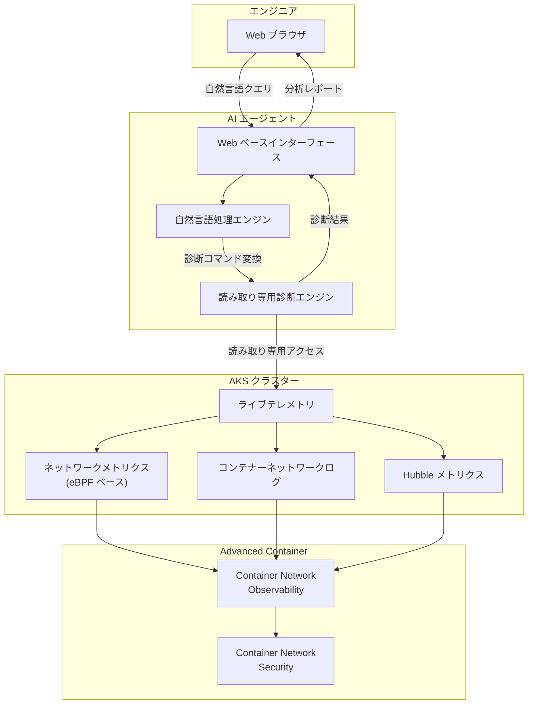

# Azure Kubernetes Service (AKS): コンテナーネットワーキングトラブルシューティング用 AI エージェント

**リリース日**: 2026-03-24

**サービス**: Azure Kubernetes Service (AKS)

**機能**: AI Agent for container networking troubleshooting

**ステータス**: In preview (パブリックプレビュー)

[このアップデートのインフォグラフィックを見る](https://takech9203.github.io/azure-news-summary/20260324-aks-ai-agent-networking-troubleshooting.html)

## 概要

Kubernetes クラスターにおけるネットワーキングの問題をトラブルシューティングする際、ログやメトリクスが複数のツールに分散しているため、エンジニアはインシデント発生時に手動でシグナルを相関付ける必要があり、解決までに時間がかかるという課題があった。この課題を解決するために、Microsoft はコンテナーネットワーキングトラブルシューティング用の AI エージェントをパブリックプレビューとして発表した。

このエージェントは軽量な Web ベースのインターフェースを提供し、自然言語クエリをライブテレメトリを使用した読み取り専用の診断コマンドに変換する。これにより、エンジニアは複雑なコマンドやツールを操作することなく、対話形式でネットワークの問題を迅速に特定できるようになる。

本機能は KubeCon + CloudNativeCon Europe 2026 にて発表され、AKS の Advanced Container Networking Services スイートの一部として位置づけられている。

**アップデート前の課題**

- ネットワーク問題のトラブルシューティングに必要なログやメトリクスが複数のツールに分散している
- インシデント発生時にエンジニアが手動でシグナルを相関付ける必要があり、解決までの時間が長い
- Kubernetes ネットワーキングの診断には専門的な知識とコマンドラインスキルが求められる

**アップデート後の改善**

- 自然言語でネットワークの問題を質問するだけで診断結果が得られる
- ライブテレメトリを活用したリアルタイムの診断が可能
- 軽量な Web インターフェースにより、専門知識が少ないエンジニアでもトラブルシューティングが可能
- 読み取り専用の操作のため、診断中にクラスターの状態を変更するリスクがない

## アーキテクチャ図

この図は、エンジニアが Web インターフェースを通じて自然言語でクエリを送信し、AI エージェントがそれを読み取り専用の診断コマンドに変換して AKS クラスターのライブテレメトリから情報を取得する流れを示している。Advanced Container Networking Services の Observability 機能と連携してネットワーク診断を行う。

## サービスアップデートの詳細

### 主要機能

1. **自然言語による診断クエリ**
   - エンジニアが日常的な言葉でネットワークの問題を記述すると、AI エージェントがそれを適切な診断コマンドに変換する
   - 複雑な CLI コマンドや複数ツールの操作が不要になる

2. **ライブテレメトリとの統合**
   - AKS クラスターのリアルタイムのネットワークメトリクスやログにアクセスし、現在のクラスター状態に基づいた診断を提供する
   - eBPF ベースのメトリクス収集により、パフォーマンスへの影響を最小限に抑える

3. **読み取り専用の安全な診断**
   - すべての診断操作は読み取り専用であり、クラスターの設定や状態を変更しない
   - インシデント対応中でも安全に使用できる

4. **軽量 Web ベースインターフェース**
   - 追加のツールインストールなしにブラウザから利用可能
   - チーム内での診断結果の共有が容易

## 技術仕様

| 項目 | 詳細 |
|------|------|
| ステータス | パブリックプレビュー |
| 所属スイート | Advanced Container Networking Services |
| インターフェース | Web ベース |
| 診断モード | 読み取り専用 |
| データソース | ライブテレメトリ (ネットワークメトリクス、ログ、Hubble メトリクス) |
| 基盤技術 | eBPF |
| 対応データプレーン | Cilium および非 Cilium (Container Network Observability は両対応) |

## メリット

### ビジネス面

- ネットワーク障害の平均復旧時間 (MTTR) の短縮により、サービス可用性が向上する
- 専門的なネットワークエンジニアリング知識がなくてもトラブルシューティングが可能になり、対応可能な人員が拡大する
- インシデント対応コストの削減が期待できる

### 技術面

- 複数ツールに分散したシグナルを自動的に相関付けることで、根本原因の特定が迅速化する
- 読み取り専用操作により、診断中の意図しないクラスター変更リスクを排除できる
- eBPF ベースのテレメトリ収集により、ワークロードへのパフォーマンスオーバーヘッドが最小限に抑えられる

## デメリット・制約事項

- パブリックプレビュー段階であり、プロダクション環境での使用は推奨されない場合がある
- Advanced Container Networking Services の有効化が前提となる
- AI エージェントの診断精度はプレビュー段階のため、すべてのネットワーク問題を正確に診断できるとは限らない
- 読み取り専用のため、問題の修正は別途手動で行う必要がある

## ユースケース

### ユースケース 1: Pod 間通信の障害調査

**シナリオ**: マイクロサービス間の通信が突然失敗し、サービスがタイムアウトしている。原因が DNS、ネットワークポリシー、CNI 設定のいずれにあるかが不明。

**対応例**: AI エージェントに「Pod A から Pod B への通信がタイムアウトしている原因を調べて」と自然言語で質問すると、エージェントがライブテレメトリからフローログ、DNS 解決状況、ネットワークポリシーの適用状況を自動的に収集・分析し、根本原因を提示する。

**効果**: 従来は複数の kubectl コマンドや Hubble CLI を使って手動で調査する必要があった作業が、自然言語での対話に置き換わり、調査時間が大幅に短縮される。

### ユースケース 2: インシデント対応時の迅速なネットワーク診断

**シナリオ**: 本番環境で外部サービスへの接続が断続的に失敗しており、オンコールエンジニアがネットワークの専門家ではない。

**対応例**: Web インターフェースを開き、「外部サービス example.com への接続が断続的に失敗している。何が原因か」と入力する。エージェントが L3/L4 のフローデータや DNS 解決のメトリクスを自動分析し、結果を提示する。

**効果**: ネットワーク専門知識がないエンジニアでもインシデント対応の初期調査が可能になり、エスカレーションまでの時間を短縮できる。

## 関連サービス・機能

- **Advanced Container Networking Services**: AKS のネットワーキング機能を強化するスイート。Container Network Observability、Container Network Security、Container Network Performance の各機能セットを提供
- **Container Network Observability**: eBPF ベースのネットワーク可観測性機能。ノードレベルメトリクス、Hubble メトリクス、コンテナーネットワークログを提供し、AI エージェントのデータソースとなる
- **Azure Kubernetes Application Network**: KubeCon 2026 で発表された新しいアプリケーションネットワーク機能。mTLS 暗号化、アプリケーション対応の認可ポリシー、詳細なトラフィックテレメトリを提供
- **Azure Managed Prometheus / Grafana**: Container Network Observability のメトリクスの保存・可視化に利用可能

## 参考リンク

- [インフォグラフィック](https://takech9203.github.io/azure-news-summary/20260324-aks-ai-agent-networking-troubleshooting.html)
- [公式アップデート情報](https://azure.microsoft.com/updates?id=557887)
- [KubeCon Europe 2026 関連ブログ](https://opensource.microsoft.com/blog/2026/03/24/whats-new-with-microsoft-in-open-source-and-kubernetes-at-kubecon-cloudnativecon-europe-2026/)
- [Advanced Container Networking Services 概要 - Microsoft Learn](https://learn.microsoft.com/en-us/azure/aks/advanced-container-networking-services-overview)

## まとめ

コンテナーネットワーキングトラブルシューティング用 AI エージェントは、AKS におけるネットワーク問題の診断を自然言語ベースの対話型インターフェースに変革するものである。複数ツールに分散したログやメトリクスを AI が自動的に相関付けることで、エンジニアの負担を軽減し、インシデント対応時間の短縮に貢献する。

推奨される次のアクションは以下の通り:

1. Advanced Container Networking Services を AKS クラスターで有効化し、Container Network Observability を構成する
2. パブリックプレビューの AI エージェント機能を非本番環境で試用し、自然言語による診断の精度と有用性を評価する
3. プレビュー期間中のフィードバックを Microsoft に提供し、GA に向けた機能改善に貢献する

---

**タグ**: #AzureKubernetesService #AKS #AIAgent #ContainerNetworking #Troubleshooting #AdvancedContainerNetworkingServices #Observability #eBPF #Containers #Compute #Preview #KubeCon
