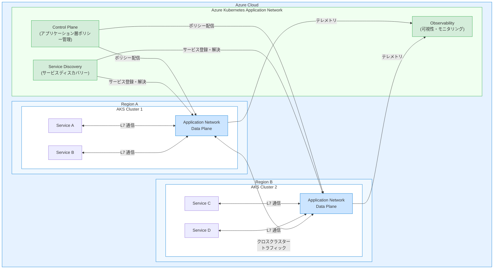

# Azure Kubernetes Service (AKS): Microsoft Azure Kubernetes Application Network

**リリース日**: 2026-03-24

**サービス**: Azure Kubernetes Service (AKS)

**機能**: Azure Kubernetes Application Network

**ステータス**: In preview

[このアップデートのインフォグラフィックを見る](https://takech9203.github.io/azure-news-summary/20260324-aks-application-network.html)

## 概要

Microsoft は Azure Kubernetes Application Network のパブリックプレビューを発表した。Kubernetes 環境がリージョンやクラスターをまたいでスケールするにつれて、IP ベースのネットワーキングの管理が困難になり、アプリケーションレベルでの可視性やセキュリティ制御が限定的になるという課題がある。Azure Kubernetes Application Network は、アプリケーション層の抽象化を導入することで、これらの課題を解決する新しいネットワーキング機能である。

従来の AKS ネットワーキングでは、IP アドレスベースのルーティングやネットワークポリシーが中心であり、マイクロサービス間の通信制御はインフラストラクチャ層に依存していた。Azure Kubernetes Application Network は、アプリケーション層 (L7) での抽象化を提供し、サービス間通信の可視性向上、きめ細かなセキュリティポリシーの適用、マルチクラスター・マルチリージョン環境での統一的なネットワーク管理を実現する。

**アップデート前の課題**

- Kubernetes 環境がリージョンやクラスターをまたいでスケールすると、IP ベースのネットワーキング管理が複雑化していた
- アプリケーションレベルでの可視性が限定的で、サービス間通信のトラブルシューティングが困難であった
- IP アドレスに基づくネットワークポリシーでは、アプリケーション層のセキュリティ制御が不十分であった
- マルチクラスター環境でのサービスディスカバリーやトラフィック管理に一貫性がなかった

**アップデート後の改善**

- アプリケーション層の抽象化により、IP アドレスに依存しないサービス間通信の管理が可能になった
- サービス間のトラフィックフローに対するアプリケーションレベルの可視性が向上した
- L7 レベルのセキュリティポリシーにより、きめ細かなアクセス制御を実現できるようになった
- マルチクラスター・マルチリージョン環境での統一的なネットワーク管理が可能になった

## アーキテクチャ図

Azure Kubernetes Application Network は、複数のリージョン・クラスターにまたがる AKS 環境において、アプリケーション層のコントロールプレーンがポリシー管理・サービスディスカバリー・可視性を統一的に提供する。各クラスターのデータプレーンがサービス間の L7 通信を仲介し、クロスクラスタートラフィックの制御とモニタリングを実現する。

## サービスアップデートの詳細

### 主要機能

1. **アプリケーション層の抽象化**
   - IP アドレスではなく、サービス名やアプリケーション識別子に基づくネットワーキングを提供する
   - Pod の IP アドレスが変更されても、サービス間の通信が自動的に維持される
   - アプリケーション開発者がインフラストラクチャの詳細を意識せずにサービス間通信を構成できる

2. **アプリケーションレベルの可視性**
   - サービス間のトラフィックフロー (HTTP/gRPC レベル) のモニタリングと分析が可能になる
   - リクエストのレイテンシ、エラーレート、スループットなどのメトリクスをアプリケーション単位で収集できる
   - マルチクラスター環境における分散トレーシングをサポートする

3. **L7 セキュリティポリシー**
   - HTTP メソッド、パス、ヘッダーなどに基づくきめ細かなアクセス制御を実現する
   - 従来の IP ベースのネットワークポリシーよりも、アプリケーションのコンテキストに即したセキュリティルールを定義できる
   - サービス間の相互 TLS (mTLS) による暗号化通信を提供する

4. **マルチクラスター・マルチリージョン対応**
   - 複数の AKS クラスターにまたがるサービスメッシュを統一的に管理できる
   - クロスクラスターのサービスディスカバリーにより、リージョンをまたいだサービス間通信が可能になる

## メリット

### ビジネス面

- マルチクラスター環境のネットワーク管理の複雑さが軽減され、運用コストの削減が期待できる
- アプリケーションレベルの可視性向上により、障害の早期検知と迅速な原因特定が可能になる
- セキュリティポリシーの粒度が向上し、コンプライアンス要件への対応が容易になる

### 技術面

- IP ベースの管理から脱却し、アプリケーション中心のネットワーキングモデルに移行できる
- L7 レベルのトラフィック制御により、カナリアリリースや A/B テストなどの高度なデプロイ戦略を実装しやすくなる
- 分散マイクロサービスアーキテクチャにおけるサービス間通信の信頼性が向上する

## デメリット・制約事項

- パブリックプレビュー段階であり、本番環境での利用は推奨されない
- プレビュー期間中は SLA が適用されない
- GA 時に仕様や機能が変更される可能性がある
- アプリケーション層のプロキシ処理によるレイテンシのオーバーヘッドが発生する可能性がある
- 対応リージョンや SKU に制限がある可能性がある (詳細は公式ドキュメントを参照)

## ユースケース

### ユースケース 1: マルチリージョンのマイクロサービスアーキテクチャ

**シナリオ**: グローバル展開する EC サイトが複数リージョンの AKS クラスターでマイクロサービスを運用しており、リージョン間のサービス間通信の管理・可視性・セキュリティが課題となっているケース

**効果**: Azure Kubernetes Application Network により、リージョンをまたいだサービスディスカバリーと L7 トラフィック管理が統一的に行えるようになり、クロスリージョンのフェイルオーバーや負荷分散がアプリケーション層で制御できる

### ユースケース 2: ゼロトラストセキュリティの実装

**シナリオ**: 金融機関がコンテナ化されたアプリケーション群を AKS 上で運用しており、サービス間通信に対してゼロトラストセキュリティモデルを適用する必要があるケース

**効果**: L7 セキュリティポリシーと mTLS により、サービス間の通信をアプリケーション層で認証・認可・暗号化できる。IP アドレスに依存しないポリシー定義により、Pod のスケールアウトや再デプロイ時にもセキュリティポリシーが一貫して適用される

## 関連サービス・機能

- **Azure Kubernetes Service (AKS)**: Azure Kubernetes Application Network の基盤となるマネージド Kubernetes サービス。既存の AKS ネットワーキング (Azure CNI、kubenet) と併用される
- **Azure CNI (Container Networking Interface)**: AKS のネットワーク基盤。Application Network は既存の CNI ネットワーキングの上位レイヤーとして動作する
- **Azure Network Policy**: Pod 間の L3/L4 ネットワークポリシー。Application Network は L7 レベルのセキュリティ制御を追加する
- **Azure Monitor**: Application Network から収集されるテレメトリデータの分析・アラートに活用できる
- **Azure Service Mesh (Istio ベース)**: 既存のサービスメッシュソリューション。Application Network はマネージドなアプリケーション層ネットワーキングとして補完的な役割を果たす

## 参考リンク

- [インフォグラフィック](https://takech9203.github.io/azure-news-summary/20260324-aks-application-network.html)
- [公式アップデート情報](https://azure.microsoft.com/updates?id=557922)
- [AKS ネットワーキングの概念 - Microsoft Learn](https://learn.microsoft.com/en-us/azure/aks/concepts-network)
- [AKS ドキュメント - Microsoft Learn](https://learn.microsoft.com/en-us/azure/aks/)

## まとめ

Azure Kubernetes Application Network のパブリックプレビューにより、AKS 環境におけるネットワーキングがアプリケーション層の抽象化によって大きく進化する。従来の IP ベースのネットワーキングでは困難であった、マルチクラスター・マルチリージョン環境でのサービス間通信の統一管理、アプリケーションレベルの可視性、L7 セキュリティポリシーの適用が可能になる。

本機能はパブリックプレビュー段階であるため、本番環境への適用は推奨されないが、マイクロサービスアーキテクチャを採用している組織は、開発・テスト環境で評価を開始することを推奨する。特にマルチクラスター環境での IP 管理の複雑さに課題を感じている場合や、サービス間通信のゼロトラストセキュリティ実装を検討している場合は、早期の検証が有効である。

---

**タグ**: #Azure #AKS #Kubernetes #ApplicationNetwork #Networking #L7 #ServiceMesh #MultiCluster #Security #Preview #Compute #Containers
