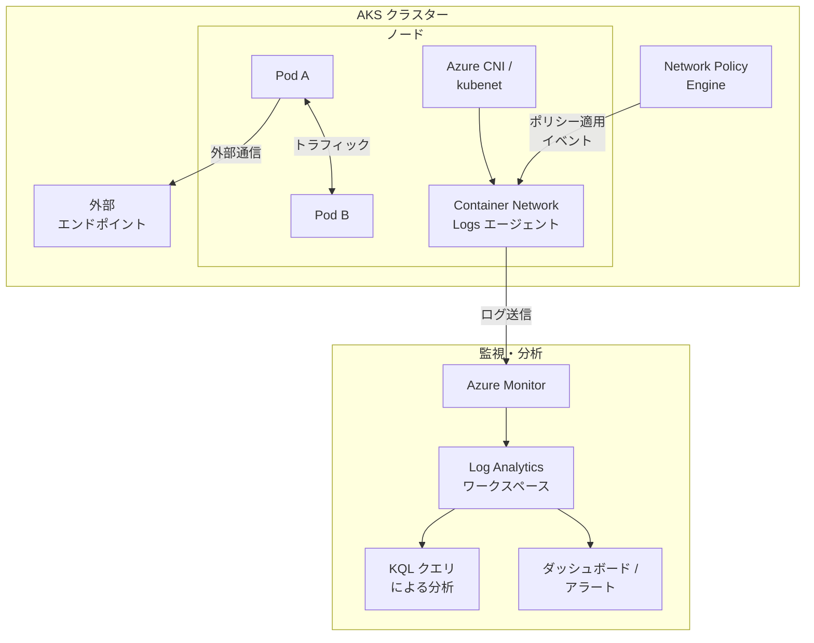

# Azure Kubernetes Service (AKS): コンテナーネットワークログの一般提供開始

**リリース日**: 2026-03-24

**サービス**: Azure Kubernetes Service (AKS)

**機能**: Container Network Logs (コンテナーネットワークログ)

**ステータス**: Launched (GA)

[このアップデートのインフォグラフィックを見る](https://takech9203.github.io/azure-news-summary/20260324-aks-container-network-logs.html)

## 概要

Azure Kubernetes Service (AKS) のコンテナーネットワークログ機能が一般提供 (GA) となった。Kubernetes 環境におけるネットワークの問題は、トラフィックフローの可視性が限られ、障害に関するコンテキストが不十分なため、診断が困難になることが多い。本機能はこの課題に対応し、コンテナーレベルでのネットワークトラフィックに関する詳細なログを提供する。

コンテナーネットワークログは、AKS クラスター内のコンテナー間およびコンテナーと外部エンドポイント間のネットワーク通信に関する包括的な可視性を実現する。これにより、ネットワーク接続の問題、パケットドロップ、DNS 解決の失敗などのトラブルシューティングが大幅に効率化される。

本機能は AKS の Network Observability (ネットワーク可観測性) 機能群の一部として位置づけられ、Azure Monitor や Log Analytics ワークスペースと統合することで、ネットワークイベントの収集・分析・アラート設定が可能となる。

**アップデート前の課題**

- Kubernetes 環境でのネットワーク障害の根本原因特定に時間がかかっていた
- コンテナー間のトラフィックフローに対する可視性が限られていた
- ネットワーク障害発生時のコンテキスト情報が不十分で、問題の再現・診断が困難だった
- ネットワークポリシーの適用状況を確認する手段が限定的だった

**アップデート後の改善**

- コンテナーレベルでのネットワークトラフィックログにより、接続の問題を迅速に特定可能
- パケットドロップやネットワークポリシーによるブロックの原因を詳細に把握可能
- Azure Monitor / Log Analytics との統合により、ログの一元管理とクエリベースの分析が可能
- GA リリースにより、プロダクション環境での利用が正式にサポートされる

## アーキテクチャ図



この図は、AKS クラスター内でコンテナーネットワークログがどのように収集され、Azure Monitor を経由して Log Analytics ワークスペースに送信されるかを示している。ネットワークポリシーエンジンからのイベントも含め、包括的なネットワーク可視性が実現される。

## サービスアップデートの詳細

### 主要機能

1. **ネットワークフローログの収集**
   - コンテナー間 (East-West) およびコンテナーと外部エンドポイント間 (North-South) のトラフィックフローを記録
   - 送信元・宛先の IP アドレス、ポート、プロトコル、バイト数、パケット数などのメタデータを含む

2. **ネットワークポリシー適用ログ**
   - Kubernetes ネットワークポリシーや Azure ネットワークポリシーによって許可またはブロックされたトラフィックの記録
   - ポリシーのデバッグやセキュリティ監査に活用可能

3. **パケットドロップの可視化**
   - ネットワーク層でのパケットドロップとその原因を記録
   - 接続タイムアウトやアプリケーション障害の根本原因分析を支援

4. **Azure Monitor 統合**
   - 収集したログを Azure Monitor / Log Analytics ワークスペースに送信
   - KQL (Kusto Query Language) を使用した柔軟なクエリと分析が可能
   - アラートルールの設定によるプロアクティブな監視

## 技術仕様

| 項目 | 詳細 |
|------|------|
| 機能名 | Container Network Logs |
| ステータス | 一般提供 (GA) |
| 対象サービス | Azure Kubernetes Service (AKS) |
| カテゴリ | Compute, Containers |
| 統合先 | Azure Monitor, Log Analytics |
| ネットワークプラグイン | Azure CNI (推奨) |

## 設定方法

### 前提条件

1. Azure サブスクリプションが有効であること
2. AKS クラスターが作成済みであること
3. Azure CLI が最新バージョンにアップデートされていること
4. Azure Monitor / Log Analytics ワークスペースが構成済みであること

### Azure CLI

```bash
# AKS クラスターでネットワーク可観測性 (Network Observability) を有効にする
az aks update \
  --resource-group myResourceGroup \
  --name myAKSCluster \
  --enable-network-observability
```

```bash
# 診断設定を作成してコンテナーネットワークログを Log Analytics に送信する
az monitor diagnostic-settings create \
  --name AKS-NetworkLogs \
  --resource /subscriptions/<subscription-id>/resourceGroups/<resource-group>/providers/Microsoft.ContainerService/managedClusters/<cluster-name> \
  --workspace /subscriptions/<subscription-id>/resourcegroups/<resource-group>/providers/microsoft.operationalinsights/workspaces/<workspace-name> \
  --logs '[{"category": "container-network-logs","enabled": true}]'
```

### Azure Portal

1. Azure Portal で対象の AKS クラスターに移動する
2. 左メニューから「監視」>「診断設定」を選択する
3. 「診断設定を追加する」をクリックする
4. ログカテゴリから「container-network-logs」を選択する
5. 送信先として Log Analytics ワークスペースを指定する
6. 「保存」をクリックする

## メリット

### ビジネス面

- ネットワーク障害の平均解決時間 (MTTR) の短縮により、サービスの可用性が向上する
- プロアクティブなネットワーク監視により、ユーザー影響が発生する前に問題を検知できる
- セキュリティ監査やコンプライアンス要件への対応が容易になる

### 技術面

- コンテナーレベルでのネットワークトラフィックの詳細な可視化が実現する
- ネットワークポリシーの動作検証が容易になり、セキュリティ構成の確認が効率化する
- Log Analytics の KQL クエリを活用した柔軟な分析が可能になる
- 既存の Azure Monitor エコシステムとシームレスに統合できる

## デメリット・制約事項

- ログの収集・保存にかかるコストが発生する (Log Analytics ワークスペースのデータ取り込み量に応じた課金)
- 高トラフィック環境ではログ量が大きくなり、ストレージコストに影響する可能性がある
- ログ収集エージェントがノードリソース (CPU/メモリ) を消費する

## ユースケース

### ユースケース 1: マイクロサービス間の接続障害のトラブルシューティング

**シナリオ**: マイクロサービスアーキテクチャにおいて、特定のサービス間の通信が断続的に失敗する問題が発生している。

**実装例**:

```kusto
// Log Analytics で特定の Pod 間のパケットドロップを調査する
ContainerNetworkLogs
| where TimeGenerated > ago(1h)
| where Action == "Drop"
| summarize DropCount = count() by SourcePod, DestinationPod, DestinationPort
| order by DropCount desc
```

**効果**: パケットドロップの発生パターンを特定し、ネットワークポリシーの誤設定やリソース制約による接続障害の根本原因を迅速に特定できる。

### ユースケース 2: ネットワークポリシーの検証

**シナリオ**: 新しいネットワークポリシーを適用した後、意図しないトラフィックブロックが発生していないかを確認したい。

**実装例**:

```kusto
// ネットワークポリシーによるブロックイベントを確認する
ContainerNetworkLogs
| where TimeGenerated > ago(24h)
| where Action == "Deny"
| summarize BlockCount = count() by PolicyName, SourceNamespace, DestinationNamespace
| order by BlockCount desc
```

**効果**: ネットワークポリシーの適用結果をログベースで検証し、意図しないブロックを早期に発見・修正できる。

## 料金

コンテナーネットワークログ自体の追加料金は発生しないが、以下の関連コストが発生する。

| 項目 | 料金 |
|------|------|
| Log Analytics データ取り込み | 従量課金制 (Azure Monitor の料金体系に準拠) |
| Log Analytics データ保持 | 31 日間は無料、それ以降は保持期間に応じた課金 |

詳細な料金については、[Azure Monitor の料金ページ](https://azure.microsoft.com/pricing/details/monitor/)を参照されたい。

## 関連サービス・機能

- **Azure Monitor Container Insights**: AKS クラスターの包括的な監視ソリューション。コンテナーネットワークログと組み合わせることで、アプリケーションレイヤーとネットワークレイヤーの両方を統合的に監視できる
- **Azure Monitor Network Insights**: Azure ネットワークリソース全体の監視。AKS のネットワークログと合わせて、エンドツーエンドのネットワーク可視性を実現する
- **Azure Network Policy Manager**: AKS でのネットワークポリシー管理。コンテナーネットワークログによりポリシー適用状況の監査が可能になる
- **Azure Monitor Managed Service for Prometheus**: メトリクスベースの監視。ネットワークログと Prometheus メトリクスを組み合わせた総合的な可観測性を構築できる

## 参考リンク

- [インフォグラフィック](https://takech9203.github.io/azure-news-summary/20260324-aks-container-network-logs.html)
- [公式アップデート情報](https://azure.microsoft.com/updates?id=557892)
- [Microsoft Learn - AKS の監視](https://learn.microsoft.com/en-us/azure/aks/monitor-aks)
- [Azure Monitor 料金ページ](https://azure.microsoft.com/pricing/details/monitor/)
- [AKS 料金ページ](https://azure.microsoft.com/pricing/details/kubernetes-service/)

## まとめ

AKS のコンテナーネットワークログが GA となり、Kubernetes 環境におけるネットワークトラブルシューティングの課題が大きく改善された。これまで困難だったコンテナーレベルでのネットワークフローの可視化が標準機能として利用可能になり、接続障害やパケットドロップの根本原因分析が効率化される。

Solutions Architect への推奨アクションとして、まずは開発・ステージング環境でコンテナーネットワークログを有効化し、ログの収集量とコストを評価した上で、プロダクション環境への展開を計画することを推奨する。特にマイクロサービスアーキテクチャを採用している環境や、厳格なネットワークポリシーを適用している環境では、本機能の導入による運用効率の向上が大きい。

---

**タグ**: #Azure #AKS #Kubernetes #ContainerNetworkLogs #NetworkObservability #Monitoring #GA
