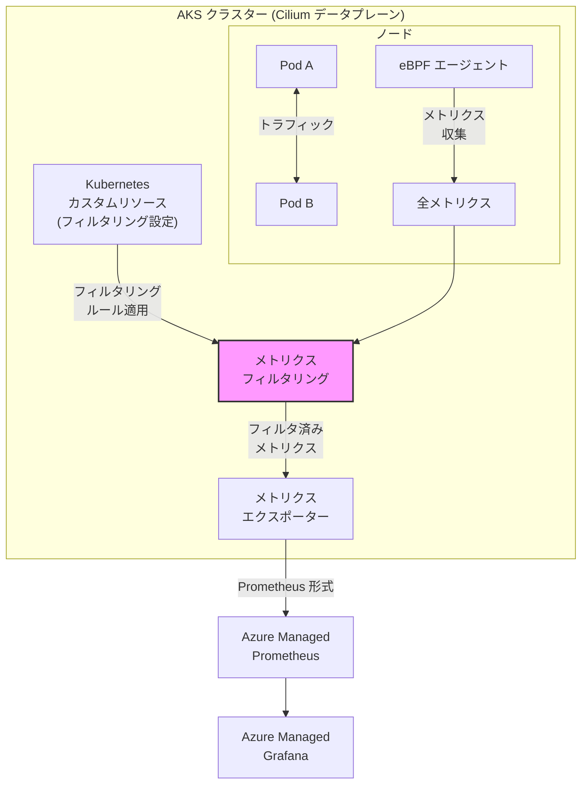

# Azure Kubernetes Service (AKS): コンテナーネットワークメトリクスフィルタリングの一般提供開始

**リリース日**: 2026-03-24

**サービス**: Azure Kubernetes Service (AKS)

**機能**: Container Network Metrics Filtering (コンテナーネットワークメトリクスフィルタリング)

**ステータス**: Launched (GA)

[このアップデートのインフォグラフィックを見る](https://takech9203.github.io/azure-news-summary/20260324-aks-container-network-metrics-filtering.html)

## 概要

Azure Container Networking Services (ACNS) のコンテナーネットワークメトリクスフィルタリング機能が一般提供 (GA) となった。ネットワーク可観測性は大量のメトリクスを生成するため、運用上重要なデータに集中することが困難になるという課題があった。本機能は、オペレーターが Kubernetes カスタムリソースを使用して、収集するコンテナーレベルのメトリクスを動的に制御できるようにする。

本機能により、メトリクスの収集をソースレベルでフィルタリングし、収集・保存される前に不要なメトリクスを除外できる。これにより、監視ダッシュボードにはアクション可能なシグナルのみが表示され、ストレージコストの最適化とクエリパフォーマンスの向上が実現する。

本機能は KubeCon + CloudNativeCon Europe 2026 にあわせて発表された一連の AKS ネットワーキング機能強化の一部であり、ACNS の Container Network Observability 機能群に位置づけられる。

**アップデート前の課題**

- ネットワーク可観測性メトリクスが大量に生成され、運用上重要なデータの特定が困難だった
- 全メトリクスを収集・保存することでストレージコストが増大していた
- 大規模環境ではメトリクスの量がクエリパフォーマンスに悪影響を与えていた
- 特定のアプリケーションやワークロードに関連するメトリクスだけを選択的に収集する手段がなかった

**アップデート後の改善**

- Kubernetes カスタムリソースを使用して収集対象メトリクスを動的に制御可能
- 名前空間、Pod、ラベルベースのフィルタリングにより、特定のアプリケーションに焦点を当てた監視が可能
- メトリクス種別ごとのフィルタリングにより、ユースケースに必要なデータのみを収集可能
- ストレージコストの最適化とノイズの削減が実現

## アーキテクチャ図



この図は、AKS クラスター内で eBPF エージェントが収集したネットワークメトリクスが、Kubernetes カスタムリソースで定義されたフィルタリングルールに基づいて選別され、Azure Managed Prometheus / Grafana に送信される流れを示している。フィルタリングはメトリクスの収集段階 (ソースレベル) で適用されるため、不要なデータがストレージに到達しない。

## サービスアップデートの詳細

### 主要機能

1. **名前空間ベースのフィルタリング**
   - 特定の名前空間に属する Pod のメトリクスのみを収集対象にできる
   - 本番環境の重要なアプリケーションに監視リソースを集中させることが可能

2. **Pod およびラベルベースのフィルタリング**
   - Kubernetes ラベルセレクターを使用して、特定のワークロードや Pod グループのメトリクスを選択的に収集
   - ターゲットを絞った監視により、関連性の高いデータのみを取得

3. **メトリクス種別フィルタリング**
   - ノードレベルメトリクス (転送パケット数、ドロップパケット数など) やHubble メトリクス (DNS クエリ、TCP フラグなど) の中から、必要な種別のみを選択して収集
   - 不要なメトリクス種別を除外することでデータ量を削減

4. **Kubernetes カスタムリソースによる動的制御**
   - フィルタリング設定を Kubernetes カスタムリソースとして宣言的に管理
   - クラスターの再起動なしに、フィルタリングルールを動的に変更可能

## 技術仕様

| 項目 | 詳細 |
|------|------|
| 機能名 | Container Network Metrics Filtering |
| ステータス | 一般提供 (GA) |
| 対象サービス | Azure Kubernetes Service (AKS) |
| 必要なデータプレーン | Cilium (Azure CNI Powered by Cilium) |
| 必要な Kubernetes バージョン | 1.29 以降 |
| 上位機能 | Advanced Container Networking Services (ACNS) |
| メトリクス形式 | Prometheus |
| 対応 OS | Linux のみ |

## 設定方法

### 前提条件

1. Azure サブスクリプションが有効であること
2. Azure CNI Powered by Cilium を使用した AKS クラスターが作成済みであること
3. Advanced Container Networking Services (ACNS) が有効化されていること
4. Kubernetes バージョン 1.29 以降であること

### Azure CLI

```bash
# ACNS を有効にして AKS クラスターを作成する
az aks create \
  --resource-group myResourceGroup \
  --name myAKSCluster \
  --network-plugin azure \
  --network-dataplane cilium \
  --enable-acns
```

```bash
# 既存のクラスターで ACNS を有効にする
az aks update \
  --resource-group myResourceGroup \
  --name myAKSCluster \
  --enable-acns
```

## メリット

### ビジネス面

- メトリクスのストレージコストを削減でき、大規模環境での可観測性の運用コストを最適化できる
- 運用チームがノイズの少ないダッシュボードにより迅速に問題を特定でき、MTTR (平均解決時間) が短縮される
- 包括的な可観測性と費用対効果のバランスを柔軟に調整できる

### 技術面

- ソースレベルでのフィルタリングにより、Prometheus サーバーやストレージへの負荷が軽減される
- Kubernetes ネイティブなカスタムリソースによる宣言的な設定管理が可能
- 名前空間、ラベル、メトリクス種別による多次元のフィルタリングが可能
- クラスター再起動なしにフィルタリングルールを動的に変更できる

## デメリット・制約事項

- Cilium データプレーン (Azure CNI Powered by Cilium) を使用するクラスターでのみ利用可能であり、非 Cilium クラスターでは使用できない
- Pod レベルメトリクスは Linux ノードのみで利用可能 (Windows ノードは非対応)
- Advanced Container Networking Services (ACNS) は有料の付加機能であり、追加コストが発生する
- フィルタリングにより除外されたメトリクスは収集されないため、後から過去の除外データを参照することはできない

## ユースケース

### ユースケース 1: 大規模マルチテナント環境での選択的監視

**シナリオ**: 数十の名前空間を持つ大規模 AKS クラスターにおいて、本番ワークロードのネットワークメトリクスのみを重点的に監視し、開発・テスト名前空間のメトリクスを除外したい。

**効果**: 名前空間ベースのフィルタリングにより、本番環境に関連するメトリクスのみが収集され、ストレージコストの大幅な削減とダッシュボードの視認性向上が期待できる。

### ユースケース 2: 特定のマイクロサービスのネットワーク問題調査

**シナリオ**: 特定のマイクロサービス間で断続的な接続問題が報告されている。該当するサービスのメトリクスのみを詳細に収集し、問題の根本原因を調査したい。

**効果**: ラベルベースのフィルタリングにより、対象のサービスに関連する Pod のメトリクスのみを収集できる。不要なデータが排除されることで、Grafana ダッシュボードでの分析が効率化され、問題の特定が迅速化する。

## 料金

コンテナーネットワークメトリクスフィルタリングは Advanced Container Networking Services (ACNS) の一部として提供される。ACNS は有料の付加機能である。

詳細な料金については、[Advanced Container Networking Services の料金ページ](https://azure.microsoft.com/pricing/details/azure-container-networking-services/)を参照されたい。

## 関連サービス・機能

- **Azure Container Networking Services (ACNS)**: 本機能の上位サービス。Container Network Observability、Container Network Security、Container Network Performance の各機能群を提供する
- **Container Network Logs**: コンテナーネットワークログ機能。メトリクスフィルタリングと組み合わせて、メトリクスとログの両面からネットワーク可観測性を実現する
- **Azure Managed Prometheus**: メトリクスの保存・クエリ基盤。フィルタリングされたメトリクスの送信先として利用する
- **Azure Managed Grafana**: メトリクスの可視化基盤。フィルタリングによりノイズが削減されたダッシュボードを構築できる
- **Azure Kubernetes Fleet Manager**: 複数 AKS クラスターの管理。クロスクラスターネットワーキングと合わせて、分散環境のネットワーク可観測性を強化する

## 参考リンク

- [インフォグラフィック](https://takech9203.github.io/azure-news-summary/20260324-aks-container-network-metrics-filtering.html)
- [公式アップデート情報](https://azure.microsoft.com/updates?id=557902)
- [What's new with Microsoft in open-source and Kubernetes at KubeCon + CloudNativeCon Europe 2026](https://opensource.microsoft.com/blog/2026/03/24/whats-new-with-microsoft-in-open-source-and-kubernetes-at-kubecon-cloudnativecon-europe-2026/)
- [Microsoft Learn - Advanced Container Networking Services の概要](https://learn.microsoft.com/en-us/azure/aks/advanced-container-networking-services-overview)
- [Microsoft Learn - コンテナーネットワークメトリクスの概要](https://learn.microsoft.com/en-us/azure/aks/container-network-observability-metrics)
- [ACNS 料金ページ](https://azure.microsoft.com/pricing/details/azure-container-networking-services/)

## まとめ

AKS のコンテナーネットワークメトリクスフィルタリングが GA となり、大規模 Kubernetes 環境におけるネットワーク可観測性のコスト最適化とノイズ削減が実現された。Kubernetes カスタムリソースによる宣言的なフィルタリング設定により、名前空間、Pod ラベル、メトリクス種別の各次元で収集対象を柔軟に制御できる。

Solutions Architect への推奨アクションとして、ACNS を利用中の Cilium ベースクラスターにおいて、まず現在のメトリクス収集量とストレージコストを評価し、フィルタリングによる最適化の余地を検討することを推奨する。特に大規模なマルチテナント環境やメトリクスのストレージコストが課題となっている環境では、本機能の導入により運用コストの削減と監視品質の向上が見込まれる。

---

**タグ**: #Azure #AKS #Kubernetes #ACNS #ContainerNetworkMetrics #NetworkObservability #MetricsFiltering #Cilium #GA
