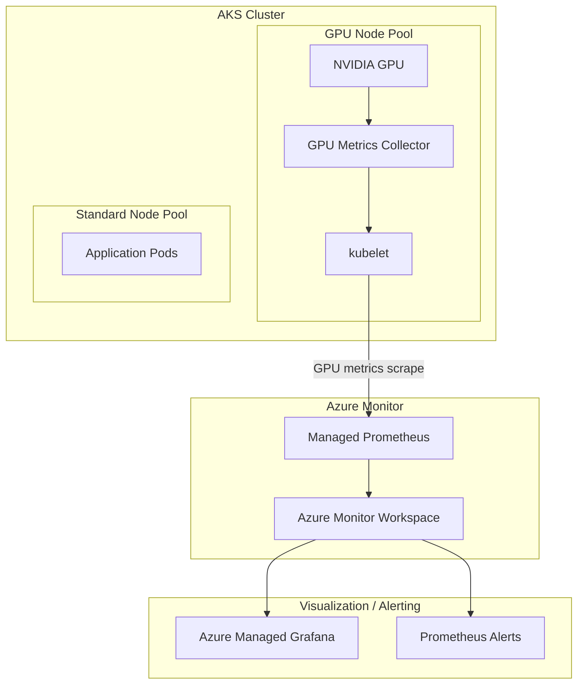

# Azure Kubernetes Service (AKS): マネージド GPU メトリクスの Azure Monitor 対応

**リリース日**: 2026-03-24

**サービス**: Azure Kubernetes Service (AKS)

**機能**: マネージド GPU メトリクス (Azure Monitor)

**ステータス**: In preview

[このアップデートのインフォグラフィックを見る](https://takech9203.github.io/azure-news-summary/20260324-aks-gpu-metrics-azure-monitor.html)

## 概要

Microsoft は、Azure Kubernetes Service (AKS) における GPU メトリクスのマネージド収集機能をパブリックプレビューとして発表した。この機能により、NVIDIA GPU 対応ノードプールからパフォーマンスおよび使用率データが自動的に Managed Prometheus に公開される。

GPU を使用するワークロード (機械学習トレーニング、推論、グラフィックス処理など) を実行するチームにとって、GPU の使用状況を Kubernetes メトリクスと統合的に監視することは運用上の重要課題であった。従来は GPU メトリクスの収集に別途ツールの導入や手動設定が必要であったが、本機能によりこの課題が解消される。

AKS マネージド GPU メトリクスは、NVIDIA GPU 対応ノードプールから GPU の使用率やパフォーマンスデータを自動収集し、Azure Monitor の Managed Prometheus に統合する。これにより、Azure Managed Grafana の既存ダッシュボードや Prometheus アラートと組み合わせた一元的な GPU 監視が実現する。

**アップデート前の課題**

- GPU ワークロードの使用率を Kubernetes メトリクスと統合的に監視する手段が限定されていた
- GPU メトリクスの収集には NVIDIA DCGM Exporter などのサードパーティツールを手動でデプロイ・管理する必要があった
- GPU の使用状況とクラスター全体のリソース消費を関連付けた分析が困難であった

**アップデート後の改善**

- NVIDIA GPU 対応ノードプールから GPU メトリクスが自動的に Managed Prometheus に公開される
- 追加のエクスポーターやカスタム設定なしで GPU 監視が可能になる
- 既存の Azure Monitor / Grafana ダッシュボードおよび Prometheus アラートとシームレスに統合できる

## アーキテクチャ図



AKS クラスター内の NVIDIA GPU 対応ノードプールから GPU メトリクスが自動収集され、Managed Prometheus を経由して Azure Monitor Workspace に格納される。格納されたメトリクスは Azure Managed Grafana でのダッシュボード表示や Prometheus アラートによる通知に利用できる。

## サービスアップデートの詳細

### 主要機能

1. **GPU メトリクスの自動収集**
   - NVIDIA GPU 対応ノードプールからパフォーマンスおよび使用率データを自動的に収集する
   - 追加のエクスポーターやサイドカーコンテナのデプロイが不要

2. **Managed Prometheus への統合**
   - 収集された GPU メトリクスが Managed Prometheus に直接公開される
   - 既存の Kubernetes メトリクス (kubelet、cadvisor など) と同一の Prometheus エンドポイントで管理可能

3. **Azure Managed Grafana との連携**
   - GPU メトリクスを Grafana ダッシュボードで可視化できる
   - Kubernetes のリソースメトリクスと GPU メトリクスを統合的に表示可能

4. **Prometheus アラートとの統合**
   - GPU 使用率の閾値に基づくアラートルールを Prometheus Alert として設定可能
   - GPU リソースの過不足を自動検知する運用フローの構築が容易

## 技術仕様

| 項目 | 詳細 |
|------|------|
| 対象 GPU | NVIDIA GPU 対応ノードプール |
| メトリクス収集先 | Azure Monitor Managed Prometheus |
| メトリクスストア | Azure Monitor Workspace |
| 可視化 | Azure Managed Grafana |
| アラート | Prometheus Alerts |
| ステータス | パブリックプレビュー |

## 設定方法

### 前提条件

1. AKS クラスターに NVIDIA GPU 対応ノードプール (Standard_NC6s_v3 以上推奨) が構成されていること
2. Azure Monitor の Managed Prometheus が有効化されていること
3. Azure Managed Grafana ワークスペースが Azure Monitor Workspace にリンクされていること

### Azure CLI

```bash
# GPU 対応ノードプールの作成 (未作成の場合)
az aks nodepool add \
    --resource-group myResourceGroup \
    --cluster-name myAKSCluster \
    --name gpunp \
    --node-count 1 \
    --node-vm-size Standard_NC6s_v3 \
    --node-taints sku=gpu:NoSchedule \
    --enable-cluster-autoscaler \
    --min-count 1 \
    --max-count 3
```

```bash
# Managed Prometheus の有効化 (未有効化の場合)
az aks update \
    --resource-group myResourceGroup \
    --name myAKSCluster \
    --enable-azure-monitor-metrics
```

## メリット

### ビジネス面

- GPU ワークロードの使用率を可視化することで、GPU リソースの過剰プロビジョニングを防ぎコスト最適化が可能
- 運用チームの GPU 監視に関する手動作業が削減され、運用コストが低下する
- AI/ML ワークロードの SLA 維持に必要な監視基盤が標準機能として提供される

### 技術面

- サードパーティツールの導入・管理が不要となり、運用の複雑性が低減する
- Kubernetes メトリクスと GPU メトリクスの統合により、ワークロード全体のパフォーマンス分析が容易になる
- Managed Prometheus ベースのため、スケーラブルなメトリクス収集・保存が保証される

## デメリット・制約事項

- パブリックプレビューのため、SLA の保証がない (本番環境での利用は慎重に検討が必要)
- NVIDIA GPU のみが対象であり、AMD GPU (NVv4 シリーズなど) は AKS でサポートされていない
- Managed Prometheus の有効化が前提条件となるため、追加のメトリクス保存コストが発生する可能性がある

## ユースケース

### ユースケース 1: AI/ML トレーニングジョブの GPU 使用率監視

**シナリオ**: 大規模言語モデルのファインチューニングを AKS 上で実行しており、GPU メモリ使用率やコンピュート使用率を継続的に監視して、トレーニングの効率性を評価したい。

**効果**: GPU 使用率が低い場合はバッチサイズの調整やノード数の削減を検討でき、コスト最適化に直結する。

### ユースケース 2: 推論ワークロードのスケーリング判断

**シナリオ**: リアルタイム推論 API を GPU ノード上で提供しており、GPU 使用率に基づく自動スケーリングの判断材料が必要。

**効果**: Prometheus アラートと組み合わせることで、GPU 使用率の閾値超過時に自動的にノードプールのスケールアウトをトリガーできる。

## 料金

マネージド GPU メトリクス機能自体の追加料金に関する具体的な情報は、プレビュー時点では公開されていない。ただし、以下の関連コストが発生する。

| 項目 | 料金 |
|------|------|
| GPU 対応 VM (Standard_NC6s_v3) | リージョンおよび利用時間に応じた従量課金 |
| Managed Prometheus メトリクス取り込み | メトリクスのサンプル数に基づく従量課金 |
| Azure Monitor Workspace | データ保持期間に応じた課金 |
| Azure Managed Grafana | インスタンスプランに応じた課金 |

## 関連サービス・機能

- **Azure Monitor Managed Prometheus**: GPU メトリクスの収集・保存先となるフルマネージド Prometheus サービス
- **Azure Managed Grafana**: 収集された GPU メトリクスの可視化に使用するダッシュボードサービス
- **Container Insights**: AKS クラスターのログおよびパフォーマンスデータの収集・分析機能
- **NVIDIA Device Plugin for Kubernetes**: GPU リソースをスケジュール可能にするための Kubernetes デバイスプラグイン

## 参考リンク

- [インフォグラフィック](https://takech9203.github.io/azure-news-summary/20260324-aks-gpu-metrics-azure-monitor.html)
- [公式アップデート情報](https://azure.microsoft.com/updates?id=557882)
- [Microsoft Learn - AKS で GPU を使用する](https://learn.microsoft.com/en-us/azure/aks/use-nvidia-gpu)
- [Microsoft Learn - AKS の監視](https://learn.microsoft.com/en-us/azure/aks/monitor-aks)
- [Microsoft Learn - Prometheus メトリクスのスクレイプ設定](https://learn.microsoft.com/en-us/azure/azure-monitor/containers/prometheus-metrics-scrape-configuration)

## まとめ

AKS マネージド GPU メトリクスは、GPU ワークロードの可観測性における大きなギャップを埋めるアップデートである。これまで手動でのツール導入・設定が必要であった GPU メトリクスの収集が、AKS の標準機能として Managed Prometheus に統合されることで、運用の簡素化とコスト最適化が実現する。

AI/ML ワークロードや GPU を活用するコンピュート集約型アプリケーションを AKS 上で運用しているチームは、パブリックプレビューの段階で本機能を検証し、GPU リソースの監視体制を強化することを推奨する。本番環境への適用は GA 後に検討すべきである。

---

**タグ**: #Azure #AKS #GPU #AzureMonitor #Prometheus #Grafana #NVIDIA #Kubernetes #Preview #Compute #Containers
