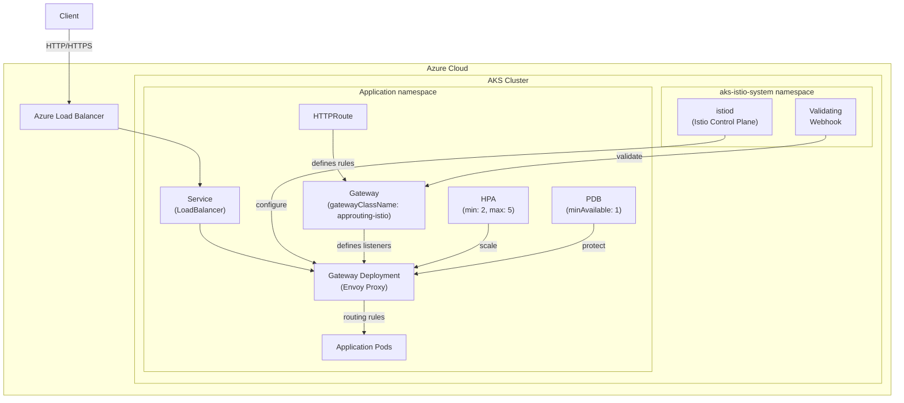

# Azure Kubernetes Service (AKS): Application Routing with Meshless Istio (パブリックプレビュー)

**リリース日**: 2026-03-24

**サービス**: Azure Kubernetes Service (AKS)

**機能**: Application Routing with Meshless Istio

**ステータス**: In preview

[このアップデートのインフォグラフィックを見る](https://takech9203.github.io/azure-news-summary/20260324-aks-meshless-istio-routing.html)

## 概要

Microsoft は、Azure Kubernetes Service (AKS) において「Application Routing with Meshless Istio」のパブリックプレビューを発表した。これは、Kubernetes の Ingress NGINX プロジェクトの廃止 (2026 年 3 月にメンテナンス終了) に伴い、フルサービスメッシュの複雑さを伴わずに、標準準拠の Ingress 移行パスを提供する新機能である。

本機能は、Istio コントロールプレーンをデプロイして Kubernetes Gateway API リソースのインフラストラクチャを管理するが、従来の Istio サービスメッシュアドオンとは異なり、サイドカーインジェクションや Istio CRD のサポートは行わない。つまり、サービスメッシュの運用負荷なしに、Gateway API ベースの高度なトラフィック管理を実現する「メッシュレス」なアプローチとなっている。

Kubernetes SIG Network が推進する Gateway API は、従来の Ingress API の後継として設計された標準的なトラフィック管理フレームワークであり、AKS もこの方向性に合わせた長期的な移行を進めている。

**アップデート前の課題**

- Ingress NGINX の廃止により、Kubernetes オペレーターは代替となる Ingress ソリューションを必要としている
- フルサービスメッシュ (Istio) の導入は、サイドカープロキシの管理やリソース消費など運用の複雑さが大きい
- 従来の Ingress API はロールベースの制御やポータビリティに限界があり、Gateway API への移行が推奨されている

**アップデート後の改善**

- フルサービスメッシュを導入せずに、Istio ベースの Gateway API トラフィック管理が利用可能
- Kubernetes Gateway API 標準に準拠し、将来の Kubernetes エコシステムとの互換性を確保
- AKS マネージドな Istio コントロールプレーンにより、運用・アップグレードの負担を軽減
- HPA と PDB がデフォルトで構成され、高可用性が確保される

## アーキテクチャ図



Istio コントロールプレーン (istiod) が Gateway リソースに基づいて Envoy プロキシをプロビジョニング・構成し、サイドカーなしで Gateway API ベースのトラフィック管理を実現する。

## サービスアップデートの詳細

### 主要機能

1. **メッシュレス Istio コントロールプレーン**
   - サイドカーインジェクションなしで Istio コントロールプレーンをデプロイ
   - Gateway API リソースのインフラストラクチャ管理に特化
   - GatewayClass 名は `approuting-istio` を使用

2. **Kubernetes Gateway API のネイティブサポート**
   - Gateway、HTTPRoute などの標準リソースを使用したトラフィック管理
   - ロールベースの設計 (インフラ管理者とアプリ開発者の関心の分離)
   - Ingress API の後継として標準化された API

3. **自動リソースプロビジョニング**
   - Gateway リソースの作成時に Deployment、Service (LoadBalancer)、HPA、PDB が自動生成
   - デフォルトで HPA (最小 2、最大 5 レプリカ、CPU 使用率 80%) を構成
   - PDB (最小可用性 1) によるアップグレード時の中断最小化

4. **マネージドライフサイクル管理**
   - AKS クラスターの Kubernetes バージョンに基づく Istio バージョンの自動管理
   - パッチバージョンは AKS リリースの一部として自動アップグレード
   - マイナーバージョンはクラスターアップグレード時または新 Istio バージョンリリース時に自動アップグレード

5. **リソースカスタマイズ**
   - istiod の HPA 設定 (minReplicas、maxReplicas) のカスタマイズが可能
   - Gateway リソースのアノテーションおよび ConfigMap によるカスタマイズ
   - 内部ロードバランサーの構成にも対応

## 技術仕様

| 項目 | 詳細 |
|------|------|
| GatewayClass 名 | `approuting-istio` |
| コントロールプレーン | istiod (aks-istio-system namespace) |
| サイドカーインジェクション | 非対応 (メッシュレス) |
| Istio CRD サポート | 非対応 |
| HPA デフォルト設定 | min: 2、max: 5、CPU: 80% |
| PDB デフォルト設定 | minAvailable: 1 |
| アップグレード方式 | インプレース (リビジョン方式ではない) |
| 対応プロトコル | HTTP、HTTPS |
| TLSRoute (SNI Passthrough) | 現時点では非対応 |

## 設定方法

### 前提条件

1. Azure CLI に `aks-preview` 拡張機能 (バージョン 19.0.0b24 以降) をインストール
2. Managed Gateway API のインストールを有効化
3. `AppRoutingIstioGatewayAPIPreview` フィーチャーフラグを登録

### Azure CLI

```bash
# aks-preview 拡張機能のインストール
az extension add --name aks-preview

# フィーチャーフラグの登録
az feature register --namespace "Microsoft.ContainerService" --name "AppRoutingIstioGatewayAPIPreview"

# 新規クラスター作成時に有効化
az aks create \
    --resource-group <ResourceGroupName> \
    --name <ClusterName> \
    --enable-app-routing-istio

# 既存クラスターで有効化
az aks update \
    --resource-group <ResourceGroupName> \
    --name <ClusterName> \
    --enable-app-routing-istio
```

### Gateway と HTTPRoute の構成例

```yaml
# Gateway リソースの作成
apiVersion: gateway.networking.k8s.io/v1
kind: Gateway
metadata:
  name: my-gateway
spec:
  gatewayClassName: approuting-istio
  listeners:
  - name: http
    port: 80
    protocol: HTTP
    allowedRoutes:
      namespaces:
        from: Same
---
# HTTPRoute リソースの作成
apiVersion: gateway.networking.k8s.io/v1
kind: HTTPRoute
metadata:
  name: my-route
spec:
  parentRefs:
  - name: my-gateway
  hostnames: ["app.example.com"]
  rules:
  - matches:
    - path:
        type: PathPrefix
        value: /
    backendRefs:
    - name: my-service
      port: 8080
```

## メリット

### ビジネス面

- Ingress NGINX 廃止後のサポートされた移行パスを提供し、セキュリティリスクを軽減
- フルサービスメッシュ導入と比較して運用コスト・学習コストが大幅に低い
- Kubernetes 標準に準拠するため、マルチクラウドやベンダーロックイン回避に有利

### 技術面

- サイドカーなしのため、アプリケーション Pod のリソース消費やレイテンシへの影響が最小限
- Gateway API の標準的なリソースモデル (Gateway / HTTPRoute) によるインフラとアプリの関心の分離
- マネージドな Istio コントロールプレーンにより、バージョン管理やアップグレードの運用負荷を削減
- HPA・PDB のデフォルト構成により、高可用性とゼロダウンタイムアップグレードを実現

## デメリット・制約事項

- Istio サービスメッシュアドオンとの同時利用は不可 (一方を無効化してから他方を有効化する必要がある)
- サイドカーインジェクションや Istio CRD (VirtualService、DestinationRule など) は使用不可
- TLSRoute (SNI パススルー) は現時点で非対応
- Egress トラフィック管理は非対応
- Azure DNS および TLS 証明書の自動管理は Gateway API 実装では現時点で非対応 (手動での TLS 構成が必要)
- パブリックプレビュー段階のため、SLA の対象外であり本番環境での使用は非推奨
- ConfigMap カスタマイズは許可リストに基づき制限される

## ユースケース

### ユースケース 1: Ingress NGINX からの移行

**シナリオ**: 現在 AKS で Ingress NGINX を使用しており、2026 年 11 月のサポート終了前に Gateway API ベースの移行を計画しているチーム。

**実装例**:

```bash
# 既存クラスターで Application Routing Gateway API を有効化
az aks update --resource-group myRG --name myCluster --enable-app-routing-istio

# 新しい Gateway と HTTPRoute を作成して段階的に移行
kubectl apply -f gateway.yaml
kubectl apply -f httproute.yaml

# 動作確認後、旧 Ingress リソースを削除
kubectl delete ingress old-ingress
```

**効果**: フルサービスメッシュを導入せずに、標準準拠の Gateway API ベースのトラフィック管理へ移行でき、2026 年 11 月以降もサポートされた環境を維持できる。

### ユースケース 2: マイクロサービスの L7 トラフィック管理

**シナリオ**: 複数のマイクロサービスへのルーティングをホスト名やパスベースで制御したいが、サービスメッシュの複雑さは避けたい場合。

**実装例**:

```yaml
apiVersion: gateway.networking.k8s.io/v1
kind: HTTPRoute
metadata:
  name: multi-service-route
spec:
  parentRefs:
  - name: main-gateway
  rules:
  - matches:
    - path:
        type: PathPrefix
        value: /api
    backendRefs:
    - name: api-service
      port: 8080
  - matches:
    - path:
        type: PathPrefix
        value: /web
    backendRefs:
    - name: web-frontend
      port: 3000
```

**効果**: Gateway API の HTTPRoute を活用し、柔軟なパスベースルーティングを実現しつつ、サイドカーのオーバーヘッドなしで運用できる。

## 料金

Application Routing with Meshless Istio は AKS アドオンとして提供され、アドオン自体の追加料金は発生しない。ただし、Istio コントロールプレーン (istiod) および Gateway Deployment (Envoy Proxy) が使用するコンピューティングリソース (CPU、メモリ) 分の AKS ノード料金が発生する。

## 関連サービス・機能

- **[Istio サービスメッシュアドオン](https://learn.microsoft.com/azure/aks/istio-about)**: フルサービスメッシュ機能 (サイドカー、mTLS、トラフィックポリシー) が必要な場合の選択肢。本機能との同時利用は不可
- **[Application Routing アドオン (NGINX)](https://learn.microsoft.com/azure/aks/app-routing)**: 従来の Ingress API ベースのマネージド NGINX。2026 年 11 月までサポート
- **[Application Gateway for Containers](https://learn.microsoft.com/azure/application-gateway/for-containers/overview)**: Ingress API と Gateway API の両方をサポートする Azure ネイティブの L7 ロードバランサー
- **[Managed Gateway API](https://learn.microsoft.com/azure/aks/managed-gateway-api)**: 本機能の前提条件となる Gateway API CRD のマネージドインストール

## 参考リンク

- [インフォグラフィック](https://takech9203.github.io/azure-news-summary/20260324-aks-meshless-istio-routing.html)
- [公式アップデート情報](https://azure.microsoft.com/updates?id=557927)
- [Microsoft Learn - Application Routing Gateway API](https://learn.microsoft.com/azure/aks/app-routing-gateway-api)
- [Microsoft Learn - Application Routing アドオン](https://learn.microsoft.com/azure/aks/app-routing)
- [Microsoft Learn - Istio サービスメッシュアドオン](https://learn.microsoft.com/azure/aks/istio-about)
- [Kubernetes Gateway API 公式サイト](https://gateway-api.sigs.k8s.io/)

## まとめ

Application Routing with Meshless Istio は、Ingress NGINX の廃止という Kubernetes エコシステムの大きな転換点において、AKS ユーザーに対して現実的かつ標準準拠の移行パスを提供するアップデートである。フルサービスメッシュの運用負荷なしに Istio ベースの Gateway API トラフィック管理を利用できる点が最大の特徴であり、特に「サービスメッシュは不要だが、Gateway API 標準に移行したい」というニーズに最適である。

現在パブリックプレビュー段階であるため本番環境での利用は推奨されないが、Ingress NGINX のサポートが 2026 年 11 月に終了することを考慮すると、早期に検証環境での評価と移行計画の策定を開始することが推奨される。

---

**タグ**: #Azure #AKS #Kubernetes #Istio #GatewayAPI #ApplicationRouting #Meshless #ServiceMesh #IngressNGINX #Preview
