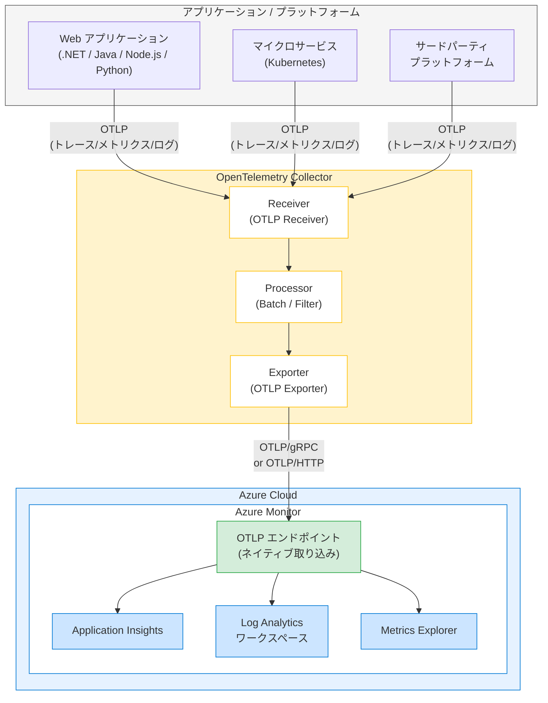

# Azure Monitor: OpenTelemetry Collector による OTLP データのネイティブ取り込み

**リリース日**: 2026-03-24

**サービス**: Azure Monitor

**機能**: OpenTelemetry Collector を使用した OTLP データの Azure Monitor へのネイティブ取り込み

**ステータス**: In preview

[このアップデートのインフォグラフィックを見る](https://takech9203.github.io/azure-news-summary/20260324-azure-monitor-otlp-opentelemetry-collector.html)

## 概要

Azure Monitor が OpenTelemetry Protocol (OTLP) シグナルのネイティブ取り込みをパブリックプレビューとしてサポートした。これにより、OpenTelemetry で計装されたアプリケーションやプラットフォームからテレメトリデータを Azure Monitor に直接送信できるようになる。

OpenTelemetry は CNCF (Cloud Native Computing Foundation) が推進するオープンソースのオブザーバビリティフレームワークであり、トレース、メトリクス、ログの収集・エクスポートを標準化するプロトコルである。今回のアップデートにより、OpenTelemetry Collector を構成して OTLP エンドポイント経由で Azure Monitor にテレメトリデータを送信することが可能となり、ベンダーロックインを回避しながら Azure Monitor の豊富な分析・可視化機能を活用できるようになる。

従来は Azure Monitor OpenTelemetry Distro や各言語向けの Azure Monitor Exporter を使用する必要があったが、OTLP ネイティブ取り込みにより、OpenTelemetry Collector からの標準的な OTLP エクスポートがそのまま Azure Monitor に取り込まれるようになる。

**アップデート前の課題**

- Azure Monitor へのテレメトリ送信には Azure Monitor 固有の Exporter やDistro を各アプリケーションに組み込む必要があった
- OpenTelemetry Collector を利用する環境では、Azure Monitor Exporter を Collector に追加で構成する必要があり、標準の OTLP エクスポートとは別の設定が必要であった
- マルチクラウドやハイブリッド環境でテレメトリパイプラインを統一的に構成することが困難であった

**アップデート後の改善**

- OpenTelemetry Collector から標準的な OTLP プロトコルで Azure Monitor に直接データを送信可能に
- Azure Monitor 固有の Exporter を各アプリケーションに組み込む必要がなくなり、計装の簡素化が実現
- OpenTelemetry エコシステムとの互換性が向上し、マルチベンダー環境でのテレメトリパイプライン構築が容易に

## アーキテクチャ図



アプリケーションから送信された OTLP テレメトリデータが OpenTelemetry Collector を経由し、Azure Monitor の OTLP エンドポイントにネイティブに取り込まれ、Application Insights、Log Analytics ワークスペース、Metrics Explorer で分析・可視化される流れを示している。

## サービスアップデートの詳細

### 主要機能

1. **OTLP ネイティブ取り込み**
   - Azure Monitor が OTLP プロトコルを直接受け入れるエンドポイントを提供し、OpenTelemetry Collector や OTLP 互換のアプリケーションからのテレメトリデータをネイティブに取り込む

2. **OpenTelemetry Collector との統合**
   - OpenTelemetry Collector の OTLP Exporter を構成することで、Collector が収集したトレース、メトリクス、ログを Azure Monitor に送信可能

3. **3 種類のテレメトリシグナルのサポート**
   - トレース (分散トレーシング)、メトリクス (パフォーマンス指標)、ログ (アプリケーションログ) の 3 つのシグナルタイプを OTLP 経由で取り込み可能

4. **既存の Azure Monitor 機能との統合**
   - 取り込まれたテレメトリデータは Application Insights のアプリケーションマップ、トランザクション検索、Metrics Explorer、Log Analytics クエリなど既存の Azure Monitor 機能でそのまま利用可能

## 技術仕様

| 項目 | 詳細 |
|------|------|
| プロトコル | OTLP/gRPC、OTLP/HTTP |
| サポートシグナル | トレース、メトリクス、ログ |
| 認証方式 | Microsoft Entra ID (Azure AD) 認証 |
| OpenTelemetry Collector 互換性 | OTLP Exporter を使用 |
| ステータス | パブリックプレビュー |

## 設定方法

### 前提条件

1. Azure サブスクリプションが作成済みであること
2. Application Insights リソースまたは Log Analytics ワークスペースが構成済みであること
3. OpenTelemetry Collector がインストール済みであること

### OpenTelemetry Collector 構成例

```yaml
# otel-collector-config.yaml
receivers:
  otlp:
    protocols:
      grpc:
        endpoint: 0.0.0.0:4317
      http:
        endpoint: 0.0.0.0:4318

processors:
  batch:
    timeout: 5s
    send_batch_size: 1024

exporters:
  otlp:
    endpoint: "<Azure Monitor OTLP エンドポイント>"
    headers:
      Authorization: "Bearer <アクセストークン>"

service:
  pipelines:
    traces:
      receivers: [otlp]
      processors: [batch]
      exporters: [otlp]
    metrics:
      receivers: [otlp]
      processors: [batch]
      exporters: [otlp]
    logs:
      receivers: [otlp]
      processors: [batch]
      exporters: [otlp]
```

### Azure Portal

1. Azure Portal で Application Insights リソースに移動する
2. 「概要」ペインから接続文字列を取得する
3. OpenTelemetry Collector の構成ファイルにエンドポイントと認証情報を設定する
4. Collector を起動し、テレメトリデータが Azure Monitor に流入していることを確認する

## メリット

### ビジネス面

- ベンダーロックインを回避し、OpenTelemetry 標準に準拠したオブザーバビリティ基盤を構築できる
- マルチクラウド・ハイブリッド環境で統一的なテレメトリパイプラインを運用でき、運用コストを削減できる
- OpenTelemetry エコシステムの豊富なインテグレーションを活用しつつ、Azure Monitor の分析機能を利用できる

### 技術面

- アプリケーション側に Azure Monitor 固有の SDK や Exporter を組み込む必要がなくなり、計装コードの簡素化が可能
- OpenTelemetry Collector の Processor 機能 (フィルタリング、サンプリング、バッチ処理等) を活用したテレメトリデータの前処理が可能
- 複数のバックエンドへの同時エクスポートが容易であり、Azure Monitor と他のオブザーバビリティツールを並行して利用できる
- .NET、Java、Node.js、Python など多様な言語・フレームワークからの統一的なテレメトリ収集が可能

## デメリット・制約事項

- 本機能はパブリックプレビュー段階であり、GA 時に仕様やエンドポイントが変更される可能性がある
- プレビュー期間中は SLA が提供されないため、本番環境での利用には十分な検証が必要である
- OpenTelemetry Collector の運用・管理が追加の運用負荷となる場合がある
- 従来の Azure Monitor OpenTelemetry Distro を使用した直接送信と比較して、Collector を経由するためレイテンシが若干増加する可能性がある

## ユースケース

### ユースケース 1: Kubernetes マイクロサービス環境での一元的テレメトリ収集

**シナリオ**: AKS (Azure Kubernetes Service) 上で複数のマイクロサービスが稼働しており、各サービスが異なる言語 (.NET、Java、Node.js) で実装されているケース。各サービスに Azure Monitor 固有の SDK を組み込むのではなく、OpenTelemetry の標準計装を使用して統一的にテレメトリを収集したい。

**効果**: OpenTelemetry Collector を DaemonSet または Sidecar として Kubernetes クラスタにデプロイし、各サービスからの OTLP テレメトリを集約して Azure Monitor に送信する。サービス個別の Azure Monitor SDK 依存がなくなり、計装の標準化と運用の簡素化が実現される。

### ユースケース 2: マルチクラウド環境でのオブザーバビリティ統合

**シナリオ**: Azure と他のクラウドプロバイダーを併用する環境で、全てのテレメトリデータを Azure Monitor に集約して統合的に分析したいケース。

**効果**: OpenTelemetry Collector を各環境に配置し、OTLP エクスポートで Azure Monitor に統一的にテレメトリを送信する。クラウドプロバイダーを問わず標準化されたテレメトリパイプラインが構築でき、Azure Monitor の Application Insights やLog Analytics で一元的な可視化・分析が可能となる。

## 料金

Azure Monitor の OTLP 取り込みに関する追加料金の詳細はプレビュー段階のため公式に確定していない。テレメトリデータの取り込みおよび保持に関しては、既存の Azure Monitor (Application Insights / Log Analytics) の料金体系が適用される。

| 項目 | 料金体系 |
|------|------|
| Application Insights データ取り込み | GB 単位の従量課金 |
| Log Analytics データ取り込み | GB 単位の従量課金 |
| データ保持 (31 日以降) | GB/月 単位の従量課金 |

無料枠: Application Insights では毎月 5 GB のデータ取り込みが無料で提供される。

## 関連サービス・機能

- **Application Insights**: Azure Monitor の APM (Application Performance Management) 機能。OTLP 経由で取り込まれたトレース・メトリクスデータの分析・可視化に使用
- **Log Analytics ワークスペース**: テレメトリデータの長期保存および KQL (Kusto Query Language) による高度なクエリ分析基盤
- **Azure Monitor OpenTelemetry Distro**: 各言語向けの Azure Monitor 用 OpenTelemetry ディストリビューション。OTLP ネイティブ取り込みの代替手段としてアプリケーションから直接 Azure Monitor に送信する場合に使用
- **Azure Kubernetes Service (AKS)**: OpenTelemetry Collector をデプロイしてコンテナ化されたワークロードからテレメトリを収集するプラットフォーム
- **Azure Managed Grafana**: Azure Monitor に取り込まれたテレメトリデータを Grafana ダッシュボードで可視化するマネージドサービス

## 参考リンク

- [インフォグラフィック](https://takech9203.github.io/azure-news-summary/20260324-azure-monitor-otlp-opentelemetry-collector.html)
- [公式アップデート情報](https://azure.microsoft.com/updates?id=559273)
- [Azure Monitor OpenTelemetry の有効化 - Microsoft Learn](https://learn.microsoft.com/en-us/azure/azure-monitor/app/opentelemetry-enable)
- [Azure Monitor OpenTelemetry 構成 - Microsoft Learn](https://learn.microsoft.com/en-us/azure/azure-monitor/app/opentelemetry-configuration)
- [OpenTelemetry Collector 公式ドキュメント](https://opentelemetry.io/docs/collector/)
- [Azure Monitor 料金ページ](https://azure.microsoft.com/en-us/pricing/details/monitor/)

## まとめ

Azure Monitor が OpenTelemetry Protocol (OTLP) のネイティブ取り込みをパブリックプレビューとしてサポートしたことにより、OpenTelemetry Collector を使用した標準的なテレメトリパイプラインから Azure Monitor へのデータ送信が大幅に簡素化された。アプリケーション側に Azure Monitor 固有の Exporter を組み込む必要がなくなり、OpenTelemetry 標準に準拠した計装を維持しながら Azure Monitor の豊富な分析・可視化機能を活用できるようになる。

特に Kubernetes マイクロサービス環境やマルチクラウド環境において、OpenTelemetry Collector を中心としたテレメトリパイプラインの構築が容易になるため、Solutions Architect はオブザーバビリティ戦略の選択肢として本機能の評価を推奨する。プレビュー段階であるため、まずは開発・テスト環境で OTLP エンドポイントの構成とデータ取り込みを検証し、GA 後の本番環境適用に備えることが望ましい。

---

**タグ**: #Azure #AzureMonitor #OpenTelemetry #OTLP #ApplicationInsights #Observability #DevOps #OpenSource #Preview
