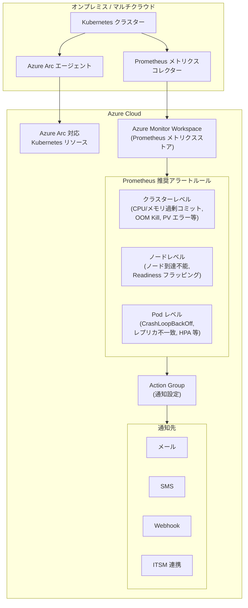

# Azure Monitor: Prometheus コミュニティ推奨アラートが Azure Arc 対応 Kubernetes で一般提供開始

**リリース日**: 2026-03-24

**サービス**: Azure Monitor

**機能**: Azure Arc 対応 Kubernetes クラスター向け Prometheus コミュニティ推奨アラートのワンクリック有効化

**ステータス**: Launched (GA)

[このアップデートのインフォグラフィックを見る](https://takech9203.github.io/azure-news-summary/20260324-azure-monitor-prometheus-alerts-arc-k8s.html)

## 概要

Azure Monitor において、Azure Arc 対応 Kubernetes クラスター向けの Prometheus 推奨アラートが一般提供 (GA) となった。Azure Portal からワンクリックで Prometheus 推奨アラートを有効化できる機能であり、Prometheus コミュニティルールに基づく強化されたアラートルールセットが提供される。

これらのアラートは、クラスターレベル、ノードレベル、Pod レベルの包括的な監視カバレッジを提供する。CPU やメモリの過剰コミット、OOM Kill、PersistentVolume の枯渇、Pod の CrashLoopBackOff、ノードの到達不能など、Kubernetes 運用における重要なシナリオを網羅している。Azure Arc 対応 Kubernetes クラスターではプラットフォームメトリクスの推奨アラートはサポートされないため、同等の Prometheus ベースのアラートルールが代替として提供される。

従来の Container Insights カスタムメトリクスアラート (プレビュー) は 2024 年 5 月 31 日に廃止されており、本機能はその後継として位置づけられる。既存のレガシーアラートルールを使用している場合は、本機能への移行が推奨される。

**アップデート前の課題**

- Azure Arc 対応 Kubernetes クラスターでは、プラットフォームメトリクスベースの推奨アラートがサポートされず、監視設定に手間がかかった
- Prometheus アラートルールを手動で作成・管理する必要があり、ベストプラクティスに基づくルール設計に専門知識が求められた
- レガシーの Container Insights カスタムメトリクスアラートが廃止され、代替となる統合的なアラート設定手段が必要だった

**アップデート後の改善**

- Azure Portal からワンクリックで Prometheus コミュニティ推奨アラートを有効化できるようになった
- クラスター、ノード、Pod の各レベルで事前定義されたアラートルールが提供され、包括的な監視をすぐに開始できる
- 個別ルールの有効/無効切り替え、名前・重大度・しきい値のカスタマイズが可能
- Azure Arc 対応 Kubernetes クラスターでも AKS と同等のアラート体験が実現した

## アーキテクチャ図



Azure Arc エージェントがオンプレミスまたはマルチクラウド環境の Kubernetes クラスターを Azure に接続し、Prometheus メトリクスコレクターが Azure Monitor Workspace にメトリクスを送信する。推奨アラートルールがメトリクスを評価し、条件に該当した場合に Action Group を通じて通知を送信する。

## サービスアップデートの詳細

### 主要機能

1. **ワンクリック有効化**
   - Azure Portal のクラスターの「アラート」メニューから「Set up recommendations」を選択するだけで、推奨アラートルールを有効化できる
   - Prometheus ルールグループはクラスターと同じリージョンに自動作成される

2. **クラスターレベルアラート (11 ルール)**
   - KubeCPUQuotaOvercommit: CPU リソースクォータが利用可能な CPU の 150% を超過した場合
   - KubeMemoryQuotaOvercommit: メモリリソースクォータが利用可能なメモリの 150% を超過した場合
   - KubeContainerOOMKilledCount: コンテナが OOM Kill された場合
   - KubeClientErrors: Kubernetes API クライアントエラー率が 1% を超過した場合
   - KubePersistentVolumeFillingUp: PersistentVolume の空き容量が枯渇傾向にある場合
   - KubePersistentVolumeInodesFillingUp: PV の inode が 3% 未満の場合
   - KubePersistentVolumeErrors: PV が Failed/Pending 状態の場合
   - KubeContainerWaiting: コンテナが 60 分以上 Waiting 状態の場合
   - KubeDaemonSetNotScheduled / KubeDaemonSetMisScheduled: DaemonSet のスケジューリング問題
   - KubeQuotaAlmostFull: リソースクォータ使用率が 90-100% の場合

3. **ノードレベルアラート (2 ルール)**
   - KubeNodeUnreachable: ノードが 15 分以上到達不能な場合
   - KubeNodeReadinessFlapping: ノードの Readiness ステータスが 15 分間に 2 回以上変化した場合

4. **Pod レベルアラート (15 ルール)**
   - KubePodCrashLooping: Pod が CrashLoopBackOff 状態の場合
   - KubeDeploymentReplicasMismatch: Deployment のレプリカ数が不一致の場合
   - KubeStatefulSetReplicasMismatch: StatefulSet のレプリカ数が不一致の場合
   - KubeHpaReplicasMismatch / KubeHpaMaxedOut: HPA 関連の問題
   - KubeContainerAverageCPUHigh / KubeContainerAverageMemoryHigh: コンテナリソース使用率 95% 超過
   - KubePodFailedState / KubePodNotReadyByController: Pod の異常状態
   - KubePodReadyStateLow: Pod の Ready 率が 80% 未満
   - KubePodContainerRestart: コンテナ再起動の検出
   - KubeJobFailed / KubeJobStale: Job の失敗・停滞
   - KubePVUsageHigh: PV 使用率 80% 超過
   - KubeletPodStartUpLatencyHigh: Pod 起動レイテンシの 99 パーセンタイルが 60 秒超過

5. **カスタマイズ機能**
   - 個別ルールの有効/無効切り替えが可能
   - ルール名、重大度、しきい値を編集可能
   - Action Group による通知先のカスタマイズ

## 技術仕様

| 項目 | 詳細 |
|------|------|
| 対象クラスター | Azure Arc 対応 Kubernetes クラスター |
| メトリクスストア | Azure Monitor Workspace (Prometheus 互換) |
| アラートルール数 | クラスターレベル 11、ノードレベル 2、Pod レベル 15 (合計 28 ルール) |
| デプロイ方法 | Azure Portal / ARM テンプレート / Bicep |
| ルールグループリージョン | クラスターと同一リージョンに作成 (推奨) |
| プラットフォームメトリクスアラート | Azure Arc 対応 Kubernetes ではサポートされない (Prometheus ベースで代替) |

## 設定方法

### 前提条件

1. Azure Arc 対応 Kubernetes クラスターが Azure に接続済みであること
2. クラスターで Prometheus メトリクス収集が有効化されていること (Azure Monitor Workspace が構成済み)
3. Action Group が作成済みであること (通知先の設定)

### Azure Portal

1. Azure Portal で対象の Azure Arc 対応 Kubernetes クラスターに移動する
2. 左メニューから **Alerts** を選択する
3. **Set up recommendations** ボタンをクリックする
4. 表示される Prometheus アラートルールの一覧で、有効化するルールグループ (Pod / Cluster / Node) をトグルで切り替える
5. 必要に応じて個別ルールを展開し、名前、重大度、しきい値を編集する
6. 通知方法として既存の Action Group を選択するか、新しい Action Group を作成する
7. **Save** をクリックしてルールグループを保存する

### ARM テンプレート

```bash
# ARM テンプレートのダウンロード
# テンプレート URL: https://aka.ms/azureprometheus-recommendedmetricalerts

# デプロイ時に以下のパラメータを指定
# - clusterResourceId: クラスターのリソース ID
# - actionGroupResourceId: Action Group のリソース ID
# - azureMonitorWorkspaceResourceId: Azure Monitor Workspace のリソース ID
# - location: アラートルールグループを格納するリージョン
```

## メリット

### ビジネス面

- ワンクリックで Kubernetes 監視のベストプラクティスを導入でき、監視設定にかかる時間とコストを大幅に削減できる
- Prometheus コミュニティの知見に基づくアラートルールにより、重要な障害を早期に検知し、ダウンタイムを最小化できる
- オンプレミスやマルチクラウド環境の Kubernetes クラスターも Azure と統一的に監視でき、運用の一貫性が向上する

### 技術面

- Prometheus コミュニティで実績のあるアラートルールが事前定義されており、アラート設計のベストプラクティスをすぐに活用できる
- クラスター、ノード、Pod の全レベルをカバーする 28 のアラートルールで、包括的な可観測性を実現する
- しきい値や重大度のカスタマイズにより、環境固有の要件に合わせた調整が可能
- ARM テンプレートや Bicep によるインフラストラクチャ・アズ・コード (IaC) でのデプロイに対応している

## デメリット・制約事項

- Azure Arc 対応 Kubernetes クラスターではプラットフォームメトリクスの推奨アラートルールはサポートされない (Prometheus ベースのみ)
- Prometheus メトリクス収集が事前に有効化されている必要があり、Azure Monitor Workspace の構成が前提となる
- ルールグループ作成後は同じポータルページからの編集ができず、ルールグループのページから個別に編集する必要がある
- アラートルールの評価には Prometheus メトリクスの収集間隔に依存するレイテンシが存在する

## ユースケース

### ユースケース 1: ハイブリッドクラウド環境の統一監視

**シナリオ**: オンプレミスのデータセンターと AWS に Kubernetes クラスターを展開している企業が、Azure Arc でこれらのクラスターを管理し、統一的な監視アラートを設定する。

**実装例**:

1. オンプレミスおよび AWS の Kubernetes クラスターに Azure Arc エージェントをインストール
2. 各クラスターで Prometheus メトリクス収集を有効化し、Azure Monitor Workspace にメトリクスを送信
3. Azure Portal から各クラスターの推奨アラートを有効化
4. 共通の Action Group で Webhook を設定し、既存のインシデント管理システムに通知を連携

**効果**: マルチクラウド・ハイブリッド環境のすべての Kubernetes クラスターを Azure Portal から統一的に監視でき、アラート設定の標準化と運用効率の向上を実現できる。

### ユースケース 2: レガシー Container Insights アラートからの移行

**シナリオ**: 以前の Container Insights カスタムメトリクスアラート (プレビュー) を使用していた組織が、廃止に伴い新しい Prometheus 推奨アラートに移行する。

**実装例**:

1. 既存の Container Insights カスタムメトリクスアラートを無効化 (Insights メニュー > Recommended alerts (preview) > Disabled)
2. クラスターの Alerts メニューから Set up recommendations を選択
3. レガシーアラートに対応する Prometheus ルール (例: Container CPU % -> KubeContainerAverageCPUHigh) を有効化
4. 必要に応じてしきい値を既存の設定に合わせて調整

**効果**: 廃止されたレガシーアラートから最新の Prometheus ベースのアラートに移行することで、継続的な監視カバレッジを維持しつつ、より多くのアラートシナリオに対応できる。

## 料金

Prometheus 推奨アラートの利用料金は、Azure Monitor の Prometheus メトリクスおよびアラートルールの料金体系に基づく。

| 項目 | 料金 |
|------|------|
| Prometheus メトリクス取り込み | Azure Monitor Workspace の料金体系に準拠 |
| アラートルール評価 | Prometheus アラートルールの料金体系に準拠 |
| 通知 (Action Group) | 通知タイプ (メール、SMS、Webhook 等) ごとの料金 |

無料枠: Prometheus メトリクスには毎月一定量の無料取り込み枠が提供される。詳細は [Azure Monitor の料金ページ](https://azure.microsoft.com/pricing/details/monitor/) を参照。

## 利用可能リージョン

Azure Monitor Workspace がサポートされるすべてのリージョンで利用可能。Prometheus ルールグループはクラスターと同じリージョンに作成することが推奨される。

## 関連サービス・機能

- **Azure Monitor Workspace**: Prometheus メトリクスの格納先であり、推奨アラートルールの評価基盤
- **Azure Arc 対応 Kubernetes**: オンプレミスやマルチクラウドの Kubernetes クラスターを Azure に接続するサービス
- **Container Insights**: Kubernetes クラスターのログ・パフォーマンス監視機能。Prometheus 推奨アラートと併用可能
- **Azure Monitor Alerts**: アラートの評価・通知基盤。Action Group による通知先の管理を提供
- **Azure Kubernetes Service (AKS)**: AKS クラスターでも同様の Prometheus 推奨アラートおよびプラットフォームメトリクスアラートが利用可能

## 参考リンク

- [インフォグラフィック](https://takech9203.github.io/azure-news-summary/20260324-azure-monitor-prometheus-alerts-arc-k8s.html)
- [公式アップデート情報](https://azure.microsoft.com/updates?id=558825)
- [Microsoft Learn ドキュメント - Recommended alert rules for Kubernetes clusters](https://learn.microsoft.com/en-us/azure/azure-monitor/containers/kubernetes-metric-alerts)
- [Prometheus 推奨アラート ARM テンプレート](https://aka.ms/azureprometheus-recommendedmetricalerts)
- [トラブルシューティングガイド (コミュニティ Runbook)](https://aka.ms/aks-alerts/community-runbooks)
- [料金ページ](https://azure.microsoft.com/pricing/details/monitor/)

## まとめ

Azure Monitor Prometheus コミュニティ推奨アラートの Azure Arc 対応 Kubernetes サポートが GA となり、オンプレミスやマルチクラウド環境の Kubernetes クラスターでも、AKS と同等のワンクリックアラート設定体験が利用可能になった。Prometheus コミュニティのベストプラクティスに基づく 28 のアラートルールがクラスター、ノード、Pod の全レベルをカバーし、OOM Kill、CrashLoopBackOff、PersistentVolume 枯渇など、Kubernetes 運用における重要な障害シナリオを包括的に監視できる。Azure Arc で Kubernetes クラスターを管理している組織は、Azure Portal から推奨アラートを有効化し、既存の Action Group と組み合わせることで、統一的な監視アラート基盤を迅速に構築できる。レガシーの Container Insights カスタムメトリクスアラートを使用している場合は、本機能への移行を推奨する。

---

**タグ**: #Azure #AzureMonitor #Prometheus #AzureArc #Kubernetes #GA #Alerting #Monitoring #Observability #HybridCloud
