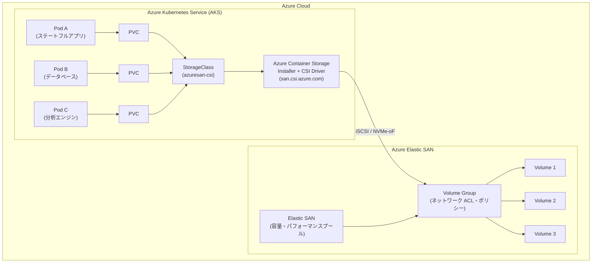

# Azure Container Storage: v2.1.0 で Elastic SAN 統合とオンデマンドインストールが一般提供開始

**リリース日**: 2026-03-24

**サービス**: Azure Container Storage

**機能**: Azure Container Storage v2.1.0 - Elastic SAN 統合およびオンデマンドインストール

**ステータス**: Launched (GA)

[このアップデートのインフォグラフィックを見る](https://takech9203.github.io/azure-news-summary/20260324-container-storage-elastic-san-v2-1.html)

## 概要

Azure Container Storage v2.1.0 が一般提供 (GA) として正式リリースされた。本バージョンでは、Azure Elastic SAN との統合機能が追加され、Kubernetes クラスター上のコンテナ化されたワークロードが共有ストレージプールからストレージを消費できるようになった。これにより、個別のディスクを大量に管理することなく、高い一貫性のあるストレージパフォーマンスを実現できる。

Azure Container Storage は、コンテナ向けに構築されたクラウドベースのボリューム管理・デプロイ・オーケストレーションサービスである。Kubernetes と統合し、ステートフルアプリケーション向けの永続ボリュームを動的にプロビジョニングできる。v2.1.0 では Elastic SAN をバッキングストレージとして利用することで、予測可能なスループット、LRS (ローカル冗長ストレージ) および ZRS (ゾーン冗長ストレージ) による冗長性、数千の永続ボリュームのクラスタ単位でのプロビジョニングが可能となった。

さらに、オンデマンドインストール機能により、CSI ドライバーのインストールがストレージクラスの作成時まで遅延されるようになり、不要なリソース消費を回避しつつ、必要なタイミングで自動的にドライバーが展開される。

**アップデート前の課題**

- コンテナ化されたワークロードでは、個別のマネージドディスクを大量に管理する必要があり、運用が複雑であった
- VM あたりのディスクアタッチ上限 (例: 64 ディスク/VM) がボトルネックとなり、大規模なステートフルワークロードのスケーリングが制限されていた
- ストレージの過剰プロビジョニングが発生しやすく、コスト効率が低下していた
- CSI ドライバーのインストールが即時に行われるため、使用しないストレージタイプのリソースも消費していた

**アップデート後の改善**

- Elastic SAN の共有ストレージプールから動的にボリュームをプロビジョニングでき、個別ディスク管理が不要に
- クラスタあたり数千の永続ボリュームをサポートし、Azure Resource Manager のディスクアタッチ制限を回避
- ストレージ容量を一括で追加でき、SAN 全体でパフォーマンスを共有することでコストを最適化
- オンデマンドインストールにより、ストレージクラス作成時に必要な CSI ドライバーのみが自動展開

## アーキテクチャ図



AKS 上の Pod が PersistentVolumeClaim (PVC) を通じて StorageClass を参照し、Azure Container Storage の CSI ドライバーが Elastic SAN のボリュームグループ内のボリュームを iSCSI プロトコル経由でマウントする構成を示している。Elastic SAN はストレージ容量とパフォーマンスの共有プールとして機能し、ボリュームグループがネットワークアクセス制御とポリシーを管理する。

## サービスアップデートの詳細

### 主要機能

1. **Elastic SAN 統合によるスケーラブルなブロックストレージ**
   - Elastic SAN の共有ストレージプールから Kubernetes の永続ボリュームを動的にプロビジョニング
   - クラスタあたり数千の永続ボリュームをサポートし、VM あたりのディスクアタッチ制限を回避
   - LRS および ZRS による冗長性オプションを提供

2. **オンデマンド CSI ドライバーインストール**
   - インストーラーのみのモードでは、CSI ドライバーのデプロイがストレージクラス作成時まで遅延
   - 不要なリソース消費を回避し、必要なタイミングで自動的にドライバーが展開
   - ストレージタイプ指定モードでは、インストール時にドライバーとデフォルトストレージクラスを同時にデプロイ

3. **複数のプロビジョニングモデル**
   - 動的プロビジョニング: Azure Container Storage が Elastic SAN のボリュームグループとボリュームをオンデマンドで作成
   - 事前プロビジョニング: 既存の Elastic SAN とボリュームグループを参照してボリュームを作成
   - 静的プロビジョニング: 事前に作成した Elastic SAN ボリュームを Kubernetes の PV として利用

4. **Kubernetes ネイティブなボリューム管理**
   - StorageClass、PersistentVolume、PersistentVolumeClaim を kubectl コマンドで管理
   - ボリュームの拡張、スナップショット、暗号化をサポート
   - 標準的な Kubernetes ツールで操作でき、CSI ドライバーの手動インストールが不要

## 技術仕様

| 項目 | 詳細 |
|------|------|
| バージョン | Azure Container Storage v2.1.0 (version 2.x.x 系) |
| サポートするストレージタイプ | ローカル NVMe ディスク、Azure Elastic SAN |
| 接続プロトコル | iSCSI、NVMe-oF over TCP |
| CSI プロビジョナー | san.csi.azure.com (Elastic SAN) |
| デフォルトストレージクラス名 | azuresan-csi |
| 冗長性オプション | LRS (ローカル冗長)、ZRS (ゾーン冗長) |
| ボリューム拡張 | サポート (allowVolumeExpansion: true) |
| スナップショット | サポート (Elastic SAN のみ) |
| 保存時の暗号化 | サポート (Elastic SAN) |
| OS サポート | Linux のみ (Windows 非対応) |
| デフォルト Elastic SAN 容量 | 1 TiB (StorageClass パラメータでカスタマイズ可能) |

## 設定方法

### 前提条件

1. Azure CLI v2.83.0 以降がインストールされていること
2. AKS クラスタが作成済みであること (Linux ノードプール)
3. kubectl がインストールされていること
4. Elastic SAN プロバイダーが登録済みであること

### Azure CLI

```bash
# Elastic SAN プロバイダーの登録 (初回のみ)
az provider register --namespace Microsoft.ElasticSan

# 既存の AKS クラスタに Azure Container Storage をインストール (インストーラーのみ)
az aks update -n <cluster-name> -g <resource-group> --enable-azure-container-storage

# Elastic SAN ストレージタイプを指定してインストール
az aks update -n <cluster-name> -g <resource-group> --enable-azure-container-storage elasticSan

# AKS マネージド ID に Azure Container Storage Operator ロールを割り当て
export AKS_MI_OBJECT_ID=$(az aks show --name <cluster-name> --resource-group <resource-group> --query "identityProfile.kubeletidentity.objectId" -o tsv)
az role assignment create --assignee $AKS_MI_OBJECT_ID --role "Azure Container Storage Operator" --scope "/subscriptions/<azure-subscription-id>"
```

### StorageClass の作成

```yaml
apiVersion: storage.k8s.io/v1
kind: StorageClass
metadata:
  name: azuresan-csi
provisioner: san.csi.azure.com
reclaimPolicy: Delete
volumeBindingMode: Immediate
allowVolumeExpansion: true
parameters:
  initialStorageTiB: "10"  # カスタム容量 (省略時は 1 TiB)
```

### PersistentVolumeClaim の作成

```yaml
apiVersion: v1
kind: PersistentVolumeClaim
metadata:
  name: managedpvc
spec:
  accessModes:
    - ReadWriteOnce
  resources:
    requests:
      storage: 1Gi
  storageClassName: azuresan-csi
```

## メリット

### ビジネス面

- ストレージの一括プロビジョニングにより、過剰プロビジョニングを回避しコストを削減
- 個別ディスクの管理が不要となり、運用負荷を大幅に軽減
- SAN 全体でパフォーマンスを共有することで、未使用のパフォーマンスを他のボリュームが活用可能

### 技術面

- VM あたりのディスクアタッチ制限 (64 ディスク/VM) を回避し、クラスタあたり数千のボリュームをサポート
- iSCSI / NVMe-oF プロトコルにより、高速なアタッチ・デタッチ操作と Pod の迅速なリカバリを実現
- LRS / ZRS による冗長性オプションで、データの耐久性と可用性を確保
- Kubernetes ネイティブな操作で CSI ドライバーの手動管理が不要

## デメリット・制約事項

- Azure Elastic SAN の容量拡張は Azure Container Storage 経由では未サポート (Azure Portal または Azure CLI から直接操作が必要)
- Windows ノードプールは非対応 (Linux のみ)
- Azure Disks は v2.x.x ではサポートされない (Azure Disks を使用する場合は v1.x.x が必要)
- 転送中の暗号化は Elastic SAN では未サポート
- Elastic SAN ボリュームグループのネットワーク ACL で明示的に許可されたサブネットからのみアクセス可能 (複数ノードプールが異なるサブネットにある場合は全サブネットの ACL 登録が必要)

## ユースケース

### ユースケース 1: 大規模データベースクラスタのストレージ統合

**シナリオ**: 複数の PostgreSQL や MySQL インスタンスを AKS 上で運用しており、個別のマネージドディスク管理が運用負荷となっている場合。

**実装例**:

```bash
# AKS クラスタに Azure Container Storage + Elastic SAN をインストール
az aks update -n myAKSCluster -g myResourceGroup --enable-azure-container-storage elasticSan

# StorageClass を適用
kubectl apply -f storageclass.yaml

# 各データベースインスタンスの PVC を作成
kubectl apply -f db-pvc.yaml
```

**効果**: Elastic SAN の共有プールからボリュームが動的にプロビジョニングされ、個別ディスクの管理が不要に。VM あたりのディスク制限を回避し、単一ノード上で多数のデータベースインスタンスを運用可能。

### ユースケース 2: CI/CD パイプラインの高速ストレージ

**シナリオ**: CI/CD ワークロードで多数の短命な Pod が頻繁にストレージをアタッチ・デタッチする環境。

**実装例**:

```yaml
apiVersion: v1
kind: PersistentVolumeClaim
metadata:
  name: cicd-workspace
spec:
  accessModes:
    - ReadWriteOnce
  resources:
    requests:
      storage: 10Gi
  storageClassName: azuresan-csi
```

**効果**: iSCSI プロトコルによる高速なアタッチ・デタッチ操作により、Pod の起動・終了時間を短縮。SAN のパフォーマンス共有により、ピーク時にも安定したスループットを提供。

## 利用可能リージョン

Azure Container Storage は以下のリージョンで利用可能:

- **北米**: East US, East US 2, West US, West US 2, West US 3, Central US, North Central US, South Central US, West Central US, Canada Central, Canada East
- **ヨーロッパ**: North Europe, West Europe, UK South, France Central, Germany West Central, Sweden Central, Switzerland North
- **アジア太平洋**: Japan East, Australia East, East Asia, Southeast Asia, Korea Central, Central India
- **中東**: UAE North
- **アフリカ**: South Africa North
- **南米**: Brazil South

Elastic SAN の利用可能リージョンは上記と異なる場合がある。最新のリージョン情報は Elastic SAN のドキュメントを参照のこと。

## 関連サービス・機能

- **Azure Elastic SAN**: Azure Container Storage のバッキングストレージとして機能するフルマネージド SAN サービス。容量とパフォーマンスの共有プールを提供
- **Azure Kubernetes Service (AKS)**: Azure Container Storage のホスト環境となるマネージド Kubernetes サービス
- **Azure Container Storage v1.x.x**: Azure Disks をサポートする旧バージョン。Azure Disks が必要な場合はこちらを使用
- **ローカル NVMe ディスク**: Azure Container Storage v2.x.x でサポートされるもう一つのストレージタイプ。超低レイテンシが求められるワークロード向け

## 参考リンク

- [インフォグラフィック](https://takech9203.github.io/azure-news-summary/20260324-container-storage-elastic-san-v2-1.html)
- [公式アップデート情報](https://azure.microsoft.com/updates?id=557912)
- [Azure Container Storage ドキュメント](https://learn.microsoft.com/en-us/azure/storage/container-storage/container-storage-introduction)
- [Azure Elastic SAN ドキュメント](https://learn.microsoft.com/en-us/azure/storage/elastic-san/elastic-san-introduction)
- [Azure Container Storage + Elastic SAN 利用ガイド](https://learn.microsoft.com/en-us/azure/storage/container-storage/use-container-storage-with-elastic-san)
- [Azure Container Storage インストールガイド](https://learn.microsoft.com/en-us/azure/storage/container-storage/install-container-storage-aks)

## まとめ

Azure Container Storage v2.1.0 の GA リリースにより、Elastic SAN 統合とオンデマンドインストールが正式に利用可能となった。Kubernetes 上のステートフルワークロードにおいて、VM あたりのディスクアタッチ制限を回避しつつ、共有ストレージプールから数千のボリュームを動的にプロビジョニングできる点が大きなメリットである。

Solutions Architect への推奨アクション:
- 現在 Azure Disks を個別管理しているステートフルワークロードについて、Elastic SAN への移行を検討する
- 既存の AKS クラスタに対し、インストーラーのみモードで Azure Container Storage を有効化し、段階的に Elastic SAN ストレージクラスを導入する
- 複数ノードプール環境では、Elastic SAN ボリュームグループのネットワーク ACL に全ノードプールのサブネットが含まれていることを確認する

---

**タグ**: #AzureContainerStorage #ElasticSAN #AKS #Kubernetes #Containers #Compute #GA #StorageConsolidation
