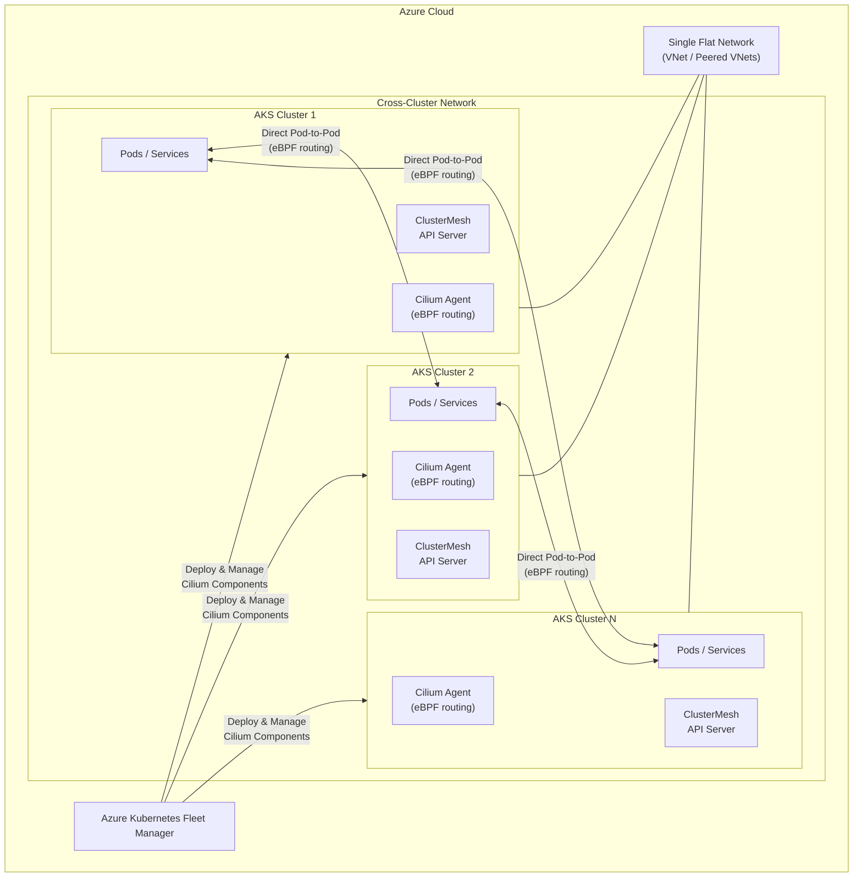

# Azure Kubernetes Fleet Manager: クロスクラスターネットワーキング (パブリックプレビュー)

**リリース日**: 2026-03-24

**サービス**: Azure Kubernetes Fleet Manager

**機能**: Cross-cluster networking (クロスクラスターネットワーキング)

**ステータス**: In preview

[このアップデートのインフォグラフィックを見る](https://takech9203.github.io/azure-news-summary/20260324-fleet-manager-cross-cluster-networking.html)

## 概要

Azure Kubernetes Fleet Manager にクロスクラスターネットワーキング機能がパブリックプレビューとして追加された。この機能により、Fleet Manager に参加する複数の Kubernetes クラスター間で Kubernetes データプレーンを拡張し、クラスター間の直接通信を実現する。

複数の Kubernetes クラスターにまたがるアプリケーションを運用する組織では、分散マイクロサービス環境の複雑さに起因するパフォーマンス、グローバルサービスディスカバリー、可観測性に関する課題が発生しがちである。本機能は Cilium マルチクラスターを Fleet Manager がマネージドで提供することにより、クラスター間ネットワークの構成・管理のオーバーヘッドを排除する。

接続されたクラスター上の Pod は、他の接続されたクラスター上のエンドポイントと、ネットワークポリシーの適用を維持したまま直接通信できる。また、サービスをグローバルに公開し、あたかもローカルサービスであるかのように他のクラスターから呼び出すことが可能になる。

**アップデート前の課題**

- 複数クラスター間のネットワーク接続を手動で構成・管理する必要があり、Cilium マルチクラスターのデータプレーンコンポーネントを各クラスターで個別に設定する運用負荷が高かった
- クラスター間のサービスディスカバリーが困難で、分散マイクロサービスのグローバルな通信に独自の仕組みが必要だった
- Cilium コンポーネントのバージョン管理やアップグレードを手動で行う必要があり、互換性の確保が煩雑だった

**アップデート後の改善**

- Fleet Manager がクロスクラスターネットワークをマネージドで提供し、Cilium マルチクラスターの構成・管理が自動化される
- サービスにアノテーションを追加するだけでグローバルサービスとして公開でき、クラスター間の透過的なロードバランシングが実現する
- Cilium コンポーネントの更新が AKS Kubernetes リリースに統合され、Fleet Manager の Update Runs/Strategies と連携したアップグレードが可能になる

## アーキテクチャ図



Fleet Manager がクロスクラスターネットワークに参加する各 AKS クラスターに Cilium Agent と ClusterMesh API Server を自動デプロイする。各クラスターの Pod は eBPF ベースのルーティングにより、プロキシやゲートウェイを介さず直接通信する。

## サービスアップデートの詳細

### 主要機能

1. **マネージド Cilium マルチクラスター**
   - Fleet Manager が Cilium Agent (cilium-agent) と clustermesh-apiserver を各メンバークラスターの制御プレーンに自動デプロイする
   - クラスターがクロスクラスターネットワークに参加すると、既存のクラスターにも新しいクラスターの情報が自動的に反映される

2. **eBPF ベースのダイレクトルーティング**
   - Cilium Agent が eBPF ベースのルーティングを構成し、プロキシやゲートウェイなしで各クラスターの Pod が直接通信できる
   - 各クラスターは Pod およびサービスのローカル CIDR IP アドレス設定を保持する

3. **グローバルサービス公開**
   - Kubernetes Service に `service.cilium.io/global: "true"` アノテーションを追加するだけでクロスクラスターネットワーク全体にサービスを公開可能
   - 複数クラスターに同一サービスをデプロイすると、リクエストが透過的にクラスター間でロードバランシングされる
   - `service.cilium.io/shared: "false"` を設定することで一時的にロードバランシングからクラスターを除外できる

4. **ネットワークポリシー制御**
   - CiliumNetworkPolicy を使用してクロスクラスターのデータフローを制御可能
   - クラスター間通信にもネットワークポリシーが完全に適用される

5. **自動コンポーネント更新**
   - Cilium コンポーネントの更新が AKS Kubernetes リリースにバンドルされる
   - Fleet Manager の Update Runs と Strategies を使用して、クラスターの更新順序を定義したアップグレードが可能

## 技術仕様

| 項目 | 詳細 |
|------|------|
| 最大メンバークラスター数 | 1 つのクロスクラスターネットワークあたり 255 クラスター |
| ネットワークモデル | フラットネットワーク (単一 VNet またはピアリングされた VNet) |
| CNI | Cilium (ACNS 経由で有効化) |
| ルーティング方式 | eBPF ベースの直接ルーティング (プロキシ/ゲートウェイ不要) |
| オーバーレイネットワーク | トンネルによるオーバーレイはサポートされない |
| ネットワークプロファイル | 複数のクロスクラスターネットワークプロファイルを作成可能 |
| クラスター参加制限 | メンバークラスターは同時に 1 つのクロスクラスターネットワークにのみ参加可能 |

## 設定方法

### 前提条件

1. Azure CLI バージョン 2.82.0 以降がインストールされていること
2. Azure CLI `fleet` 拡張機能バージョン 1.8.3 以降がインストールされていること
3. メンバークラスターで Advanced Container Networking Services (ACNS) と Cilium が有効であること
4. クラスターが単一のフラットネットワーク (VNet またはピアリングされた複数の VNet) に接続されていること
5. セルフマネージドの Cilium マルチクラスターが同時にデプロイされていないこと

### Azure CLI

```bash
# Fleet 拡張機能のインストール/更新
az extension add --name fleet
az extension update --name fleet

# Fleet Manager の作成
az fleet create \
    --resource-group ${GROUP} \
    --name ${FLEET} \
    --location ${LOCATION} \
    --enable-managed-identity

# メンバークラスターの参加
az fleet member create \
    --resource-group ${GROUP} \
    --fleet-name ${FLEET} \
    --name ${MEMBER_NAME} \
    --member-cluster-id ${MEMBER_CLUSTER_ID}

# メンバークラスター一覧の確認
az fleet member list \
    --resource-group ${GROUP} \
    --fleet-name ${FLEET} \
    -o table
```

## メリット

### ビジネス面

- マルチクラスター環境のネットワーク運用負荷を大幅に削減し、インフラ管理チームの工数を節約できる
- クラスター間のサービス連携が容易になり、マルチリージョン/マルチクラスター構成のアプリケーション開発のスピードが向上する
- Cilium コンポーネントの自動更新により、セキュリティパッチ適用の運用コストが削減される

### 技術面

- eBPF ベースの直接ルーティングにより、プロキシやゲートウェイを経由しないため低レイテンシのクラスター間通信が実現する
- CiliumNetworkPolicy によるきめ細かいトラフィック制御で、クラスター間通信にもセキュリティ境界を適用可能
- アノテーション追加のみでグローバルサービスを構成でき、既存の Kubernetes ワークフローとの親和性が高い
- Fleet Manager の Update Runs/Strategies と統合されたアップグレード戦略により、クラスター更新時のリスクを低減できる

## デメリット・制約事項

- パブリックプレビューのため SLA が適用されず、本番環境での使用は推奨されない
- クラスターは単一のフラットネットワーク上に存在する必要があり、トンネルによるオーバーレイネットワークはサポートされない
- メンバークラスターは同時に 1 つのクロスクラスターネットワークにのみ参加可能
- Advanced Container Networking Services (ACNS) と Cilium の有効化が必須であり、既存の CNI プラグインからの移行が必要な場合がある
- ACNS が設定する Cilium のバージョンや有効機能を直接変更することはできない
- セルフマネージドの Cilium マルチクラスターとの同時利用はできない
- 1 つのクロスクラスターネットワークあたり最大 255 クラスターの制限がある

## ユースケース

### ユースケース 1: マルチリージョン分散アプリケーション

**シナリオ**: EC サイトを複数リージョンにデプロイし、バックエンドのマイクロサービス (在庫管理、注文処理等) が各リージョンのクラスター間で透過的に通信する必要がある。

**実装例**:

```yaml
# グローバルサービスとして在庫管理サービスを公開
apiVersion: v1
kind: Service
metadata:
  name: inventory-service
  annotations:
    service.cilium.io/global: "true"
spec:
  selector:
    app: inventory
  ports:
    - port: 80
      targetPort: 8080
```

**効果**: 各リージョンのクラスターから inventory-service をローカルサービスと同様に呼び出すことが可能になり、リージョン間のロードバランシングが自動的に行われる。

### ユースケース 2: Blue/Green デプロイメントのクラスター間切り替え

**シナリオ**: アプリケーションの新バージョンを別クラスターにデプロイし、段階的にトラフィックを移行する。

**実装例**:

```yaml
# 旧クラスター側: 一時的にロードバランシングから除外
apiVersion: v1
kind: Service
metadata:
  name: frontend-service
  annotations:
    service.cilium.io/global: "true"
    service.cilium.io/shared: "false"
spec:
  selector:
    app: frontend
  ports:
    - port: 443
      targetPort: 8443
```

**効果**: サービスやクラスターを削除せずにトラフィックの切り替えが可能になり、問題発生時は shared アノテーションの変更のみで迅速にロールバックできる。

## 関連サービス・機能

- **Azure Kubernetes Service (AKS)**: Fleet Manager のメンバークラスターとして参加する AKS クラスターが基盤となる
- **Advanced Container Networking Services (ACNS)**: クロスクラスターネットワーキングの前提条件であり、Cilium を有効化するために必要
- **Azure Arc-enabled Kubernetes**: Arc 対応の Kubernetes クラスターも Fleet Manager のメンバークラスターとして参加可能
- **Fleet Manager Update Runs/Strategies**: Cilium コンポーネントの更新がこのアップグレード機構と統合されている

## 参考リンク

- [インフォグラフィック](https://takech9203.github.io/azure-news-summary/20260324-fleet-manager-cross-cluster-networking.html)
- [公式アップデート情報](https://azure.microsoft.com/updates?id=557877)
- [Microsoft Learn ドキュメント - Cross-cluster networking](https://learn.microsoft.com/en-us/azure/kubernetes-fleet/concepts-cross-cluster-networking)
- [Microsoft Learn ドキュメント - Fleet Manager クイックスタート](https://learn.microsoft.com/en-us/azure/kubernetes-fleet/quickstart-create-fleet-and-members)
- [Cilium マルチクラスター公式ドキュメント](https://docs.cilium.io/en/stable/network/clustermesh/intro/)

## まとめ

Azure Kubernetes Fleet Manager のクロスクラスターネットワーキング機能は、マルチクラスター Kubernetes 環境におけるネットワーク接続の課題を大幅に簡素化するアップデートである。Fleet Manager がマネージドで Cilium マルチクラスターを提供することにより、従来手動で行っていたクラスター間ネットワークの構成・管理が自動化される。

Solutions Architect にとって特に重要なポイントは、eBPF ベースの低レイテンシ通信、アノテーションベースの簡潔なグローバルサービス公開、および CiliumNetworkPolicy によるセキュリティ制御が統合的に利用できる点である。

現時点ではパブリックプレビューであるため、本番環境への適用は GA 後に検討することを推奨する。ただし、マルチクラスター構成を計画している場合は、検証環境で早期に評価を開始し、ACNS/Cilium の有効化やフラットネットワーク構成の要件を確認しておくことが望ましい。

---

**タグ**: #Azure #AzureKubernetesFleetManager #AKS #Containers #Compute #CrossClusterNetworking #Cilium #eBPF #Kubernetes #MultiCluster #Preview
