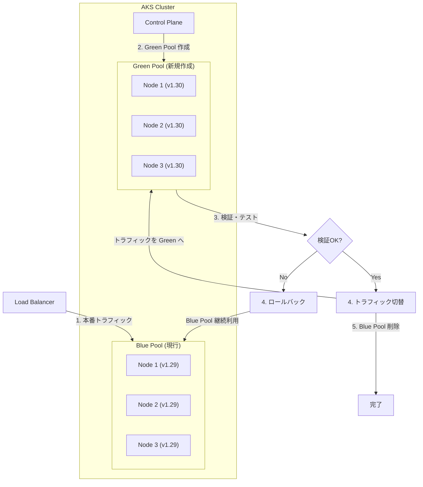

# Azure Kubernetes Service (AKS): Blue-Green エージェントプールアップグレード

**リリース日**: 2026-03-25

**サービス**: Azure Kubernetes Service (AKS)

**機能**: Blue-Green エージェントプールアップグレード

**ステータス**: In preview

[このアップデートのインフォグラフィックを見る](https://takech9203.github.io/azure-news-summary/20260325-aks-blue-green-agent-pool-upgrade.html)

## 概要

Azure Kubernetes Service (AKS) において、Blue-Green エージェントプールアップグレードがパブリックプレビューとして発表された。この機能は、従来のインプレース（その場での）ノードプールアップグレードに代わり、新しい構成を持つ並列ノードプールを作成することで、ワークロードの移行前に検証を行い、問題発生時にはクリーンなロールバックパスを提供する。

KubeCon + CloudNativeCon Europe 2026 において Microsoft が発表したこの機能は、本番環境でのアップグレードに伴うリスクを大幅に軽減するものである。従来、プロダクション環境のアップグレードは大きなリスクを伴い、問題発生時の復旧は時間がかかり困難であった。Blue-Green エージェントプールアップグレードにより、クラスターの変更がより安全で、観測可能で、可逆的になる。

同時に発表された**エージェントプールロールバック**機能と組み合わせることで、オペレーターはアップグレードライフサイクル全体に対して、「アップグレードして祈る」か「バージョンを据え置く」かの二択ではない、実質的な制御を得ることができる。

**アップデート前の課題**

- インプレースノードプールアップグレードでは、稼働中の環境に直接変更が適用されるためリスクが高い
- アップグレード後に問題が発生した場合、ロールバックに完全な再構築が必要で、復旧に時間とコストがかかる
- アップグレード中にワークロードの検証を行う手段が限られている

**アップデート後の改善**

- 新しい構成を持つ並列ノードプールを事前に作成し、トラフィック移行前に検証が可能
- 問題発生時にはクリーンなロールバックパス（旧ノードプールへの切り戻し）を提供
- エージェントプールロールバック機能との連携により、ノードプールを以前の Kubernetes バージョンとノードイメージに戻すことが可能

## アーキテクチャ図

Blue-Green アップグレードでは、現行のノードプール（Blue）を維持したまま、新しいバージョンのノードプール（Green）を並列に作成する。Green Pool での検証が完了した後にトラフィックを切り替え、問題があれば即座に Blue Pool へロールバックできる。

## サービスアップデートの詳細

### 主要機能

1. **Blue-Green エージェントプールアップグレード**
   - 既存のノードプール（Blue）を維持したまま、新しい構成のノードプール（Green）を並列に作成
   - ワークロードを Green Pool に移行する前に、動作検証やテストを実施可能
   - 検証完了後にトラフィックを切り替え、旧プールを削除する段階的なアプローチ

2. **エージェントプールロールバック**
   - アップグレード後に問題が発生した場合、ノードプールを以前の Kubernetes バージョンとノードイメージに戻すことが可能
   - 完全な再構築を必要とせずに、迅速な復旧を実現

3. **既存のアップグレード戦略との補完関係**
   - 従来のローリングアップグレード（max-surge、drain-timeout、soak-time 等の設定）に加え、Blue-Green という新たな選択肢を提供
   - ミッションクリティカルなワークロードに対して、より安全なアップグレードパスを実現

## メリット

### ビジネス面

- 本番環境のアップグレードに伴うダウンタイムリスクの大幅な軽減
- アップグレード失敗時の復旧時間（MTTR）の短縮
- 段階的なアップグレードにより、ビジネス影響を最小限に抑制

### 技術面

- ワークロード移行前に新しいノードプール構成の検証が可能
- ロールバックパスが明確で、旧ノードプールへの即時切り戻しが可能
- エージェントプールロールバック機能との組み合わせにより、アップグレードライフサイクル全体の制御性が向上

## デメリット・制約事項

- パブリックプレビュー段階のため、本番環境での利用には注意が必要
- Blue-Green アプローチでは、一時的に 2 つのノードプールが並行稼働するため、アップグレード中のコンピューティングリソースとコストが増加する
- サブスクリプションのクォータが十分に確保されている必要がある

## ユースケース

### ユースケース 1: ミッションクリティカルなワークロードの Kubernetes バージョンアップグレード

**シナリオ**: 金融システムや医療システムなど、ダウンタイムが許容されないワークロードを運用している AKS クラスターで、Kubernetes のメジャーバージョンアップグレードを実施する場合。

**効果**: 新しい Kubernetes バージョンのノードプールを事前に作成し、動作検証やパフォーマンステストを完了してからトラフィックを切り替えることで、安全なアップグレードを実現。問題が発見された場合は旧ノードプールに即座にロールバック可能。

### ユースケース 2: ノードイメージの更新と構成変更

**シナリオ**: OS セキュリティパッチの適用や、VM SKU の変更を伴うノードプール構成の更新を行う場合。

**効果**: 新しいノードイメージや構成のノードプールを並列に作成し、アプリケーションの互換性を事前に確認。従来のインプレースアップグレードでは検出しにくかった互換性問題を、移行前に発見できる。

## 料金

Blue-Green エージェントプールアップグレード機能自体に追加料金は発生しないと想定されるが、アップグレード中は 2 つのノードプールが並行稼働するため、その期間中のコンピューティングリソース（VM）費用が一時的に増加する。具体的な料金は使用する VM SKU とノード数に依存する。

## 関連サービス・機能

- **AKS ローリングアップグレード**: 従来のノードプールアップグレード方式。max-surge や soak-time 等のパラメータで挙動をカスタマイズ可能
- **エージェントプールロールバック**: Blue-Green アップグレードと併せて発表された機能。アップグレード後のノードプールを以前のバージョンに戻す機能
- **AKS コントロールプレーンアップグレード**: コントロールプレーンとノードプールを分離してアップグレードする機能。Blue-Green アップグレードの前提として、コントロールプレーンの事前アップグレードが必要

## 参考リンク

- [インフォグラフィック](https://takech9203.github.io/azure-news-summary/20260325-aks-blue-green-agent-pool-upgrade.html)
- [公式アップデート情報](https://azure.microsoft.com/updates?id=557862)
- [KubeCon + CloudNativeCon Europe 2026 ブログ記事](https://opensource.microsoft.com/blog/2026/03/24/whats-new-with-microsoft-in-open-source-and-kubernetes-at-kubecon-cloudnativecon-europe-2026/)
- [AKS コントロールプレーンアップグレード ドキュメント](https://learn.microsoft.com/en-us/azure/aks/upgrade-aks-control-plane)
- [AKS ノードプール ローリングアップグレード ドキュメント](https://learn.microsoft.com/en-us/azure/aks/upgrade-aks-node-pools-rolling)

## まとめ

Blue-Green エージェントプールアップグレードは、AKS における本番環境のアップグレードリスクを大幅に軽減する重要な機能である。従来のインプレースアップグレードでは避けられなかった「アップグレードして問題がないことを祈る」というアプローチから脱却し、事前検証とクリーンなロールバックパスを備えた安全なアップグレード戦略を提供する。エージェントプールロールバック機能と組み合わせることで、アップグレードライフサイクル全体に対する制御性が大幅に向上する。ミッションクリティカルなワークロードを AKS で運用している組織は、パブリックプレビュー段階で検証環境にてこの機能を試し、GA 後の本番適用に備えることを推奨する。

---

**タグ**: #Azure #AKS #Kubernetes #BlueGreen #NodePool #Upgrade #Preview #Compute #Containers
