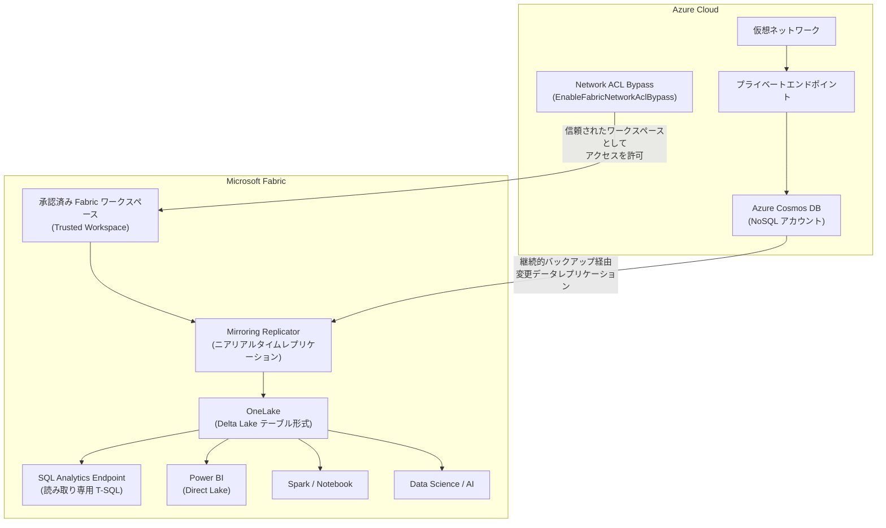

# Azure Cosmos DB: Fabric Mirroring でのプライベートエンドポイントサポートが一般提供開始

**リリース日**: 2026-03-25

**サービス**: Azure Cosmos DB

**機能**: Cosmos DB Mirroring in Microsoft Fabric with private endpoints

**ステータス**: Launched (GA)

[このアップデートのインフォグラフィックを見る](https://takech9203.github.io/azure-news-summary/20260325-cosmosdb-fabric-mirroring-private-endpoints.html)

## 概要

Azure Cosmos DB の Microsoft Fabric Mirroring において、プライベートエンドポイントのサポートが一般提供 (GA) として開始された。これにより、仮想ネットワークやプライベートエンドポイントでネットワーク保護された Azure Cosmos DB アカウントからも、ETL パイプラインの構築なしに運用データをニアリアルタイムで Fabric OneLake にレプリケーションできるようになる。

この機能は Network ACL Bypass という仕組みを利用しており、承認された Fabric ワークスペースが信頼されたリソースとして Cosmos DB アカウントにアクセスすることを可能にする。データゲートウェイを必要とせず、ネットワークセキュリティ態勢を維持したまま、Fabric の分析機能をフル活用できる点が特徴である。

現時点では Azure Cosmos DB for NoSQL アカウントのみがサポートされている。

**アップデート前の課題**

- プライベートエンドポイントや仮想ネットワークで保護された Cosmos DB アカウントでは、Fabric Mirroring を利用するためにネットワーク制約を緩和する必要があった
- ネットワーク分離環境の運用データを分析基盤に取り込むには、別途 ETL パイプラインやデータゲートウェイの構築が必要だった
- セキュリティ要件とデータ分析の即時性を両立させることが困難だった

**アップデート後の改善**

- Network ACL Bypass 機能により、プライベートエンドポイント構成を維持したまま Fabric Mirroring が利用可能
- データゲートウェイ不要で、承認された Fabric ワークスペースから直接アクセスが可能
- ミラーリング設定完了後はパブリックネットワークアクセスを無効化でき、セキュリティ態勢を完全に復元可能

## アーキテクチャ図



Network ACL Bypass により、承認された Fabric ワークスペースがプライベートエンドポイントで保護された Cosmos DB アカウントに信頼されたリソースとしてアクセスし、変更データをニアリアルタイムで OneLake に Delta Lake テーブル形式でレプリケーションする。パブリックネットワークアクセスを無効化した状態でもミラーリングは継続動作する。

## サービスアップデートの詳細

### 主要機能

1. **Network ACL Bypass によるプライベートアクセス**
   - `EnableFabricNetworkAclBypass` ケイパビリティを Cosmos DB アカウントで有効化
   - Fabric ワークスペース ID とテナント ID を指定して、信頼されたリソースとして承認
   - 承認後はパブリックネットワークアクセスを無効化しても Fabric からのアクセスが継続

2. **自動構成 PowerShell スクリプト**
   - RBAC 権限の構成、IP ファイアウォールルールの設定、Network ACL の有効化、信頼されたワークスペースの構成、ネットワーク設定の復元を自動化
   - 手動設定では 1,200 以上の IP アドレスの追加が必要なところ、スクリプトにより一括処理が可能

3. **Network Security Perimeter (NSP) によるサービスタグ対応 (プレビュー)**
   - サービスタグ (`DataFactory.<region>`, `PowerQueryOnline.<region>`) を使用して IP アドレスの手動管理を回避
   - NSP のインバウンドアクセスルールとして構成可能

4. **OAuth ベース認証**
   - プライベートネットワーク環境では Microsoft Entra ID (OAuth) 認証のみサポート
   - アカウントキー認証はプライベートネットワーク構成では利用不可

## 技術仕様

| 項目 | 詳細 |
|------|------|
| ステータス | 一般提供 (GA) |
| 対応ソース | Azure Cosmos DB for NoSQL |
| レプリケーション方式 | 継続的バックアップ (7 日または 30 日) ベース |
| ターゲットフォーマット | Delta Lake テーブル (Parquet) |
| ネットワーク構成 | プライベートエンドポイント、仮想ネットワーク |
| 認証方式 (プライベートネットワーク) | Microsoft Entra ID (OAuth) のみ |
| 必要ケイパビリティ | EnableFabricNetworkAclBypass |
| リージョン要件 | Cosmos DB アカウントと Fabric ワークスペースが同一リージョンであること |

## 設定方法

### 前提条件

1. Azure Cosmos DB for NoSQL アカウントが仮想ネットワークまたはプライベートエンドポイントで構成済みであること
2. 継続的バックアップ (7 日または 30 日) が有効化されていること
3. Microsoft Entra ID 認証が有効化されていること
4. Cosmos DB Built-in Data Contributor RBAC ポリシーが適用されていること
5. カスタムミラーリング RBAC ポリシー (`readMetadata`, `readAnalytics`) が適用されていること
6. Fabric キャパシティが有効かつ稼働中であること
7. Cosmos DB アカウントと Fabric ワークスペースが同一 Azure リージョンに存在すること
8. 構成ユーザーが Azure サブスクリプションの Owner または Cosmos DB アカウントの Contributor 権限を持つこと

### PowerShell (自動構成スクリプト)

```powershell
# Azure に接続
Connect-AzAccount
Set-AzContext -Subscription "<subscriptionId>"

# 自動構成スクリプトをダウンロードして実行
# https://github.com/Azure-Samples/azure-docs-powershell-samples/blob/main/azure-cosmosdb/common/ps-account-setup-cosmos-pe-mirroring.ps1
.\ps-account-setup-cosmos-pe-mirroring.ps1
```

スクリプト実行時に以下の情報が求められる:
- Azure サブスクリプション ID
- リソースグループ名
- Cosmos DB アカウント名
- Fabric ワークスペース名
- Azure リージョン (例: `westus3`)

### 手動構成の主要ステップ

1. **Network ACL ケイパビリティの有効化**:

```powershell
$cosmos = Get-AzResource -ResourceGroupName <resourceGroup> -Name <accountName> -ResourceType "Microsoft.DocumentDB/databaseAccounts"
$cosmos.Properties.capabilities += @{ name = "EnableFabricNetworkAclBypass" }
$cosmos | Set-AzResource -UsePatchSemantics -Force
```

2. **信頼されたワークスペースの構成**:

```powershell
Update-AzCosmosDBAccount `
    -ResourceGroupName <CosmosDbResourceGroupName> `
    -Name <CosmosDbAccountName> `
    -NetworkAclBypass AzureServices `
    -NetworkAclBypassResourceId "/tenants/<FabricTenantId>/subscriptions/00000000-0000-0000-0000-000000000000/resourceGroups/Fabric/providers/Microsoft.Fabric/workspaces/<FabricWorkspaceId>"
```

3. **ミラーリング作成後にパブリックアクセスを無効化**:

```powershell
Update-AzCosmosDBAccount `
    -ResourceGroupName <resourceGroup> `
    -Name <accountName> `
    -PublicNetworkAccess "Disabled"
```

### Azure Portal

1. Fabric ポータルでワークスペースを開き、**Create** から **Mirrored Azure Cosmos DB** を選択
2. **New connection** で **Azure Cosmos DB v2** を選択
3. Cosmos DB エンドポイント URL を入力し、認証方式は **Organizational account** (OAuth) を選択
4. データベースとコンテナを選択してミラーリングを開始
5. レプリケーションステータスが「Running」になることを確認

## メリット

### ビジネス面

- セキュリティ要件の厳しいエンタープライズ環境でも、ETL パイプラインなしで Cosmos DB の運用データを分析基盤に統合可能
- ネットワーク分離を維持したまま分析基盤を構築でき、コンプライアンス要件への適合が容易
- Fabric の BI、AI、データサイエンス機能を安全にプライベートな Cosmos DB データに対して適用可能

### 技術面

- データゲートウェイが不要であり、追加のインフラ管理が不要
- Network ACL Bypass により、パブリックネットワークアクセスを無効化した状態でもミラーリングが継続動作
- PowerShell スクリプトによる自動構成で、1,200 以上の IP アドレスの手動管理を回避
- ミラーリング設定後のネットワーク設定復元により、セキュリティ態勢を完全に元の状態に戻せる

## デメリット・制約事項

- Azure Cosmos DB for NoSQL アカウントのみ対応 (他の API モデルは非対応)
- Cosmos DB アカウントと Fabric ワークスペースが同一リージョンに存在する必要がある
- プライベートネットワーク環境では Microsoft Entra ID (OAuth) 認証のみサポートされ、アカウントキー認証は利用不可
- 初回ミラーリング設定時にはパブリックネットワークアクセスを一時的に「Selected networks」に変更する必要がある (設定完了後に無効化可能)
- Network ACL 構成はワークスペース単位であり、各ワークスペースを個別に承認する必要がある
- コンテナ構成の変更には PowerQueryOnline および DataFactory の IP がファイアウォールに許可されている必要がある
- カスタマーマネージドキー (CMK) は OneLake 上のミラーリングデータでは非対応
- 複数書き込みリージョンを持つアカウントは非対応

## ユースケース

### ユースケース 1: 金融機関の取引データ分析

**シナリオ**: 金融機関が Azure Cosmos DB にリアルタイムの取引データを格納しており、厳格なネットワーク分離要件の下でデータを分析基盤に統合したい。

**効果**: プライベートエンドポイント構成を維持したまま、取引データをニアリアルタイムで Fabric OneLake にレプリケーション。パブリックネットワークアクセスを無効化した状態でも分析が可能となり、規制要件を満たしながら Power BI でのリアルタイムダッシュボードや不正検知モデルの構築が実現する。

### ユースケース 2: IoT データのセキュアな分析パイプライン

**シナリオ**: 製造業の IoT センサーデータが Cosmos DB に格納されており、ネットワーク分離された環境でデータサイエンスチームが予知保全モデルを構築したい。

**効果**: プライベートエンドポイントによるネットワーク分離を維持しつつ、IoT データを Fabric の Spark / Notebook 環境で直接利用可能。ETL パイプラインの構築・運用コストを削減しながら、セキュアな環境で機械学習モデルの開発が可能になる。

## 料金

Cosmos DB Mirroring のレプリケーションにかかるコンピュートおよびストレージには、Fabric キャパシティベースの無料枠が適用される。

| 項目 | 料金 |
|------|------|
| レプリケーションコンピュート | 無料 (Fabric キャパシティに含まれる) |
| OneLake ストレージ (ミラーリング用) | キャパシティサイズに応じた無料枠 |
| クエリコンピュート (SQL / Power BI / Spark) | 通常の Fabric キャパシティ消費として課金 |
| Cosmos DB 継続的バックアップ | 標準料金が適用 (ミラーリングによる追加料金なし) |
| Cosmos DB データエクスプローラー使用時 | 通常の RU 消費として課金 |

継続的バックアップはミラーリングの前提条件であり、7 日間継続的バックアップを選択すれば無料で利用可能。

## 関連サービス・機能

- **Microsoft Fabric Mirroring**: Azure の各種データベースを OneLake にニアリアルタイムでレプリケーションする統合機能。Azure SQL Database、PostgreSQL、MySQL、Cosmos DB 等に対応
- **Azure Cosmos DB for NoSQL**: マルチモデル対応の分散データベースサービス。本アップデートの対象となるプライベートエンドポイント構成のソースデータベース
- **Microsoft Fabric OneLake**: Fabric のユニファイドデータレイク。Delta Lake フォーマットでデータを格納し、Fabric 内の全サービスからアクセス可能
- **Network Security Perimeter (NSP)**: サービスタグベースのネットワークアクセス制御 (プレビュー)。IP アドレスの手動管理を回避する代替手段
- **Power BI Direct Lake**: OneLake 上の Delta テーブルに直接アクセスする Power BI のクエリモード

## 参考リンク

- [インフォグラフィック](https://takech9203.github.io/azure-news-summary/20260325-cosmosdb-fabric-mirroring-private-endpoints.html)
- [公式アップデート情報](https://azure.microsoft.com/updates?id=558836)
- [Microsoft Learn ドキュメント - Cosmos DB Mirroring 概要](https://learn.microsoft.com/en-us/fabric/mirroring/azure-cosmos-db)
- [Microsoft Learn ドキュメント - プライベートネットワーク構成](https://learn.microsoft.com/en-us/fabric/mirroring/azure-cosmos-db-private-network)
- [Fabric Mirroring 概要](https://learn.microsoft.com/en-us/fabric/mirroring/overview)
- [Azure Cosmos DB 料金](https://azure.microsoft.com/pricing/details/cosmos-db)
- [OneLake ミラーリング料金](https://azure.microsoft.com/pricing/details/microsoft-fabric/)

## まとめ

Azure Cosmos DB の Microsoft Fabric Mirroring においてプライベートエンドポイントのサポートが一般提供開始となった。Network ACL Bypass 機能により、プライベートエンドポイントや仮想ネットワークで保護された Cosmos DB アカウントからデータゲートウェイなしでニアリアルタイムのデータレプリケーションが可能になり、セキュリティ態勢を維持したまま Fabric の分析機能をフル活用できる。

Solutions Architect としては、ネットワーク分離要件のある Cosmos DB 環境で分析基盤を構築する際に、本機能の採用を積極的に検討すべきである。初回設定時のパブリックネットワークアクセスの一時的な変更が必要な点、OAuth 認証のみのサポート、同一リージョン要件などの制約を踏まえつつ、提供されている自動構成 PowerShell スクリプトを活用して検証環境での構成・動作確認を行うことを推奨する。

---

**タグ**: #AzureCosmosDB #MicrosoftFabric #Mirroring #PrivateEndpoint #NetworkSecurity #GA #OneLake #DeltaLake #HTAP #Analytics
