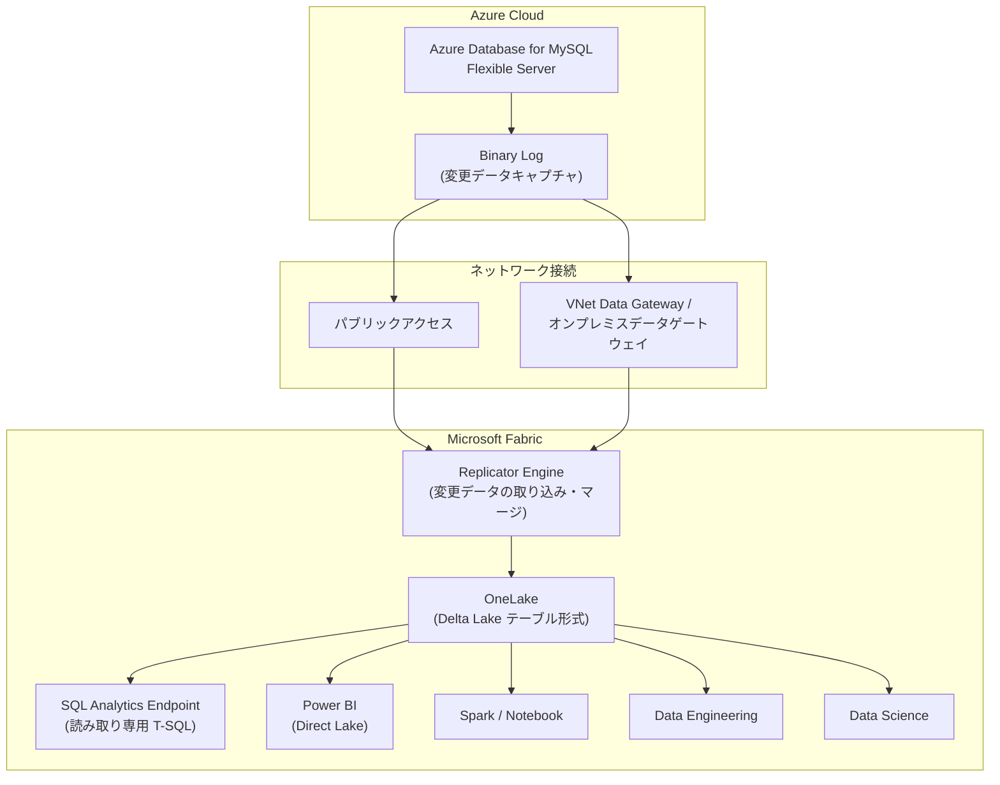

# Azure Database for MySQL: Fabric Mirroring 統合のパブリックプレビュー開始

**リリース日**: 2026-03-25

**サービス**: Azure Database for MySQL

**機能**: Fabric Mirroring integration for Azure Database for MySQL

**ステータス**: In preview

[このアップデートのインフォグラフィックを見る](https://takech9203.github.io/azure-news-summary/20260325-mysql-fabric-mirroring.html)

## 概要

Azure Database for MySQL - Flexible Server において、Microsoft Fabric Mirroring 統合がパブリックプレビューとして利用可能になった。この機能により、MySQL の運用データを ETL パイプラインの構築・管理なしに、ニアリアルタイムで Microsoft Fabric の OneLake にレプリケーションできるようになる。

Fabric Mirroring は、Azure Database for MySQL のバイナリログ (binlog) を利用してデータ変更を検出し、Delta Lake テーブル形式で OneLake に継続的にレプリケーションを行うデータベースミラーリング方式を採用している。ミラーリングされたデータは、Fabric 内の Spark、Notebook、Power BI、データエンジニアリング、データサイエンスなど、あらゆる分析ワークロードから直接利用可能である。

パブリックアクセス可能なサーバーだけでなく、仮想ネットワークやプライベートエンドポイントによるネットワーク分離環境のサーバーにも対応しており、高可用性構成のサーバーからのミラーリングもサポートされている。

**アップデート前の課題**

- MySQL の運用データを分析基盤で利用するには、ETL パイプラインの構築・運用が必要で、開発・保守コストが大きかった
- データの鮮度が ETL の実行頻度に依存し、リアルタイムに近い分析が困難だった
- パイプラインの障害対応やスキーマ変更への追従など、運用上の負担が継続的に発生していた

**アップデート後の改善**

- ETL パイプラインの構築が不要となり、数クリックでミラーリングを設定可能
- ニアリアルタイムでのデータレプリケーションにより、最新のデータに基づく分析が可能
- フルマネージドサービスとして提供され、レプリケーションのホスティング・管理が不要

## アーキテクチャ図

Azure Database for MySQL のバイナリログから変更データを検出し、Fabric の Replicator Engine が OneLake に Delta Lake テーブル形式でニアリアルタイムにレプリケーションを行う。ネットワーク分離環境のサーバーには VNet Data Gateway またはオンプレミスデータゲートウェイ経由で接続可能である。

## サービスアップデートの詳細

### 主要機能

1. **ニアリアルタイムのデータレプリケーション**
   - バイナリログベースの変更データキャプチャにより、INSERT / UPDATE / DELETE を継続的に検出
   - 変更データは Delta Lake テーブルに自動マージされ、OneLake 上で即座にクエリ可能

2. **ゼロ ETL アーキテクチャ**
   - ETL パイプラインの設計・構築・保守が不要
   - Fabric ポータルから数ステップでミラーリングを構成可能
   - フルマネージドサービスとしてレプリケーションプロセスが自動管理される

3. **SQL Analytics Endpoint の自動生成**
   - ミラーリング作成時に SQL Analytics Endpoint が自動生成される
   - T-SQL によるクエリ、ビュー、TVF、ストアドプロシージャの作成が可能 (読み取り専用)
   - SSMS、VS Code (mssql 拡張機能)、GitHub Copilot 等のツールからもアクセス可能

4. **ネットワーク分離環境のサポート**
   - パブリックアクセス、仮想ネットワーク、プライベートエンドポイント構成に対応
   - VNet Data Gateway またはオンプレミスデータゲートウェイによるプライベート接続をサポート

5. **クロスデータベースクエリ**
   - ミラーリングされたデータに対して、他の Warehouse や Lakehouse とのクロスデータベースクエリが可能
   - 3 パート名前空間 (database.schema.table) による参照

## 技術仕様

| 項目 | 詳細 |
|------|------|
| ステータス | パブリックプレビュー |
| 対応ソース | Azure Database for MySQL - Flexible Server |
| 対応コンピュートティア | General Purpose、Memory Optimized (Burstable は非対応) |
| レプリケーション方式 | データベースミラーリング (binlog ベース) |
| ターゲットフォーマット | Delta Lake テーブル (Parquet) |
| テーブル選択上限 | 1 回の設定で最大 1,000 テーブル |
| 認証方式 | Basic (MySQL Authentication) |
| ネットワーク | パブリックアクセス、VNet Data Gateway、オンプレミスデータゲートウェイ |

## 設定方法

### 前提条件

1. Azure Database for MySQL - Flexible Server が作成済みであること (General Purpose または Memory Optimized ティア)
2. Fabric キャパシティが有効かつ稼働中であること (一時停止されたキャパシティではミラーリングが停止する)
3. Fabric テナント設定で「Service principals can use Fabric APIs」が有効化されていること
4. Fabric テナント設定で「Users can access data stored in OneLake with apps external to Fabric」が有効化されていること
5. Fabric ワークスペースで Member または Admin ロールを持っていること
6. Read Replica またはRead Replica が存在する Primary サーバーではミラーリングは非対応

### Azure Portal

1. Fabric ポータル (https://fabric.microsoft.com) を開き、ワークスペースを選択
2. **New item** から **Mirrored Azure Database for MySQL (preview)** を選択
3. 接続情報を入力:
   - **Server**: `<server-name>.mysql.database.azure.com`
   - **Database**: レプリケーション対象のデータベース名
   - **Authentication kind**: Basic (MySQL Authentication)
   - **Data gateway**: 必要に応じて VNet Data Gateway またはオンプレミスデータゲートウェイを選択
4. **Connect** を選択して接続を検証
5. テーブル一覧からミラーリング対象のテーブルを選択 (最大 1,000 テーブル)
6. ミラーリング名を入力し、**Create mirrored database** を選択

数分後にレプリケーションが開始され、「Rows Replicated」の状態とともにデータが Mirrored Database ビューに表示される。

## メリット

### ビジネス面

- ETL パイプラインの開発・運用コストを大幅に削減し、分析基盤の構築期間を短縮
- ニアリアルタイムのデータ可用性により、意思決定のスピードが向上
- Fabric の BI、AI、データサイエンス機能を MySQL の運用データに対して即座に適用可能

### 技術面

- フルマネージドのレプリケーションにより、パイプラインの障害対応やスケーリングの運用負荷を排除
- Delta Lake フォーマットによるオープンなデータ形式で、Fabric 内の全サービスとシームレスに連携
- Direct Lake モードにより、Power BI からデータ移動なしで高速なレポーティングが可能
- ネットワーク分離環境でもゲートウェイ経由で安全にデータをレプリケーション可能

## デメリット・制約事項

- パブリックプレビュー段階であり、SLA は提供されない
- Burstable コンピュートティアのサーバーはソースとして非対応
- Read Replica、または Read Replica が存在する Primary サーバーからのミラーリングは非対応
- SQL Analytics Endpoint は読み取り専用であり、ミラーリングされたデータへの書き込みは不可
- 初期スナップショット取得時に、ソースサーバーの CPU および IOPS 使用率が一時的に上昇する
- UPDATE / DELETE が頻繁なワークロードでは、redo ログおよびバイナリログの I/O と ストレージ消費が増加する可能性がある
- アクティブな長時間トランザクションにより、バイナリログのパージが遅延し、ストレージ消費が増大する可能性がある

## ユースケース

### ユースケース 1: MySQL 運用データのリアルタイムダッシュボード

**シナリオ**: EC サイトの受注データや在庫データが Azure Database for MySQL に格納されており、経営層向けにリアルタイムに近い売上・在庫ダッシュボードを Power BI で提供したい。

**効果**: ETL パイプラインの構築なしに、MySQL のデータが Direct Lake モードで Power BI に直接連携され、ニアリアルタイムのダッシュボードを迅速に構築可能。データ鮮度の向上により、在庫切れや売上異常の早期検知が実現する。

### ユースケース 2: 運用データに基づく機械学習パイプライン

**シナリオ**: MySQL に蓄積された顧客行動データや取引データを用いて、Fabric のデータサイエンス機能で需要予測や異常検知モデルを構築したい。

**効果**: OneLake 上の最新データを Spark Notebook から直接利用でき、データ取得のためのバッチ処理が不要となる。モデルの再学習サイクルを短縮し、予測精度の向上に寄与する。

## 料金

Fabric Mirroring のレプリケーションにかかるコンピュートおよびストレージには、キャパシティベースの無料枠が適用される。

| 項目 | 料金 |
|------|------|
| レプリケーションコンピュート | 無料 (Fabric キャパシティに含まれる) |
| OneLake ストレージ (ミラーリング用) | 1 CU あたり 1 TB まで無料 (例: F64 で 64 TB) |
| 超過ストレージ / キャパシティ一時停止時 | OneLake ストレージの通常料金が適用 |
| クエリコンピュート (SQL / Power BI / Spark) | 通常のキャパシティ消費として課金 |

初期設定時のみ稼働中の Fabric キャパシティが必要。レプリケーション自体のバックグラウンドコンピュートはキャパシティを消費しない。

## 関連サービス・機能

- **Microsoft Fabric Mirroring**: Azure の各種データベースを OneLake にニアリアルタイムでレプリケーションする統合機能。Azure SQL Database、PostgreSQL、Cosmos DB 等にも対応
- **Azure Database for MySQL - Flexible Server**: MySQL 互換のフルマネージドデータベースサービス。General Purpose および Memory Optimized ティアでミラーリングをサポート
- **Microsoft Fabric OneLake**: Fabric のユニファイドデータレイク。Delta Lake フォーマットでデータを格納し、Fabric 内の全サービスからアクセス可能
- **Power BI Direct Lake**: OneLake 上の Delta テーブルに直接アクセスする Power BI のクエリモード。データ移動なしで高速なレポーティングを実現

## 参考リンク

- [インフォグラフィック](https://takech9203.github.io/azure-news-summary/20260325-mysql-fabric-mirroring.html)
- [公式アップデート情報](https://azure.microsoft.com/updates?id=558841)
- [Microsoft Learn ドキュメント - Fabric Mirroring for Azure Database for MySQL](https://learn.microsoft.com/en-us/fabric/mirroring/azure-database-mysql)
- [Microsoft Learn チュートリアル - ミラーリングの設定手順](https://learn.microsoft.com/en-us/fabric/mirroring/azure-database-mysql-tutorial)
- [Microsoft Learn ドキュメント - Fabric Mirroring 概要](https://learn.microsoft.com/en-us/fabric/mirroring/overview)

## まとめ

Azure Database for MySQL - Flexible Server 向けの Fabric Mirroring 統合がパブリックプレビューとして開始された。ETL パイプラインの構築・管理なしに、MySQL の運用データをニアリアルタイムで Microsoft Fabric の OneLake にレプリケーションし、BI、AI、データサイエンスなどの分析ワークロードに直接活用できるようになる。

Solutions Architect としては、MySQL を運用データベースとして利用しつつ Fabric での分析基盤を構築しているケースにおいて、ETL パイプラインの代替として積極的に評価を推奨する。Burstable ティア非対応や Read Replica との共存不可などの制約に留意しつつ、まずは開発環境でミラーリングの設定とレプリケーション遅延の検証を行い、ソースサーバーへのパフォーマンス影響を確認することが望ましい。

---

**タグ**: #AzureDatabaseForMySQL #MicrosoftFabric #Mirroring #OneLake #DeltaLake #ZeroETL #Preview #Analytics #PowerBI #DataEngineering
