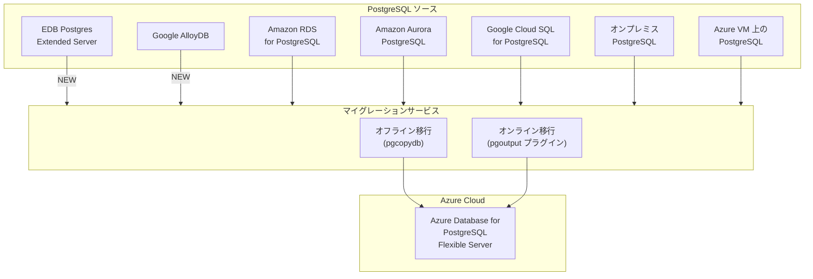

# Azure Database for PostgreSQL: マイグレーションサービスの大幅強化 - EDB / Google AlloyDB 対応と pgoutput プラグイン採用

**リリース日**: 2026-03-25

**サービス**: Azure Database for PostgreSQL

**機能**: PostgreSQL マイグレーションサービス - 新ソース対応および pgoutput プラグイン採用

**ステータス**: Launched (GA)

[このアップデートのインフォグラフィックを見る](https://takech9203.github.io/azure-news-summary/20260325-postgresql-migration-service-updates.html)

## 概要

Microsoft は、Azure Database for PostgreSQL のマイグレーションサービスに関する 3 つの重要なアップデートを同時に一般提供 (GA) として発表した。これにより、より多くの PostgreSQL ソースからの移行が可能になり、オンライン移行の信頼性とパフォーマンスが向上する。

第一のアップデートは、EDB Postgres Extended Server がマイグレーションソースとして新たにサポートされたことである。EDB は商用 PostgreSQL ディストリビューションとして広く利用されており、これらのワークロードを Azure Database for PostgreSQL へ最小限のダウンタイムで移行できるようになった。

第二のアップデートは、Google AlloyDB がマイグレーションソースとして新たにサポートされたことである。Google Cloud 上の AlloyDB で稼働している PostgreSQL ワークロードを Azure へ移行するための安全かつ信頼性の高いワークフローが提供される。

第三のアップデートは、オンライン (最小ダウンタイム) 移行において pgoutput プラグインが採用されたことである。PostgreSQL のネイティブ論理レプリケーションフレームワークに準拠することで、モダンな PostgreSQL デプロイメントとのエコシステム互換性が向上し、信頼性とパフォーマンスが改善された。

**アップデート前の課題**

- EDB Postgres Extended Server からの直接移行がサポートされておらず、手動でのデータ移行やサードパーティツールが必要だった
- Google AlloyDB から Azure への移行パスが提供されていなかった
- オンライン移行で使用されるレプリケーション方式が PostgreSQL のネイティブ論理レプリケーションフレームワークと異なる場合があり、互換性の問題が発生する可能性があった

**アップデート後の改善**

- EDB Postgres Extended Server から Azure Database for PostgreSQL への直接移行がマネージドサービスとしてサポートされた
- Google AlloyDB から Azure Database for PostgreSQL への移行が Azure Portal または Azure CLI から実行可能になった
- pgoutput プラグインの採用により、オンライン移行の信頼性とパフォーマンスが向上し、PostgreSQL のネイティブ論理レプリケーションとの互換性が確保された

## アーキテクチャ図

この図は、マイグレーションサービスがサポートする各種 PostgreSQL ソースと移行方式を示している。今回のアップデートで EDB Postgres Extended Server と Google AlloyDB が新たに移行元として追加され (NEW)、オンライン移行では pgoutput プラグインが採用された。

## サービスアップデートの詳細

### 1. EDB Postgres Extended Server ソースのサポート

- EDB PostgreSQL が Azure Database for PostgreSQL への移行ソースとして正式にサポートされた
- EDB Postgres Extended Server 上の PostgreSQL エステートを Azure へ統合・移行するための安全かつ信頼性の高いワークフローが提供される
- 最小ダウンタイムでの移行が可能

### 2. Google AlloyDB ソースのサポート

- Google AlloyDB が Azure Database for PostgreSQL への移行ソースとして正式にサポートされた
- Google Cloud 上の AlloyDB ワークロードを Azure へ移行・統合できるようになった
- 既にサポートされていた Google Cloud SQL for PostgreSQL に加え、Google Cloud からの移行オプションが拡充された

### 3. pgoutput プラグインの採用

- オンライン (最小ダウンタイム) 移行において pgoutput プラグインが採用された
- pgoutput は PostgreSQL のネイティブ論理レプリケーションフレームワークの一部であり、標準的なレプリケーション方式である
- モダンな PostgreSQL デプロイメントとのエコシステム互換性が向上した
- 信頼性とパフォーマンスの両面で改善が実現された

## 技術仕様

| 項目 | 詳細 |
|------|------|
| サービス | Azure Database for PostgreSQL - マイグレーションサービス |
| 新規対応ソース | EDB Postgres Extended Server、Google AlloyDB |
| 移行方式 | オフライン移行、オンライン移行 (最小ダウンタイム) |
| オンライン移行プラグイン | pgoutput (PostgreSQL ネイティブ論理レプリケーション) |
| 内部使用バイナリ | pgcopydb |
| データサイズ制限 | 無制限 |
| 対応する移行内容 | スキーマおよびデータ |
| 操作インターフェース | Azure Portal、Azure CLI |

## メリット

### ビジネス面

- EDB や Google AlloyDB を利用している組織が Azure へのマイグレーション戦略を容易に計画・実行できるようになった
- マルチクラウド環境からの PostgreSQL ワークロード統合がさらに容易になった
- マネージドサービスによる移行で、移行プロジェクトの工数とリスクを削減できる

### 技術面

- pgoutput プラグインの採用により、PostgreSQL のネイティブ論理レプリケーションに準拠した標準的な方式でオンライン移行が実行される
- 移行対象ソースの拡大により、異なる PostgreSQL ディストリビューションやクラウドサービスからの移行を統一的なツールで実施できる
- オンライン移行のパフォーマンスと信頼性が向上し、大規模データベースの移行がより安定する

## デメリット・制約事項

- オンライン移行では、全テーブルにプライマリキーが必要である
- オンライン移行はオフライン移行と比較して複雑であり、失敗の可能性が高い
- 長時間の移行実行時にはソースインスタンスのストレージとコンピューティングへの影響を注意深くモニタリングする必要がある

## ユースケース

### ユースケース 1: EDB PostgreSQL エステートの Azure への統合

**シナリオ**: 企業がオンプレミスの EDB Postgres Extended Server で複数のデータベースを運用しており、クラウド移行を計画している。

**効果**: マイグレーションサービスを利用することで、EDB 上の PostgreSQL ワークロードを Azure Database for PostgreSQL Flexible Server へ最小限のダウンタイムで移行でき、マネージドサービスの利点 (高可用性、自動バックアップ、スケーラビリティ) を享受できる。

### ユースケース 2: Google Cloud から Azure へのマルチクラウド移行

**シナリオ**: Google Cloud 上で AlloyDB を利用している組織が、Azure への統合やマルチクラウド戦略の見直しを行う。

**効果**: Google AlloyDB からの直接移行がサポートされたことで、Google Cloud SQL for PostgreSQL と合わせて Google Cloud からの PostgreSQL 移行が包括的にカバーされ、移行計画の選択肢が広がる。

### ユースケース 3: 大規模データベースの最小ダウンタイム移行

**シナリオ**: ミッションクリティカルな大規模 PostgreSQL データベースを、業務を停止せずに Azure へ移行する必要がある。

**効果**: pgoutput プラグインの採用によりオンライン移行の信頼性とパフォーマンスが向上し、ネイティブ論理レプリケーションフレームワークとの互換性が確保されることで、大規模データベースの移行がより安定して実行できる。

## 関連サービス・機能

- **Azure Database for PostgreSQL Flexible Server**: 移行先となる次世代マネージド PostgreSQL サービス
- **Azure Database Migration Service (Classic)**: 従来の移行サービス。マイグレーションサービスはこれを代替し、1 TB のデータサイズ制限を撤廃している
- **pgcopydb**: マイグレーションサービスが内部で使用する PostgreSQL データベースコピーツール

## 参考リンク

- [インフォグラフィック](https://takech9203.github.io/azure-news-summary/20260325-postgresql-migration-service-updates.html)
- [公式アップデート情報 - EDB サポート](https://azure.microsoft.com/updates?id=558865)
- [公式アップデート情報 - Google AlloyDB サポート](https://azure.microsoft.com/updates?id=558851)
- [公式アップデート情報 - pgoutput プラグイン](https://azure.microsoft.com/updates?id=558846)
- [Microsoft Learn ドキュメント - マイグレーションサービス概要](https://learn.microsoft.com/en-us/azure/postgresql/migrate/migration-service/overview-migration-service-postgresql)

## まとめ

今回のアップデートにより、Azure Database for PostgreSQL のマイグレーションサービスは移行元ソースの大幅な拡充とオンライン移行の技術的改善を同時に実現した。EDB Postgres Extended Server と Google AlloyDB の追加により、商用 PostgreSQL ディストリビューションやマルチクラウド環境からの移行がマネージドサービスとして提供され、pgoutput プラグインの採用によりオンライン移行の信頼性とパフォーマンスが向上した。PostgreSQL ワークロードの Azure への移行を検討している組織は、マイグレーションサービスの最新の対応ソース一覧を確認し、移行計画に反映することを推奨する。

---

**タグ**: #Azure #AzureDatabaseForPostgreSQL #PostgreSQL #Migration #EDB #GoogleAlloyDB #pgoutput #GA #Databases #HybridMulticloud
